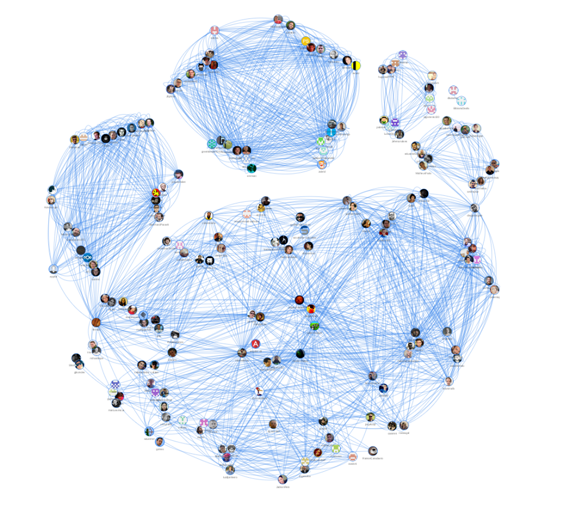
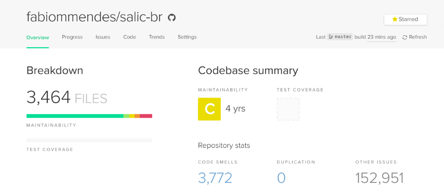
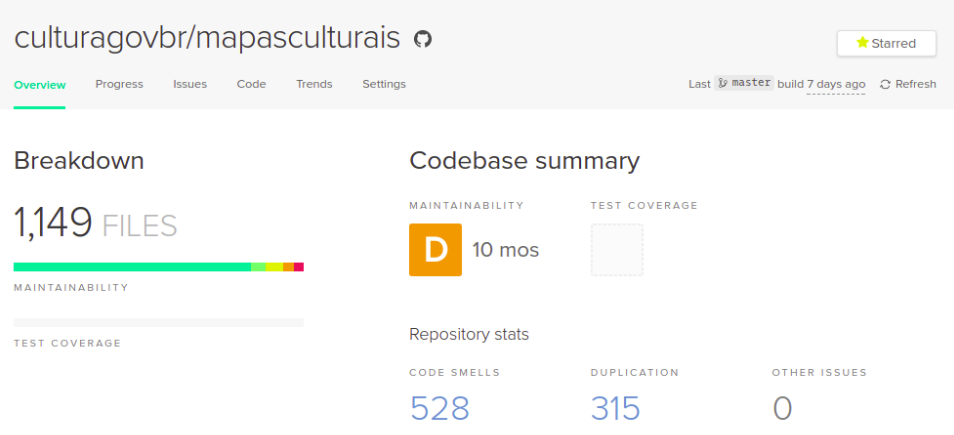
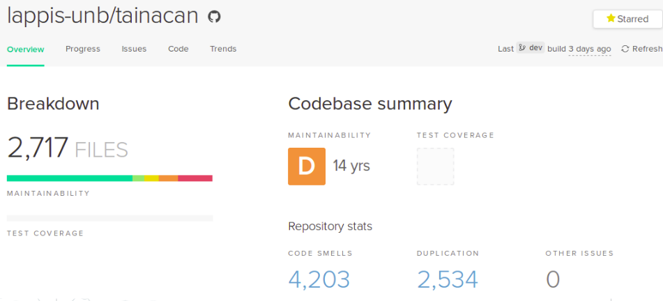
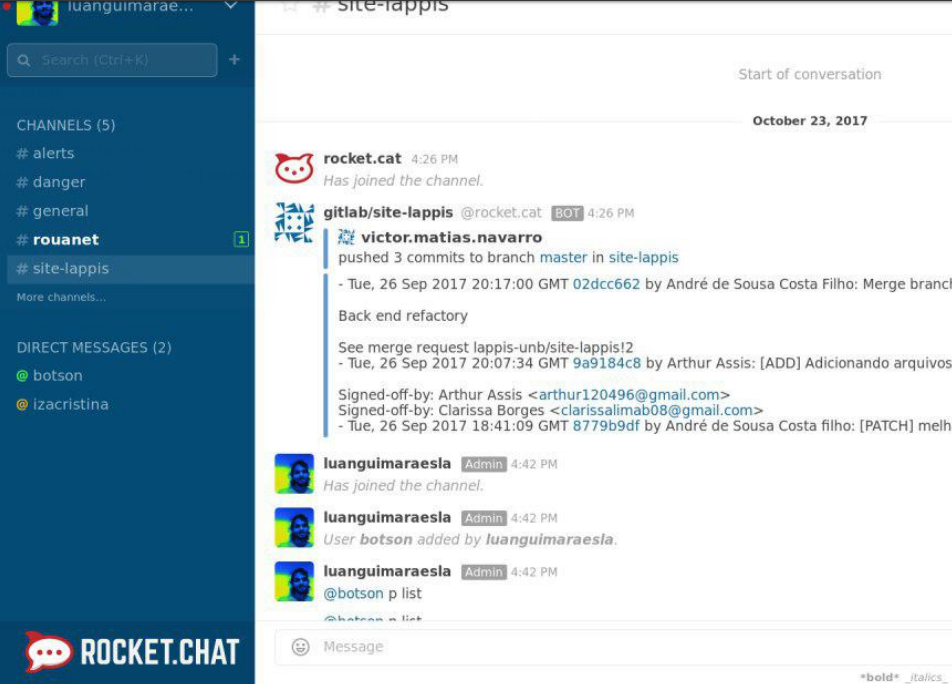
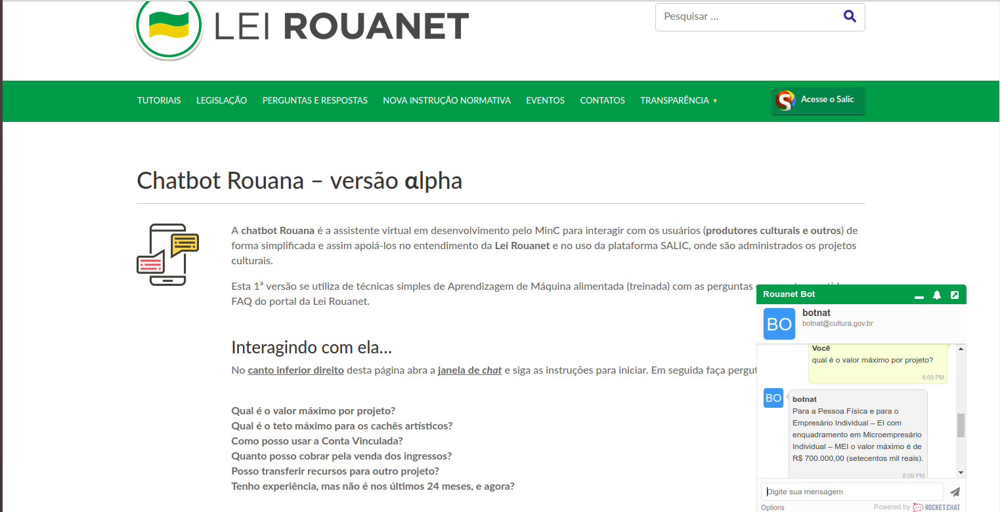

# RELATÓRIO DE CUMPRIMENTO DO OBJETO ETAPA I - Ecossistemas de Software Livre - Janeiro 2018

# Introdução
 O presente relatório apresenta o acompanhamento do trabalho realizado no projeto "Ecossistemas de Software Livre", Termo de Cooperação para Descentralização de Crédito, Processo Ofício No 0646/2017/FUB-UnB, Vigência Outubro 2017 à Outubro 2019. O relatório apresentado é referente aos avanços realizados na Etapa I (Outubro 2017 à Dezembro 2017), de acordo com o cronograma do Plano de Trabalho.

## FASE DE INICIAÇÃO

Ações programadas para esta etapa de acordo com o plano de trabalho:

- [x] Mobilizar Equipe
- [x] Elaborar Planos de trabalho para CDT
- [x] Criar ambientes computacionais

### Mobilizar a Equipe

A equipe foi montada a partir dos perfis técnicos necessários para o projeto, além da experiência. Os papéis que compõe a equipe do projeto são:

* Coordenador: professor responsável pelo acompanhamento administrativo, prestração de conta, contato com MinC, coordenação das atividades realizadas. **Quantidade: 01**.
* Vice Coordenador: professor responsável pelo acompanhamento administrativo, prestração de conta, contato com MinC, coordenação das atividades realizadas.  **Quantidade: 01**.
* Desenvolvedores Seniores: desenvolvedores com experiência de mercado. Responsável pela tomada de decisões técnicas, acompamento da metodologia e dos times.  **Quantidade: 01**
* Designers Seniores: designers com experiência de mercado tanto em relação ao design web quanto em Experiência de Usuarios (UX).  **Quantidade: 02**.
* Desenvolvedores Plenos: desenvolvedores recém formados, com experiência de projetos de software. Responsável pela execução da metodologia ágil, organização dos times, documentação e acompanhamento.  **Quantidade: 04**.
* Alunos de Engenharia de Software: time de desenvolvimento. **Quantidade: 11**.

Cada membro da equipe foi alocado em frentes de trabalho, de acordo com o cronograma do projeto. Na primeira etapa foram definido times composto por 4 perfis:

1. Legado em Software Livre
2. Catálogo de Softwares Culturais
3. Aprendizado de Máquina Lei Rouanet
4. Gestão de Prática Colaborativa

### Elaborar Planos de Trabalho para o CDT

Elaborou-se os planos de trabalho individuais para todos os membros da equipe. Os planos de trabalho foram elaborados a partir de 4 perfis distintos que variam de acordo com a função de cada membro dentro da equipe:

1. Legado em Software Livre
2. Catálogo de Softwares Culturais
3. Aprendizado de Máquina Lei Rouanet
4. Gestão de Prática Colaborativa

### Criar Ambientes Computacionais

Discutiu-se junto ao gestor do MinC quais seriam os softwares estratégicos para focar o desenvolvimento de práticas colaborativas. A equipe foi dividida em vários times, cada um focado em um sistema distinto desenvolvido ou utilizado pelo MinC. Nesta fase, cada equipe levantou os ambientes  correspondentes a cada sistema estudado.

Nesta fase, foram abordados os seguintes sistemas:

1. E-praças [https://github.com/culturagovbr/e-pracas]
2. GOG [https://github.com/culturagovbr/GOG]
3. Maps culturais [https://github.com/culturagovbr/mapasculturais]
4. Salic-br [https://github.com/culturagovbr/salic-br]
5. Salic-minc [https://github.com/culturagovbr/salic-minc]
6. Sistel [https://github.com/culturagovbr/SisTel]
7. Tainacan [https://github.com/medialab-ufg/tainacan/]
8. Versalic [https://github.com/culturagovbr/VerSalic]

Em todos os casos, a ênfase foi criar os ambientes computacionais com ênfase na automação e reprodutividade, assim como se familiarizar com as ferramentas e configurações das tecnologias utilizadas (incluindo, mas não limitado a PHP, Java, Python/Flask e Angular).

Desenvolveu-se outra frente em paralelo a estes estudos com o objetivo de compreender ferramentas de provisionamento de containers para embasar um fluxo de desenvolvimento baseado em DevOps. Decidiu-se em reunião estratégica com o gestor do Minc adotar a ferramenta Rancher [http://rancher.com/], já que a mesma é Software Livre e já está em fase de adoção no próprio Ministério da Cultura. Nesta fase, migrou-se parte da infraestrutura do LAPPIS para esta ferramenta de forma tornar possível que as soluções desenvolvidas no LAPPIS possam ser migradas com facilidade para a infraestrutura do MinC. De forma semelhante, será possível utilizar a infraestrutura do LAPPIS como ambiente de homologação para parte dos estudos realizados.

## FASE DE PLANEJAMENTO/EXECUÇÃO

### Legado em Software Livre

Ações programadas para esta etapa de acordo com o plano de trabalho:

- [x] Realizar Estudos de conteinerização
- [x] Realizar Estudo de refatoração em software legado
- [x] Realizar Estudos sobre práticas de DevOps aplicada a software legado

#### Realizar Estudos de conteinerização

Esta etapa foi dedicada ao estudo das ferramentas utilizadas na área de conteinerização, incluindo Docker, Docker-Compose e Rancher. Esta etapa de estudo foi importante para alinhar e capacitar o time tecnicamente nas ferramentas adotadas.

#### Realizar Estudo de refatoração em software legado

Foram realizados estudos com análise estática de código em cima de alguns softwares do MinC, incluindo o Salic e o Simec. Em ambos casos, trata-se de sistemas legados com uma base de código monolítica muito grande e que não foram desenvolvidos de acordo com boas práticas modernas de desenvolvimento de software.

##### Características do projeto: Salic-br

* Repositório: https://github.com/culturagovbr/salic-br
* Linhas de código: 483.958
  - Aplicação: 161.523
  - Bibliotecas: 320,496
    - Zend: 214.521
    - WebServiceRF: 113
    - MinC/PDF: 96.098
    - MinC: 9.767
  - Linhas de código de testes: 564
* Débito técnico estimado: 11.890 hs
* Avaliação de mantenibilidade (codeclimate): C

##### Características do projeto: Salic-minc

* Repositório: https://github.com/culturagovbr/salic-minc
* Linhas de código: 487.535
  - Aplicação: 165.717
  - Bibliotecas: 320,007
    - Zend: 214.516
    - WebServiceRF: 113
    - MinC/PDF/mpdf: 96.098
    - MinC: 9.280
  - Linhas de código de testes: 514

##### Características do projeto: Simec

* Repositório: https://softwarepublico.gov.br/social/simec
* Linhas de código: 192.522
  - Dependências externas: 39.790
  - Linhas de código de testes: *não possui*
* Débito técnico estimado: *Não foi possível avaliar*
* Avaliação de mantenibilidade (codeclimate): *Não foi possível avaliar*

O repositório possui uma quantidade de arquivos e defeitos tão grande que a ferramenta de análise estática utilizada pelo CodeClimate (PHP Code Sniffer) encerra abruptamente a execução por falta de memória.

##### Problemas encontrados/soluções sugeridas

Tanto o Salic quanto o Simec compartilham vários problemas comuns. Listamos aqui os problemas identificados e sugestões para lidar com os mesmos com vistas a tranformar o sistema legado em uma comunidade de Software Livre. De um modo geral, recomenda-se adotar o padrão de desenvolvimento "Legacy in a Box": o aplicativo e todas as dependências devem ser containerizados para que seja possível isolar o sistema legado do resto do desenvolvimento. A partir daí, o sistema legado é tratado como uma dependência estática e o desenvolvimento de novas funcionalidades pode ser feito de forma relativamente independente. Os novos módulos desenvolvidos podem eventualmente reimplementar as funcionalidades do sistema legado, que pode ser desativado gradualmente.

Uma estratégia mais concreta de aplicar o "Legacy in a Box" para um sistema web consiste em separar gradualmente o frontend da aplicação em módulos independentes. Uma vez que a reescrita completa de qualquer uma das duas aplicações é inviável, recomenda-se a adoção de um "framework progressivo" para organização em alto nível da aplicação e a utilização do padrão de Web Components para isolar funcionalidades específicas. Neste sentido, recomenda-se investigar as seguintes tecnologias:

- Vue.js ou Riot.js (frameworks progressivos)
- Polymer, X-Tag, Svelte ou Stencil.js (Web Components)

A documentação do Salic menciona o Vue.js, apesar deste framework não ser utilizado na aplicação principal.

###### Disponibilização em repositório público (Simec)

O código fonte do Simec está disponível para download no Portal do Software público e não possui um reposítório Git associado. Desta forma, o código não é versionado e a colaboração entre diferentes times é enormemente dificultada.

O Salic possui um repositório no Github, no entanto o nível de interação com a comunidade fora do Ministério da Cultura é extremamente reduzido. É óbvio que, por se tratar ar um sistema interno do MinC, não devemos esperar um grande nível de participação externa. No entanto, é possível energizar a comunidade isolando funcionalidades genéricas implementadas no Salic na forma de pacotes independentes oferecidos para a comunidade. Isto facilita a manutenibilidade e possivelmente pode aumentar a chance de engajamento com a comunidade de desenvolvedores de Software Livre.

###### Acoplamento com o banco de dados e dificuldade de reprodução do ambiente fora da infra-estrutura do MinC.

Nenhum dos dois projetos possui scripts de instalação, inicialização e migrações de dados para a criação do banco de dados, dificultando a implantação automatizada.

O Salic implementa regras de negócio dentro banco de dados e não realiza uma separação clara da responsabilidade do banco ou da camada de aplicação. Não foi possível aferir se o mesmo também é verdadeiro para o Simec.

###### Ausência de testes automatizados.

Impossibilita a automação do fluxo de trabalho dentro da filosofia DevOps e dificulta a refatoração do projeto.

Ainda que a utilização de testes automatizados seja uma importante ferramenta no processo de evolução e manutenção de um software, é necessário definir uma estratégia adequada para a implementação de testes em sistemas legados. Se por um lado testes unitários automatizados aumentam o nível de confiabilidade do processo de desenvolvimento e diminuem a probabilidade de introdução de bugs e regressões, eles também ajudam à cristalizar a interface da aplicação, o que pode ser indesejável em uma aplicação que precise de refatorações em nível arquitetural.

A estratégia recomendada é priorizar a implementação de testes funcionais e de integração, especialmente no nível da interface do usuário. Neste sentido, os testes automatizados devem ser criados com o foco nas partes em desenvolvimento e refatoração ativa, com ênfase nas funcionalidades de alto nível. Em paralelo, na medida que se consiga isolar componentes específicos em pacotes próprios, recomenda-se a criação de testes unitários.

###### Inclusão de dependências no repositório do próprio projeto.

Nenhum dos dois projetos realiza o gerenciamento de dependências de forma automatizada. O Salic possui um trabalho inicial para utilizar o PHP composer e já gerencia parte das dependências com esta dependência, ainda que algumas bibliotecas importantes como o Zend Framework não são gerenciadas. O Simec não possui qualquer forma de gerenciamento de pacotes.

Esta prática dificulta a atualização das bibliotecas e abre espaço para brechas de segurança. Nenhum dos projetos possui documentação sobre quais bibliotecas precisam de patches para a utilização no sistema. Em nenhum dos casos, as dependências estão vendorizadas de forma consistente e ambos projetos misturam dependências externas de terceiros e bibliotecas desenvolvidas pelo próprio MinC. Esta prática também diminui a trasparência sobre as partes do código de responsabilidade do MinC e dificulta a tarefa de ferramentas de análise estática de código.

###### Documentação incompleta e desatualizada

Nenhum dos dois projetos possui documentação técnica adequada. O Salic possui alguma documentação sobre alguns conceitos e processos adotados no projeto, mas não existe documentação sobre a API e arquitetura do sistema. O Simec não possui qualquer forma de documentação no repositório.

Recomenda-se a utilização de um serviço que construa a documentação automaticamente a partir do código (ex.: readthedocs.org). Isto foi sugerido na documentação do Salic, mas não foi implementado em nenhum dos dois projetos.

###### ORM

O Salic utiliza a versão 1 do framework Zend e o Simec não utiliza nenhum ORM. Em ambos casos, utiliza-se queries SQL construídas manualmente. Esta é uma prática conhecidamente responsável por várias vulnerabildades, ainda que nenhuma análise de segurança para detecção destas vulnerabilidades tenha sido realizada.

O Zend permite a execução simultânea da versão 1 e da versão 2 ou 3 como estratégia de migração. Recomenda-se atualizar gradualmente para a versão mais atual do framework para utilizar recursos e atualizações de segurança disponíveis nesta versão. Também é necessário definir o ORM adotado, uma vez que o Zend permite a utilização de diferentes ORMs.

#### Realizar Estudos sobre práticas de DevOps aplicada a software legado

Para esta etapa, foi realizado um estudo de boas práticas para a criação de comunidades se Software Livre e a criação de um fluxo mínimo de trabalho baseado em DevOps.

Norteado por estas diretrizes, criou-se um checklist de boas práticas para comunidades de software livre e analisou-se alguns sistemas desenvolvidos pelo MinC de acordo com estes requisitos. Em vários casos, foram detectadas falhas e, quando viável, a equipe desenvolveu correções.

Os seguintes projetos foram avaliados nessa etapa:

* e-praca - [https://github.com/culturagovbr/epracas-backend](https://github.com/culturagovbr/epracas-backend)
* Gestão de Ouvidoria Governamental (GOG) - [https://github.com/culturagovbr/GOG](https://github.com/culturagovbr/GOG)
* Mapas Culturais - [https://github.com/culturagovbr/mapasculturais](https://github.com/culturagovbr/mapasculturais)
* Salic-br - [https://github.com/culturagovbr/salic-br](https://github.com/culturagovbr/salic-br)
* Salic-minc - [https://github.com/culturagovbr/salic-minc](https://github.com/culturagovbr/salic-minc)
* Sistema de gestão dos serviços de telefonia (Sistel) -[https://github.com/culturagovbr/SisTel](https://github.com/culturagovbr/SisTel)
* Tainacan - [https://github.com/medialab-ufg/tainacan/](https://github.com/medialab-ufg/tainacan/)

As principais contribuições realizadas nessa etapa foram:

* Conteinerização
* Ferramentas de coleta de métricas de código estático
* Ferramenta de Integração contínua

As contribuições foram realizadas por meio de abertura de pull requests nos repositórios principais dos projetos.

### Catálogo de Softwares Culturais

Ações programadas para esta etapa de acordo com o plano de trabalho:

- [x] Realizar Estudos de tecnologias e práticas devops
- [x] Realizar Estudos repositórios MINC
- [x] Elaborar Relatório de Resultado dos Estudos

Todas as atividades relacionadas as ações listadas acima foram 100% finalizadas.

A ação abaixo foi programada para esta etapa, mas foi realocada para em decisão conjunta com o gestor do MinC para a Etapa 3.

- [ ] Realizar estudos sobre funcionalidades de catálogo de software

A primeira versão do pipeline Devops experimentado no projeto é apresentada na figura abaixo.

Primeiramente serão listadas as ferramentas que serão utilizadas para fomentar a adoção de práticas de DevOps (desenvolvimento e operações). Isto é, tendo em vista a necessidade de se automatizar os procedimentos burocráticos manuais, devemos incorporar o perfil do desenvolvedor moderno - pró-ativo, evolutivo e contínuo - na mecanização do gerenciamento da infraestrutura de desenvolvimento, historicamente reativa e caótica.

Ferramentas:
  1) Git flow
    Mecanismo de desenvolvimento baseado em uma abstração das branches do Git.
    Fornece uma interface amigável e padronizada para a contribuição coletiva a projetos Git. Facilita a integração da equipe e a organização das linhas de trabalho.
  2) Docker
    Ferramenta para criação de ambientes isolados para aplicações utilizando a lógica de compartilhamento de recursos de uma máquina HOST por containers
  3) GitLab CI/CD
    Serviço oferecido pelo GitLab para automatização da integração contínua e disponibilização contínua. Esse serviço será integrado com o Rancher para criar um fluxo contínuo de atualizações através da lógica do Git Flow

  4) Rancher
    Infraestrutura com ótima experiência de usuário para gerenciamento de containers docker em larga escala. Fornece uma API que será usada pelo Gitlab CD para atualizar os containers assim que as respectivas branchs de homologação e desenvolvimento forem atualizadas. Veja a documentação do git flow.
O fluxo de desenvolvimento se inicia com a criação de um novo projeto no GitLab. Esse projeto deve conter três branches principais, a "master", para as versões de homologação, a "develop", para as versões de  desenvolvimento e a "stable" para as releases estáveis.
Para cada nova funcionalidade, o desenvolvedor deverá assinar uma issue que será a descrição da história de usuário a ser feita e em seguida criar uma nova branch. Esta deverá seguir o padrão de nome "issue_<numero-da-issue>_<breve-nome>".
Assim que a funcionalidade estiver pronta em sua branch, o desenvolvedor abrirá um Merge Request (MR) para a branch develop. Esse MR deverá ser analisado por outro membro da equipe e então integrado caso esteja de acordo com a história de usuário relacionada. Deve-se analisar principalmente se os testes para esse novo código foram criados.
Após a integração com a branch develop, o Gitlab CI irá automaticamente executar três trabalhos. O primeiro será testar a aplicação para evitar que erros passem despercebidos. O segundo criará um ambiente isolado com a aplicação já instalada utilizando o docker. O terceiro enviará uma mensagem para o Rancher, ferramenta de gerenciamento de containers, para que este saiba que existe uma nova versão do desenvolvimento desse determinado sistema e que ele deve atualizar.
Nesse ponto, o Rancher assume o controle e atualiza automaticamente os serviços em desenvolvimento solicitados. Agora, por exemplo, o site de desenvolvimento da aplicação será atualizado com a nova versão e poderá ser imediatamente acessado (Ex.: dev.sistema.orchestra.org).
Os desenvolvedores então analisam o ambiente de desenvolvimento para averiguar se tudo está de acordo com o esperado ou se modificações devem ser feitas. No primeiro caso, abre-se um novo MR da branch "develop" para a "master", esse pode ser aceito pelo próprio autor. A versão de homologação agora é automaticamente atualizada no Rancher e pode ser acessada pelo cliente para homologação (Ex.: homologa.sistema.orchestra.org).
O cliente então avalia se aquela funcionalidade está de acordo com os requisitos solicitados e realiza um reporte para a equipe de desenvolvimento em um canal específico para isso no Rocket Chat da Orchestra (Ex.: chat.orchestra.org).
Caso o cliente esteja de acordo, essa funcionalidade entra para o conjunto de mudanças que serão implantadas na próxima release. Assim que esse conjunto cumprir com os objetivos do épico, uma tag e seu tarball são gerados e o código da "master" pode então ser integrado na branch "stable"

Além do pipeline, foram feitos alguns testes com o uso de chatbots para monitorar e controlar o pipeline, também conhecido como chatops. As figuras abaixo mostram alguns desses experimentos.

### Práticas de gestão colaborativa

Ações programadas para esta etapa de acordo com o plano de trabalho:

- [x] Realizar Estudos de comunidades prioritárias
- [x] Realizar Estudos sobre processo de planejamento conjunto

Todas as atividades relacionadas as ações listadas acima foram 100% finalizadas.

Nessa etapa foi realizada uma pesquisa exploratória tendo como objeto de estudo os movimentos, organizações, desenvolvedores e demais stakeholders que contribuem nos repositórios da organização culturagovbr [https://github.com/culturagovbr](https://github.com/culturagovbr).

Além da equipe de TI do MinC, foram identificados dois laboratórios que contribuem nos repositórios MInC:

- MediaLab (UFG) - https://www.medialab.ufg.br/ - o laboratório contribui princialmente com o projeto Tainacam e com o projeto Mapas Culturais.
- Laboratório de Tecnologias livres (UFABC) - http://pesquisa.ufabc.edu.br/lablivre/ -  o laboratório contribui principalmente com o projeto Salic-Minc e Salic-br.

O que foi levantado na primeira fase foram as a adesão desses laboratórios à  práticas ágeis e  aos padrões propostos por comunidades de software livre.

Os pontos observados foram:
- Métodos ágeis: todos aplicam alguma metodologia ágil (kaban, scrum, XP). Porém, há pouca evidência do uso maduro da metodologia;
- Issues: pouca organização das issues abertas nos projetos (Issue tracker). Grande parte das discussões relacionadas às issues são realizadas fora do repositório (em canais de comunicação privados). Não há organização das issues por labels;
- Programação Pareada: não há evidencia do uso da prática de programação pareada (signed off by);
- Code review: não há evidência de execução de code review. Não há papeis atribuídos para esse fim (mantenedores, commiters);
- Pull requests: a maioria dos pul requests não seguem os guidelines de comunidade de software livre (encontrados muitos pull requests aceitos pelos mesmos usuários que abriram o PR);
- Testes: muitos projetos não possui testes (unitários, aceitação);
- Licença: alguns repositórios não possuem licença.

Os pontos observados foram baseados no checklist de "receptividade" de comunidades/projetos de software livre propostos em [https://opensource.guide/how-to-contribute/](https://opensource.guide/how-to-contribute/), que avalia se um projeto é bom para novos contribuidores de acorodos com os seguintes critério:

- Ser software livre
    - Licença
- Projeto aceita ativamente novos contribuidores
    - Atividade/movimentação dos commits na branch master
    - Qualidade das Issues do projeto
    - Qualidade dos Pull requests do projeto
- Projeto é receptivo
    - Comunicação

### Aprendizado de Máquina Lei Rouanet

Ações programadas para esta etapa de acordo com o plano de trabalho:

- [x] Realizar Estudo Lei Rouanet/SALIC

As seguintes etapas foram planejadas para a Etapa 2, mas foram repriorizadas para serem trabalhadas na Etapa 1

- [x] Realizar Estudo de aprendizado de máquina
- [x] Realizar Estudo processamento linguagem natural
- [x] Realizar Estudos de chatbots

Foi desenvolido um primeiro protótipo de um chatbot usando o chat rocket.chat, bot hubot e a biblioteca Natural node (todos softwares livres). A solução proposta, juntamente com a documentação está disponível no respositório [https://github.com/lappis-unb/minc-rouanet-bot](https://github.com/lappis-unb/minc-rouanet-bot).

O protótipo desenvolvido teve como escopo inicial tirar dúvidas referentes à Lei Rouanet. Esse chatbot ficaria no portal Rouanet. O problema a ser resolvido é o fato que os cidadãos têm dúvidas específicas a respeito da lei Rouanet que não são sanadas apenas com o FAQ do site. A adição exaustiva de mais perguntas ao FAQ o tornaria muito extenso, dificultando a busca por perguntas específicas ou fornecendo respostas muito extensas e genéricas.

O proncipal objetivo do desenvolvimento do chatbot é fornecer auxílio imediato ao cidadão sobre dúvidas referentes à lei Rouanet.

Para isso, pretende-se criar um chatbot e integrá-lo ao site da lei Rouanet como um iframe. Algumas características desejadas do chatbot
são:

- Ser amigável;
- Estar sempre disponível;
- Fornecer respostas curtas e precisas;
- Associar o contexto entre perguntas consecutivas, quando necessário;
- Repassar o chat para uma pessoa quando ele não conseguir encontrar respostas para a pergunta;
- Pedir uma avaliação de suas respostas ao final da conversa.

O chatbot foi projetado para ser um iframe, o que facilita sua integração ao site da lei Rouanet. Ferramentas utilizadas:
- Rocket.chat: utilizado para fornecer o chat como iframe.
- Hubot Natural: framework para desenvolvimento de chatbots que conseguem realizar processamento de linguagem natural.
- Docker: utilizado para facilitar a instalação e configuração do chatbot.

Todo o desenvolvimento foi guiado por estudos teóricos, pesquisa de ferramentas, implementação, testes de qualidade e possível automação da instalação do sistema implementado (com o Docker). As tarefas finalizadas nessa etapa foram:

- Implementação da primeira versão do chat com iframe, utilizando o Rocket.chat
- Implementação da primeira versão do bot para responder automaticamente ao chat, utilizando o Hubot Natural
- Documentação do processo de instalação e configurações iniciais do chatbot
- Automatização da instalação e configuração do chatbot, utilizando o Docker
- Contribuições no repositório público do hubot-natural

As características da primeira versão do chatbot são:

- Capacidade de re-treinar o bot
-  Modularização do código do hubot-natural
-  Docker Compose do hubot-natural
-  Remoção da biblioteca Natural Node do código do Rocket.chat para a implementação de uma API em python
- Capacidade de ler mais de um arquivo .yml para o treinamento do bot
-  Escrita da versão inicial de um arquivo de contextos (.yml) para treinamento do bot, com base no FAQ da lei Rouanet

As principais limitações dessa primeira versão do chatbot são (e serão evoluidas nas próximas etapas):

- Reconhecimento das reais perguntas frequentes e dificuldades dos usuários
- O bot não reconhece acentuações
- Não é capaz de re-aprender, conforme as perguntas são realizadas
- Não é capaz de identificar e manter contextos
- Não é capaz de repassar a conversar para uma pessoa, caso ele não seja capaz de responder a uma pergunta
- Poucos tipos de classificadores implementados, somente Naive-Bayes e Regressão Logística
- Dificuldade em relação a manutenibilidade do código
- Falta de realismo nas respostas do bot (falta de personalidade)
- Não solicita uma avaliação de satisfação do usuário

### Aferição e aceitação de produtos de software

Ações programadas para esta etapa de acordo com o plano de trabalho:

- [x] Revisão da area
- [x] Diagnóstico sobre as práticas atualmente adotadas pelo MinC de garantia da qualidade de produto

#### Revisão da área

Realizou-se uma pesquisa bibliográfica na área de DevOps e aferição de qualidade de software para elaboração de questionários e outros insumos das pesquisas que serão desenvolvidas nas etapas seguintes. O protocolo completo da pesquisa  pode ser visualizado no anexo.

Realizou-se um questionário de acompanhamento de equipe que foi ministrado entre os participantes do projeto e será ministrado também na equipe do MinC na próxima etapa.

O objetivo deste questionário é criar insumos de pesquisa qualitativa para avaliar a evolução do conhecimento do time em relação aos temas abordados no projeto (ecossistemas de software livre e devos). O questionário levanta os seguintes dados/opiniões:

1. Perfil
2. Atuação no Projeto
3. Experiência no Projeto (práticas ágeis)
4. Código
5. Comunicação
6. Software Livre
7. Prática Devops

O detalhamento do questionário encontra-se em anexo.

#### Diagnóstico sobre as práticas atualmente adotadas pelo MinC de garantia da qualidade de produto

Foi realizado um diagnostico da qualidade do produto do ponto de vista da experiência de usuário e interface gráfica. Foi usado o Salic como estudo de caso, uma vez que este é o maior projeto de software do Ministério da Cultura.

Esta avaliação tem dois objetivos. O primeiro é permitir que os especialistas de design do LAPPIS se familiarizem com o SALIC. O segundo é identificar as oportunidades
mais evidentes para melhoria da experiência de uso do SALIC.

Para alcançar esses objetivos, a equipe do LAPPIS combinou uma avaliaçãoheurística da etapa de cadastro de proposta com uma análise do design visual da mesma seção do SALIC.

Os resultados apontam vários pontos de melhoria intrínseca da experiência de uso, conforme apresentado a seguir.

 Segundo o modelo estabelecido por Nielsen e Molich, uma avaliação heurística é uma forma de inspeção na qual
especialistas em usabilidade examinam a experiência de uso de um sistema, comparando-a à critérios pré-definidos
de qualidade.

São identificados pontos negativos que, por sua vez, recebem um valor de gravidade, com base em critérios como: frequência do problema, impacto do problema na experiência  de uso e persistência do problema ao longo de uma utilização recorrente.

Da mesma forma, pontos positivos recebem um valor de benefício, usando uma escala homóloga a de gravidade. Os critérios de gravidade são:

0.  Não é um problema.
1. Problema superficial. Precisa ser resolvido apenas se sobrar tempo no projeto.
2. Problema menor. Corrigi-lo tem uma prioridade baixa.
3. Problema grave. Corrigi-lo tem uma prioridade alta.
4. Catástrofe de usabilidade. Imperativo corrigir antes da próxima publicação.

Critérios Avaliados:

- **Visibilidade do estado do sistema**
O sistema deve sempre manter as pessoas informadas sobre o que está acontecendo, por meio de feedback adequado dentro de um prazo razoável.

- **Correspondência entre sistema e mundo real**
O sistema deve seguir as convenções do “mundo real” e ser estar em harmonia com as atividades realizadas fora dele, fazendo com que a informação apareça de forma natural e lógica. Também deve falar a língua das pessoas, com  alavras, frases e conceitos familiares para elas, em vez de termos orientados para o sistema.

- **Flexibilidade e eficiência de uso**
O sistema deve atender igualmente usuários iniciantes e  experientes, fornecendo orientações e processos simplificados para os iniciantes e fornecendo aceleradores e atalhos para os experientes. Também deve considerar que todas as pessoas são iniciantes quando se trata de ações realizadas com pouca frequência.

- **Coerência e padrões**
As pessoas não devem ter que se perguntar se diferentes  palavras, situações ou ações significam o mesmo. Siga as convenções da plataforma.

- **Reconhecimento ao invés de lembrança**
Minimize a carga de memória das pessoas, tornando visíveis objetos, ações e opções. As pessoas não devem ter que lembrar as informações de uma tela para outra. As  instruções para o uso do sistema devem ser visíveis ou facilmente recuperáveis sempre que apropriado.

- **Controle pelo(a) usuário(a) e liberdade**
O sistema deve oferecer formas de navegação que conduzam as pessoas durante a execução de tarefas sem tomar o controle do processo de forma arbitrária. As pessoas geralmente escolhem as funções do sistema por engano e precisarão de uma "saída de emergência" claramente marcada para deixar o estado indesejado sem ter que passar por um diálogo prolongado. Apoie desfazer e refazer.

 - **Prevenção de erros**
Melhor do que boas mensagens de erro é um design cuidadoso que impede que ocorra um problema antes de qualquer outra coisa. Elimine as condições propensas a erros ou antecipe
a presença dessas condições e apresente às pessoas uma   opção de confirmação antes de se comprometerem com a ação.

- **Auxílio a reconhecer e se recuperar de erros**
As mensagens de erro devem ser expressas em linguagem simples (sem códigos), indicar o problema com precisão e sugerir de forma construtiva uma solução.

- **Design estético e minimalista**
As telas não devem conter informações que sejam  irrelevantes ou raramente necessárias. Toda unidade extra de informação numa tela compete com as unidades de informação relevantes e diminui a sua visibilidade relativa.

- **Ajuda e documentação**
Mesmo que seja melhor que o sistema possa ser usado sem documentação, pode ser necessário fornecer ajuda e documentação. Qualquer informação desse tipo deve ser fácil de pesquisar, focada na tarefa do usuário, listar etapas concretas a serem realizadas e não ser muito grande.

O resumo dos resultados encontrados podem ser visualizados na figura abaixo. O delhamento completo está disponível em anexo.

# Acompanhamento Financeiro

O valor do repasse referente à Etapa I foi de R$598.000,00. Todo esse repasse foi na rubrica 30.90.20, referente à auxílio Financeiro a Pesquisa (Bolsas). Desse repasse, um total de R$161.100,00 foi executado na Etapa I, representando na prática que o orçamento foi consumido apenas na categoria mão-de-obra.. Todo esse valor foi executado no pagamento das bolsas do time, e o valor gasto por frente do projeto pode ser visto na figura abaixo.

# Assinatura

Responsável pela Execução:
---
Nome:  Carla Silva Rocha Aguiar
             (Coordenadora do Projeto)

Assinatura:

Data: 12/01/2018

# Anexo I - Metodologia

Na execução da Etapa I foram aplicadas várias práticas ágeis. As sprints de 2 semanas garantiram o planejamento e entregas time box. O planejamento foi feito de forma  descentralizada pelas diversas frentes do projeto,  Sendo assim, o projeto foi dividido em três níveis, o nível operacional, o nível tático e o nível estratégico:

- **Metas estratégicas**: nivel estratégico. Definidas em colaboração com gestores do MinC. O objetivo é definir as principais metas estratégicas a serem atingidas nos ciclos de 3 meses, tendo como balizadores o (a) plano de trabalho, (b) o cronograma, (c) demandas atuais do Ministério da Cultura que correlacionam com o projeto.
- **Épicas de negócio**: nível estratégico. Derivadas das Metas estratégicas, as épicas são também definidas em colaboração entre a equipe do projeto e os gestores do MinC.
- **Features**: nível Tático. São derivadas das épicas, junto à equipe do MinC, que são definidos quais as features que deverão ser implementadas na próxima etapa e a priorização das mesmas.
- **História de Usuário**: nível Operacional. São derivadas das features e são definidas pelo próprio time desenvolvimento. A história de usuário tem a característica que esta deve ser realizada em uma única sprint.
- **Tarefas/Tasks**: nível Operacional. São derivadas das histórias de usuário, mais granular.
-
A medida que desce-se o nível a partir das metas estratégicas e do planejamento tático e nos aproximamos do nível operacional, o grau de granularidade aumenta até chegar a micro atividades, ou seja ao nível de tarefas diárias executadas pelos desenvolvedores do projeto.

O acompanhamento do planejamento, execução e monitoramento do trabalho realizado na Etapa I do projeto pode ser acessado em [https://tree.taiga.io/project/lappis-ecossistema-software-livre/](https://tree.taiga.io/project/lappis-ecossistema-software-livre/).

Outras práticas ágeis aplicadas no projeto foram:
1. **Programação pareada**: todas as histórias de usuário/tasks foram alocados à duplas rotativas responsáveis pela execução da respectiva tarefa;
2. **Issues**: as tarefas, histórias, features novas foram registradas em forma de issues no respectivo repositório dos projetos tratados;
3. **GitFlow**: toda a colaboração nos repositórios seguiram o Gitflow [https://danielkummer.github.io/git-flow-cheatsheet/index.pt_BR.html](https://danielkummer.github.io/git-flow-cheatsheet/index.pt_BR.html);
4. **Devops**: práticas devops foram adotadas (pipeline, integração contínua, testes, etc).

# Anexo II - Alinhamento Estratégico

## Planejamento Estratégico Etapa 1 (Novembro 2017 à Janeiro 2018)

1. Levantamento de necessidades Etapa 1 - Nitai + time Lappis - 07/11
2. Proposta Planejamento Estratégico Etapa 1- Time Lappis - 14/11
3. Aprovação Planejamento Estratégico Etapa 1 - Time Lappis + Time MinC - 22/11

### Metas Estratégicas

* Primeiros passos para transformar software culturais para dinâmica de práticas colaborativas e aberta
* Desburocratizar o acesso à lei Rouanet (proposta) 

#### Épicas

* Avaliar sociabilidade de software culturais ao ecossistema de SWL
* Começar cultura de entrega contínua de SW
* Avaliação do fluxo de preenchimento de proposta

#### Features

* Avaliar sociabilidade de software culturais ao ecossistema de SWL
  - [x] diagnóstico do repositório para a comunidade (mapas)
  - [x] prognóstico do repositório para a comunidade (mapas)
  - [x] diagnóstico do repositório para a comunidade (salic-br)
  - [x] prognóstico do repositório para a comunidade (salic-br)

* Começar cultura de entrega contínua de SW
  - [x] Criação de uma stack de desenvolvimento
  - [x] Criação do mecanismo de chatops que auxilie a equipe na gestão da infra-estrutura
  - [x] Criação de uma stack de análise Graylog para aferição da saúde dos serviços e da infra-estrutura.
  - [x] monitorar/visualizar o fluxo de trabalho da TI do MinC

* Avaliação do fluxo de preenchimento de proposta
  - [x] Escolha das estratégias e ferramentas de Machine Learning para o chatbot
  - [x] Elaboração e implementação da interação inicial do chatbot para o portal da Lei Rouanet
  - [x] Treinamento e refinamento das informações e técnicas utilizadas no chatbot
  - [x] diagnostico de UX (salic-minc)

# Anexo III - Checklist de Avaliação dos projetos MinC

O template de checklist para avaliar os projetos do portifólio MinC está descrito abaixo. Os checklists preenchidos completos estão disponibilizados no repositório do projeto - [github.com/lappis-unb/minc](github.com/lappis-unb/minc)

## Template do checklist

 - Guias de boas pŕatica de projetos de software livre: [https://opensource.guide/](https://opensource.guide/)

### Básico

- Projeto:
- Repositório:
- Linguagem principal:
- Plataforma (web, mobile, desktop, etc):

- [ ] Possui arquivo de licença ?
  - [ ] É open source ?

- [ ] Possui arquivo CONTRIBUTING (Guidelines para a contribuição no projeto) ?
- [ ] Possui CODE_OF_CONDUCT (Como se comportar no projeto) ?
- [ ] O nome do projeto é claro e consegue mostrar o que ele faz ?

### Readme

- [ ] Possui readme?
  - Formato do readme (md, txt, rst, etc):
- [ ] Badges presentes no readme?
- A descrição do projeto responde as seguintes perguntas? :
  - [ ] O que é esse repositório/projeto ?
  - [ ] Como o projeto funciona ?
  - [ ] Quem usa/usará esse repositório?
  - [ ] Qual o objetivo do projeto ?
- [ ] Existe informação sobre como contatar o time de desnvolvimento ?

### Integração contínua

- [ ] Possui integração contínua?
    - Servidor de integração contínua (travis, circleci, etc):
- [ ] Possui testes?
- [ ] Cobertura de testes:
- [ ] Métricas de código (ex: codeclimate):

### Empacotamento

- [ ] É empacotado?
  - Sistema(s) de empacotamento (deb, npm, pip, etc):

### Documentação

- [ ] Possui documentação de usuário?
- [ ] Possui documentação de código?
  - Formato da documentação (wiki, markdown, rest, doxygen, etc):
- [ ] Possui documentação na internet?
  - Endereço:

### Comunidade

- [ ] Possui issues abertas no github?
- [ ] Possui issues fechadas?
- [ ] Já aceitou algum pull request?
  - Número de estrelas:
  - Número de forks:
  - Utiliza a wiki?
- [ ] A "fila" de issues está atualizada ?
  - [ ] Existem labels nas issues ?

### Docker

- [ ] Possui Dockerfile?
- [ ] Possui Docker compose?
- [ ] Presente no Docker hub?
  - Endereço:
- [ ] Dockerfile presente no repositório?
- [ ] Dockerfile em repositório separado?
  - Endereço:

### Automação

- Gerenciador de tarefas (make, rake, inv, gulp, etc):
- Comando de instalação/dependências?
- Comando:
  - Comando para inicializar serviço/aplicativo?
  - Comando para executar testes?
  - Comando para construir a documentação?
  - Comando para empacotar?
### Melhorias

- Listar pontos de melhorias
- Análise qualitativa do repositório

.

# Anexo IV - Pesquisa Devops Pesquisa  Survey de Acompanhamento
## Protocolo de Pesquisa Devops
### Busca
O protocolo de pesquisa definido foi:

- Busca

    * Query string: "devops".

- Repositórios de artigos:

    * Scholar
    * ACM digital library
    * IEEExplore
    * Springerlink

- Restrições:

    * Paper journal ou conferência/congresso/simpósio
    * Não colocar paper de workshop, relatório técnico, tese

- Seleção:

    * Começaremos com cerca de 600 papers
    * Ler somente o título: remover o que claramente não é apropriado (expectativa: sobrarão 250)
- Ler o resumo inteiro (expectativa: sobrarão 150 artigos)
    * Ler em detalhes (expectativa: sobrarão 50 artigos)
        * Precisa contabilizar nas estatísticas, mas não há necessidade de ler em detalhes (expectativa: sobrarão 100 artigos)
        * Descartar (expectativa: sobrarão 100 artigos)

### Protocolo:

- Etapa 1 (automatizada): robô busca artigos e exclui artigos com base na fonte (só entra journal ou conferência/congresso/simpósio)
- Etapa 2: com base nos títulos e fontes, exclui-se artigos (motivos de exclusão 1-4).
- Etapa 3: com base nos abstracts, exclui-se mais artigos.

- Motivos de exclusão:

    - Não é um artigo.
    - Fonte inadequada.
    - Repetido.
    - Não é relacionado a DevOps.

Ler em detalhes aqueles 50 papers principais, prestando a atenção às referências históricas

### Questões de pesquisa

- Quais são os principais conceitos envolvidos em DevOps e como organizá-los numa taxonomia?
- Quais são as principais áreas de pesquisa e desafios dentro de DevOps?
- Como foi a evolução da área de DevOps nos últimos 20 anos?
- Quais serão as tendências da área para os próximos anos?
- Quais são os principais veículos de publicação de trabalhos sobre DevOps tanto científicos quanto de practitioners (e.g., stackoverflow)?

Possíveis expansões da query string:
* Baseado nas palavras-chaves dos artigos encontrados com a query string inicial ("devops").

## Estudo sobre a experiência dos alunos participantes do projeto MinC

O questionário aplicado aos alunos, teve como objetivo fazer o levantamento sobre a percepção dos mesmos nos seguintes aspectos:

1. Perfil
2. Atuação no projeto
3. Experiência no Projeto
4. Código
5. Comunicação
6. Software Livre

O formulário completo, com as questões aplicados no survey podem ser acessados em:

[https://docs.google.com/forms/d/1SpZMX8qYLZGl7q6nTO4JPpI4eFbMHAJHP5NivG-jMhw/prefill](https://docs.google.com/forms/d/1SpZMX8qYLZGl7q6nTO4JPpI4eFbMHAJHP5NivG-jMhw/prefill)
