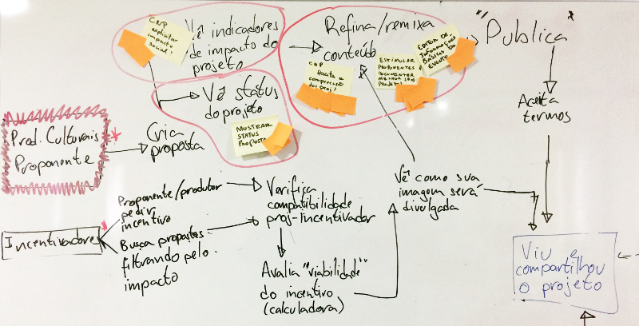
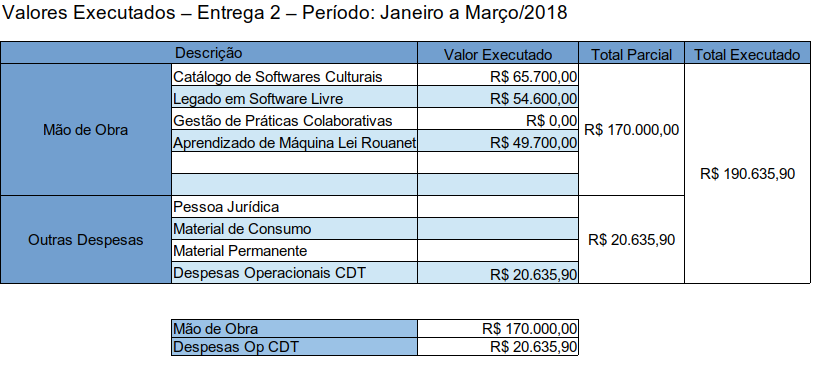

# Introdução

O presente relatório apresenta o acompanhamento do trabalho realizado no
projeto "Ecossistemas de Software Livre", Termo de Cooperação para
Descentralização de Crédito, Processo Ofício No 0646/2017/FUB-UnB, Vigência
Outubro 2017 à Outubro 2019. O relatório apresentado é referente aos avanços
realizados na Etapa II (Janeiro 2018 à Março 2018), de acordo com o cronograma
do Plano de Trabalho.

Toda alteração no cronograma proposto foi realizada  a partir de renegociação
com a CGTEC do Ministério da Cultura, e tais alterações estão descritas no
relatório.

## FASE DE PLANEJAMENTO/EXECUÇÃO

O período de Janeiro 2018 à Março de 2018 contemplou as fases de
planejamento e execução. Abaixo serão apresentados, brevemente, os principais
avanços alcançados no período. Toda a documentação e acompanhamento do projeto
está disponibilizado e pode ser acessado na organização do laboratório
[lappis-unb](https://github.com/lappis-unb), e no
repositório específico do projeto
[lappis-unb/EcossistemasSWLivre](https://github.com/lappis-unb/EcossistemasSWLivre).
Todo o planejamento e execução das tarefas podem ser acompanhados tanto nas
_issues_ quanto nas páginas _wiki_.

Abaixo serão apresentados os principais avanços alcançados no período, por
pacote de trabalho (de acordo com o Plano de Trabalho). Os avanços
apresentados de acordo com o pacote de trabalho e com cronograma, no período
citado.

### Legado em Software Livre

Os repositórios presentes na organização MinC não possuem uma padronização:
muitos deles tem pouca ou nenhuma documentação, alguns nem possuem licenças de
software, testes automatizados, integração contínua, métricas de qualidade de
código. A pouca conformidade com os modelos seguidos por comunidades de
software livre, dificulta ou limita a contribuição de interessados em coloborar
com os sistemas MinC.

Muito sistemas legados carecem de testes automatizados, boa documentação e
práticas de desenvolvimento contínuo, o que dificulta enormemente qualquer
forma de evolução. Estes também são fatores críticos na curva de aprendizado de
novos desenvolvedores e criam uma barreira para a existência de comunidades de
software livre/aberto colaborando com tais sistemas. Vários projetos mantidos
pelo Ministério da Cultura possuem as características acima citados.

Durante a primeira etapa do projeto foi priorizado a visão "legacy in the box" (legado
em uma caixa, tradução literal), no qual o foco foi isolar alguns projetos
mantidos pelo Ministério da Cultura por meio de Docker[^docker]. Essa solução gera o
benefício de criar ambientes de desenvolvimento e produção estáveis, fazendo
com que diminua o tempo de configuração de ambiente. Essa abordagem traz um
grande benefício pois possibilita o uso de práticas DevOps mesmo em sistemas
legados. Esse modelo de isolar pacotes de software legados através de containers Docker possibilita um pipeline de
entrega contínua, deploy continuo, e diminui a fronteira entre a equipe de
infraestrutura e equipe de desenvolvimento.
Já foram observados benefícios dessa abordagem, principalmente em feedback de
desenvolvedores e mantenedores da infraestrutura, feito de forma espontânea.
Pretende-se ainda fazer tanto uma avaliação qualitativa quanto quantitativa
dessa abordagem.

[^docker]: Docker fornece uma camada adicional de abstração e automação de virtualização de nível de sistema operacional. [http://www.docker.com](http://www.docker.com)

Nessa segunda etapa do projeto, usamos uma segunda forma de lidar com software
legado, sempre com o intuito de aplicar técnicas modernas de engenharia de
software e padrões de comunidade de software livre, a fim de viabilizar o uso
desses projetos legados em comunidades de software livre e em pipelines
automatizados. O foco então foi transformar um software legado em software
livre, a partir de técnicas de refatoração de código, e suite de testes
automatizados.

Com isso, abordamos um dos objetivos do pacote que é "Pesquisa em
metodologias de refatoração de sistemas legados", adotando padrões de
comunidades de software livre: desde
documentação técnica, quanto código de qualidade (respeitando métricas de
qualidade de software), cobertura de testes, suite de testes automatizado,
ferramenta de integração contínua, e pipeline de deploy contínuo. Para que
pudessemos alcançar esses objetivos, foi escolhido a API do Salic como estudo
de caso, uma vez que esse é um sistema relativamente pequeno, de grande
relevância e impacto no ecossistema Salic. A compreensão da API do Salic também
auxilia no pacote de trabalho "Aprendizado de Máquina Lei Rouanet", uma vez que
grande parte do trabalho consiste em acessar e processar dados providos da API
(e demanda de dados geram demandas para a evolução da mesma).

As ações programadas para esta etapa de acordo com o plano de trabalho foram:

- [x] Realizar Estudos de conteinerização
- [x] Realizar Estudo de refatoração em software legado
- [x] Realizar Estudos sobre práticas de DevOps aplicada a software legado

Grande parte do time foi alocado por dois meses nessa grande tarefa de
refatorar a API do Salic, e os principais avanços alcançados nessa etapa foram:

1. Adicionada instalação automazada do ambiente de desenvolvimento através do
   Virtualenv[^venv] e do Docker, a documentação está no README.
1. A qualidade do código foi melhorada através das seguintes atividades:
    * Os SQL's em forma de textos foram refatorados, agora é utilizado o
      SQLAlchemy[^sqlalchemy]. Essa refatoração melhora a manutenibilidade do código e
      também permite que o API do Salic funcione com qualquer banco de dados que o
      SQLAlchemy oferece suporte.
    * O Python utilizado no projeto foi atualizado para a versão 3
      (originalmente era utilizado a versão 2 do Python).
    * Utilização do Flake8[^flake] para melhorar a estrutura do código.
    * Adicionado banco de dados local para o ambiente de desenvolvimento.
    * Classificação no Code Climate foi de "F" para "A", resultado da redução
      do débito técnico.
    * Criados testes para os endpoints da API, onde é testado se os dados das
      requisições são recebidos corretamente.
    * Adicionada integração, build e deploy contínuo.
    * Documentação do projeto atualizada.

[^venv]: Virtualenv é um simulador de ambientes virtuais isolados para projetos Python. [http://virtualenv.pypa.io/](http://virtualenv.pypa.io/)
[^sqlalchemy]: SQLAlchemy é uma biblioteca Python de mapeamento objeto-relacional SQL. [http://www.sqlalchemy.org/](http://www.sqlalchemy.org/)
[^flake]: [http://flake8.pycqa.org](http://flake8.pycqa.org)

A mudança da utilização de strings SQL para o código Python usando SQLAlchemy
ocorreu para que além de melhorar a manutenção do código, o SQLAlchemy possui
otmizações e suporte para se conectar com outros sistemas de banco de dados,
por exemplo, caso o Salic passe a utilizar o PostgreSQL todo o sistema da
API Salic continuará funcionando corretamente.

O Flake8 é uma ferramenta de análise estática de código que confere algumas
normas que deixam o código mais legivel, padronizado e manutenível, a
refatoração do código utilizando o Flake8 visou melhorar a manutenção do
API adequando o código as normas do Flake8.

Antes da refatoração não era possível levantar um ambiente de desenvolvimento,
pois era necessário estar conectado ao banco de dados do Salic, porém agora,
com o banco de dados local quem quiser contribuir com o projeto pode levantar
o ambiente em seu próprio computador e usar um banco SQLite local, além disso,
para se conectar a um banco de dados basta setar algumas variáveis de ambiente
e o desenvolvedor pode conectar a um banco de dados remoto, como
por exemplo um banco de dados de homologação.

Foi utilizado o Code Climate, um sistema que analisa a qualidade do
código-fonte e atribui uma classificação ao projeto, essa ferramenta verifica
coisas como duplicação de código informando em quais pontos estão estas duplicações.

Os testes da API foram criados para que ao realizar manutenção no código
seja possivel ter uma garantia de que não foi introduzido bugs no sistema,
anteriormente era difícil saber se o
sistema está funcionando corretamente após o termino de uma manutenção. Também
foram criados testes que comparam os resultados das requisições ao novo projeto de API
refatorado com a API original que está atualmente em produção, para se ter uma
garantia de que ao atualizar para a nova versão em produção os sistemas que usam a API
irão continuar funcionando.

Afim de facilitar que a adição de novas features no salic-api possam chegar ao
sistema em produção de forma mais rápida e prática, foi criado uma pipeline de
deploy contínuo, onde é executado os testes do projeto, é checado se a build
está sendo gerada corretamente e depois é feito o deploy para o servidor.

Todas as melhorias implementadas acima, fez com que o projeto da API do Salic
atendesse os padrões de comunidades de software livre, além de atender os
requisitos de DevOps para entrega e deploy contínuo (build de testes). Para
tal, foram realizados ao total 300 commits (no qual foi aberto um pull request
para o projeto no repositório do MinC). A API foi  então colocado em um
ambiente de homologação no laboratório Lappis, e após todos testes passarem nesse
periodo de homologação, o projeto será entregue para o Minitério.

O acompanhamento do projeto realizado pode ser encontrado em
[https://github.com/lappis-unb/salic-api](https://github.com/lappis-unb/salic-api).

### Catálogo de Softwares Culturais

O principal objetivo nessa etapa é exercitar em todo ciclo de projeto a
experimentação e inovação contínua, de forma a subsidiar a pesquisa realizada
na Etapa 5. Nesse período foram abordados dois objetivos desse pacote:
"Aplicação de práticas de experimentação e inovação contínua no desenvolvimento
do projeto de Catálogo de Software Culturais", e "Transferência de conhecimento
e capacitar a equipe de servidores e técnicos do MinC em práticas de gestão e
desenvolvimento de software aberto, colaborativo e contínuo".

Ações programadas para esta etapa de acordo com o plano de trabalho estão
listados abaixo:

- [x] Realizar Estudos de tecnologias e práticas devops;
- [x] Realizar Estudos repositórios MINC;
- [x] Elaborar Relatório de Resultado dos Estudos;
- [x] Realizar estudos sobre funcionalidades de catálogo de software

Todas as atividades relacionadas às ações listadas acima foram 100%
finalizadas.

No último item, o foco do produto foi alterado de "catálogo de
software" para "Promova Cultura". Tal mudança foi acordado com os gestores do
Ministério. Apesar da mudança de foco do produto, a nova visão não altera o
objetivo principal do pacote, que é a "Aplicação de práticas de experimentação
e inovação contínua no desenvolvimento do projeto de Catálogo de Software
Culturais", além da execução de um ciclo completo de projeto de software.

O planejanento e construção do produto "Promova Cultura" está sendo guiado pela
metodologia de **Design Sprint**[^designsprint], um processo voltado a responder perguntas
críticas de negócios por meio de Design, Prototipagem e Teste de ideias com
Clientes.

[^designsprint]: [http://www.gv.com/sprint/](http://www.gv.com/sprint/)



Durante a Design Sprint chegou-se a pesquisar soluções semelhantes que atendam
ao objetivo definido para o produdo, são soluções que se aproximam, mesmo que
parcialmente, ao objetivo final, incluindo plataformas para visualização de
projetos culturais existentes, bem como soluções para visualização de projetos
detalhados, personalização da visualização, facilitar a compreensão, e que
explicite o impacto social.

O principal desafio trabalhado nesta frente foi o seguinte:

> **Como apresentar projetos de incentivo à cultura de forma que as pessoas
> queiram contar para alguém?**

Como resultado do trabalho a partir deste desafio foi planejado inicialmente
três soluções:

1. [Visualização dos Projetos](https://github.com/lappis-unb/PromovaCultura/issues/6)
1. [Indicadores culturais](https://github.com/lappis-unb/PromovaCultura/issues/5)
1. [Timeline cultural](https://github.com/lappis-unb/PromovaCultura/issues/4)

Todos os detalhes de execução, planejamento, resultados e próximos passos estão
publicamente documentados e disponíveis em [https://github.com/lappis-unb/PromovaCultura](https://github.com/lappis-unb/PromovaCultura).

Além do foco no processo de **Design Sprints** para os produtos acima descritos
o laboratório Lappis deu início a ações para transferência de tecnologia para
o Ministério com objetivo de fomentar as boas práticas de desenvolvimento, evolução,
manutenção, testes, entrega e deploy contínuos.

Grande parte do objetivo de transferência de conhecimento e capacitação da
equipe de servidores técnicos do MinC foi concentrado nesse período em práticas
DevOps. Para tal, além de encontros técnicos para apresentação das práticas
experimentadas no laboratório, alguns documentos técnicos foram elaborados para
tal fim. Toda a documentação foi disponibilizada no repositório do laboratório
[https://gitlab.com/lappis-unb/docs](https://gitlab.com/lappis-unb/docs),
disponibilizada também como anexo no final deste documento, os documentos
cobrem tanto a primeira quanto a terceira meta do período.

Foi elaborado documentação descrevendo todo o pipeline usado para
deploy contínuo no laboratório com os seguintes tutoriais:

1. GitLab CI/CD: Guia relacionado ao uso da Integração Contínua e Deploy
   contínuo no Gitlab;
1. Overview e exemplo básico(pt-br): Um guia que ensina como usar o gitlab
   CI/CD para gerar integração contínua e deploy contínuo em um projeto básico;
1. Usando Docker Compose (pt-br): Um guia que ensina como usar o GitLab CI/CD
   para gerar integração contínua com o Docker Compose em um projeto ágil.
1. Integrando GitLab CI/CD com projeto GitHub(pt-br): Um procedimento que
   possibilita o uso do GitLab CI/CD no projeto GitHub.

Toda a documentação foi realizada em português e disponibilizada para acesso.

Referente à segunda meta "Realizar Estudos repositórios MINC" nesse período foi.

Referente à última meta "Realizar estudos sobre funcionalidades de catálogo de
software" foram realizadas diversas reuniões com a equipe técnica da SEFIC para
compreender o processo da lei Rouanet e como é executado no Salic.

### Práticas de gestão colaborativa

Ações programadas para esta etapa de acordo com o plano de trabalho:

- [x] Realizar Estudos sobre processo de planejamento conjunto
- [x] Identificar grupos de opinião

Todas as atividades relacionadas as ações listadas acima foram 100% finalizada

Proposta de colaboração entre os labs (anexo)

Proposta de agenda de eventos entre labs e minc e com a comunidade de software
livre?

### Aprendizado de Máquina Lei Rouanet

O principal objetivo é o estudo de técnicas de Aprendizado de Máquina que
possam apoiar o sistema de recomendação e fiscalização da lei Rouanet. Nessa
etapa será realizada uma pesquisa exploratória em técnicas de aprendizado de
máquina e processamento de linguagem natural. Tais técnicas e algoritmos serão
aplicados para melhorar a experiência de usuário (UX) por meio da proposta de
chatbots como interface entre os proponentes na lei Rouanet e o Ministério da
Cultura.

Além disso, técnicas de aprendizado de máquinas serão estudadas para
automatizar processos nas trilhas de auditorias, tanto na etapa de habilitação
e aprovação, quanto na etapa de prestação de contas. O objetivo é auxiliar
auditores a encontrar erros, inconsistências e detectar anomalias nas
submissões.

Ações programadas para esta etapa de acordo com o plano de trabalho:

- [x] Realizar Estudo Lei Rouanet/SALIC
- [x] Realizar Estudo de aprendizado de máquina
- [x] Realizar Estudo processamento linguagem natural
- [x] Realizar Estudos de chatbots

Todas as atividades relacionadas as ações listadas acima foram 100%
finalizadas. Segue resumo da execução das atividades:

Foi desenvolvido uma versão inicial do bot -- versão 0.1 (beta) -- com o
framework Hubot Natural[^hubot], o desenvolvimento aconteceu após estudos sobre
ferramentas para criação de chatbots. Decidiu-se utilizar o Rocket.Chat como
interface para o chatbot, compondo a solução em conjunto com o Hubot Natural.

[^hubot]: Hubot Natural é um chatbot de Processamento de Linguagem Natural para o Rocket.Chat. [https://github.com/RocketChat/hubot-natural](https://github.com/RocketChat/hubot-natural)

Realizou-se evolução do projeto Hubot Natural, com contribuições da equipe ao
repositório oficial do projeto. Além de colaboração com os desenvolvedores core
do projeto Rocket.Chat para avaliação do melhor caminho para futuras evoluções.

Esta primeira versão foi treinada com uma base de conhecimento criada a partir
de documentos disponibilizados pela ouvidoria da SEFIC, importante destacar que
neste primeiro treinamento foi incluido especialmente conhecimentos avançados
sobre a lei de incentivo, deixando de fora da base conhecimento básicos
necessários para responder adequadamente questões mais básicas.

Levantou-se um ambiente de homologação em [https://rouana.lappis.rocks](https://rouana.lappis.rocks), incluindo uma landing page da Rouana
com instruções de como validar e homologar o assistente virtual, onde através
da base de conhecimento criada a partir dos documentos disponibilizados pela
ouvidoria da SEFIC, avaliou-se a eficácia do chatbot através de testes de
usuários incluindo servidores do MinC, pesquisadores e alunos do Lappis.

Os testes realizados com chatbot versão 0.1 (beta) em ambiente de homologação
revelaram que o assistente virtual com as tecnologias selecionadas atende
perfeitamente as necessidades do projeto, indicando que o caminho trilhado até
o momento está em sintonia com a missão final de proporcionar um novo canal
aos cidadãos para compreender e tirar dúvidas sobre a lei Rouanet.

Os dados coletados e feedback dos usuários durante a fase de homologação serão
utilizados para direcionar a evolução e melhorias, identificou-se inicialmente
que a base de conhecimento necessita de evolução, especialmente com questões
mais simples.

Contribuimos com a documentação do repositório do Hubot Natural, incluindo
documentar o processo de configuração do LiveTransfer, tradução da documentação
do Hubot Natural para o inglês e adoção de solução de documentação para o
Hubot Natural.
Foi feito também levantamento de práticas e ferramentas para instrumentalização
com ferramentas para análise estática como Coffeelint e
Codeclimate, além de integração contínua ao projeto.

Realizou-se também pesquisa e implementação de melhores práticas de UX para
interfaces conversacionais, necessária para melhoria na experiência do usuário
ao utilizar o assistente virtual da lei Rouanet.

Em paralelo a todo este trabalho, estudou-se tecnologias para criação de uma
nova versão do bot, incluindo frameworks para criação de chatbots mais
inteligentes, exemplos: Rasa, AIVA, Botpress, IBM blue mix, Seq2seq,
Hubot-playbook e Neo4j.  Estes frameworks foram avaliados na prática e algumas
tecnologias foram analisadas em detalhes, como: Rasa-NLU + BotPress +
RocketChat e Rasa-core + Rasa-nlu.

A implementação da nova versão do bot foi iniciada em paralelo ao
desenvolvimento da versão 0.1 (beta) citada anteriormente, já utilizando uma
abordagem mais poderosa de desenvolvimento de bots; escolha de mudança de
arquitetura e tecnologias a serem usadas para a próxima versão do chat.

Em complemento ao desenvolvimento do chatbot realizamos estudos para
compreensão do processo de projetos incentivados via Lei Rouanet, incluindo
estudo de tecnologias de aprendizado de máquina a fim de auxiliar o processo de
admissão e prestação de contas do Salic.

Neste sentido, iniciou-se estudos e testes de algoritmos para detecção de
anomalias em itens das planilhas orçamentárias de projetos submetidos ao Salic,
utilizando técnicas de aprendizado de máquina, tanto na extração de
características relevantes para o problema (_Exploratory Data Analysis_ e _Data
Wrangling_), quanto na classificação de novos dados (usando modelos básicos de
regressão do módulo _Scikit-learn_).

São dois os objetivos dessa frente de trabalho:

1. Auxiliar o processo de admissão e prestação de contas do Salic: automatizar
   tarefas simples e repetitivas de tais processos para otimizar da criação à
   conclusão de projetos culturais;
2. Fornecer insumos para um sistema de transparência do Salic: fornecer
   métricas utilizadas para mapear as categorias e regiões de maior incentivo e
   para incentivar novos produtores culturais.

A frente está trabalhando na criação de uma API que deve se comunicar, a
princípio, com o Salic. Contudo, futuramente novos sistemas também podem
realizar requisições à API para extrair métricas sobre projetos culturais.

O desenvolvimento desta frente está sendo feito com o levantamento de hipóteses
e evolução da API. A metodologia utilizada é a _Hypothesis-Driven Development_,
focada em criação e validação contínua de hipóteses de aprendizado de máquina,
seguida de implementação na API das hipóteses confirmadas na etapa de
validação.

A API está em desenvolvimento em Python, utilizando-se o framework Django. Três
hopóteses já foram levantadas e estão sendo validadas:

1. Relação entre o tempo e a mudança dos preços de itens da planilha
   orçamentária de um projeto;
2. Identificação de itens superfaturados a partir do histórico de projetos
   aprovados e recusados e;
3. Categorização e identificação de similaridade de um projeto a partir de sua
   planilha orçamentária vigente.

Caso as hipóteses se confirmem, serão implementadas e será possível verificar,
para cada projeto, se sua planilha orçamentária contém itens possivelmente
superfaturados e quais os projetos mais similares com o projeto em questão.

Microserviço SALIC Data - Microserviço que realiza a mineração dos dados dos
projetos submetidos por meio da plataforma SALIC e aplica técnicas de machine
learning para extração de padrão, detecção de anomalias.

### Aferição e aceitação de produtos de software

O objetivo geral desta frente de pesquisa é auxiliar os times de
desenvolvimento e gestores de TI do MinC a aprimorarem sua capacidade em tomar
decisões acerca da qualidade das versões dos produtos de software entregues por
seus fornecedores.

Ações programadas para esta etapa de acordo com o plano de trabalho:

- [x] Revisão da área
- [x] Diagnóstico sobre as práticas atualmente adotadas pelo MinC de garantia da qualidade de produto
- [ ] Elaborar Plano de Pesquisa-Ação

Aplicação de surveys com os gestores do MinC e desenvolvedores seniores do
LAPPIS e MinC.

Resultados do survey com os alunos

# Acompanhamento Financeiro


O valor do repasse referente à Etapa I foi de R$598.000,00. Todo esse repasse
foi na rubrica 30.90.20, referente à auxílio Financeiro a Pesquisa (Bolsas).
Desse repasse, um total de R$161.100,00 foi executado na Etapa I, representando
na prática que o orçamento foi consumido apenas na categoria mão-de-obra. Todo
esse valor foi executado no pagamento das bolsas do time, e o valor gasto por
frente do projeto pode ser visto na figura abaixo.

{width=400px}

# Assinatura

Responsável pela Execução:
---
Nome:  Carla Silva Rocha Aguiar
             (Coordenadora do Projeto)

Assinatura:

Data: 06/04/2018

# Anexo I - GitLab CI/CD

Este _doc_ tem por objetivo capacitar um _dev_ em utilizar o **GitLab CI/CD**
em projetos que exigem estruturas básicas de configuração. Para um melhor
aproveitamento deste _doc_ é recomendável ter realizado com completude o [guia
básico](guides/DevOps/GitLab-CI-CD/Overview-and-Basic-Example-(pt_br)).

## Introdução

[Docker Compose](https://docs.docker.com/compose/) é uma ferramenta para
definição e execução de aplicações de múltiplos _containers_ **Docker**.
Através de um arquivo de configuração [YAML](http://yaml.org/) é possível
definir os serviços da aplicação e suas interações. Esse arquivo é utilizado
como entrada em um CLI capaz de iniciar os serviços configurados em um simples
comando.

Enquanto o **Docker** permite a definição e o gerenciamento de um único
_container_, **Docker Compose** define e gerencia múltiplos _containers_ e suas
interações.

Dentre os principais benefícios, incluem:

* Facilidade de definição dos serviços;
* Uma vez definido o arquivo de configuração, o uso de simples comandos inicia a aplicação e todos os seus serviços (_containers_), incluindo suas interações;
* Ideal para desenvolvedores configurarem o ambiente local;
* É uma das camadas de configuração em orquestradores de _containers_ como [Kubernetes](https://kubernetes.io/) e [Cattle](https://github.com/rancher/cattle) (Orquestrador do [Rancher](https://rancher.com/))

Se o projeto da aplicação que estiver desenvolvendo utiliza **Docker Compose**
para definição do ambiente em nível de teste, desenvolvimento e/ou produção,
utilizar **Docker Compose** na integração contínua é uma opção.

# Utilizando Docker Compose no GitLab CI/CD

Para exemplificar o uso do **Docker Compose** no **GitLab CI/CD**, foi criado
um simples respositório chamado
[_characters_](https://gitlab.com/lappis-unb/internal/guides/examples/characters)
consolidando o uso das duas ferramentas no estágio de teste. Ao fim da leitura
deste exemplo você será capaz de reproduzir o uso do **Docker Compose** no
**CI/CD** do seu projeto.

## Projeto Modelo

O sistema _characters_ é um pequeno projeto
[Phoenix](http://phoenixframework.org/) com banco de dados em
[PostgreSQL](https://www.postgresql.org/) que define uma
[API](https://en.wikipedia.org/wiki/Application_programming_interface)
[RESTful](https://www.vinaysahni.com/best-practices-for-a-pragmatic-restful-api)
de uma única entidade chamada `Character`, conforme descrito no
[README](https://gitlab.com/lappis-unb/internal/guides/examples/characters/blob/master/README.md)
do projeto:

```javascript
// curl -X GET -H "Accept: application/json" {HOST}:{PORT}/api/v1/characters/1
"data": {
  "id": 1,
  "first_name": "Jon",
  "last_name": "Snow",
  "age": 14,
  "origin": "A Song of Ice and Fire"
}
```

### Rotas da API

As rotas, conforme especificado no comando `mix phx.routes`, são:

```javascript
// Apresenta todos os Characters
Rota: "GET /api/v1/characters",
Modelo de cURL: `curl -X GET -H "Accept: application/json" {host}:{port}/api/v1/characters`
Exemplo de resultado: {
  "data": [
    {
      "id": 1,
      "first_name": "Jon",
      "last_name": "Snow",
      "age": 14,
      "origin": "A Song of Ice and Fire"
    }, {
      "id": 2,
      "first_name": "Walter",
      "last_name": "White",
      "age": 50,
      "origin": "Breaking Bad"
    }, {
      "id": 3,
      "first_name": "Locke",
      "last_name": "Cole",
      "age": 25,
      "origin": "Final Fantasy VI"
    }, {
      "id": 4,
      "first_name": "Arthas",
      "last_name": "Menethil",
      "age": 24,
      "origin": "Warcraft III"
    }, {
      "id": 5,
      "first_name": "Dominick",
      "last_name": "Cobb",
      "age": 37,
      "origin": "Inception"
    }, {
      "id": 6,
      "first_name": "Vincent",
      "last_name": "Vega",
      "age": 27,
      "origin": "Pulp Fiction"
    }
  ]
}

// Apresenta o Character de id com o valor {:id}
Rota: "GET /api/v1/characters/:id"
Modelo de cURL: `curl -X GET -H "Accept: application/json" {host}:{port}/api/v1/characters/{:id}`
Exemplo de resultado: {
  "data": {
    "id": 1,
    "first_name": "Jon",
    "last_name": "Snow",
    "age": 14,
    "origin": "A Song of Ice and Fire"
  }
}

// Cria um novo Character
Rota: "POST /api/v1/characters"
Modelo de cURL: `curl -X POST -H "Accept: application/json" -H "Content-Type: application/json" -d '{"character":{"first_name":"{first_name}","last_name":"{last_name}","age":{age},"origin":"{origin}"}}' {host}:{port}/api/v1/characters`
Exemplo de dado: {
  "character": {
    "first_name": "Jon",
    "last_name": "Snow",
    "age": 14,
    "origin": "A Song of Ice and Fire"
  }
}
Exemplo de resultado: {
  "data": {
    "id": 1,
    "first_name": "Jon",
    "last_name": "Snow",
    "age": 14,
    "origin": "A Song of Ice and Fire"
  }
}

// Atualiza parcialmente o Character de id com o valor {:id}
Rota: "PATCH /api/v1/characters/:id"
Modelo de cURL: `curl -X PATCH -H "Accept: application/json" -H "Content-Type: application/json" -d '{"character":{"first_name":"{first_name}"}}' {host}:{port}/api/v1/characters/{:id}`
Exemplo de dado: {
  "character": {
    "last_name": "Stark"
  }
}
Exemplo de resultado: {
  "data": {
    "id": 1,
    "first_name": "Jon",
    "last_name": "Stark",
    "age": 14,
    "origin": "A Song of Ice and Fire"
  }
}

// Substitui o Character de id com o valor {:id}
Rota: "PUT /api/v1/characters/:id"
Modelo de cURL: `curl -X PUT -H "Accept: application/json" -H "Content-Type: application/json" -d '{"character":{"first_name":"{first_name}","last_name":"{last_name}","age":{age},"origin":"{origin}"}}' {host}:{port}/api/v1/characters/{:id}`
Exemplo de dado: {
  "character": {
    "first_name": "João",
    "last_name": "das Neves",
    "age": 15,
    "origin": "As Crônicas de Gelo e Fogo"
  }
}
Exemplo de resultado: {
  "data": {
    "id": 1,
    "first_name": "João",
    "last_name": "das Neves",
    "age": 15,
    "origin": "As Crônicas de Gelo e Fogo"
  }
}

// Remove o Character de id com o valor {:id}
Rota: "DELETE /api/v1/characters/:id"
Modelo de cURL: `curl -X DELETE -H "Accept: application/json" {host}:{port}/api/v1/characters/{:id}`
```

## Configuração do Docker Compose

Convencionalmente, projetos que utilizam **Docker Compose** mantêm 3 arquivos
de configuração:

1. `docker-compose.test.yml` (ou `test.yml`): Configura a aplicação para seu ambiente de teste. Utilizada pelos _devs_ para testes isolados localmente ou em ferramentas de integração contínua que suportam **Docker Compose**;
1. `docker-compose.dev.yml` (ou `local.yml`): Configura a aplicação para seu ambiente de desenvolvimento. Utilizada apenas pelos _devs_ para uso do sistema localmente;
1. `docker-compose.prod.yml` (ou `production.yml`): Configura a aplicação para seu ambiente de produção.

Cada tipo de configuração pode exigir _containers_, variáveis de ambiente e
comandos diferentes. Portanto, é comum existir uma pasta `compose` na raíz do
projeto com as configurações de cada ambiente.

### Executando o Projeto Localmente

O arquivo de configuração
[`docker-compose.dev.yml`](https://gitlab.com/lappis-unb/internal/guides/examples/characters/blob/master/docker-compose.dev.yml)
define os serviços **api** e **db**, como pode ser visto a seguir:

```yaml
version: '3.3'

services:
  api:
    container_name: characters-api-dev
    build:
      context: .
      dockerfile: ./compose/dev/api/Dockerfile
    depends_on:
      - db
    env_file:
      - ./compose/dev/db.env
      - ./compose/dev/api.env
    ports:
      - 4000:4000
    volumes:
      - ./api:/code

  db:
    container_name: characters-db-dev
    env_file:
      - ./compose/dev/db.env
    image: postgres
    volumes:
      - ./postgres/dev/data:/var/lib/postgresql/data
```

O arquivo [`./compose/dev/api/Dockerfile`](https://gitlab.com/lappis-unb/internal/guides/examples/characters/blob/master/compose/dev/api/Dockerfile) define o _container_ do serviço **api**, como pode ser visto a seguir:

```docker
FROM elixir

RUN mix local.hex --force && \
    mix local.rebar --force && \
    mix archive.install --force \
    https://github.com/phoenixframework/archives/raw/master/phx_new.ez

COPY ./compose/dev/api/entrypoint.sh /entrypoint.sh
COPY ./compose/dev/api/start.sh /start.sh
COPY ./api /code

WORKDIR /code

EXPOSE 4000

ENTRYPOINT ["/entrypoint.sh"]

CMD ["/start.sh"]
```

E os respectivos _scripts_ [`entrypoint.sh`](https://gitlab.com/lappis-unb/internal/guides/examples/characters/blob/master/compose/dev/api/entrypoint.sh) e [`start.sh`](https://gitlab.com/lappis-unb/internal/guides/examples/characters/blob/master/compose/dev/api/start.sh):

```bash
#!/usr/bin/env bash

cmd="$@"

printf "\n## Mix Version\n\n"
mix -v
mix phx.new -v

printf "\n## Updating Dependencies\n\n"
mix deps.get
mix deps.compile

printf "\n## Creating Database\n\n"
mix ecto.create
mix ecto.migrate

exec $cmd
```

```bash
printf "\n## Initializing API\n\n"
mix phx.server
```

Por fim, os arquivos [`api.env`](https://gitlab.com/lappis-unb/internal/guides/examples/characters/blob/master/compose/dev/api.env) e [`db.env`](https://gitlab.com/lappis-unb/internal/guides/examples/characters/blob/master/compose/dev/db.env) contendo as variáveis de ambiente dos serviços:

```bash
MIX_ENV=dev
POSTGRES_HOST=db
```

```bash
POSTGRES_USER=characters_dev
POSTGRES_PASSWORD=characters_dev
```

A API ficará disponível na porta `4000` de seu `localhost` e os dados do
**PostgreSQL** ficarão armazenados em `./postgres/dev/data`.

Para iniciar os serviços da API em modo de desenvolvimento, execute:

```bash
docker-compose -f docker-compose.dev.yml up
```

Para acessar a **API**, utilize o _browser_ para as rotas `GET` ou qualquer
outro programa que possa definir e executar **REST**. Por exemplo:

```bash
curl -X GET -H "Accept: application/json" localhost:4000/api/v1/characters
```

Irá listar todos os _characters_ definidos. Como o banco de dados está vazio, a
**API** irá retornar o seguinte **json**:

```json
{
  "data": []
}
```

Para semear o banco com dados de exemplo, execute:

```bash
docker-compose -f docker-compose.dev.yml exec api mix run priv/repo/seeds.exs
```

Ao executar novamente o comando para listar os _characters_, a **API** irá
retornar o seguinte **json**:

```json
{
  "data": [{
    "origin": "A Song of Ice and Fire",
    "last_name": "Snow",
    "id": 1,
    "first_name": "Jon",
    "age": 14
  }, {
    "origin": "Breaking Bad",
    "last_name": "White",
    "id": 2,
    "first_name": "Walter",
    "age": 50
  }, {
    "origin": "Final Fantasy VI",
    "last_name": "Cole",
    "id": 3,
    "first_name": "Locke",
    "age": 25
  }, {
    "origin": "Warcraft III",
    "last_name": "Menethil",
    "id": 4,
    "first_name": "Arthas",
    "age": 24
  }, {
    "origin": "Inception",
    "last_name": "Cobb",
    "id": 5,
    "first_name": "Dominick",
    "age": 37
  }, {
    "origin": "Pulp Fiction",
    "last_name": "Vega",
    "id": 6,
    "first_name": "Vincent",
    "age": 27
  }]
}
```

Para desativar a aplicação e seus serviços, execute:

```bash
docker-compose -f docker-compose.dev.yml down
```

Para remover os volumes e as imagens locais geradas, execute o comando com as
seguintes flags adicionais:

```bash
docker-compose -f docker-compose.dev.yml down --rmi local -v
```

### Executando a Aplicação em Ambiente de Teste

O arquivo de configuração
[`docker-compose.test.yml`](https://gitlab.com/lappis-unb/internal/guides/examples/characters/blob/master/docker-compose.test.yml)
define os serviços **api** e **db** em ambiente de teste, como pode ser visto a
seguir:

```yaml
version: '3.3'

services:
  api:
    container_name: characters-api-test
    build:
      context: .
      dockerfile: ./compose/test/api/Dockerfile
    depends_on:
      - db
    env_file:
      - ./compose/test/db.env
      - ./compose/test/api.env
    volumes:
      - ./api:/code

  db:
    container_name: characters-db-test
    env_file:
      - ./compose/test/db.env
    image: postgres
    volumes:
      - ./postgres/test/data:/var/lib/postgresql/data
```

As diferenças entre o arquivo de teste e o de desenvolvimento são:

* Os nomes dos _containers_ estão sinalizadas como _test_;
* A referência do **Dockerfile** é o de teste;
* As variáveis de ambiente são as de teste;
* O diretório do **PostgreSQL** é o de teste.

O arquivo [`./compose/test/api/Dockerfile`](https://gitlab.com/lappis-unb/internal/guides/examples/characters/blob/master/compose/test/api/Dockerfile) define o _container_ do serviço **api**, como pode ser visto a seguir:

```docker
FROM elixir

RUN mix local.hex --force && \
    mix local.rebar --force && \
    mix archive.install --force \
    https://github.com/phoenixframework/archives/raw/master/phx_new.ez

COPY ./compose/test/api/entrypoint.sh /entrypoint.sh
COPY ./compose/test/api/test.sh /test.sh
COPY ./api /code

WORKDIR /code

EXPOSE 4000

ENTRYPOINT ["/entrypoint.sh"]

CMD ["/test.sh"]
```

As diferenças entre o **Dockerfile** de teste e o de desenvolvimento são:

* O caminho do _entrypoint_ é o de teste;
* O _script_ de execução é o de teste.

E os respectivos _scripts_ [`entrypoint.sh`](https://gitlab.com/lappis-unb/internal/guides/examples/characters/blob/master/compose/test/api/entrypoint.sh) e [`test.sh`](https://gitlab.com/lappis-unb/internal/guides/examples/characters/blob/master/compose/test/api/test.sh):

```bash
#!/usr/bin/env bash

cmd="$@"

printf "\n## Mix Version\n\n"
mix -v
mix phx.new -v

printf "\n## Updating Dependencies\n\n"
mix deps.get

exec $cmd
```

```bash
#!/usr/bin/env bash

printf "\n## Performing Tests\n\n"
mix test
```

As diferenças entre os _scripts_ de teste e o de desenvolvimento são:

* O _entrypoint_ não compila as dependências;
* O _entrypoint_ não cria o banco de dados e nem migra;
* O comando roda a suíte de testes ao invés de iniciar o servidor da **API**.

Por fim, os arquivos [`api.env`](https://gitlab.com/lappis-unb/internal/guides/examples/characters/blob/master/compose/test/api.env) e [`db.env`](https://gitlab.com/lappis-unb/internal/guides/examples/characters/blob/master/compose/test/db.env) contendo as variáveis de ambiente dos serviços:

```bash
MIX_ENV=test
POSTGRES_HOST=db
```

```bash
POSTGRES_USER=characters_test
POSTGRES_PASSWORD=characters_test
```

A API não ficará disponível na porta `4000` de seu `localhost`, pois o arquivo
de configuração não faz a configuração de portas. Para executar a aplicação em
ambiente de teste, utilize o seguinte comando:

```bash
docker-compose -f docker-compose.test.yml run --rm api
```

**Docker Compose** irá inicializar o serviço **api** e todos os serviços
associados à ele (no caso: **db**) e executará o comando padrão da imagem (`mix
test`). Os resultados dos testes devem ser:

```markdown
## Performing Tests

.................

Finished in 0.1 seconds
17 tests, 0 failures
```

Para remover os volumes e as imagens locais geradas, execute o comando:

```bash
docker-compose -f docker-compose.dev.yml down --rmi -v
```

## Configuração do GitLab CI/CD

O arquivo de configuração **GitLab CI/CD** ([`.gitlab-ci.yml`](https://gitlab.com/lappis-unb/internal/guides/examples/characters/blob/master/.gitlab-ci.yml)) do projeto é definido:

```yaml
image: docker
services:
  - docker:dind

stages:
  - test
  - update-registry

variables:
  STAGING_IMAGE: $CI_REGISTRY_IMAGE:staging
  LATEST_IMAGE: $CI_REGISTRY_IMAGE:latest

test:
  stage: test
  before_script:
    - apk add --no-cache py-pip
    - pip install docker-compose
  script:
    - docker-compose -f docker-compose.test.yml run --rm api

push staging image:
  stage: update-registry
  script:
    - docker login -u "gitlab-ci-token" -p "$CI_JOB_TOKEN" $CI_REGISTRY
    - docker build -f compose/dev/api/Dockerfile -t $STAGING_IMAGE .
    - docker push $STAGING_IMAGE
  only:
    - /develop/
  tags:
    - docker

push latest image:
  stage: update-registry
  script:
    - docker login -u "gitlab-ci-token" -p "$CI_JOB_TOKEN" $CI_REGISTRY
    - docker build -f compose/prod/api/Dockerfile -t $LATEST_IMAGE .
    - docker push $LATEST_IMAGE
  only:
    - /master/
  tags:
    - docker
```

O _job_ em destaque para este guia é o `test`.

Sua imagem `docker` é herdada da configuração raíz e o serviço `docker:dind`
(**dind** significa _docker in docker_) permite a utilização do CLI do
**Docker**.

A configuração definida em `before_script` adiciona
[pip](https://pypi.python.org/pypi/pip) e instala o **Docker Compose**.

A configuração definida em `script`, por fim, executa as configurações do
serviço `api` definida no arquivo `docker-compose.test.yml`.

As pipelines executadas no projeto podem ser vistas nos seguintes _links_:

* [Primeiro pipeline da _branch_ test](https://gitlab.com/lappis-unb/internal/guides/examples/characters/pipelines/18027322);
* [Segundo pipeline da _branch_ test](https://gitlab.com/lappis-unb/internal/guides/examples/characters/pipelines/18027402);
* [Pipeline da _branch_ develop](https://gitlab.com/lappis-unb/internal/guides/examples/characters/pipelines/18027406);
* [Pipeline da _branch_ master](https://gitlab.com/lappis-unb/internal/guides/examples/characters/pipelines/18027409).

# Anexo II - Alinhamento Estratégico

# Anexo III - Resultados Pesquisa DevOps Pesquisa  Survey de Acompanhamento

## Resultados parciais da revisão sistemática referente à Devops

[https://docs.google.com/forms/d/1SpZMX8qYLZGl7q6nTO4JPpI4eFbMHAJHP5NivG-jMhw/prefill](https://docs.google.com/forms/d/1SpZMX8qYLZGl7q6nTO4JPpI4eFbMHAJHP5NivG-jMhw/prefill)
