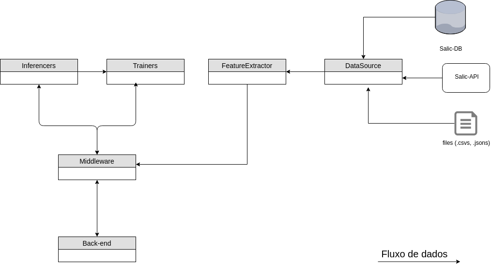
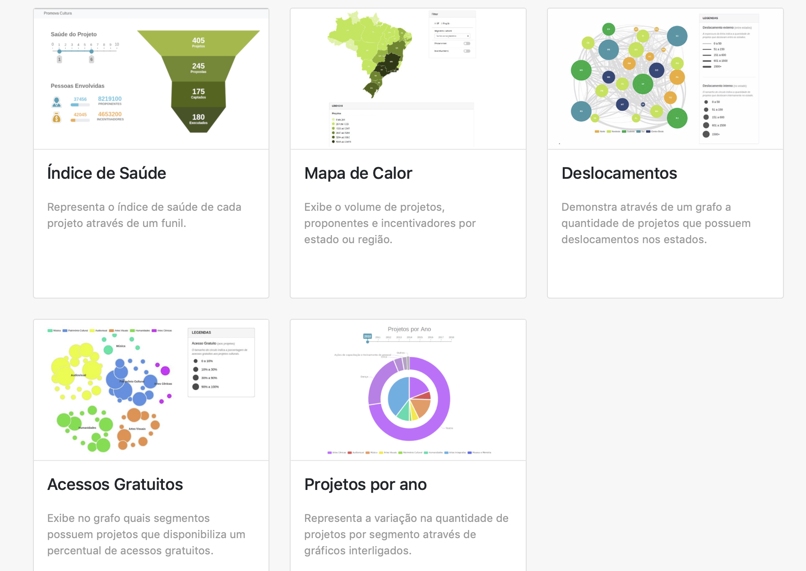

# Introdução

O presente relatório apresenta o acompanhamento do trabalho realizado no
projeto "Ecossistemas de Software Livre", Termo de Cooperação para
Descentralização de Crédito, Processo Ofício No 0646/2017/FUB-UnB, Vigência
Outubro 2017 à Outubro 2019. O relatório apresentado é referente aos avanços
realizados na Etapa IV (Julho 2018 à Setembro 2018), de acordo com o cronograma
do Plano de Trabalho.

Toda alteração no cronograma proposto foi realizada  a partir de renegociação
com a CGTEC do Ministério da Cultura, e tais alterações estão descritas no
relatório.

## FASE DE PLANEJAMENTO/EXECUÇÃO

O período de julho 2018 à setembro de 2018 contemplou as fases de
planejamento e execução. Abaixo serão apresentados, brevemente, os principais
avanços alcançados no período. Toda a documentação e acompanhamento do projeto
está disponibilizado e pode ser acessado na organização do laboratório
[lappis-unb](https://github.com/lappis-unb), e no
repositório específico do projeto
[lappis-unb/EcossistemasSWLivre](https://github.com/lappis-unb/EcossistemasSWLivre).
Todo o planejamento e execução das tarefas podem ser acompanhados tanto nas
_issues_ quanto nas páginas _wiki_. Os principais repositórios dos projetos são:

* [Chatbot Tais](https://github.com/lappis-unb/rouana)
* [SalicML](https://github.com/lappis-unb/salic-ml)
* [SalicAPI](https://github.com/lappis-unb/salic-api)
* [Promova Cultura](https://github.com/lappis-unb/PromovaCultura)

Abaixo serão apresentados os principais avanços alcançados no período, por
pacote de trabalho de acordo com o Plano de Trabalho
e cronograma.

### Legado em Software Livre <!-- {{{ -->

As macro atividades referentes a essa etapa de acordo com o cronograma do plano de trabalho são:

- [x] Realizar Estudo de Refatoração em software legado
- [x] Realizar Estudos sobre práticas de DevOps aplicada a software legado

As ações realizadas  na terceira etapa (referente ao presente relatório) para atender os objetivos do plano de trabalho foram:

- [x] Projeto/implementação  da estratégia proposta pra implementação de novas funcionalidades no SALIC (Estudo de caso).

Esse período foi marcado por propor uma solução microsserviço para adicionar novas funcionalidades para o SALIC, no contexto de aprendizagem de máquina (detalhado na seção do pacote de trabalho aprendizagem de máquina). Foi discutido  uma ideia sobre uma possível arquitetura do ML que atendia alguns critérios como:

- Separar os processos de extração de features dos processos de inferências
- Separar o processo de obtenção dos dados para que atenda diferentes tipos de fontes de dados, como APIs, banco de dados além de arquivos em discos (`.csv`, `.json`)

*Anotações da discussão (03/08/2018) em time sobre aquitetura do ML*

#### Proposta v0 de arquitetura para o ML

Considerando alguns insights da discussão anterior, o time propos uma arquitetura inicial (`v0`) que resolvesse problemas já conhecidos pelo time de desenvolvimento, como por exemplo o forte acoplamento do processo de extração de features do processo de treinamento e inferência, assim como desacoplar o processo de montar links para o SALIC de itens orçamentários, por exemplo, já que todas estas funções estavam sendo feitas dentro de um só módulo do `salic-ml`.
Além de resolver problemas já conhecidos essa arquitetura é proposta para que seja fácil introduzir novos componentes arquiteturais mais robustos mas sem gerar grandes overheads.

*Diagrama de uma proposta de arquitetura(v0) para o ML*

**Componentes**

| Componente | Objetivo |
| ------------- |:-------------:|
| DataSource | Realizar conexões (APIs, databases, arquivos em disco) com a fonte dos dados brutos e preparar estes dados para processamento |
| FeatureExtractor | A partir dos dados oriundos do `DataSource`, preparar as features que serão utilizadas para os algoritmos de treinamento e inferência de Machine Learning. |
| Trainers | Módulo que contém algoritmos de treinamento |
| Inferencers | Especialista em realizar inferências utilizando modelos já treinados, oriundos do componente `Trainers` |
| Middleware | Único meio de conexão do back-end com os módulos do `ML`. Este modulo é um intermediário entre o back-end e o módulo que de fato implementa os algoritmos de ML. Ele é responsável por preparar as features de input para os `Trainers` e `Inferencers` e devolver os outputs deste processamento para o `Back-end`. |
| Back-end | Abstração do back-end, contempla apenas a parte que do back-end é útil (enxergável) ao `Middleware`. Por exemplo, aqui entra um servidor Django mas não entra o front-end pois como o front-end é implementado é indiferente ao processo do `Middleware` |

#### O estado da arte da indústria x Salic

As arquiteturas [Lambda](http://lambda-architecture.net/) e [Kappa](http://milinda.pathirage.org/kappa-architecture.com/) estão hoje populares no mercado como soluções arquiteturais para projetos envolvendo Big Data. Existe também movimentos de propor melhorias para estas arquiteturas `[3]` e não há consenso sobre uma melhor arquitetura para softwares envlvendo Big Data.

Existem dois motivos para o caso do `Salic-ml` em particular, atualmente, não ser um bom candidado te projeto para se utilizar as arquiteturas `Lambda` ou `Kappa`.

1. O volume de novos dados da Análise Financeira é baixo. Atualmente as informações sobre todos os itens comprovados (excluindo imagens e `.pdfs`) é `117 MB`. É conhecido que o banco de dados do Salic passou a ser utilizado por padrão na análise financeira a partir de `2014`, portanto há uma média menor que `39 MB` de dados novos por ano.

2. Não temos total controle sobre a origem dos dados. Os dados brutos estão armazenados no banco de dados do Salic. Implementar uma arquitetura `Lambda` ou `Kappa`, por exemplo, colocaria um novo banco de dados e necessariamente precisariamos manter uma cópia em tempo real do banco do Salic e talvez descartasse a ideia de uma arquitetura `Lambda`, que prioriza a eficiência no tempo de execução de queries aos dados em tempo real.

#### Conclusão

O caso do `Salic-ML` não se encaixa nas arquiteturas que estão no estado da arte das soluções de Big Data do mercado. Sendo um projeto com baixo volume de novos dados, a proposta de arquitetura foi feita para resolver problemas já mapeados pelo time e dispensa arquiteturas que resolvem problemas bem mais complexos.

#### Links de referência

- [1] http://lambda-architecture.net/
- [2] http://milinda.pathirage.org/kappa-architecture.com/
- [3] https://www.oreilly.com/ideas/questioning-the-lambda-architecture

<!-- }}} -->

### Práticas de gestão colaborativa <!-- {{{ -->

O objetivo de estudar os movimentos, organizações, desenvolvedores e demais stakeholders que atuam na gestão colaborativa de software livre é manter um conjunto de ações de governança digital e comunicação que aproveite ao máximo esse potencial em favor das necessidades do órgão e das metas comuns às organizações parte das comunidades. Esse esforço envolve um trabalho de mapeamento de atores de cada comunidade (atuais e potenciais futuros), assessoria para planejamento conjunto, facilitação de fluxos de comunicação e mobilização, realização de atividades conjuntas para integração, identificação de oportunidades externas, assessoria para comunicação e divulgação ao público externo à comunidade e apoio para solução de conflitos.

Ações programadas para esta etapa de acordo com o plano de trabalho:

- [x] Identificar grupos de opinião.

As ações realizadas  nesta etapa para atender os objetivos do plano de trabalho foram:

- [x] Reuniões contínuas com os parceiros
- [x] Relacionamento com os beta testes da Tais

Entrando em entrega contínua, as reuniões de alinhamento e entrega com os parceiros (SEFIC, CGTEC) se intensificaram.

Além disso, com a entrega da chatbot para tirar dúvidas sobre a lei Rouanet, a Tais, foi criado um ambiente de homologação, para que beta testes. Nesse ambiente, os beta testes foram proponentes e pessoas que trabalham na área cultural que foram selecionadas para testar a assistente Virtual. Nesse processo, esse frente trabalhou para desenhar esse processo de colaboração, como de apresentar o produto, os requisitos e necessidades os links de uso, canais de comunicação e, finalmente, avaliação da ferramenta.

<!-- }}} -->

### Aprendizado de Máquina Lei Rouanet <!-- {{{ -->

O principal objetivo é o estudo de técnicas de Aprendizado de Máquina que possam apoiar o sistema de recomendação e fiscalização da Lei Federal de Incentivo à Cultura (Lei Rouanet). Nessa etapa será realizada uma pesquisa exploratória em técnicas de aprendizado de máquina e processamento de linguagem natural. Tais técnicas e algoritmos serão aplicados para melhorar a experiência de usuário (UX) por meio da proposta de chatbots como interface entre os proponentes na Lei Rouanet e o Ministério da Cultura.

Além disso, técnicas de aprendizado de máquinas serão estudadas para automatizar processos nas trilhas de auditorias, tanto na etapa de habilitação e aprovação, quanto na etapa de prestação de contas. O objetivo é auxiliar auditores a encontrar erros, inconsistências e detectar anomalias nas submissões.

Ações programadas para esta etapa de acordo com o plano de trabalho:

- [X] Realizar Estudo da Lei Rouanet/SALIC;
- [x] Realizar Estudo de aprendizado de máquina;
- [x] Realizar Estudo de processamento linguagem natural;
- [x] Realizar Estudo de chatbots.

As ações realizadas  nesta etapa para atender os objetivos do plano de trabalho foram:

## Chatbot Tais

O principais objetivos foram o teste e finalização dos fluxo da nova versão da Taís, utilizando a tecnologia Rasa. Após os testes, as melhorias foram aplicadas, e a taís foi colocada em produção.

1. Estabilização do Ambiente
1. Finalizar Fluxo Inicial
1. Entrega da Taís para o Refinamento
1. Entrega da Taís para o Beta
1. Entrega da Taís para a Produção
1. Estudo de melhoria do Rasa
1. Estudo de melhoria do Rocketchat

### Funcionalidades

1. Estabilização do Ambiente
- Atualização do Rocekt.Chat para inclusão da funcionalidade de "digitando"
- Atualização do Rasa
- Finalização do connector DDP, para total conexão Real Time

2. Finalizar Fluxo Inicial
- Condução dos testes internos
- Melhorias das intents com mais alternativas
- Construção do fluxo principal
- Melhoria da usabilidade no envio das mensagens: deixar elas mais claras e diretas

3. Entrega da Taís para o Refinamento
- Preparação do bot para o time de refinamento da SEFIC
- Preparação do processo e artefatos do refinamento, como questionários e roteiro
- Análise dos resultados do refinamento

4. Entrega da Taís para o Beta
- Desenvolvimento do site de beta
- Levantamento do ambiente de Beta
- Preparação para o beta: questionário, processo, e emails
- Coleta do time de beta
- Análise e monitoramento contínuo do Beta

5. Entrega da Taís para a Produção
- Requisição do ambiente de produção junto ao MinC
- Levantamento do ambiente de produção

6. Estudo de melhoria do Rasa
- Estudar policies e pipelines do rasa
- Estudar melhoria da estrutura de histórias
- Melhorar estrutura de respostas para melhor treinamento da engine de diálogos

7. Estudo de melhoria do Rocketchat
- Automatizar configuração do rocket.chat para aceitar conexões via livechat
- Melhorar real time sdk para fazer o connector do rasa

### Documentos Gerados

- [Análise do Beta](https://github.com/lappis-unb/rouana/wiki/Plano-de-comunica%C3%A7%C3%A3o-com-beta-testers)
- [Tutorial de instalação do livechat](https://github.com/lappis-unb/rouana/wiki/Instala%C3%A7%C3%A3o-do-Livechat-de-Produ%C3%A7%C3%A3o)
- [Monitoramento do beta](https://github.com/lappis-unb/rouana/wiki/Processo-de-Monitoramento-do-Beta)
- [Conteúdo Atual](https://github.com/lappis-unb/rouana/wiki/Mensagens-da-Ta%C3%ADs)
- Classificação de tópicos: [1](https://github.com/lappis-unb/rouana/wiki/Novos-t%C3%B3picos-para-inserir-no-futuro) [2](https://github.com/lappis-unb/rouana/wiki/Intents-classificados-errado) [3](https://github.com/lappis-unb/rouana/wiki/Sin%C3%B4nimos-de-t%C3%B3picos-existentes) [4](https://github.com/lappis-unb/rouana/wiki/T%C3%B3picos-complicados-para-avaliar)

### Salic-ml

O salic-ml é um projeto aberto que utiliza inteligência artificial para otimizar e automatizar o ciclo de vida de projetos culturais viabilizados pela Lei Rouanet e acompanhados pelo sistema Salic. O Projeto é dividido nas frentes de pesquisa, API e dataviz, responsáveis respectivamente pelo estudo dos dados do Salic e geração de métricas e indicadores (frente pesquisa), pela disponibilização das métricas e indicadores gerados pelo time de pesquisa através de uma API (frente API), e pela integração dos dados fornecidos por uma API à plataforma Salic (frente dataviz).

Abaixo são apresentadas as ações planejadas e realizadas por todas as três frentes do projeto entre os meses de julho e setembro de 2018.

## Ações Planejadas

De acordo com o cronograma do Termo de Execução Descentralizada (TED), o projeto deve realizar estudos de aprendizado de máquina e estudos sobre a Lei Rouanet e o sistema Salic. O projeto portanto, está adiantado, uma vez que partes do produto já estão sendo implementadas. Durante o segundo trimestre de 2018 foram levantadas de forma mais pontual as ações a serem realizadas ao longo do terceiro trimestre do ano, as ações são:

- Iniciar desenvolvimento do sistema Salic-ML;
- Planejar próximas etapas de entregas de funcionalidades;
- Realizar homologação de versão inicial do sistema.

## Ações Realizadas

Nesta seção são apresentadas as ações realizadas pelas equipes das três frentes do projeto ao longo do terceiro trimestre de 2018.

### Levantamento e construção dos indicadores financeiros de um projeto cultural

Foram desenvolvidos onze indicadores associados aos custos de um projeto cultural, valores de captação, itens listados na planilha orçamentária, fornecedores dos itens e características do proponente. Estes indicadores servem como uma "assinatura" das características financeiras do projeto, de forma que ela possa ser usada de entrada para os algoritmos que verificarão se, do ponto de vista estatístico, o projeto é anômalo em relação às "assinaturas" de projetos mais comuns no passado. Um exemplo de indicador explorado é o de [Valor Total Aprovado por Projeto Cultural](https://github.com/lappis-unb/salic-ml/blob/master/notebooks/report/analysis_of_approved_funds.ipynb) que está disponível no repositório do projeto.

### Desenvolvimento de algoritmo de detecção de anomalias nos indicadores financeiros

Implementou-se o primeiro protótipo de algoritmo que analisa, do ponto de vista estatístico, se cada indicador financeiro encontra-se dentro de um padrão de normalidade, isto é, ocorre com frequência em projetos passados. O algoritmo permite avaliar o grau de anomalia daquele indicador para um dado projeto cultural.

É importante frisar que este algoritmo ainda se encontra em estágio de protótipo e deve ser usado somente para fins de auxílio à análise de resultados pelo técnico, visto que está se utilizando de premissas estatísticas simplificadas, em comparação à realidade complexa dos dados dos projetos. Ademais, uma indicação de anormalidade estatística em uma métrica não garante que o projeto se confirme como problemático do ponto de vista qualitativo. Portanto, é inadequado fazer qualquer uso deste algoritmo como forma de automatizar processos de decisão na análise de resultados de projetos culturais.

### Desenvolvimento de medida global de complexidade financeira do projeto, com base nos indicadores

Implementou-se também o primeiro protótipo que calcula um índice de complexidade financeira do projeto, com base nos níveis de anomalia apresentados pelos respectivos indicadores financeiros do projeto. Essa medida de complexidade pressupõe que, se um projeto possui muitos indicadores que fogem do costumeiro dentro do histórico de projetos passados, isto levará a um maior esforço por parte do técnico para avaliá-lo, pois afinal o servidor não poderá se apoiar em características similares vistas em trabalhos anteriores.

### Planejamento estratégico do Salic-ML

No dia 28/09/2018 realizou-se o planejamento estratégico da frente Salic-ML junto à SEFIC, momento em que se estabeleceram metas para o quarto trimestre de 2018. As principais metas são:

- Entregar a primeira versão de produção do sistema, com as métricas de complexidade financeira;
- Formalizar o plano de entrega contínua;
- Monitorar as instâncias oficiais do Salic-ML;
- Integrar o Salic-ML ao sistema Salic;
- Construir as métricas de complexidade dos fornecedores e dos proponentes em projetos culturais;
- Aprimorar o cálculo do índice de complexidade de projetos culturais.

### Documento de roadmap do Salic-ML e etapas de entregas

O roadmap do Salic-ML (vide anexos), documento que planeja etapas de entregas e os módulos planejados, foi redigido e validado junto à equipe SEFIC de forma a garantir um ciclo contínuo de entregas de releases do sistema para entrada em produção.

### Entrega para homologação da versão do Salic-ML na parte de análise de complexidade financeira do projeto

Uma versão do sistema foi entregue para homologação junto à equipe SEFIC, contemplando os indicadores financeiros, o algoritmo de detecção de anomalias e o cálculo da métrica global de complexidade. O sistema permite o feedback dos técnicos quanto à utilidade e facilidade de uso da ferramenta até então desenvolvida.

### Modelo arquitetural do Salic-ML

O time realizou um trabalho de pesquisa e discussão para se definir um modelo arquitetural do sistema Salic-ML, para que seja viável a implementação contínua dos diversos módulos que irão compor o sistema. Os diversos modelos levantados e comparados são discutidos no documento [Desenvolvimento Arquitetura Salic-ML](https://github.com/lappis-unb/salic-ml/wiki/Desenvolvimento-Arquitetura-ML), disponível em anexo, e baseiam-se, em sua maioria na arquitetura de microsserviços, onde cada módulo/microsserviço tem desenvolvimento e deploy independente dos demais.

## Anexos

Nesta seção são apresentados os principais documentos produzidos pela equipe.

### Arquitetura do Salic-ML

https://github.com/lappis-unb/salic-ml/wiki/Desenvolvimento-Arquitetura-ML

### Roadmap do projeto

https://github.com/lappis-unb/salic-ml/wiki/Roadmap-do-Salic-ML

### Brainstorming de métricas e indicadores

https://github.com/lappis-unb/salic-ml/wiki/Brainstorming-de-features-para-estimar-Complexidade-Financeira

### Template para notebooks de pesquisa

https://github.com/lappis-unb/salic-ml/blob/master/notebooks/template.ipynb

<!-- }}} -->
### Visualização de dados e criação de Dashboards <!-- {{{ -->

Devido à mudanças de escopo do pacote de trabalho "Catálogo de Software", o pacote "Visualização de dados e criação de Dashboards" foi adiantado no cronograma, e a equipe do catálogo foi realocada para essa frente de trabalho.

As seguintes atividades foram desenvolvidas nesse período:

-[x] Execução do método Design Sprint para elaborar propostas de visualização
-[x] Desenvolvimento de protótipos em código usando a prática de desenvolvimento em power trios

#### Objetivos

O principais objetivos foram ajustes, evolução e criação de protótipos. Além de estudos sobre novas tecnologias e organização interna da equipe.

1. Desenvolver protótipos para apresentar visão transversal da cultura;
2. Estudar, testar e definir tecnologias para apresentação das informações;
3. Evoluir a página principal do PromovaCultura;
4. Organizar internamente a equipe.

#### Resultados

Durante o período, foram desenvolvidos diversos protótipos a partir da __Design Sprint__ realizada na etapa passada. Os dados foram acessados pela API do Salic, que nessa etapa foi mantida e evoluída pelo próprio time. Além de evoluir a API, foram projetas, implementadas e validadas as seguintes visualizações:

- Índice de Saúde de projetos: gráfico que compila de forma visual, informações gerais sobre a "saúde" ou qualidade de projetos culturais, de forma global. Essa visualização tem como principal objetivo informar a visão geral dos projetos submetidos via lei de Incentivo, compilando diversas métricas de análise da qualidade da proposta: (a) preenchimento completo da proposta, (b) quantidade de diligencias,(c) planilha orçamentária coerente com o objeto do projeto, (d) capacidade de captação de recursos, (e) prestação de contas em dia, etc. Todas essas métricas foram traduzidas em um gráfico funil.
- Mapa de Calor de informações sobre proponentes/incentivadores - exibe o volume de projetos, proponentes e incentivadores por estado ou região. Diversos filtros que permite uma análise sobre a origem dos proponentes e incentivadores que utilizam da Lei de Incentivo. Essa análise pode ser feita tanto global, como com o uso de filtros que permitem uma análise refinada por segmento, somente por proponente ou incentivadores
- Deslocamentos - demonstra através de um grafo a quantidade de projetos que possuem deslocamentos nos estados. Essa visualização permite análises sobre como projetos culturais viabilizados pela Lei de Incentivo circulam tanto dentro do próprio estado quanto em demais estados.
- Acessos Gratuitos: exibe grafos de quais segmentos possuem projetos que disponibiliza um percentual de acessiveis gratuitos.
- Projetos por ano - representa variações na quantidade de projetos por segmentos submetidos através de gráficos inteligados.

Além das visualizações acima citados, todos disponiblizados na página do githubpages do projeto, forma realizadas diversas reuniões de alinhamento com a equipe técnica da Sefic, a fim de validar as visualizações e levantar outros requisitos sobre informações úteis que podem ser extraído dos dados.

#### Descrição dos objetivos

1. Desenvolver protótipos para apresentar visão transversal da cultura

  - Índice de Saúde com Funil
	- Ajustes de design visual e experiência de usuário (#74, #75)

  - Mapa de calor - Quantidade de projetos, proponentes e incentivadores
	- Melhoras nos ícones internos ao mapa (#99)
	- Ajustes nos filtros e legendas existentes (#98, #96, #141)
	- Ajustes de design visual e experiência de usuário (#24, #128, #121, #126, #70, #59, #141, #168)

  - Projetos e Segmentos por ano
	- Criação do gráfico (#136, #142)
	- Propostas de design visual e experiência de usuário  (#144)
	- Ajustes de design visual e experiência de usuário (#142, #152, #168, #160)
	- Proposta para design visual e experiência de usuário em versão mobile (#163)

  - Deslocamento de projetos por estados e dentro do estado
	- Definição inicial do protótipo (#136)
	- Propostas de design visual e experiência de usuário (#143)
	- Ajustes de design visual e experiência de usuário (#168)

  - Acesso gratuito por área/segmento
	- Definição inicial do protótipo (#136. #155)
	- Propostas de design visual e experiência de usuário (#143)
	- Definição de instrução de uso (#154)
	- Ajustes de design visual e experiência de usuário (#168, #167)

2. Estudar, testar e definir tecnologias para apresentação das informações

   - Efeitos Visuais (#72)
   - Bibliotecas (#155)
   - Visualização Mobile (#163)	 	

3. Evolução da página principal do PromovaCultura

   - Organização dos objetos que compõe a página (#91, #162)
   - Design visual da página (#124)

4. Organizar internamente a equipe
 	- Componentizar/Refatorar objetos de interface (#105, #101)
	- Organização do repositório (#111)

#### Materiais Gerados

- [Biblioteca De Protótipos](https://lappis-unb.github.io/PromovaCultura/)
- [Modos de interação com os mapas (#24)](https://github.com/lappis-unb/PromovaCultura/files/2160189/Interacao.com.os.mapas.pdf)
- [Visualização mobile para segmentos por ano](https://github.com/lappis-unb/PromovaCultura/files/2419835/arquivo.editavel.inkscape.zip)

<!-- }}} -->

# Acompanhamento Financeiro

Desse repasse, um total de R$198.250,00 foi executado na Etapa IV. Todo
esse valor foi executado no pagamento das bolsas do time, viagem, diaria, pessoa jurídica (mudança de local de container para a instalaçao do conteiner comprado, de acordo com o plano de trabalho do projeto) e o valor gasto por
frente do projeto pode ser visto na Figura abaixo.

# Assinatura

Responsável pela Execução:
---
Nome:  Carla Silva Rocha Aguiar
             (Coordenadora do Projeto)

Assinatura:z  

Data: 08/10/2018

# Anexo I - Estimação de Métricas de Complexidade

Após reuniões com a equipe técnica da Sefic, alguns dos gargalos observados ao longo do ciclo de vida completo de um projeto cultural foram:

- Análise de Objeto
- Análise Financeira
- Tempo de parecer/aprovação

Dentre esses, o que aparenta ser o maior problema atualmente é a **prestação de contas no Minc**. Esse problema ocorre, principalmente, pelo fato de ser demorado para avaliar os comprovantes de cada um dos projetos e verificar se os projetos realmente cumpriram o que foi determinado pelas Instruções Normativas. Hoje, Há cerca de 17 mil projetos já executados pela lei de incentivo e que ainda não foram avaliados.

Uma possível solução para amenizar este problema seria o desenvolvimento de um sistema que recomenda quais projetos aparentam ser mais complexos para serem avaliados, além de recomendar itens da planilha que fogem dos padrões.

## Hipótese

### Hipótese Global

Considerando que não há dados suficientes para que possamos identificar projetos como problemáticos ou de boa qualidade, foi definido que a equipe trabalharia com a hipótese de anomalia.

A hipótese levantada é de que projetos anômalos, ou seja, que são diferentes da maioria do mesmo segmento, tem uma grande chance de serem mais complexos, mais difíceis de serem avaliados.

Mesmo que essa hipótese pudesse ser inválida, seria uma etapa relevante para desenvolvimento de melhores soluções.

Para avaliar a hipótese global, definiu-se que a anormalidade de projetos poderia ser avaliada em várias dimensões. Uma das possibilidades seria analisar a normalidade com relação a:

1) Aspectos Financeiros do projeto.
2) Proponentes responsáveis pelo projeto.
3) Fornecedores de um dado projeto.
4) Aspectos Temporais do ciclo de vida do projeto.
5) Serviços.

### Hipótese Específica

Atacamos primeiramente a dimensão **financeira**. As features/características levantadas para a avaliação até o momento foram:

- Total do número de itens.
- Total do valor captado do projeto.
- Total do valor comprovado do projeto.
- Total do valor aprovado do projeto.
- Número de comprovantes do projeto.
- Porcentagem de itens do projeto em relação a distribuição dos itens mais comuns para aquele segmento ou area.
- Número de projetos já enviados por aquele proponente ou outros “escritores” da proposta.
- Porcentagem ou distribuição dos fornecedores do projeto em relação a fornecedores já conhecidos.
- Porcentagem de itens acima da mediana histórica, média do desvio da mediana, ou o próprio vetor de diferença em relação a mediana.

Todas essas métricas foram escolhidas por meio de *brainstorms* tendo em mente que precisávamos de critérios objetivos que identificassem os projetos.

A partir disso, foi levantada a hipótese de que projetos anômalos com relação a essas features são projetos de difícil análise no âmbito financeiro, ou seja, alta complexidade financeira.

Assumindo essa hipótese como verdadeira, a avaliação da complexidade pode ser realizada por meio de algoritmos de detecção de anomalias (outlier detection).

## Solução

A solução desenvolvida considera que deseja-se construir um sistema de informação/recomendação, para auxiliar a avaliação e tomada de decisão dos analistas.
Dessa forma, essas métricas deveriam ser avaliadas não só em conjunto mas também de forma individual.

Portanto, a solução definida gera uma score/nota para avaliar o quão um projeto é diferente dos demais levando em conta cada uma das métricas individualmente e todas as métricas em conjunto.

A avaliação individual de cada métrica é util para mostrar ao avaliador no que ele deveria focar ao analisar um projeto específico, ou seja, guia-lo na análise. Já a avaliação geral do projeto é útil como um indicador do projeto como um todo, e pode ser usado como critério para alocação dos avaliadores de projetos.

Na primeira solução foram utilizadas ferramentas estatísticas para identificação de similaridade. Foi feita uma análise baseada em Gaussiana.

## Resultados

Os resultados obtidos permitem identificar projetos anômalos, mas isso não generaliza bem para a identificação de projetos problemáticos ou complexos. Os resultados obtidos até hoje, porém, são bastante úteis para o desenvolvimento de sistemas mais complexos.

Algumas das avaliações feitas que evidenciem o que foi dito pode ser vista no seguinte documento [Avaliação do SALIC ML](https://github.com/lappis-unb/salic-ml/wiki/Avaliação-do-SALIC-ML).

Neste documento citamos que dentre os **15** projetos com o maior número de diligencias, **4** foram considerados como tendo um nível muito baixo de complexidade pelo SALIC-ML. Ou seja, cerca de **25%** dos projetos com alta complexidade foram avaliados de forma totalmente incorreta pelo sistema.

Além disso, alguns projetos denunciados pela mídia por corrupção como ‘Minha Cidade’ e ‘Caminhos Sinfônicos’ foram avaliados como projetos muito bons pelo sistema.

## Conclusão

Percebe-se, portanto, que apesar de demonstrar alguns resultados interessantes, o sistema está em um estado inicial, experimental e precisa ser evoluído.

Apesar dos problemas encontrados, o produto desenvolvido e o conhecimento adquirido são muito úteis para o aprimoramento do sistema. Com mais tempo acredita-se que será possível obter melhoras significativas.

## Possíveis evoluções

Uma melhoria que será aplicada ao longo do tempo é o aumento da quantidade e da qualidade das features utilizadas.

Outra evolução bastante relevante é utilizar algoritmos de detecção de anomalia mais adequados para o contexto em que estamos trabalhando.

Apesar dessas evoluções serem úteis, a principal melhoria do sistema seria obtida ao aplicar algoritmos supervisionados de aprendizagem de máquina. Para isso acontecer seria necessário um ser humano avaliar os projetos previamente e dar uma nota e essa nota seria utilizada para treinar o sistema. Dessa forma, o sistema poderia estimar qual seria a nota dada por um analista a um determinado projeto.

# Anexo II - Arquitetura Salic-ML

# Arquitetura SALIC-ML Produto

## Histórico e Estudos
Dada a arquitetura monolítica produzida na primeira etapa de desenvolvimento, temos o seguinte diagrama:

O produto final, apesar de ser construído por três times diferentes (ml, backend e frontend), possui como saída apenas um serviço, chamado na imagem de "Product Stack". Os diferentes componentes são:

- **Django Templates**: Front end feito de forma acoplada ao backend. Apresenta os indicadores ao usuário final.
- **Django ML Indicator Provider (salic-ml)**: Pacote Python, [disponível no pypi](https://pypi.org/project/salic-ml/0.0.6/). Consome os dados brutos de CSVs gerados por meio de queries no SALIC-DB e calcula indicadores e métricas de um dado projeto.
- **Django Backend**: Back end Django padrão, responsável por consumir o **ML Indicator Provider**, formatar os dados e enviá-los ao front end para ser mostrado ao usuário.

Com esta modelagem, existem alguns problemas causados tanto por ela quanto por problemas na implementação. Dado o ritmo de desenvolvimento e a falta de entrosamento e planejamento da equipe recém formada, ocorreram as seguintes situações que levaram a decisões que prejudicam a manutenibilidade do código:

- Dados do ML Indicator Provider são consumidos diretamente por eles nos CSVs
  - Algumas métricas retornam uma lista de elementos que era mapeada apenas pelos IDs/PRONACs
    - Para mostrar esta lista no front, o backend deveria realizar queries no SALIC-DB para buscar as informações faltantes.
    - Os dados necessários são facilmente acessáveis pelo ML Indicator Provider
      - Os dados faltantes são fornecidos pelo salic-ml
  - Os CSVs devem ser colocados na pasta do pacote instalado via Pip
    - Configuração do ambiente não é trivial e automatizada
    - Os dados utilizados para treinamento/pré processamento não são automaticamente atualizados
  - A constante leitura dos CSVs realizada pelas dependências adiciona lentidão ao processo de desenvolvimento do backend.
- Os resultados entregues pelo salic-ml não apresentam formatos específicos
  - A coleta e formatação dos resultados, feitas pelo backend, é extremamente *hardcoded*

**Resultado**: Tempo de desenvolvimento do backend é afetado pela dependência do salic-ml, reduzindo a produtividade da equipe de backend + frontend. A equipe de ML não consegue realizar deploy contínuo das suas implementações já que a formatação dos dados é diretamente dependente do trabalho da equipe de backend + frontend.

***

Com os principais problemas mapeados, iniciou-se o plano de refatoração para permitir a constante melhora do produto.

O primeiro passo foi desacoplar o backend do frontend. Tal transição incluiu mudanças que resolviam em parte o problema de performance na index. Além disso, como o objetivo final é alimentar o SALIC com os indicadores calculados, não faria sentido manter um frontend externo acoplado ao serviço de backend.

Nesta mudança arquitetural, mitigou-se alguns problemas de implementação que afetavam a performance, mas ainda existem pontos a serem corrigidos. A arquitetura resultante pode ser observada na imagem abaixo:

***

Com o frontend desacoplado, pode-se repensar na arquitetura do backend. Como o resultado final é ter um serviço alimentando o SALIC, um ecossistema de microserviços começa a surgir naturalmente.

Ao se desenhar uma arquitetura de microserviços, pode-se pensar em diversos aspectos para limitar até onde cada agente atua dentro da sua rede de serviços.

***

### Decomposição em Microserviços
#### [Decomposição por Funcionalidade (by business capability)](https://microservices.io/patterns/decomposition/decompose-by-business-capability.html)
Define-se que um serviço é responsável por uma única função. Exemplos:
- Serviço de recomendação de filmes
- Serviço de streaming de vídeo
- Serviço de pagamento

#### [Decomposição por Subdomínio (by subdomain)](https://microservices.io/patterns/decomposition/decompose-by-subdomain.html)
Define-se que um serviço é responsável pelas funções contidas em um determinado subdomínio. Exemplos:
- Serviço de Gerenciamento de Filmes (recomendações, streaming, etc)
- Serviço de Gerenciamento de Usuários (contas, assinaturas, etc)

***

No contexto do SALIC-ML, **pode ser interessante o uso da decomposição por subdomínio**, já que as próprias equipes já apresentam esta separação. O espelhamento da organização das equipes na arquitetura de software, e vice versa, pode ser observada em empresas reais, como o Spotify, que [modificou a sua metodologia de desenvolvimento](https://medium.com/productmanagement101/spotify-squad-framework-part-i-8f74bcfcd761) para atender a recém implementada abordagem da arquitetura de microserviços.

Portanto, torna-se sugestiva a modificação do backend para que existam, agora, três serviços:
- Frontend (salic-ml-front)
- Backend (salic-ml-web)
- ML Indicator Provider (salic-ml)

Tal modelagem permite, se devidamente implementada, o deploy contínuo de features feitas no módulo de indicadores.

***

### Gerenciamento dos Dados
#### [Um banco de dados por serviço](https://microservices.io/patterns/data/database-per-service.html)
Cada serviço possui um banco de dados. Oferece a liberdade da escolha da modelagem do banco e do seu paradigma de acordo com a necessidade. Dificulta cruzamento de dados dispostos em bancos diferentes.
#### [Banco de dados compartilhado](https://microservices.io/patterns/data/shared-database.html)
Um banco de dados é compartilhado entre um ou mais serviços. Reduz a liberdade em relação à escolha da modelagem e do paradigma. Facilita o cruzamento de dados, pois estão todos no mesmo banco.

***

No contexto do SALIC-ML, **pode existir uma mesclagem entre as duas abordagens**. Existem bancos individuais para cada serviço mas, ao mesmo tempo, os dados do SALIC-DB podem ser acessados por qualquer serviço do ecossistema, sendo compartilhado.

Com isso, elimina-se problemas de gerenciamento de dados entre o salic-ml-web e o salic-ml, já que ambos podem ler os dados brutos diretamente da fonte principal. Não existirão problemas de inconsistência, já que haverá apenas operações de leitura no banco compartilhado e não haverá transações distribuídas obrigatórias nos bancos individuais. Os bancos de dados individuais podem ser utilizados para cache de pré processamento, o que melhora a performance do sistema e permite a implementação de features como "ordenar os projetos pela complexidade financeira".

***

### Comunicação entre serviços
#### [Invocação de Procedimentos Remotos (Remote Procedure Invocation)](https://microservices.io/patterns/communication-style/rpi.html)
Forma mais simples de se implementar comunicação entre serviços. Exige com que um serviço tenha de lidar com a disponibilidade dos outros serviços de forma individual. Exemplos:
- REST
- gRPC
- Apache Thrift
#### [Mensageiros (Messaging)](https://microservices.io/patterns/communication-style/messaging.html)
Apresenta a necessidade de se utilizar um serviço de comunicação (message broker) mas resolve problemas mencionados na abordagem anterior. Exemplos de comunicadores:
- RabbitMQ
- Apache Kafka
#### [Protocolos de Domínio Específico (Domain-specific Protocol)](https://microservices.io/patterns/communication-style/domain-specific.html)
Utilizado em casos específicos, onde se enxerga a necessidade de se implementar um protocolo para uma determinada atividade. Exemplos:
- SMTP (envio de emails)
- RMTP (streaming de mídias)

***

No contexto do SALIC-ML, **pode ser interessante o uso de algum comunicador**, como o RabbitMQ, para a implementação de features como "pré calcular os indicadores dos projetos". Além disso, aumenta a escalabilidade da solução, já que é possível multiplicar o número de instâncias dos serviços de forma automatizada. A facilidade intrínseca dos brokers também é uma vantagem na implementação.

***

### External API (Acesso externo aos dados produzidos)
#### [API Gateway](https://microservices.io/patterns/apigateway.html)
Apresenta um serviço chamado API Gateway que consome todos os demais e expõe os resultados de forma agrupada de forma generalizada para os clientes.
#### [Backends for frontends](https://microservices.io/patterns/apigateway.html)
Apresenta vários serviços que expõem os resultados para os clientes. Cada um destes serviços é feito especialmente para um tipo de cliente.

***

No contexto do SALIC-ML, temos planejado utilizar apenas um serviço para alimentar possíveis clientes externos. Portanto, **a abordagem ideal atual seria o uso de um API Gateway**. Talvez, por conta das adaptações feitas neste gateway para estar alinhado com o frontend de homologação, seja necessário criar outro serviço para atender às especificidades do SALIC-API. Dito isto, percebe-se que **a abordagem de API Gateway pode ser facilmente substituída pela Backends for frontends**

## Propostas de arquitetura
Este espaço está reservado para a documentação das propostas de arquitetura do produto SALIC-ML:

***

### 16/09/2018 - Versão 1 (Homologação)

Serviços:
- **Frontend**: Permite a visualização dos indicadores num browser
- **API Gateway**: Expõe os resultados dos indicadores para serviços externos
  - **API Gateway DB**: Armazena dados de homologação + cache dos indicadores
- **RabbitMQ**: Gerencia a comunicação entre os serviços
- **ML Indicator Provider**: Calcula os indicadores dos projetos
  - **SALIC-ML-DB**: Armazena dados de pré processamento (médias, desvios padrão, variâncias, etc)
- **SALIC-DB**: Armazenamento dos dados brutos do MinC

***

### 16/09/2018 - Versão 1 com processamento como serviço (Homologação)

Serviços:
- **Frontend**: Permite a visualização dos indicadores num browser
- **API Gateway**: Expõe os resultados dos indicadores para serviços externos
  - **API Gateway DB**: Armazena dados de homologação + cache dos indicadores
- **RabbitMQ**: Gerencia a comunicação entre os serviços
- **ML Indicator Provider**: Calcula os indicadores dos projetos
  - **SALIC-ML-DB**: Armazena dados de pré processamento (médias, desvios padrão, variâncias, etc)
- **Processing Unit**: Realiza o pré processamento dos dados e alimenta o SALIC-ML-DB
- **SALIC-DB**: Armazenamento dos dados brutos do MinC

***

### 16/09/2018 - Versão 1 com processamento como serviço + Integração com SALIC-API (Homologação)

Serviços:
- **Frontend**: Permite a visualização dos indicadores num browser
- **API Gateway**: Expõe os resultados dos indicadores para serviços externos
  - **API Gateway DB**: Armazena dados de homologação + cache dos indicadores
- **RabbitMQ**: Gerencia a comunicação entre os serviços
- **ML Indicator Provider**: Calcula os indicadores dos projetos
  - **SALIC-ML-DB**: Armazena dados de pré processamento (médias, desvios padrão, variâncias, etc)
- **Processing Unit**: Realiza o pré processamento dos dados e alimenta o SALIC-ML-DB
- **SALIC-API**: Realiza o fornecimento dos dados brutos do MinC

***

### 16/09/2018 - Versão 1 com processamento como serviço + Integração com SALIC (Produto Final)

Serviços:
- **API Gateway**: Expõe os resultados dos indicadores para serviços externos
  - **API Gateway DB**: Armazena dados de homologação + cache dos indicadores
- **RabbitMQ**: Gerencia a comunicação entre os serviços
- **ML Indicator Provider**: Calcula os indicadores dos projetos
  - **SALIC-ML-DB**: Armazena dados de pré processamento (médias, desvios padrão, variâncias, etc)
- **Processing Unit**: Realiza o pré processamento dos dados e alimenta o SALIC-ML-DB
- **SALIC-API**: Realiza o fornecimento dos dados brutos do MinC e recebe os resultados do SALIC-ML

***
