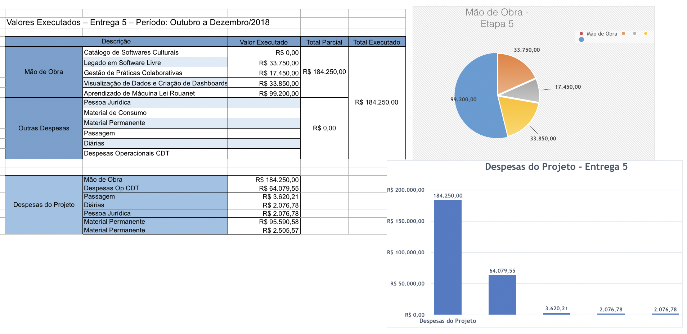

# Introdução

O presente relatório apresenta o acompanhamento do trabalho realizado no
projeto "Ecossistemas de Software Livre", Termo de Cooperação para
Descentralização de Crédito, Processo Ofício No 0646/2017/FUB-UnB, Vigência
Outubro 2017 à Outubro 2019. O relatório apresentado é referente aos avanços
realizados na Etapa VI (Outubro 2018 à Janeiro 2019), de acordo com o cronograma
do Plano de Trabalho.

Toda alteração no cronograma proposto foi realizada  a partir de renegociação
com a CGTEC do Ministério da Cultura, e tais alterações estão descritas no
relatório.
O presente relatório apresenta o acompanhamento do trabalho realizado no 
projeto "Ecossistemas de Software Livre", Termo de Cooperação para
Descentralização de Crédito, Processo Ofício No 0646/2017/FUB-UnB, Vigência
Outubro 2017 à Outubro 2019. O relatório apresentado é referente aos avanços
realizados na Etapa IV (Outubro 2018 à Janeiro 2019), de acordo com o cronograma
do Plano de Trabalho.

Toda alteração no cronograma proposto foi realizada  a partir de renegociação
com a CGTEC do Ministério da Cultura, e tais alterações estão descritas no
relatório.

## FASE DE PLANEJAMENTO/EXECUÇÃO

O período de Outubro 2018 à Janeiro 2019 contemplou as fases de
planejamento e execução. Abaixo serão apresentados, brevemente, os principais
avanços alcançados no período. Toda a documentação e acompanhamento do projeto
está disponibilizado e pode ser acessado na organização do laboratório
[lappis-unb](https://github.com/lappis-unb), e no
repositório específico do projeto
[lappis-unb/EcossistemasSWLivre](https://github.com/lappis-unb/EcossistemasSWLivre).
Todo o planejamento e execução das tarefas podem ser acompanhados tanto nas
_issues_ quanto nas páginas _wiki_.

Abaixo serão apresentados os principais avanços alcançados no período, por
pacote de trabalho (de acordo com o Plano de Trabalho),
de acordo com o cronograma, no período citado.

------

# Chatbot Tais

## Objetivos

O objetivo principal deste período foi a melhoria da inteligência da Tais e aumento do seu conhecimento.

1. Estudo das estruturas internas do Rasa
1. Teste de parâmetros do Rasa
1. Atualização do Rasa
1. Cadastro de novas perguntas e respostas
1. Melhoria das respostas já cadastradas
1. Ambiente de produção
1. Integração entre o Rasa e Rocketchat

## Funcionalidades

1. Estudo das estruturas internas do Rasa
- Levantar possíveis algoritmos implementados no rasa
- Investigar quais cabem no nosso contexto
- Utilizar e testar os algoritmos alterando as estruturas de conversa necessárias

2. Teste de parâmetros do Rasa
- Levantar parâmetros dos algoritmos
- Testar diferentes parâmetros para identificar os que dão os melhores resultados

3. Atualização do Rasa
- Atualizar o rasa para a versão 11
- Evolução do connector com o rocketchat
- Reestruturar os containers para comportar a atualização

4. Cadastro de novas perguntas e respostas
- Levantamento dos conhecimentos pendentes da Taís
- Priorização dos conhecimentos
- Estruturação do conhecimento em perguntas e respotas
- Cadastro das perguntas e repostas
- Teste do novo conhecimento

5. Melhoria das respostas já cadastradas
- Revisão dos textos escritos
- Melhoria das perguntas e textos de repostas

6. Ambiente de produção
- Configuração dos livechat na página inicial da lei rouanet

7. Integração entre o Rasa e Rocketchat
- Desenvolvimento do tracker store para o elasticsearch
- Levantamento da stack do elasticsearch
- Configuração do elasticsearch
- Elaboração da vizualizações no kibana

------

# SALIC-ML

## Objetivos

Na reunião de planejamento estratégico foram estabelecidos os seguintes objetivos:

1. Integrar o ML no Salic
2. Colocar o ML em produção
3. Monitorar a ML em produção
4. Evoluir a acurácia dos modelos
5. Formalizar o plano de Entrega Continua - modelo workshop
6. Sistema de Recomendação com base em Indicadores de Complexidade
7. Sistema de Recomendação com base na Recomendação de projetos similares

## Avanços/Resultados

### 1. Integrar o ML no Salic, 2. Colocar o ML em produção e 3. Monitorar a ML em produção

A primeira versão do relatório de complexidade foi completada no final de Outubro. Estável o suficiente para iniciar a integração com o SALIC. Esse serviço acessa o banco de dados do Salic tanto para realizar o treinamento dos modelos, quanto para estimar as métricas dos projetos. Foi diagnosticado pela CGTEC um alto volume de requisições ao banco do salic (pois além do salic, o versalic também acessa o banco). Por esse motivo, além da sobrecarga de tarefas urgentes ocupou a equipe de técnicos da CGTEC,  a subida em produção foi adiada. Com isso, todas as atividades relacionadas foram colocadas em espera.

### 4. Acurácia dos modelos
Realizamos uma série de estudos para testar distribuições de probabilidade que gerassem modelos de "estereótipo vs. outlier" mais precisos. Definimos o limiar de outlier em 5% e comparamos as seguintes distribuições de probabilidade: Log-Normal, Gammma, KDE-Gauss com a distribuição gaussiana usada até então. Tudo isso em conjunto com o algoritmo de comparação "Lof".

De forma geral, KDE-Gauss foi a mais precisa porém alguns indicadores de complexidade renderam resultados mais precisos com outras distribuições. O detalhe dos estudos para cada métrica está disponível aqui:

- https://github.com/lappis-unb/salic-ml/blob/master/notebooks/report/analysis_of_approved_funds.ipynb
- https://github.com/lappis-unb/salic-ml/blob/master/notebooks/report/analysis_of_common_items.ipynb
- https://github.com/lappis-unb/salic-ml/blob/master/notebooks/report/analysis_of_common_items.ipynb
- https://github.com/lappis-unb/salic-ml/blob/master/notebooks/report/analysis_of_items_price.ipynb
- https://github.com/lappis-unb/salic-ml/blob/master/notebooks/report/analysis_of_items_receipts_ratio.ipynb
- https://github.com/lappis-unb/salic-ml/blob/master/notebooks/report/analysis_of_new_providers.ipynb
- https://github.com/lappis-unb/salic-ml/blob/master/notebooks/report/analysis_of_number_of_items.ipynb
- https://github.com/lappis-unb/salic-ml/blob/master/notebooks/report/analysis_of_number_of_receipts.ipynb
- https://github.com/lappis-unb/salic-ml/blob/master/notebooks/report/analysis_of_proponent_projects.ipynb
- https://github.com/lappis-unb/salic-ml/blob/master/notebooks/report/analysis_of_raised_funds.ipynb
- https://github.com/lappis-unb/salic-ml/blob/master/notebooks/report/analysis_of_verified_and_raised_funds_ratio.ipynb
- https://github.com/lappis-unb/salic-ml/blob/master/notebooks/report/analysis_of_verified_funds.ipynb

O próximo passo é implementar as técnicas identificadas nesses estudos na ferramenta de diagnóstico de complexidade.

### 5. Formalizar o plano de Entrega Continua - modelo workshop e 6. Sistema de Recomendação com base em Indicadores de Complexidade
A dinâmica de entrega contínua funcionou particularmente bem com os dois workshops realizados onde pudemos apresentar as evoluções parciais à equipe da SEFIC e validar a fundo estas evoluções.

Ficou clara a necessidade de separar o diagnóstico de complexidade em duas partes: **complexidade da análise de resultado**, com a maioria das métricas trabalhadas até então, e **saúde do projeto**, com métricas que fazem mais sentido na fase de acessibilidade. 

Nos aprofundamos na complexidade da análise de resultado, refatorando e recombinando algumas métricas. Também identificamos uma nova métrica, que considera a quantidade de comprovantes para cada tipo de transação financeira realizada durante a execução. A versão mais recente da página de diagnóstico contém as seguintes métricas:

Tivemos também a oportunidade de identificar dimensões que podem ser parametrizadas para acelerar a análise de objeto. Essas dimensões serão investigadas nas próximas etapas do projeto.

### 7. Sistema de Recomendação com base na Recomendação de projetos similares
Iniciou-se o desenvolvimento de uma ferramenta que busca, dado um projeto cultural apto a ser analisado financeiramente, retornar um conjunto de projetos (já analisados) que sejam similares a este. O propósito é fornecer de forma fácil ao técnico as experiências passadas de análise em projetos parecidos. 

Para isto, desenhou-se um roadmap de construção da ferramenta, a qual inicia na definição do "estereótipo" de um projeto: um vetor contendo dados característicos como segmento, produto cultural principal, resumo do projeto, título, itens culturais, etc. Construído o vetor de características / estereótipo de um projeto, pode-se buscar os projetos mais similares entre si. 

Finalizou-se com a construção de protótipos, em notebook Python, que testam diferentes vetores de features dos projetos e calculam a similaridade entre eles, usando medidas de similaridade coerentes com os dados levantados. Estes protótipos darão base à ferramenta definitiva na API.

Documentação relacionada:
* https://github.com/lappis-unb/salic-ml/wiki/Um-algoritmo-de-detec%C3%A7%C3%A3o-de-similaridade-de-projetos---Roadmap
* https://github.com/lappis-unb/salic-ml/blob/master/notebooks/doing/projects_similarity_feature_engineering.ipynb
* https://github.com/lappis-unb/salic-ml/blob/master/notebooks/report/textual_features.ipynb

------

# Visualização de dados e criação de Dashboards 

## Objetivo
Conforme acordado com os gestores da SEFIC, o foco da frente de visualização de dados até o final do projeto é a adaptação de todos os relatórios disponíveis no [Portal Comparar](http://sistemas.cultura.gov.br/comparar/salicnet/salicnet.php). 
Esta release iniciou a transição dos estudos de protótipos de visualização para a adaptação dos primeiros relatórios do portal Comparar.

## Atividades realizadas
1. Concluir protótipos iniciados na fase de estudos 
2. Avaliação de usabilidade intrínseca dos protótipos
3. Análise do portal Comparar e início da adaptação dos relatórios.

## Avanços/Resultados
Tomando como base os resultados da análise que fizemos do portal Comparar, foi identificado que o relatório [CAPTAÇÃO DE RECURSO POR UF - DESDE 1992](http://sistemas.cultura.gov.br/comparar/grid_Proponente_Captacao_UF/grid_Proponente_Captacao_UF.php), seria o mais viável com base nos dados disponíveis na API do SALIC, bem como com os protótipos já criados. 

> Relatório de análise do portal Comparar

Com isso, foi desenvolvida uma nova visualização [Mapa de Captação](https://lappis-unb.github.io/PromovaCultura/vuejs.html#/proponent-map), contendo as dimensões do relatório escolhido. Também identificamos os relatórios de [Projetos apresentados por ano, região e uf](http://sistemas.cultura.gov.br/comparar/grid_Comparativo_Apresentacao_PorAno_Regiao_UF/grid_Comparativo_Apresentacao_PorAno_Regiao_UF.php), [Projetos apresentados por ano, área e segmento cultural](http://sistemas.cultura.gov.br/comparar/grid_Comparativo_Apresentacao_PorAno_Area_Segmento/grid_Comparativo_Apresentacao_PorAno_Area_Segmento.php) e [Projetos apresentados por ano, região e uf, área e segmento cultural](http://sistemas.cultura.gov.br/comparar/grid_Comparativo_Apresentacao_PorAno_Regiao_UF_Area_Segmento/grid_Comparativo_Apresentacao_PorAno_Regiao_UF_Area_Segmento.php) como os próximos a serem adaptados.

Em paralelo, a análise de usabilidade identificou algumas dezenas de problemas, sobretudo relacionados à clareza de compreensão dos detalhes como rótulos e legendas. Estes problemas foram priorizados ([#204](https://github.com/lappis-unb/PromovaCultura/issues/204), [#205](https://github.com/lappis-unb/PromovaCultura/issues/205), [#206](https://github.com/lappis-unb/PromovaCultura/issues/206), [#207](https://github.com/lappis-unb/PromovaCultura/issues/207) e [#208](https://github.com/lappis-unb/PromovaCultura/issues/208)) e serão resolvidos à medida que os protótipos forem adaptados à novas visualizações.

## Descrição das atividades

**1. Concluir protótipos iniciados na fase de estudos**

Finalizamos algumas pendências da release anterior que eram importantes para considerar que a etapa de prototipagem estava conluída de fato.
   - Estudo Mobile para protótipo de deslocamento ([#161](https://github.com/lappis-unb/PromovaCultura/issues/161))
   - Incrementar página principal da biblioteca de protótipos ([#181](https://github.com/lappis-unb/PromovaCultura/issues/181))

**2. Avaliação de usabilidade intrínseca dos protótipos**

Visto que a partir desta release os protótipos começariam a ser adaptados para visualizações em ambiente de produção,  realizamos uma série de estudos de usabilidade e acessibilidade para identificar possíveis problemas de experiência que precisariam ser corrigidos antes da entrada em produção. 

Além disso, as visualizações precisam atender os padrões governamentais de acessibilidade tanto para a versão desktop quanto para a versão mobile. Todos os problemas foram mapeados em issues, conforme mencionado acima. Do ponto de vista interno do Laboratório, essas atividades permitiram um primeiro contato dos bolsistas de design com atividades de avaliação de usabilidade.

   - Revisão de protótipos de acordo com as normas de acessibilidade do Governo Federal e do W3C ([#193](https://github.com/lappis-unb/PromovaCultura/issues/193))
   - Redefinir contrastes da paleta de cores da plataforma ([#192](https://github.com/lappis-unb/PromovaCultura/issues/192))
   - Avaliação heurística da versão Desktop dos protótipos ([#202](https://github.com/lappis-unb/PromovaCultura/issues/202))
   - Avaliação heurística da versão Mobile dos protótipos ([#210](https://github.com/lappis-unb/PromovaCultura/issues/210))
   - Estudo sobre melhores formas de disposição de ícones do mapa ([#106](https://github.com/lappis-unb/PromovaCultura/issues/106))

**3. Análise do portal Comparar e início da adaptação dos relatórios**

Esta atividade foi o cerne da entrega. Fizemos um longo trabalho de análise do portal Comparar para entender o tamanho do escopo e o conteúdo dos relatórios. Em seguida, fizemos a correspondência entre o portal Comparar e a realidade do material do Promova Cultura: tanto a API do SALIC quanto os protótipos de visualização disponíveis. O intuito foi de encontrar quais relatórios poderíamos adaptar e disponibilizar no tempo mais curto possível.

Depois da análise concluímos que nenhum relatório do portal Comparar tem dados 100% disponíveis na API. Optamos por ajustar a visualização primeiro e evoluir a API em seguida.

   - Análise de todos os relatórios disponíveis no portal Comparar ([#191](https://github.com/lappis-unb/PromovaCultura/issues/191))
   - Identificar relatórios do Comparar mais próximos aos protótipos criados pela equipe ([#200](https://github.com/lappis-unb/PromovaCultura/issues/200))
   - Início da adaptação do relatório "Proponente - Captação de recursos por UF" ([#209](https://github.com/lappis-unb/PromovaCultura/issues/209) e [#217](https://github.com/lappis-unb/PromovaCultura/issues/217))
   - Mapeamento de mudanças necessárias na API para suportar o relatório "Proponente - Captação de recursos por UF" ([#219](https://github.com/lappis-unb/PromovaCultura/issues/219))

## Materiais Gerados
- [Visualização mobile para deslocamento](https://github.com/lappis-unb/PromovaCultura/files/2572058/mobile_grafo_deslocamento.zip)
- [Biblioteca De Protótipos](https://lappis-unb.github.io/PromovaCultura/)
- [Planilha de comparação - Comparar x PromovaCultura](https://docs.google.com/spreadsheets/d/1HjrNITQ8EGYVrMCxTMUh14Ogyaxum5WVYP4jVDwki4o/edit#gid=617071560)
- [Avaliação heurística - Desktop](https://docs.google.com/spreadsheets/d/1YcHfbKnBSV4-8aEc5LjvGVWDLe9Of2VDhWUxALTF3ok/edit?usp=sharing)
- [Avaliação heurística - Mobile](https://docs.google.com/spreadsheets/d/1mJhnPSw7OsYzEP9dCqF6le-F2X4G9ZbJwktwS5CYjSQ/edit#gid=0)  

### Práticas de gestão colaborativa <!-- {{{ -->

O objetivo de estudar os movimentos, organizações, desenvolvedores e demais stakeholders que atuam na gestão colaborativa de software livre é manter um conjunto de ações de governança digital e comunicação que aproveite ao máximo esse potencial em favor das necessidades do órgão e das metas comuns às organizações parte das comunidades. Esse esforço envolve um trabalho de mapeamento de atores de cada comunidade (atuais e potenciais futuros), assessoria para planejamento conjunto, facilitação de fluxos de comunicação e mobilização, realização de atividades conjuntas para integração, identificação de oportunidades externas, assessoria para comunicação e divulgação ao público externo à comunidade e apoio para solução de conflitos.

As ações realizadas  nesta etapa para atender os objetivos do plano de trabalho foram:

- [x] Reuniões contínuas com os parceiros
- [x] Escrita do Capítulo do Livro sobre "Modelos de contratação""
- [x] Submissão do artigo para OSS 2019 (maior conferência de software livre do mundo) com os resultados da Tais
- [x] Webinars para compartilhar o conhecimento técnico adquirido com o projeto da Tais

Entrando em entrega contínua, as reuniões de alinhamento e entrega com os parceiros (SEFIC, CGTEC) se intensificaram.

Pela maturidade do time e dos resultados resultaram na realização de dois webinars, juntamente com comunidade de software livre e interessados em chatbots na esplanada dos ministério. No primeiro webinar participaram cerca de 100 pessoas, enquanto no segundo webinar participaram cerca de 40 pessoas. O conteúdo do webinar faz parte da estratégia de transferência de técnilogia, no qual o material produzido poderá ser usado pela equipe técnica da CGTEC para auxiliá-los a manter e evoluir a TAIS.

Contribuimos também  com o capítulo de livro "Colaboração aberta e sua relação com a contratação de software na administração pública". Tal texto está disponibilizado em anexo. 

Submetemos também um artigo para a conferência "Open Source System 2019 - OSS", chamado "FLOSS FAQ chatbot project reuse - how to allow  nonexperts to develop a chatbot". Tal artigo está aguardando revisão.

<!-- }}} -->

# Acompanhamento Financeiro

Desse repasse, um total de R$184.250,00 foi executado na Etapa V. Todo
esse valor foi executado no pagamento das bolsas do time, viagem, diaria, pessoa jurídica (mudança de local de container para a instalaçao do conteiner comprado, de acordo com o plano de trabalho do projeto) e o valor gasto por
frente do projeto pode ser visto na Figura abaixo.

# Assinatura

Responsável pela Execução:
---
Nome:  Carla Silva Rocha Aguiar
             (Coordenadora do Projeto)

Assinatura: 

Data: 28/01/2019

# Anexo 1 

1. Introdução

	O objetivo desse texto é apresentar sucintamente o fenômeno geral da colaboração aberta e o mais específico da codificação social que diz respeito à construção de códigos em plataformas de colaboração. A partir daí, fazer uma relação sobre os efeitos desses fenômenos no setor público e na relação da sociedade com o Estado.

	Uma vez delineado esse campo, vamos tratar como esses novos paradigmas que estão surgindo afetam os mecanismos de contratação de software pelo Estado, tendo como base duas experiências atualmente em voga na administração pública federal, os Termos de Execução Descentralizada com Universidades Públicas Federais (TEDs) e as licitações de Ateliê de Software.

	Esse texto não busca ser exaustivo nem na análise dos novos paradigmas nem dos instrumentos mencionados, buscando mais apontar algumas características gerais e levantar hipóteses para pesquisa e reflexão pela administração pública, pesquisadores e sociedade em geral.

2. O fenômeno da colaboração aberta e da codificação social

	Em respeito ao estudo da inovação, já faz alguns anos que a literatura tem apontado para o fenômeno da colaboração aberta ou inovação colaborativa (SØRENSEN & TORFING, 2011; FORTE & LAMPE, 2013; MERGEL, 2015). A inovação colaborativa se dá através de uma plataforma tecnologicamente mediada com baixas barreiras de entrada e saída, participa quem quer, quando quer, como quiser. Seria também uma espécie de inovação produzida pela colaboração baseada em rede, diferente daquela produzida pelas hierarquias do setor público ou pela competição do mercado.

	Dentro desse fenômeno mais amplo, é possível localizar um tipo específico voltado à construção e inovação em software. Chamado na literatura de “social coding” (ou codificação social numa tradução livre) (MERGEL, 2015), esse tipo de colaboração se manifesta na construção de softwares de código aberto através de plataformas de colaboração onde redes de desenvolvedores e usuários colaboram aos milhares. Essas plataformas proporcionam ambientes colaborativos onde os desenvolvedores podem receber relatos organizados dos usuários e outros membros das comunidades de colaboração (as chamadas “issues”), podem se abrir para colaboração externa e colaborar numa miríade de projetos distintos (através dos chamados “pull requests”), podem estudar o código de qualquer projeto através dos recursos de transparência da própria plataforma que permite navegar pelas discussões que levaram a produção dos códigos ali presentes.

	No que diz respeito ao setor público, ainda que seja incalculável o potencial de colaboração da sociedade nos softwares adotados pelo Estado através das plataformas de codificação social, a literatura demonstra que o principal uso tem sido o compartilhamento de código entre uma mesma organização Estatal ou entre organizações distintas (MERGEL, 2015; CRIADO, 2016). Segundo Criado, 

“O caso do GitHub demonstra o potencial para a colaboração aberta entre servidores públicos dentro de uma plataforma aberta na qual podem interagir com outros profissionais do setor para desenvolver projetos conjuntamente, tanto de software quanto de outro tipo” (CRIADO, 2016, página 264, tradução nossa).

	Para que a colaboração aberta de software (“social coding”) seja viável, é fundamental que o acesso ao código seja viável por qualquer pessoa na internet. Uma das principais definições da colaboração aberta diz respeito às baixas barreiras para participar (ou deixar de participar). Se o acesso ao código for dificultado, a colaboração não floresce. Desde algumas décadas atrás, a partir do desenvolvimento dos instrumentos de licenciamento de software, o código fonte tem sido tratado como propriedade intelectual, um ativo comercial a se proteger. Esse cercamento moderno do conhecimento embutido nos códigos fontes dos softwares teve uma resposta, na década de 80, pelo movimento do software livre que entende que a liberdade de modificar e estudar o código do software que utiliza deve ser inalienável. Para isso esse movimento formulou uma lista de 4 liberdades que nenhum ser humano pode ser privado no contato com qualquer software, chamadas de “as 4 liberdades básicas do software livre” (executar, estudar, distribuir e modificar). Para garantir isso, esse movimento utilizou o mecanismo da propriedade intelectual para criar um tipo de licença de software que exige a distribuição do código fonte, incluindo qualquer modificação feita no software por qualquer pessoa, mesmo que posteriormente. A licença criada pelo movimento software livre é a GPL (“General Public Licence”) que está atualmente na sua terceira versão (AGPLv3). 

Atualmente, a disponibilidade de licenças que viabilizam a colaboração aberta em software é maior, graças a movimentos dissidentes que surgiram a partir do movimento software livre, como a turma do “open source”, ampliando a possibilidade de abertura de código. As licenças ligadas ao movimento “open source” desobrigam os futuros contribuidores a licenciar suas modificações em formato aberto, atraindo outros modelos de negócio para o ecossistema da colaboração aberta em software. Kon et al (2012) propuseram uma tipologia que organiza essa grande variedade de licenças em três tipos: (1) Licenças permissivas - que são aquelas onde “não é feita nenhuma restrição ao licenciamento de trabalhos derivados, podendo estes, inclusive, ser distribuídos sob uma licença restrita” (Kon et al, 2012) - (2) Licenças recíprocas totais - que “determinam que qualquer trabalho derivado
precisa ser distribuído sob os mesmos termos da licença original” (Kon et al, 2012) e finalmente as (3) Recíprocas parciais - que embora exijam os mesmos termos para os trabalhos derivados, “quando o trabalho é utilizado apenas como um componente de outro projeto, esse projeto não precisa estar sob a mesma licença” (Kon et al, 2012).

O nosso objetivo aqui não é analisar as vantagens e desvantagens de cada abordagem, mas sim apontar que ambas permitem que o fenômeno da colaboração aberta em software aconteça. Para as licenças ligadas ao movimento do software livre a obrigação de manter abertos os códigos vem do próprio instrumento da propriedade intelectual (o texto da própria licença) enquanto para as ligadas ao movimento “open source” a manutenção da abertura não é uma obrigação mas sim algo que é incentivado pelo nível de atividade do próprio projeto. Quando um projeto de software “open source” é muito ativo, o custo em não publicar uma modificação está em se distanciar da base de código principal do projeto (árvore principal) e perder as próprias modificações no longo prazo, já que sempre será muito grande o incentivo para obter as outras atualizações feitas pelos demais desenvolvedores do projeto. Para fins de definição, sempre que nesse texto nos referirmos ao código construído nas plataformas de codificação social usaremos o termo FLOSS, que é uma junção das iniciais de “free”, “libre” e de “open source software”. O termo FLOSS será utilizado aqui sempre para a referência ao software livre ou ao software de código aberto (“open source”).

3. Efeitos no setor público e na relação Sociedade/Estado

	Para além dos efeitos na eficiência Estatal pelo compartilhamento de códigos entre servidores e orgãos, a literatura de governança digital aponta para um ganho de participação e co-construção de políticas através das plataformas de colaboração aberta. Vaz (2017) alerta que existe um processo global de superação do modo “broadcasting” da governança eletrônica, que adquire um caráter cada vez mais relacional. Segundo o autor, 

O quadro de transformações tecnológicas e a sua interação com os processos sociais permitem que se considere a emergência de uma segunda geração da governança eletrônica. Supera-se o modo broadcasting de governança eletrônica: quebra-se o monopólio do Estado sobre as decisões e iniciativas de transparência e participação nas políticas públicas. Surgem outras formas de promover a participação, a transparência e o controle social das políticas públicas. As práticas de desenvolvimento compartilhado e os dados governamentais abertos permitem a coprodução e a produção descentralizadas de aplicações e serviços de base tecnológica. [...] Isso significa que podem emergir, desvinculadamente dos governos, formas de participação e intervenção nas decisões das políticas públicas baseadas na tecnologia (VAZ, 2017, página 91).

A visão aguçada sobre o potencial da colaboração aberta na construção de softwares no setor público já se manifesta há alguns anos nas experiências Brasileiras. Uma das iniciativas precursoras para o aproveitamento desse potencial foi a do Portal do Software Público Brasileiro (SPB), lançado em 2007, que em apenas três anos de vida já “disponibilizava à sociedade trinta e seis soluções – ou softwares públicos. Tais soluções eram utilizadas por 66 mil usuários cadastrados à época” (FREITAS & MEFFE, 2010, página 535). O portal era utilizado por vários atores diferentes como pessoas físicas, empresas e órgãos das diversas esferas de governo cooperam numa mesma lógica de “disponibilização de bens e serviços públicos em uma rede virtual interorganizacional de produção e difusão de conhecimento tecnológico” (FREITAS, 2012, página 111). Pelo portal, que ainda segue ativo, qualquer orgão público poderia aderir a qualquer uma das soluções disponibilizadas, se beneficiando dos seus arranjos de desenvolvimento, fossem eles realizados pelos próprios órgãos, ou abrindo procedimentos licitatórios para que as empresas envolvidas no ecossistema (o portal chamava de comunidades) pudessem prestar serviços relacionados ao software adotado. 

A iniciativa do Portal do Software Público Brasileiro atuou em consonância com a recomendação de Sørensen & Torfing (2011) quando dizem que “o papel dos gestores públicos não é o de produzir a inovação pública mas o de criar, institucionalizar e gerir arenas abertas e flexíveis para a interação colaborativa com outros atores relevantes ou afetados” (página 857). Por outro lado sempre enfrentou dificuldades para se manter como uma iniciativa vibrante. A baixa capacidade de produzir impacto na administração pública pode estar relacionada com sua excessiva institucionalização, o que acabou criando uma barreira burocrática para a adesão e participação no portal. Isso teria causado o efeito de distanciar as práticas do portal das práticas mais comuns das comunidades de FLOSS nas demais plataformas de colaboração aberta, como github etc. Segundo O’Maley (2013), esse diagnóstico é confirmado por um grande número de desenvolvedores brasileiros de FLOSS “que acreditam faltar à iniciativa tanto uma comunidade de programadores vibrante e inovadora quanto a oferta de software de ponta” (página 5).

A adoção de software pelo Estado é relevante porque impacta diretamente a oferta dos serviços públicos aos cidadãos. A estimativa é que existam atualmente aproximadamente 2 mil serviços públicos só na administração pública federal. Diante do fato de que esses serviços estão em processo de digitalização, diversos tipos de softwares estão sendo adotados para viabilizar a oferta dos serviços e, consequentemente, dar suporte às políticas públicas. Segundo Germani (2016),
serviços digitais se concretizam na forma de software que, acessíveis a partir de dispositivos conectados à rede, podem atender milhares – ou milhões – de pessoas simultaneamente. Softwares, por sua vez, são conjuntos de instruções, escritos em forma de texto, que indicam para o computador o que ele deve fazer. Logo, serviços digitais são, também, produtos de produção intelectual – e, portanto, conhecimento - assim como textos, leis, partituras, etc. Este entendimento é importante pois, ao analisar as novas práticas e metodologias de desenvolvimento de serviços digitais, analisaremos, sobretudo, sob a perspectiva das mudanças estruturais trazidas pelos meios digitais de comunicação, em especial a Internet, sobre a forma como a humanidade produz conhecimento (página 5).

Entre os exemplos de softwares que suportam os serviços públicos digitais está o Sistema de Apoio às Leis de Incentivo à Cultura (SALIC). Esse sistema suporta a política nacional de incentivo à cultura, amparada pela popular Lei Rouanet. A maneira com que os os diversos atores do setor cultural tem acesso a essa política é através desse serviço digital. Dessa forma, uma importante política pública no Brasil tem nesse serviço digital um de seus principais componentes. Muitas das decisões ligadas ao desenvolvimento dos softwares que viabilizam a oferta de um serviço desse tipo passam por decisões políticas. Decisões sobre essas tecnologias acabam portanto, refletindo ou condicionando as decisões sobre as políticas públicas que esses serviços suportam.

4. Arranjo de comunidade

O politólogo Steven Weber (2004) explorou o tema das comunidades de desenvolvimento colaborativo de software de código aberto. Segundo Weber (2004), o processo do código aberto é uma organização política que opera a gestão de conflitos, poder, interesses, regras, normas comportamentais, procedimentos de tomada de decisão e mecanismos de sanção, porém de uma maneira diferente da lógica da economia política da era industrial (Idem, página 3). Não é um processo “caótico e desregrado no qual todos têm igual poder e influência” (Idem, página 3), nem uma comunidade idílica de amigos com a mesma opinião onde reina o consenso e os acordos fáceis. De fato, o conflito é inerente ao processo do FLOSS (Idem, página 3). Ainda segundo Weber, o processo do FLOSS demonstra a “viabilidade de um sistema de inovação massivamente distribuído que estende as fronteiras das noções convencionais sobre os limites da divisão de trabalho” (Idem, página 14). Essas características ficam claras quando diz que as comunidades de código aberto “descrevem uma estrutura nascente de cultura e comunidade”, incluindo critérios “para entrar (e sair), papéis de liderança, relações de poder, questões distributivistas, formas de educação e socialização” (Idem, página 15).

O diagnóstico político de Weber é corroborado por estudos dentro da Computação e Engenharia de Software, a respeito do desenvolvimento colaborativo. Esses estudos analisam a atuação dos desenvolvedores nas plataformas de colaboração aberta. A partir da análise em ambientes de codificação social, Dabbish & Stuart (2012) demonstram que os mecanismos de transparência presentes na plataforma do GitHub viabilizam o trabalho cooperativo, diminuindo a necessidade de encontros sincronizados. Segundo as autoras, seus achados trazem informações relevantes sobre o “desenho desse tipo de mídia social para colaboração em larga escala e implicam uma variedade de maneiras pelas quais a transparência pode apoiar inovação, compartilhamento de conhecimento e construção de comunidade” (DABBISH & STUART, 2012, página 1286). McDonald & Goggins (2013) também perceberam o valor da transparência e das ferramentas sociais de colaboração no dia a dia dos desenvolvedores que operam nesses ambientes. Segundo alguns resultados de suas pesquisas, também com base no GitHub, os desenvolvedores associam a experiência de uso da plataforma com o desenvolvimento de práticas mais democráticas e transparentes de trabalho. O ambiente de discussão em torno das contribuições permite que haja um diálogo público atrelado ao processo decisório sobre novas incorporações de código, permitindo que quem proponha a alteração tenha acesso e exponha todos os argumentos e todos os interessados naquela mudança possam se manifestar (MCDONALD & GOGGINS, 2013, página 142). O uso do mecanismo das menções (@usuário), típico dos ambientes de mídias sociais, também é utilizado como instrumento de trabalho para aumentar a agilidade na resolução dos problemas e melhorar a comunicação entre os desenvolvedores e usuários (ZHANG, WANG & YIN, 2015, página 4). O histórico público desse processo (transparência) também permite que ele seja posteriormente conhecido por qualquer desenvolvedor ou usuário da comunidade.

5. O Estado e as comunidades

Podemos dizer que um arranjo FLOSS é uma instituição social regida pela inovação distribuída, ágil, transparente e com altos níveis de qualidade técnica, que já tem funcionado com participação de agentes Estatais. O livre acesso aos códigos e documentação da comunidade, permite que diferentes atores possam investir em desenvolvimento de forma complementar e articulada com as outras partes, potencializando a entrega de resultados e, a partir da transparência, aumentando a confiança entre os membros do arranjo. Esse tipo de arranjo também fortalece a autonomia da sociedade na construção de tecnologias que dão suporte às políticas públicas ao mesmo tempo que preserva a soberania estatal na execução das políticas, eliminando a dependência das instituições estatais de um único agente privado. Porém, efetivar a adesão do Estado a esses arranjos não é uma operação simples, exigindo outros tipos de capacidades de gestão, além de instrumentos de contratação e financiamento de desenvolvimento de softwares que possam ser operados nestes novos paradigmas.

Quando se trata de instituições estatais o principal apelo deve estar relacionado ao seu caráter público e responsivo à participação da cidadania. Segundo Germani (2016),  os processos de  desenvolvimento de software baseados em códigos abertos, para além do licenciamento do código-fonte, promove a abertura do processo de desenvolvimento para os cidadãos, “que serão futuros usuários do serviço, para participar da sua construção, e permitindo com que outros atores, de dentro e de fora do governo, possam acompanhar, opinar e colaborar com o processo” (GERMANI, 2016). Segundo Meireles (2015), o FLOSS permite que os “softwares sejam modificados pelas próprias pessoas, com base em suas necessidades funcionais, diferenças culturais, personalidade e estilo” (MEIRELES, 2015). Além disso, torna “o desenvolvimento mais ágil, como também promove ciclos de inovação aberta, ao contar com a participação de comunidades interessadas” (MEIRELES, 2015).

Além desses argumentos, vale mencionar o trabalho realizado pelo Grupo de Trabalho que investigou a possibilidade de migrações para FLOSS na UFABC (RATCOV, PELLEGRINI, VIEIRA e DA SILVA, 2018), que produziu um relatório que elenca os seguintes argumentos pró-software livre:
1. Economicidade: Possuem custos mais baixos principalmente quando operados em escala, mesmo considerando os investimentos necessários para a saúde do arranjo de comunidade;
2. Segurança: Software auditável é sempre mais seguro;
3. Autonomia tecnológica: Permite que cidadãos Brasileiros e arranjos locais tenham completo conhecimento dos códigos e tecnologias, afastando dependências externas;
4. Independência de fornecedores: Os arranjos de comunidade são diversos, de forma que o orgão público não fica refém de um único fornecedor;
5. Argumento democrático: Já explicitado acima, sua construção é naturalmente participativa;
6. Estimula um mercado interno de desenvolvimento: Permite que diversos empreendimentos locais se capacitem nas tecnologias devido a baixa barreira de entrada;
7. Promove inclusão digital: Diminuindo barreiras de custo e acesso a conhecimento;
8. Software livre naturalmente suporta formatos abertos pois são construídos de forma a atender uma ampla gama de iniciativas e organizações.

Quanto melhor uma tecnologia é desenhada, tendo em vista os objetivos e sujeitos que farão uso dela, mais sucesso e impacto essa tecnologia irá gerar. Pequenos detalhes muitas vezes são responsáveis por diferenças expressivas nos resultados. Dessa forma, optar por uma metodologia participativa na construção de tecnologias que suportam os serviços públicos digitais parece ser uma decisão acertada. Além do aumento de eficiência e qualidade na construção dos códigos informáticos, as decisões de desenho tomadas em conjunto com o público sujeito e interessado levarão a prestação de melhores serviços públicos. Atualmente, esse processo é incentivado por duas das maiores economias mundiais, Estados Unidos e Reino Unido, além de diversas cidades referência no mundo, como o caso de Barcelona. Como já falamos anteriormente, o Brasil também tem um iniciativa consolidada nessa mesma linha, o portal do Software Público Brasileiro, tendo obtido resultados importantes na última década.

6. Refletindo sobre instrumentos de contratação

Para essa reflexão, vamos considerar dois instrumentos pelos quais um órgão Estatal pode aderir a um arranjo FLOSS. A ideia de adesão ao arranjo FLOSS é definida aqui como a utilização por parte de uma instituição estatal de instrumentos para adotar e financiar o desenvolvimento de infraestruturas e aplicações digitais FLOSS com vistas a implementar um determinado serviço e política pública.

Os exemplos foram trabalhados considerando dois instrumentos distintos, o TED com Universidades Públicas Federais e o Ateliê de Software via licitação com empresas privadas. Serão analisados alguns aspectos transversais à gestão de Tecnologia da Informação, como Efetividade, Sustentabilidade e Inovação, além da adequação de cada instrumento para operar a adesão do Estado aos arranjos de comunidades FLOSS.

6.1. O instrumento do TED

O instrumento do termo de Execução Descentralizada é definido pelo Decreto nº 8.180, de 30 de dezembro de 2013, como “instrumento por meio do qual é ajustada a descentralização de crédito entre órgãos e/ou entidades integrantes dos Orçamentos Fiscal e da Seguridade Social da União, para execução de ações de interesse da unidade orçamentária descentralizadora e consecução do objeto previsto no programa de trabalho, respeitada fielmente a classificação funcional programática”. Esse instrumento é utilizado para realização de parceria entre órgãos vinculados ao Orçamento Geral da União (OGU), podendo parte do orçamento ser transferido para ser empenhado e executado por outros órgãos, desde que cumprindo a função original para a qual aquele orçamento foi destinado. É um instrumento amplamente utilizado para que órgãos da administração direta possam financiar pesquisa e desenvolvimento nas universidades públicas e assim auxiliar e qualificar a entrega dos objetivos pretendidos pelo órgão. 

Alguns orgãos públicos tem usado o instrumento do TED com Universidades Públicas Federais como uma alternativa ao modelo das fábricas de software que entregam soluções de baixa qualidade a custos altos. A parceria com as Universidades Públicas permite aos orgãos operar a inovação em tecnologia fora da métrica por ponto de função. Essa métrica não considera o software como um produto de criatividade intelectual que busca solucionar um problema finalístico, buscando quantificar o seu desenvolvimento pelos seus próprios componentes tecnológicos. No modelo da fábrica de software, a empresa tem o incentivo a desenhar uma solução mais difícil de usar, desde que tenha mais componentes onde possa fazer cobranças maiores. No final das contas, o equilíbrio entre a necessidade do órgão de contratar software de qualidade ao menor custo possível e a necessidade da empresa de faturar mais com menos trabalho empenhado, fica desequilibrada para o lado do órgão, que acaba recebendo software ruim e pagando caro por isso.

Já o modelo de TED com Universidades Públicas Federais tem na inovação e no software de qualidade uma das premissas da parceria. Isso porque a parceria, além de envolver a entrega da solução de software, contempla também a realização de pesquisa e a entrega de outros produtos e atividades ligadas à produção de conhecimento, como formação de novos pesquisadores, publicação de artigos acadêmicos e participação/promoção de seminários. A parceria é planejada através de um plano de trabalho acordado entre as partes que prevê as diversas fases do projeto e um cronograma de desembolso que considere as necessidades reais do projeto em cada etapa. A partir da realização desse planejamento e firmado o instrumento, as partes podem focar a energia no que realmente traz valor para ambas: a pesquisa e desenvolvimento da solução. Nesse modelo, a forma de aferição de resultados é mais flexível por se tratar de dois órgãos federais. A Universidade está sujeita à legislação de licitações e presta contas aos órgãos de controle da mesma forma que o órgão descentralizador, com responsabilidade dividida.

Por outro lado, essa flexibilidade também pode ser uma fragilidade do instrumento. A falta de acompanhamento da parceria pelo órgão descentralizador pode gerar um desequilíbrio em relação aos interesses das partes, fazendo com que a universidade se concentre mais nos resultados acadêmicos de formação e publicação de artigos e menos na entrega da solução para o órgão. Nesse caso a inovação até seria documentada mas não seria aplicada no caso concreto, gerando prejuízos para os objetivos que foram estabelecidos para a ação orçamentária que originou a parceria. Alguns gestores têm dúvidas sobre como garantir o cumprimento dos objetivos no contexto de uma parceria em que o órgão não pode impor sanções à universidade. A parceria ficaria muito dependente dos aspectos macros, relacionados à capacidade que a universidade tem de cumprir os objetivos da parceria, mas faltaria instrumentos concretos para garantir qualidade e alinhamento das entregas específicas com as necessidades do órgão. 

O arcabouço do processo de desenvolvimento das comunidades FLOSS está disponível para ser aplicado nesse tipo de parceria, elevando a qualidade do trabalho para outros patamares, principalmente o uso de metodologia ágil, comunicação instantânea entre servidores do órgão e pesquisadores da universidade, além das práticas simplificadas de documentação em tempo real (através de ferramenta de wiki). Há relatos de alguns aperfeiçoamentos recentes que foram realizados no acompanhamento desse tipo de instrumento de parceria, como a exigência à universidade de confecção de relatórios trimestrais com indicadores, além do acompanhamento constante dos repositórios de código e demais produtos da parceria (comunicação instantânea e wikis).

Se do ponto de vista da inovação são inegáveis as vantagens trazidas pelo instrumento TED com universidades públicas federais, vale fazer a mesma reflexão em relação aos aspectos de efetividade e sustentabilidade. Quanto mais consolidado o tipo de infraestrutura de TI, menos esse instrumento pode agregar a ela. Por exemplo, para o órgão manter infraestruturas básicas como link de internet ou impressoras, esse instrumento não é adequado, pois a conexão entre a inovação e a entrega de valor é mais fraca. Para esse tipo de infraestrutura, os contratos são os instrumento mais adequado. Por outro lado, para a entrega de serviços digitais com agilidade e qualidade como sites e serviços aos cidadãos, o instrumento do TED passa a fazer mais sentido. O legado deixado pelos TEDs nos orgãos tende a se integrar de forma permanente nas equipes contribuindo para aumentar a efetividade do órgão na entrega de serviços digitais para as áreas finalísticas e consequentemente para os cidadãos. Siqueira et al (2018) demonstrou como a capacidade de pesquisa e adaptação do arranjo de universidade foi fundamental para o sucesso de uma parceria de dois anos entre a Universidade de Brasília e o Ministério do Planejamento de 2014 a 2016. Os autores, que atuaram nessa parceria,
acreditavam que a entrega constante de software era melhor para o sucesso do projeto. Em oposição a isso, o Ministério do Planejamento estava habituado à ideia de uma única entrega ao final do projeto, e nem sua estrutura burocrática, nem sua experiência técnica estavam alinhadas a esse estilo de trabalho. Isso estava prejudicando os benefícios da ferramenta (desenvolvida) e impedindo o time da UnB de mostrar os frutos do projeto para aqueles responsáveis por avaliarem o trabalho (SIQUEIRA ET AL, 2018).

Dessa forma, a capacidade do time do projeto de pesquisar e implementar a técnica da engenharia de software conhecida como entrega contínua foi decisiva na transformação cultural necessária para o orgão absorver o trabalho que estava sendo realizado no contexto do projeto. Segundo os autores,
a entrega contínua ajudou a fortalecer a confiança entre desenvolvedores e a equipe do ministério. Antes de utilizar a entrega contínua, eles só conseguiam validar as novas funcionalidades desenvolvidas apenas no final do ciclo de release, normalmente a cada quatro meses. Com a implementação da entrega contínua, versões intermediárias ficavam disponíveis permitindo que eles realizassem pequenas validações ao longo do tempo. O monitoramento constante do trabalho de desenvolvimento trouxe maior segurança aos líderes do ministério e melhorou as interações com nossa equipe (SIQUEIRA ET AL, 2018). 

Em suma, a construção e utilização da entrega contínua no TED descrito pelo artigo, foi responsável por estabelecer três novas dinâmicas, fundamentais para o sucesso da parceria e para a garantia da entrega de valor para o orgão: (1) Demonstrar resultados concretos ao invés de apenas reportá-los, (2) Tornar o gerenciamento do projeto transparente e colaborativo para a equipe do ministério e (3) Ganhar a confiança da equipe do governo (SIQUEIRA ET AL, 2018).
Do ponto de vista da sustentabilidade, as vantagens desse instrumento dependem do cultivo de um ambiente propício no próprio órgão. Via de regra, os servidores dos órgãos de TI se envolvem pouco com as atividades mais centrais das áreas de tecnologia da informação como desenvolvimento e gestão de projetos, ficando mais a cargo da gestão de contratos. Essa característica da gestão das equipes prejudica o processo de apropriação e sustentabilidade, ficando todo o conhecimento apenas nos fornecedores passageiros. Por outro lado, um ambiente onde os servidores se envolvem nas discussões e decisões sobre os sistemas e soluções de software do órgão é o mais propício para aproveitar os aportes que as parcerias com as universidades públicas podem trazer. O uso do arcabouço de trabalho das comunidades FLOSS já mencionados aqui, aliado ao comprometimento verdadeiro dos servidores com os códigos e comunidades das soluções adotadas e desenvolvidas pelo órgão, gera um ambiente seguro e duradouro, cuja sustentabilidade das soluções evita a interrupção na oferta de serviços e políticas digitais pelos órgãos estatais.

6.2. O instrumento do Ateliê de Software

	O instrumento da licitação para ateliê de software usa o mesmo instrumento legal de contratação das atuais fábricas de software (que é a lei de licitações) mas com mudanças substanciais nas exigências e nas métricas utilizadas. A base filosófica do instrumento do ateliê é o manifesto do “kraftmenship” ou manifesto para a artesania de software, que parte da premissa de que a construção de software está mais próxima de um processo de criação artística do que do processo fabril como é tratado atualmente pelas fábricas. Isso significa que o trabalho de criação de software deve estar orientado a criar valor em suas soluções e valorizar o trabalho das pessoas envolvidas, recompensando esforço e qualidade. Assim como o TED, esse instrumento se viabiliza a partir de uma crítica frontal à metodologia de trabalho e gestão e à métrica mais utilizada hoje nos processos governamentais de contratação de software, a contagem por pontos de função. A métrica de pontos de função gera incentivos para que as empresas construam softwares piores e mais complicados para os usuários mas que tenham remunerações mais atraentes para os seus negócios. A busca de soluções inovadoras e o esforço na construção de entregas com mais qualidade não são captados pela métrica. Esse incentivo implícito na métrica gera um desequilíbrio entre a qualidade do produto e o uso eficiente do dinheiro público, em detrimento do lucro das empresas.

	Outra mudança que a lógica do ateliê de software promove em relação às fábricas de software é a mudança da metodologia. No conceito fabril, os processos são mais importantes que as pessoas e toda falha é analisada como uma falta de aderência à eles. Na lógica do ateliê as pessoas estão no centro do método, cuja preocupação começa desde as exigência da pirâmide invertida na montagem da equipe (a quantidade de juniores não pode ser maior que a de desenvolvedores plenos que não pode ser maior que a de desenvolvedores seniores) e a obrigatoriedade de manter a equipe presente no órgão. Com uma equipe formada majoritariamente de profissionais experientes e “in-loco” o gestor passa a ter incidência sobre o clima organizacional que será criado e a metodologia de trabalho que será utilizada. A métrica utilizada pelo ateliê é a UST (Unidade de Serviço Técnico) que estima o nível de esforço necessário para produzir os principais componentes e etapas de um processo de desenvolvimento. Essa estimativa é feita a partir da criação de um repertório acordado entre o orgão e a empresa, que passa por revisões periódicas de comum acordo entre as partes. O fato do repertório poder passar por revisões periódicas permite que ele seja capaz de reequilibrar constantemente a relação a partir dos requisitos de qualidade exigidos pelo órgão. Parece complexo mais não é: enquanto o manual de contagem de pontos de função tem aproximadamente 80 páginas, o repertório utilizado pelo Ministério das Relações Exteriores na contagem dos pontos de função tem no máximo 5 páginas. Essa simplificação também permite que a gestão seja feita com mais qualidade. Um ponto importante para o funcionamento correto da métrica é que nada deve ser pago fora do previsto. Toda entrega é quantificada em UST antes de começar o trabalho e acordada entre as partes. Quando concluído, o valor cobrado deverá ser aquele que foi acordado anteriormente. Qualquer adaptação no repertório só poderá acontecer após a entrega do produto.

	Do ponto de vista da inovação, como o repertório de contagem é gerido pelo próprio órgão, ele tem liberdade de remunerar trabalhos que contribuam para a inovação, como estudos e pesquisas. Por outro lado, uma gestão que usa como base o manifesto da artesania de software percebe a inovação como um vetor para melhorar a qualidade do trabalho das pessoas resolvendo problemas da organização. Não se trata, portanto, de inovar por inovar. Em relação à sustentabilidade, é evidente que o instrumento do ateliê associado ao uso de metodologia ágil é fundamental para que os projetos sejam entregues com qualidade e atendendo a necessidade dos usuários, contribuindo para a continuidade das soluções. Por fim, em relação à efetividade, o instrumento do ateliê contribui com entregas mais rápidas e melhores, melhorando a capacidade que a TI tem de atender as necessidades dos usuários e áreas da organização que dependem da TI para desempenhar o seu trabalho. 

6.3. Adequação dos instrumentos em relação à arranjos de comunidades FLOSS

O diagnóstico dos dois instrumentos (TED e Ateliê de Software) revela que apesar de suas especificidades, eles estão mais capacitados para lidar com os desafios de Efetividade, Sustentabilidade e Inovação inerentes à TI das organizações públicas do que o modelo atual baseado em fábricas de software regidas pela métrica dos pontos de função. Por outro lado, ambos os arranjos se diferem em relação a suas fortalezas e fraquezas, tornando necessária uma avaliação minuciosa do cenário de TI do orgão antes de decidir pela adoção de um ou outro instrumento. Abaixo apresentamos uma sistematização básica desses achados em formato de tabela (Tabela 1).

Para o recorte específico que nos propusemos a desenvolver nesse texto, relacionado a capacidade do Estado em aderir a arranjos de colaboração aberta e codificação social no formato de comunidades FLOSS, percebemos que o instrumento do Ateliê de Software possui inúmeras lacunas e fragilidades nesse sentido. Isso se deve ao fato de que esse instrumento depende de uma cultura organizacional pró software livre nas áreas de TI dos orgãos para que a adesão ao FLOSS aconteça. A licitação de Ateliê de Software não possui nenhum mecanismo incentivador ou facilitador para isso. Regido por um contrato privado, um arranjo desse tipo não garante as vantagens difusas oriundas da adesão à FLOSS, como autonomia tecnológica, desenvolvimento de mercado local entre outras. 

Por outro lado, o instrumento do TED com Universidades Públicas se mostrou mais adequado. Isso acontece pelo TED ser operado como um instrumento baseado em uma parceria de pesquisa aplicada e não nos moldes de um contrato cliente/fornecedor. Como a universidade não pode - nem deve - operar no mesmo ritmo do mercado, precisa aliar a entrega de valor para o parceiro, com a construção de um ambiente saudável de pesquisa e formação. O objetivo institucional da Universidade de atuar na formação de pesquisadores e profissionais requer a construção de pontes amplas de colaboração, sob o risco de oferecer um ambiente medíocre e pouco desafiador para os alunos e bolsistas. Essas especificidades fazem com que os laboratórios de universidade de certa forma dependam da articulação com o conhecimento disponível nas comunidades para efetuar a entrega de valor ao órgão parceiro. Seria hipoteticamente possível a existência de TEDs para construir soluções fechadas e autorais, porém com o alto custo da universidade não cumprir o seu papel institucional, afetando a qualidade e agilidade das entregas no médio e longo prazos. Além disso, soluções fechadas possuem níveis muito mais baixos de transparência, se comparadas com a transparência inerente aos arranjos de colaboração aberta, prejudicando os trabalhos de monitoramento e controle da parceria realizados tanto pelos orgãos parceiros quanto pelos orgãos de controle. Explicando melhor, a articulação com as comunidades potencializa a entrega de inovação e valor da solução ao parceiro, ao passo que a transparência das práticas de colaboração aberta mitigam a fragilidade de controle do instrumento que foi detectada no nosso diagnóstico. Em suma, o instrumento do TED acaba sendo afetado por uma força centrípeta na direção do arranjo de comunidade, tanto pelas necessidades intrínsecas da pesquisa aplicada (inovação com entrega de valor e requisitos de transparência), quanto pelo caráter aberto da cultura da boa ciência como um empreendimento coletivo e colaborativo.

Eixo/Aspecto
Termo de Descentralização com Universidades Públicas Federais
Licitação de Ateliê de Software
Inovação
É premissa do acordo. Com uma boa prospecção de universidades com histórico de pesquisa nas áreas de desafio pretendidas pelo órgão, é um forma eficiente de utilizar pesquisa aplicada nos desafios e problemas do órgão. Requer acompanhamento próximo da gestão para que a inovação não seja aplicada apenas nos produtos acadêmicos da parceria.
Depende da gestão de TI do órgão. Flexibilidade dos repertórios permite à gestão remunerar inovação. Isso depende da gestão pois incentivo dificilmente virá da empresa. Gestão orientada para que as soluções de TI entreguem valor concreto para as áreas finalísticas poderá utilizar bem esse instrumento.
Efetividade
Aumenta a efetividade na oferta de serviços complexos. O legado deixado pelas Universidades instrumentaliza o órgão a fazer entregas melhores e mais efetivas. Para isso é necessário que a gestão tenha sucesso em envolver a equipe permanente (seja servidores, seja terceirizados) nas dinâmicas de trabalho ao longo do tempo de execução do TED.
Flexibilidade do instrumento associado a equipes mais experientes trabalhando em metodologia ágil tende a aumentar a efetividade de todas as entregas.
Sustentabilidade
Instrumento ajuda se ambiente de trabalho compartilhado for criado. O modo de trabalho das comunidades FLOSS ajuda no processo de criação de capacidades na equipe de servidores e terceirizados.
Instrumento ajuda mas peso está na gestão. Entregas melhores fazem com que os projetos durem mais. Clima organizacional faz com que o conhecimento se dissemine na equipe. Por outro lado é papel da gestão proteger a área de TI de projetos inúteis.
Fortalezas
Não depende, para funcionar, do conhecimento prévio da gestão em relação à metodologia de trabalho.
Tem mecanismos de sanção que podem ser utilizados para melhorar a qualidade dos produtos entregues.
Fragilidades
Sem acompanhamento próximo da gestão, foco da Universidade tende a ser em produtos acadêmicos ou experimentos sem conexão com os problemas da organização.
Depende mais do conhecimento prévio da gestão em relação a metodologia de trabalho e cultura organizacional.

Tabela 1: Sistematização do diagnóstico realizado nos dois instrumentos

7. Conclusão

	Passamos por uma visão geral do fenômeno da colaboração aberta, a partir de sua vertente mais específica da codificação social. A codificação social tem sido pesquisada como um fenômeno em crescimento e cada vez mais adotadas pelas instituições Estatais. As potencialidades da codificação social são viabilizadas pelo modelo de licenciamento dos softwares, geridos como um bem comum. Do software livre ao “open source” os diversos modelos permitem a realização da codificação social, ainda que com visões de mundo e incentivos diferentes.
	
	De forma geral, os arranjos de comunidade FLOSS baseados nas plataformas de codificação social atuam com altos níveis de transparência se utilizando de instrumentos específicos dessas plataformas para fomentar a comunicação e construir práticas de colaboração. Do ponto de vista do Estado, a adoção de softwares produzidos dentro de desses paradigmas pode aumentar a permeabilidade e a transparência na construção dos serviços digitais disponibilizados para a população, aprimorando a participação social, além de outros benefícios mais difusos para a sociedade.

	Por fim, analisamos dois instrumentos de contratação e investimento público em softwares o TED com universidades federais e a licitação de ateliê de software com empresas privadas. Ambos os instrumentos têm a vantagem de superar a mediocridade da métrica de pontos por função aumentando a entrega de valor para os orgãos e a efetividade no gasto do recurso público. Por outro lado o TED é mais recomendado para contextos de inovação, além de ser mais adequado para a adesão do Estado a arranjos de comunidades FLOSS. O instrumento do TED com as universidades públicas, se bem manejado, traz enormes benefícios relacionados a inovação e sustentabilidade, além dos demais benefícios difusos trazidos pela adesão a esse tipo de arranjo.

8. Referências Bibliográficas

CRIADO, J. Ignacio. Las administraciones publicas en la era del gobierno abierto. Gobernanza inteligente para un cambio de paradigma en la gestion publica. Revista de Estudios Políticos, n. 173, 2016. Disponível em:      http://www.cepc.gob.es/Publicaciones/Revistas/revistaselectronicas?IDR=3&IDN=1361&IDA=37798 Acesso em: 25 out. 2018.

DABBISH, Laura; STUART, Colleen; TSAY, Jason; et al. Social Coding in GitHub: Transparency and Collaboration in an Open Software Repository. In: Proceedings of the ACM 2012 Conference on Computer Supported Cooperative Work. New York, NY, USA: ACM, 2012, p. 1277–1286. (CSCW ’12). Disponível em: <http://doi.acm.org/10.1145/2145204.2145396>. Acesso em: 24 out. 2018.

FORTE, Andrea; LAMPE, Cliff, Defining, Understanding, and Supporting Open Collaboration: Lessons From the Literature, American Behavioral Scientist, v. 57, n. 5, p. 535–547, 2013.

FREITAS, Christiana Soares de; MEFFE, Corinto. Redes de produção de conhecimento tecnológico: um projeto governamental brasileiro. Estudos de Sociologia, v. 15, n. 29, 2010. Disponível em: <http://piwik.seer.fclar.unesp.br/estudos/article/view/2978>. Acesso em: 1 nov. 2018.

FREITAS, Christiana Soares de. O Software Público Brasileiro: novos modelos de cooperação econômica entre Estado e Sociedade Civil. Informação & Sociedade: Estudos, v. 22, n. 2, 2012. Disponível em: <http://periodicos.ufpb.br/ojs2/index.php/ies/article/view/12231>. Acesso em: 1 nov. 2018.

GERMANI, Leonardo Barbosa. Desafios para o desenvolvimento de serviços digitais pelo governo federal brasileiro. 2016. Disponível em: tede2.pucsp.br/tede/handle/handle/18772. Acesso em: 1 nov. 2018.

KON, Fabio et al. Software Livre e Propriedade Intelectual: Aspectos Jurídicos, Licenças e Modelos de Negócio. http://ccsl.ime.usp.br/files/slpi.pdf Acesso em 05/nov/2018, v. 2, p. 12, 2012.

MCDONALD, Nora; GOGGINS, Sean. Performance and Participation in Open Source Software on GitHub. In: CHI ’13 Extended Abstracts on Human Factors in Computing Systems. New York, NY, USA: ACM, 2013, p. 139–144. (CHI EA ’13). Disponível em: <http://doi.acm.org/10.1145/2468356.2468382>. Acesso em: 25 out. 2018.

MEIRELES, Adriana Veloso. Democracia 3.0 : interação entre governo e cidadãos mediada por tecnologias digitais. 2015. Disponível em: <http://repositorio.unb.br/handle/10482/19044>. Acesso em: 26 nov. 2017.

MERGEL, Ines. Open collaboration in the public sector: The case of social coding on GitHub. Government Information Quarterly, v. 32, n. 4, p. 464–472, 2015.

O’MALEY, Daniel. Software Público Brasilerio (SPB): The State in the Commons. In: WORKSHOP SOBRE SOFTWARE LIVRE. Anais do WSL2013. Porto Alegre-RS: SBC. [s.l.: s.n.], 2013, p. 1–10.

RATCOV, D.; PELLEGRINI, J. C.; VIEIRA, M. S.; da SILVA, S. J. Relatório -- GT Software Livre. Santo André, 2018. Disponível em: http://nti.ufabc.edu.br/cetic-2/relatorios-de-grupos-de-trabalho

SIQUEIRA, R. et al, Continuous Delivery: Building Trust in a Large-Scale, Complex Government Organization, IEEE Software, v. 35, n. 2, p. 38–43, 2018. Disponível: https://ieeexplore.ieee.org/stamp/stamp.jsp?tp=&arnumber=8255783

SØRENSEN, Eva; TORFING, Jacob. Enhancing Collaborative Innovation in the Public Sector. Administration & Society, v. 43, n. 8, p. 842–868, 2011.

VAZ, José Carlos. Transformações tecnológicas e perspectivas para a gestão democrática das políticas culturais. Cadernos Gestão Pública e Cidadania, v. 22, n. 71, 2017.

WEBER, Steven. “The Success of Open Source”. Harvard University Press, 2004. 312 p.

ZHANG, Yang; WANG, Huaimin; YIN, Gang; et al. Exploring the Use of @-mention to Assist Software Development in GitHub. In: Proceedings of the 7th Asia-Pacific Symposium on Internetware. New York, NY, USA: ACM, 2015, p. 83–92. (Internetware ’15). Disponível em: <http://doi.acm.org/10.1145/2875913.2875914>. Acesso em: 25 out. 2018.

