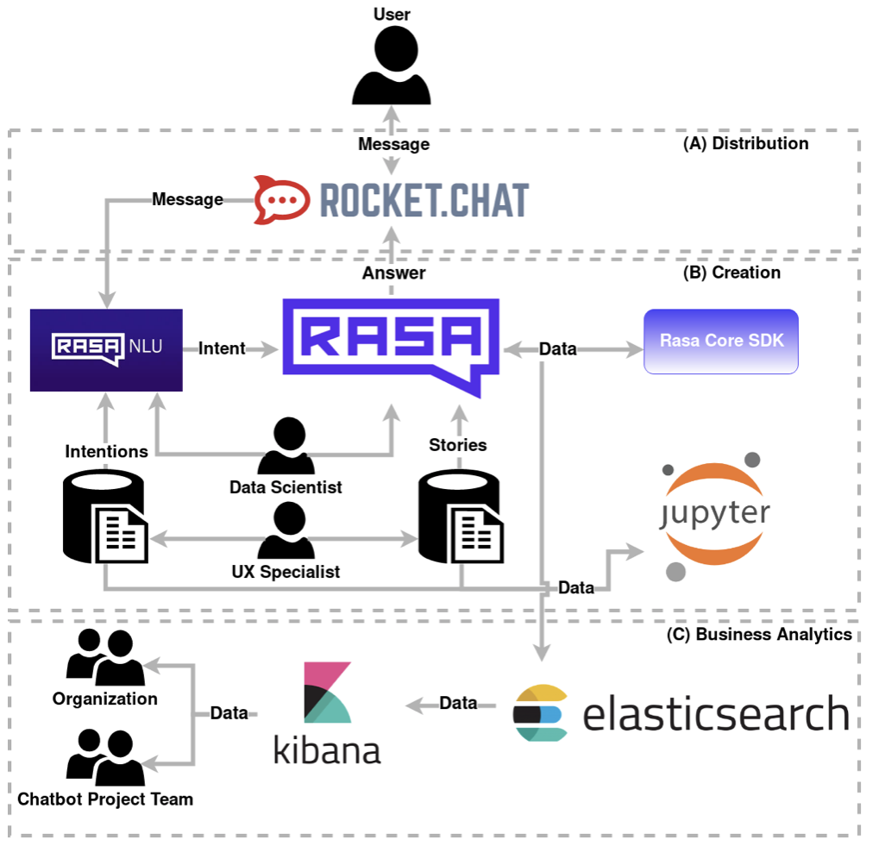
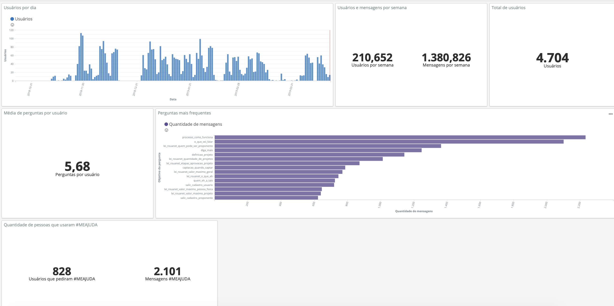
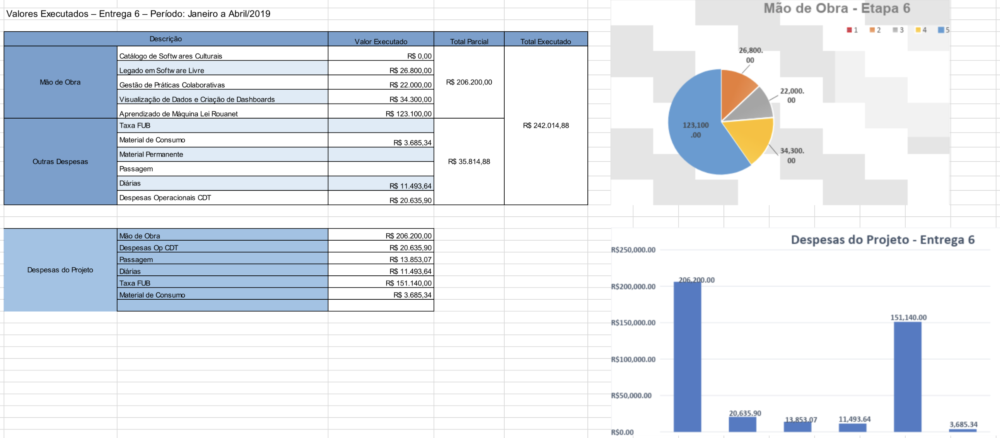

# Introdução

O presente relatório apresenta o acompanhamento do trabalho realizado no
projeto "Ecossistemas de Software Livre", Termo de Cooperação para
Descentralização de Crédito, Processo Ofício No 0646/2017/FUB-UnB, Vigência
Outubro 2017 à Outubro 2019. O relatório apresentado é referente aos avanços
realizados na Etapa VII (Fevereiro 2019 à Abril 2019), de acordo com o cronograma
do Plano de Trabalho.

Toda alteração no cronograma proposto foi realizada  a partir de renegociação
com a CGTEC do Ministério da Cultura, e tais alterações estão descritas no
relatório.
O presente relatório apresenta o acompanhamento do trabalho realizado no 
projeto "Ecossistemas de Software Livre", Termo de Cooperação para
Descentralização de Crédito, Processo Ofício No 0646/2017/FUB-UnB, Vigência
Outubro 2017 à Outubro 2019. O relatório apresentado é referente aos avanços
realizados na Etapa VII (Fevereiro 2019 à Abril 2019), de acordo com o cronograma
do Plano de Trabalho.

Toda alteração no cronograma proposto foi realizada  a partir de renegociação
com a CGTEC do Ministério da Cultura, e tais alterações estão descritas no
relatório.

Todas as frentes contempladas no plano de trabalho no período foram aplicadas em dois principais produtos desenvolvidos no laboratório: o salic-ml e a Tais.

## FASE DE PLANEJAMENTO/EXECUÇÃO

O período de fevereiro 2019 à abril 2019 contemplou as fases de
planejamento e execução. Abaixo serão apresentados, brevemente, os principais
avanços alcançados no período. Toda a documentação e acompanhamento do projeto
está disponibilizado e pode ser acessado na organização do laboratório
[lappis-unb](https://github.com/lappis-unb), e no
repositório específico do projeto
[lappis-unb/EcossistemasSWLivre](https://github.com/lappis-unb/EcossistemasSWLivre).
Todo o planejamento e execução das tarefas podem ser acompanhados tanto nas
_issues_ quanto nas páginas _wiki_.

Abaixo serão apresentados os principais avanços alcançados no período, por
pacote de trabalho (de acordo com o Plano de Trabalho),
de acordo com o cronograma, no período citado.

------

# Chatbot Tais

## Objetivos
O período de de fevereiro à Abril iniciamos a consolidação do projeto Tais. Os principais objetivos nesse período foram evoluir as visualizações de uso do chatbot (BI),além de automatizar o framework desenvolvido para facilitar a evolução e manutenção por parte do Ministério.

O assistente virtual utiliza um conjunto de ferramentas e abordagens cuja gestão é realizada por pesquisadores de diversos backgrounds, incluindo engenheiros de software, designers de experiência e roteiristas. A esse conjunto de ferramentas e abordagens gerido por um time multidisciplinar damos o nome de "Framework de Assistente Virtual do Laboratório Lappis". Esse Framework tem duas características que tornam ele especialmente interessante para o uso no relacionamento dos cidadãos com as políticas e serviços públicos do Estado. (i) A primeira é que sua concepção é baseada no uso de ferramentas open source que permitem à organização ter total autonomia e independência em relação a guarda dessas informações. Todo o conteúdo planejado, o histórico de conversas e os dados gerados pelo monitoramento ficam armazenados nos servidores da organização ("on premises"), sem a necessidade de cedê-las ou fazê-las circular ou por servidores de terceiros (atendendo a regulação de dados GDPR). (ii) A segunda característica é que o assistente virtual desenvolvido pelo laboratório Lappis não trabalha com o conceito de árvore de decisão, mas sim com redes neurais, que conseguem interpretar a mensagem de fato, inferir o contexto do diálogo e aproximar a conversa com o chatbot de uma conversa natural.

Dessa maneira, de toda demanda recebida pelo assistente são inferidas as intenções do usuário (chamadas de "intents") para as quais o assistente busca a melhor resposta possível a partir do contexto da conversa. O uso de algoritmos de aprendizado profundo (deep learning) faz com seja possível definir sinônimos dentro de um contexto específico. Um dos exemplos, no caso a assistente virtual Taís, diz respeito à palavra "proponente" que, no contexto da lei de incentivo, é sinônimo de produtor cultural. Isso também é possível por meio de inferência de contextos de diálogos, ou seja, o chatbot não só usa a pergunta atual do usuário, mas também o histórico da conversa (identificando assim o contexto da conversa), para conseguir dar a resposta mais apropriada. Logo, a inteligência do assistente se aproxima da capacidade que um ser humano tem de entender e interpretar perguntas, em vez de simplesmente navegar em uma lista de opções sequenciais, como um roteiro de telemarketing da organização. Essa característica é especialmente importante por evitar expor ao cidadão a complexidade da administração pública, com todas as suas caixinhas, nem exigir que o cidadão conheça previamente a estrutura do órgão que faz a gestão da política pública para a qual busca algum atendimento. Esse fato que tende a ocorrer em outros canais, como websites institucionais e URAs.

É igualmente importante que o planejamento e gestão de um assistente virtual no órgão sejam feitos de forma integrada à gestão dos demais processos de relacionamento com os cidadãos, sob o risco de fragmentar e complexificar ainda mais a busca por informações sobre as políticas. O assistente não pode ser tratado como uma ferramenta "ad hoc", isolada das outras estratégias de relacionamento já executadas pelo órgão, levando ao risco de atender apenas a demandas pontuais de grupos específicos, diminuindo a eficiência do gasto público e o impacto na missão global do orgão. Tratar o assistente virtual de forma complementar aos meios disponíveis para atendimento dos cidadãos permitirá ao órgão realizar integrações de canais (como por exemplo a assistente virtual respondendo perguntas por comandos de voz) além de viabilizar uma leitura e interpretação mais holística das estatísticas de monitoramento. Isso permitirá aferir o quanto a ativação do assistente virtual melhorou de fato a qualidade do atendimento e a resolução de problemas do público alvo das políticas, sem falar na redução de custos operacionais. Dessa forma, a nossa visão estratégica sobre a ativação de um assistente virtual é menos a da instalação de uma nova ferramenta e mais a da melhoria da eficiência do gasto público e da agilidade e qualidade do relacionamento dos cidadãos com as políticas públicas.

Vamos indicar quais são as tecnologias utilizadas e os perfis mínimos necessários para o funcionamento desse framework de assistente virtual criado pelo laboratório Lappis. Dentro da visão estratégica exposta aqui, alguns desses perfis provavelmente já existirão na organização e devem ser aproveitados para a gestão do assistente virtual, favorecendo a integração e transversalidade dos canais de atendimento do órgão.
O framework

A arquitetura geral do framework desenvolvido pelo Laboratório é mostrado na figura abaixo. Foi desenvolvido com a Licença AGPL3.



No período foram evoluidas as seguintes funcionalidades:

### Releases
Foram realizadas três releases no período de 3 meses. Foram entregues as seguintes funcionalidades :

- Adição de conteúdo sobre Prorrogação de prestação de contas
- Adição de conteúdo sobre prazo de submissão de proposta
- Adição de conteúdo de democratização
- Adição de conteúdo de incentivo por parentes
- Adição de mecanismo para o usuário dar feedback dos erros da Tais
- Melhoria no conteúdo de elegibilidade
- Melhoria de interação da Tais com o usuário
- Adição de configuração necessária para utilização de custom actions
- Adição de configuração para uso de testes e2e
- Atualização do nome Ministério da Cultura para Secretaria Especial da Cultura
- Refatoração de intents e utters que não estão mais sendo utilizadas
- Atualização do jupyter - notebooks de intents
- Atualização da versão do Rasa
- Resolvendo bug - Parte de processos com dificuldades de serem encontradas na conversa

### Estudos realizados

Foram realizados estudos sobre a automatização da do framework, possíveis mudanças arquiteturais, métricas de monitoramento de chatbots em uso, também sobre a personalidade da Tais.

O conteúdo completo desses estudos está disponibilizado nos Anexos.

### Dashboard BI Tais

Foi disponibilizado a página de dashboard no kibana para acompanhar o uso da Tais. Foram disponibilizados as seguintes métricas para acompanhar, tanto o ambiente de homologação quanto produção:

- Usuários por dia
- Usuários e mensagens por semana
- Total de usuários
- Média de perguntas por usuário
- Perguntas mais frequentes
- Quantidade de pessoas que usaram #MEAJUDA
- Tendências de intents 

Além dessas métricas, foi realizado um estudo para levantas as métricas mais relevantes para chatbots (em anexo). Nos próximos ciclos, iremos implementar grande parte dessas métricas.

O monitoramento da Tais em produção nos fornece as seguintes informações
- O número médio de usuários atendidos pela Tais por dia é 40 usuários
- A quantidade de usuários atendidos por mês é cerca de 1100 
- Há em média 5,4 perguntas por usuários
- 18% dos usuários usam o recurso #MEAJUDA
- As perguntas mais realizadas para a Tais são: "Como faço para submeter um projeto pela Lei Rouanet" e "Quem pode ser proponente"
- A Tais ficou fora do ar em 2 ocasiões. Isso porque a atualização da página da lei rouanet é realizada de forma manual pela equipe do Ministério da Cidadania, e o script com o livechat da Tais é inserido na página a mão. Nas duas ocasiões, esqueceram de inserir o script da TAIS.




### Plataforma de inserção de Conteúdo

Foi levantado durante o projeto, a necessidade de uma plataforma para inserção de conteúdo. Atualmente, o conteúdo é inserido como arquivo markdown, arquivo técnico que dificulta, e até inviabiliza equipes de conteúdo inserir conteúdos na Tais. 

Foi iniciado então uma nova frente de trabalho para desenvolver uma plataforma de inserção de conteúdo, integrado com o bot da Tais.

O repositório do projeto pode ser acessado em [https://github.com/lappis-unb/rasa-nlu-trainer](https://github.com/lappis-unb/rasa-nlu-trainer) e o projeto está na fase inicial (os requisitos foram levantados). 

### Contribuições

Além do trabalho com o projeto da Tais, foram realizadas as seguintes contribuições para comunidade de software livre e de chatbots:

- Contribuições para o Rasa - foram realizadas duas contribuições para a comunidade do Rasa. Primeiro, a capacidade de utilizad o kafka com broker no bot. Essa funcionalidade faz com que o histórico das conversas do chatbot não fique armazenado em RAM (Como era realizado anteriormente na Tais), e também faz a conexão com o elastik search. A segunda contribuição para o Rasa foi a funcionalidade de validador, que valida o formato de todos arquivos de intents, utters, e domain. Essa funcionalidade agiliza enormemente a adição de novos conteúdos no chatbot. Ambas as funcionalidade foram aceitas pela comunidade Rasa.

- Boilerplate - foi desenvolvido um boilerplate de chatbot em português. Esse framework possui as integrações, ferramentas, e configurações necessárias para criar um chatbot em lingua portuguesa. Esse trabalho contribuir com a frente de governança a criar comunidade de chatbots que compartilhem nossa mesma estratégia.

- Contribuições para a comunidade de chatbots - foram realizados diversos webinários com o intuito de compartilhar o conhecimento técnico adquirido e também registrar parte do trabalho técnico realizado pela equipe. A lista completa de webinars realizados e os temas podem ser acessados na página do laboratório do youtube em [https://www.youtube.com/channel/UCbZvFMRd5NaPiqj0w4uU8RQ?view_as=subscriber](https://www.youtube.com/channel/UCbZvFMRd5NaPiqj0w4uU8RQ?view_as=subscriber).

- Contribuição para a comunidade de chatbots - participamos do evento da ENAPE GNPapo | com o tema  "Chatbot - O Chat dos Bots" no qual compartilhamos nossa experiência com gestores da administração pública. Tal evento pode ser acessado em [https://www.youtube.com/watch?v=EReGGDHpyDA&list=PLo2mbJ5niURZE9U8XI8xw4sV_hh1HVWLg&index=10](https://www.youtube.com/watch?v=EReGGDHpyDA&list=PLo2mbJ5niURZE9U8XI8xw4sV_hh1HVWLg&index=10)


# SALIC-ML

O primeiro trimestre de 2019 foi marcado pela transição de Ministério da Cultura para Secretaria Especial, o que afetou o planejamento das atividades. Durante esse período de pouca interação com a Secretaria Especial, continuamos evoluindo o ML na direção acordada no final de 2018. 


# Atividades planejadas

1. Modificações no relatório de complexidade da análise de resultado
1. Exploração de relações de CPF e CNPJ
1. Melhoria de performance da geração de métricas

# Atividades realizadas

### Modificações no relatório de complexidade da análise de resultado

Na última reunião de trabalho de 2018, identificamos a necessidade de mudar as métricas que compõem o relatório de complexidade da análise de resultado. As seguintes métricas foram retiradas: *Itens orçamentários inesperados*,  
*Preços acima da média* e *Valor aprovado*. Retirá-las do relatório não significa eliminar o trabalho realizado. Essas métricas foram reservadas para possível uso no futuro, por exemplo na fase de admissibilidade. Já as métricas de  *Valor captado* e *Valor comprovado* foram combinadas para identificar o saldo que ainda falta ser comprovado. 

A métrica de *Comprovantes por código de operação* foi separada em três. Uma métrica para cada tipo de operação: saque, cheque ou transferência. Os técnicos da SEFIC foram enfáticos no impacto dessas métricas para a complexidade da análise, contudo não identificamos em nossos estudos uma ocorrência alta de casos onde uma operação estava relacionada a dois comprovantes ou mais. O que indica a necessidade de uma análise mais profunda para confirmar a baixa ocorrência dessa situação ou identificar a discrepância entre o esperado e o encontrado.

A equipe Lappis também recalibrou os pesos de cada métrica de acordo com as indicações da SEFIC. Isso garante que o escore geral de complexidade seja mais preciso e condizente com a realidade.

Ao final do período a que se refere este relatório, ainda restava a estabilização do relatório em um ambiente de testes interno para que, em seguida, fosse discutida a criação de um ambiente de testes nas dependências da Secretaria Especial.


*Relatório de de complexidade da análise de resultado ao final do período*

### Exploração de relações de CPF e CNPJ

Para avançar no cálculo do escore de proponentes precisamos entender a qualidade das relações dos proponentes com outros atores do processo de incentivo. Isso implica entender e mapear essas relações, não só de forma direta, entre CPFs, mas também “desconstruir” CNPJs para identificar as pessoas que compõem os quadros societários.

Para isso, parte da equipe realizou um estudo preliminar das relações entre CPFs e CNPJs no contexto da Lei de Incentivo. Iniciamos com uma análise técnica para identificar as melhores abordagens e ferramentas na geração de grafos de relacionamento. Bibliotecas como NetworkX e Pandas foram escolhidas para uma etapa de experimentação. Esta etapa de experimentação serviu para capacitar a equipe tanto no cálculo de geração desses grafos, quanto na sua representação visual.

O passo seguinte foi explorar os dados reais da Lei de Incentivo para entendê-los. Criamos aproximadamente 10 alternativas de grafos para estudo, cada um abordando aspectos ligeiramente diferentes. Eis alguns exemplos:
1. relação de pessoas em um quadro societário de proponente;
1. visualização do fluxo financeiro em um projeto, onde se identificam os incentivadores, os proponentes e todos os fornecedores;
1. identificação de “ciclos” de pessoas relacionadas seja por sociedade ou seja por participação no mesmo projeto.


**Relação de pessoas em um quadro societário de proponente**


**O maior "ciclo" de pessoas que conseguimos renderizar**

Ao mesmo tempo, fizemos algumas explorações propositivas. Isso foi uma tentativa de atacar o mesmo problema a partir de uma abordagem oposta: ao invés de começar com os dados e com cálculos, começamos criando representações visuais para quebra de regras de negócios. Por exemplo, um proponente que também é sócio de uma empresa incentivadora.


**Exemplo de representação propositiva**

Todo esse trabalho foi uma primeiro contato com a identificação e representação entre pessoas no contexto da Lei de Incentivo. Se por um lado, não possível identificar problemas flagrantes como o caso Bellini, por outro lado conseguimos identificar outras situações curiosas como alguém que fez um incentivo de R$1,00 e foi contratado pelo projeto para preparar a proposta; ou uma empresa de mídia que incentivou uma série de projetos e forneceu serviços de impressão.

Ao final do período, tivemos um dia de palestras e workshops com o Sr. Jackson Maia, membro do corpo técnico do CGEE (Centro de Gestão e Estudos Estratégicos). O Sr. Jackson é um cientista de dados, especializado em visualizações complexas. 
Ele orientou a equipe a usar grafos como uma ferramenta de exploração inicial, para gerar hipóteses, que talvez acabem sendo apresentadas de uma outra forma. Isso corroborou a percepção da equipe que talvez a entrega de grafos complexos para os técnicos da SEFIC não seja a melhor solução. Ainda há trabalho de análise e exploração pela frente.

### Melhoria de performance da geração de métricas

Nas entregas anteriores estabelecemos um ritmo de avanço na pesquisa e geração de métricas seguido por um movimento de estabilização e aumento de precisão. No período coberto por este relatório, parte da equipe foi alocada para as atividades do segundo movimento.

A arquitetura dos microserviços estava se tornando complexa demais. Fizemos uma reestruturação dessa arquitetura não só para estabilizar o SALIC-ML como um todo, mas porque o cálculo de algumas métricas não estavam funcionando corretamente. Um dos benefícios secundários dessa reestruturação foi facilitar a criação de novas métricas uma vez que todo o processo de treinamento das métricas, que era feito manualmente, foi 100% automatizado. 

Concretamente, transferimos todo o processamento dos cálculos e treinamentos que geram as métricas para o banco de dados. Até então, o processamento era feito em memória, para aumentar a performance. Essa era uma solução pouco resiliente já que qualquer incidente que fizesse o servidor reiniciar implicava na perda das métricas e obrigava um recálculo. Agora, os resultados são persistidos o que evita quedas abruptas no serviço. Ainda que a performance seja um pouco mais lenta, a considerável redução do risco garante uma melhor qualidade do serviço como um todo. Também recombinamos os repositórios no GitHub em função das mudanças recém descritas. 

Completamos a conteinerização de todos os serviços, o que é fundamental para um processo de entrega contínua. No contexto específico do SALIC-ML isso é relevante porque à partir do próximo ciclo de trabalho esperamos ter ambientes de desenvolvimento e homologação ativos em paralelo. Para isso, precisamos de flexibilidade e velocidade ao lidar com múltiplos ambientes.

Por fim, conseguimos aumentar o tamanho da amostra de projetos utilizada no cálculo das métricas. O que era uma limitação na capacidade de processamento, foi consideravelmente reduzido depois da reestruturação.

Essas atividades foram executadas já pensando que a sustentação do SALIC-ML será eventualmente absorvida pelo Ministério da Cidadania. Por isso focamos em simplificar ao máximo o processo de deploy e resiliência do catálogo de serviços.


### Práticas de gestão colaborativa <!-- {{{ -->

O objetivo de estudar os movimentos, organizações, desenvolvedores e demais stakeholders que atuam na gestão colaborativa de software livre é manter um conjunto de ações de governança digital e comunicação que aproveite ao máximo esse potencial em favor das necessidades do órgão e das metas comuns às organizações parte das comunidades. Esse esforço envolve um trabalho de mapeamento de atores de cada comunidade (atuais e potenciais futuros), assessoria para planejamento conjunto, facilitação de fluxos de comunicação e mobilização, realização de atividades conjuntas para integração, identificação de oportunidades externas, assessoria para comunicação e divulgação ao público externo à comunidade e apoio para solução de conflitos.

As ações realizadas  nesta etapa para atender os objetivos do plano de trabalho foram:

- [x] Reuniões contínuas com os parceiros
- [x] Gnpapo sobre chatbots

Nesse primeiro trimestre houveram diversas mudanças de gestão no Ministério da Cidadania, e foram realizadas diversas reuniões de apresentação do modelo do TED, e em especial sobre os objetivos e acompanhamento do projeto do LAPPIS. Além das reuniões, a frente de gestão colaborativa manteve o compartilhamento do conhecimento por meio da organização de webinars e participação do evento Gnpapo sobre chatbots. 


<!-- }}} -->

# Acompanhamento Financeiro



# Assinatura

Responsável pela Execução:
---
Nome:  Carla Silva Rocha Aguiar
             (Coordenadora do Projeto)

Assinatura: 

Data: 28/04/2019


# Anexo 1 

## Ferramentas que compõem o framework

### Rasa NLU 

O Rasa NLU é uma ferramenta de processamento de linguagem natural utilizado para a classificação de intenções e extração de entidades aplicadas ao Bot, ou seja, o NLU é responsável por entender o que os usuários escreveram. Isso é feito por uma comparação da mensagem do usuário com  os modelos de Machine Learning, procurando  inferir a intenção mais próxima da base de conhecimento. A partir daí, a saída do Rasa NLU será a intenção do usuário que enviou a mensagem, que pode ser, por exemplo, cumprimentar, despedir ou uma dúvida específica.

### Rasa Core
O Rasa Core é o centro do chatbot, o que é um diferencial do Framework LAPPIS. Ele é responsável por escolher a melhor ação a ser tomada a partir do histórico da conversa e da atual intenção do usuário. Seja essa ela uma resposta dentro do contexto atual da conversa ou uma ação realizada em um novo contexto. Isso garante que o usuário esteja sempre no controle da conversa, ao invés de ser conduzido por uma árvore de decisões. Assim como o Rasa NLU, o Rasa Core utiliza Machine Learning para responder as mensagens. Para que isso seja possível, é necessário a criação das stories, que são os exemplos de intenção e resposta, ou seja, o chatbot vai escolher a melhor resposta para interagir com os usuários a partir desses exemplos de conversas implementados.


### Jupyter Notebooks

Uma das maiores dificuldades ao projetar o conteúdo e diálogos de um chatbot é a construção adequada do conjunto de dados de treinamento para as intents e as stories. Jupyter Notebooks é uma aplicação web que ajuda a entender e visualizar dados e resultados de análises, facilitando a experimentação, colaboração e publicação online. O Jupyter foi a ferramenta escolhida para automatizar a análise do conteúdo do chatbot e gerar recomendações de ajustes nas intents e stories. O que nos permite antecipar os problemas de interação com o chatbot antes de colocar o conteúdo em produção. 


### Elasticsearch/Kibana

É impossível fazer gestão de atendimento sem entender como os cidadãos usam e se apropriam dos canais oferecidos. Conhecer as estatísticas de uso, perfis dos usuários e tendências das demandas é crucial para o sucesso permanente da estratégia. O Elasticsearch é a fundação do módulo de análise de uso do chatbot, pois nele são gerenciadas as informações coletadas das conversas. Para interpretação de todo o conteúdo coletado pelo Elasticsearch, o Kibana é a camada visual responsável por disponibilizar todos os dados por meio de dashboards, gráficos e imagens. Apresenta esses dados de forma a facilitar a interpretação.

### RocketChat

O RocketChat é um software criado por uma startup brasileira que tem o objetivo de fornecer uma infraestrutura de salas de conversa que podem ser utilizadas para diversos fins. Tem recursos de conversação, repositório de documentos e API para bots. Sua interface se assemelha com a do WhatsApp ou Telegram. Seu código é livre e licenciado em MIT. No framework do assistente virtual, o RocketChat carrega a janela de conversação onde os cidadãos interagem de fato com o assistente.


### Perfis que compõem o framework

#### Líder de produto

O líder de produto é um perfil fundamental, responsável por orientar o time em relação à aplicação prática do assistente no caso concreto. É o líder de produto que vai estar mais próximo ao órgão para compreender como o assistente virtual se encaixa na estratégia de atendimento da organização. A partir disso, define o escopo da base de conhecimento do bot e prioriza as principais demandas de evolução de conteúdo e novas funcionalidades.

#### Engenheiro de software

O time de Engenharia de Software tem como principal objetivo manter e evoluir o framework. Garantir a integração entre as partes e a estabilidade da solução tecnológica. Sempre que uma das partes evolui nas suas comunidades de origem (ex: Rasa, RocketChat, etc) é papel desse time avaliar os impactos da atualização dos componentes no framework Lappis. Também é o time que garante a entrega contínua, ou seja, o processo automatizado de atualizações dos ambientes de homologação e produção.

#### Cientista de dados

O cientista de dados tem o papel de analisar os dados relativos ao conteúdo de interação do assistente virtual e as estatísticas de monitoramento. Seu papel é importante para identificar gargalos de pontos de melhoria nos outros módulos. Esse tipo de análise é capaz de identificar quando uma determinada intenção do usuário não está sendo adequadamente interpretada pelo aprendizado de máquina e levantar esse alerta para o time de conteúdo, que pode produzir textos mais claros e para o time de engenharia que pode trabalhar em  uma  melhor calibragem do aprendizado de máquina. Complementarmente, a análise dos dados de acesso e interação pode produzir novas demandas de cruzamento e visualização de dados para serem implementadas nas ferramentas de visualização dos dados, como o Kibana. Esse tipo de análise é de especial importância para que a ferramenta produza dados que serão agregados nos indicadores de melhoria de atendimento do órgão.


#### Roteirista de chatbot

O roteirista de bot tem a responsabilidade de adaptar os conteúdos das políticas fornecidos pelo orgão para que se adequem ao formato conversacional do bot. Para isso ele é responsável por definir a persona do bot a partir de características básicas de personalidade (como empatia, objetividade, nível do vocabulário etc). Uma vez definidas e pactuadas com o órgão, essas características servem de base para a formulação dos textos das respostas disponíveis no banco de conhecimento da assistente virtual. Também é papel do roteirista interpretar os dados de interação e fazer melhorias nos conteúdos que eventualmente não estiverem sendo compreendidos pelos usuários.

#### Especialista em UX

A pessoa responsável pela experiência de usuário (UX) trabalha lado-a-lado com a equipe de roteiristas. Especialistas de UX atuam para otimizar a experiência de conversa e reforçar a ideia de uma interação que flui naturalmente. Garantem que sequências de pergunta-resposta se desenvolvam de forma harmônica tanto dentro do mesmo tópico, quanto de forma global na base de conhecimento. 

### Importância do Parceiro
Órgãos da administração pública federal, governos estaduais e prefeituras, além de órgãos públicos ligados aos outros poderes são os parceiros preferenciais na adoção do framework de assistente virtual do Lappis. Na linha de que o framework de assistente virtual do Laboratório Lappis é um processo sustentado por tecnologia que busca a melhoria dos indicadores de atendimento do órgão, ele deve ser implementado num arranjo de parceria do laboratório com o próprio órgão. É um trabalho a ser realizado a quatro mãos em que o laboratório entra com a pesquisa, facilitação de aprendizado, desenvolvimento e costura das tecnologias necessárias para a operação do framework e o órgão entra com a definição das prioridades, metas e indicadores (gestão), o esforço de homologação e disponibilização em produção (tecnologia da informação) além da definição da equipe que fará a sustentação e gestão do assistente em caráter permanente. O papel do Laboratório Lappis na parceria será o de customizar o framework para o contexto do parceiro, colaborar no processo de implantação e facilitar o aprendizado da equipe do órgão. Do lado do parceiro, será necessária a indicação de responsáveis para ocupar os papéis de Líder de projeto, Tecnologia da Informação e Comunicação. A indicação desses responsáveis é especialmente importante pois eles cuidarão do serviço dentro do órgão de forma permanente. Nesse arranjo, tanto o Lappis quanto o órgão serão parceiros do resultado final da iniciativa, que é o de melhorar a eficiência do gasto público e do atendimento à população.

# Estudos chatbots
# Estudo de Ferramentas de Gerenciamento de Conteudo

Este documento contém um estudo sobre ferramentas capazes de gerenciar o 
conteúdo de um **chatbot**. 

O objetivo principal deste estudo é econtrar **ferramentas, frameworks,**
**softwares ou scripts** que permitam o gerenciamento do coteúdo (`intents`,
`utters` e `stories`) de forma que pessoas não técnicas consigam gerenciar
e evolui-lo, possivelmente por meio de uma aplicação web.

## Descrição das ferramentas

Após o uso de cada uma das ferramentas segue a descrição do uso e impressões
de cada uma delas.

### Xenioo

**Sobre a ferramenta:** A ferramenta Xenioo permite a criação de um bot do zero assim como a criação por meio de templates já existentes! A ferramenta possui uma interface intuitiva devido ao fato da criação de intents e utters se darem por meio de caixas de diálogo no qual uma caixa é setada a outra dependendo do fluxo de conversa e da resposta do usuário! Todo o manuseio da criação se dá por meio da ação de arrastar um diálogo ao outro e apontar as setas para as caixas seguintes de diálogo. A partir do momento em que o usuário clica na caixa é aberta uma aba lateral que possui os campos e edição de conteúdo que permite ao usuário criar os diálogos assim como inserir campos de entrada ou botões.

**Prós:**

Adição de conteúdo
Edição de conteúdo
Remoção de conteúdo
Aplição de utter de forma intuitiva de acordo com a resposta do usuário
Facilidade de linkar (criar stories) por meio de setas entre caixas de diálogo
Permissão para clonar utters afim de não ter retrabalho
Caixa de diálogo relacionada a fallback
Criação de intents e entidades
É oferecido um token para realizar integração
Opensource [Aqui](https://github.com/xenioo)

**Contras:**

O plano Free restringe um total de 1000 mensagens por mês
O plano Free restringe uma grande quantidade de serviços como criação de intents entre outros ...
Não é possivel entender como são exportados os dados e como funciona integração pelo fato de que o plano Free permite apenas que se teste como é feito a criação, edição e remoção.
Logo, a viabilidade de utilização da ferramenta será se basear no código fonte citado acima para evoluir e adaptar as nossas necessidades devido a ferramenta oferecer uma interface intuitiva e de fácil utilização.

### BotPress

Botpress é uma ferramenta completa para o **desenvolvimento** de `chatbots`
permite o uso do `rasa-nlu` para identificação das `intents` mas não permite
a utilização do `rasa-core`. Esta ferramenta também não permite a importação
de arquivos como `domain.yml`.

**Prós:**

Plataforma de desenvolvimento de chatbots completa

**Contras:**

Não permite importar um bot pronto e não tem integração com rasa_core

### Articulate

Articulate é uma plataforma bem completa no gerenciamento de `chatbots`.
Possui uma interface bonita e utiliza o `rasa-nlu` e `rasa-core` "por dentro",
outro ponto interessante desta ferramenta é a importação e exportação de um 
arquivo `json` com todo o bot.

Esta plataforma é divida principalmente em **API** e **UI**, onde é necessário
programar todas interações. A principal tecnologia utilizada é o `javascript`
e no *frontend* o `reactnative`.

O projeto é todo `dockerizado` e possui integrações com `elasticsearch`, porém
quando é executado toda a `stack` utiliza bastante recursos computacionais.

A interface é muito boa para criação de um `chatbot` nela porém não é voltada
para importação e gerenciamento de um `chatbot` pronto, então grandes mudanças
são necessárias na interface e também na `api`. O entendimento do uso do
`elasticsearh` e adapatação pro contexto também é importante.

**Prós:**

Inteface muito bonita e completa.

**Contras:**

Permite a exportação de um arquivo json com a "mente" do chatbot, mas não permite nenhuma integração com um chatbot pronto.

### rasaui

Plataforma completa e com uma comunidade grande, tem como objetivo atacar praticamente todos os desafios do desenvolvimento de um chatbot feito com rasa. Porém não conseguimos executar a plataforma, seguindo o [README](https://github.com/paschmann/rasa-ui/blob/master/README.md) do projeto, após executar o comando referente ao `docker-compose` toda a `stack` do projeto é levantada, porém a integração com o banco `postgresql` simplesmente não funciona. Não existe nenhuma documentação sobre este problema, e não econtramos a solução. Aparentemente o problema está na migração do banco.

**Prós:**

Plataforma que propõe uma solução completa para o desenvolvimento de um chatbot feito com RASA.

**Contras:**

Não funcionou no período de teste, e não encontramos a solução.

## Custom Action
As _actions_ são as respostad do bot para as entradas de usuário. Elas podem ter 3 tipos: 
* default actions (action_listen, action_restart, action_default_fallback)
* utter actions, começa com utter_, manda mensagem para os usuários
* custom actions - qualquer outra ação, pode rodar outros trechos de código

Quando o bot prediz a intenção de uma custom action, ele chama um webserver no endpoint especificado no arquivo `endpoints.yml`: 
``` 
  action_endpoint:
    url: "http://localhost:5055/webhook" 
```

Deve passar a flag ` --endpoints endpoints.yml ` ao rodar os scripts.
Rodar `python -m rasa_core_sdk.endpoint --actions actions`. 

É preciso criar um arquivo para as _custom actions_: 

``` python
from rasa_core_sdk import Action 
from rasa_core_sdk.events import SlotSet # importar slots para pegar valores vindos do usuário.  Ainda não usado
import requests
import random

class ActionTest(Action):
   def name(self):
      return "action_test" # nome da action no arquivo domain

   def run(self, dispatcher, tracker, domain):
        try: #consultar projeto na API SALIC e printar o nome de um deles
          dispatcher.utter_message("Um dos projetos cadastrados no SALIC")
          req = requests.request('GET', "http://api.salic.cultura.gov.br/v1/projetos/")
          quantity = req.json()['count']
          a = req.json()['_embedded']['projetos'][random.randint(0, quantity)]['nome']
          dispatcher.utter_message(a)
        except ValueError:
          dispatcher.utter_message(ValueError)

```

Deve acrescentar as intents, stories e actions nos arquivos apropriados. 


## Referências
* [RASA Custom Actions](https://rasa.com/docs/core/customactions/)
* [RASA Custom Actions Server](https://rasa.com/docs/platform/dev/custom_actions/)

### Uso de Slots

Os *Slots* funcionam como a memória do *Bot*. As informações dos *slots* serão armazenadas na forma de pares de *chaves-valores*.

Os *Slots* podem ou não influenciar na tomada de decisões do bot, de acordo com o seu tipo.

O tipo *text* pode ser utilizado para coleta de informações diretas do usuário, por exemplo para pegar o nome de uma cidade, de um local, o CPF do usuário, etc. Para este tipo, durante o fluxo de conversa, só é possível saber quando o *slot* foi preenchido ou não.

Os tipos **categorical** ou **bool** devem ser usado quando o valor em questão é importante para tomada de decisões.

Em casos onde se quer apenas armazenar dados mas não se espera que o *slot* afete o fluxo de conversação, deve-se utilizar o tipo *unfeaturized*.

#### Configuração dos *Slots*

Para utilizar um slot é preciso incluí-lo no arquivo `domain.yml`, dentro de uma *tag* de *slots*:

```yml
slots:
  pronac:
    type: unfeaturized
```

Dentro das *intents* deve-se definir exemplos de *entities*, que terão seu valores preenchidos de acordo com o *slot* correspondente:

``` markdown
## intent:pronac
- meu pronac é [1234567](pronac)
- [98765](pronac)
- [098778](pronac)
- [97656](pronac)
- [1234567](pronac)
- o número do pronac é [6556789](pronac)
- o pronac do meu projeto é [093596](pronac)
- meu numero de pronac é [9104835](pronac)
- o pronac é [92749502](pronac)
- me fale sobre o projeto do pronac [0927493](pronac)
- quero saber do projeto [0439582](pronac)
- me fale sobre o projeto do pronac [029385](pronac)
```

#### Acessando e alterando valores dos *Slots*

Quando o slot é preeenchido, seu valor pode ser acessado dentro das *Actions* através do *tracker*. Ex:

```python
class ActionInformacaoProjeto(Action):
  def name(self):
    return "informacao_projeto"

  def run(self, dispatcher, tracker, domain):
    pronac = tracker.current_slot_values()['pronac']
```

#### Definindo o valor de um *Slot* a partir de uma *Custom Action*

```python
from rasa_core_sdk.actions import Action
from rasa_core_sdk.events import SlotSet
import requests

class ActionTipoDeProjeto(Action):
    def name(self):
        return "tipo_de_projeto"

    ## Descobrir tipo de projeto
    def run(self, dispatcher, tracker, domain):
        url = "http://projetos.com"
        data = requests.get(url).json
        return [SlotSet("tipo_de_projeto", data["tipo_de_projeto"])]
```

#### Definindo comportamento do bot de acordo com o *Slot*

Uma vez que os valores possíveis para um *slot* foram definidos no `domain`, deve-se escrever exemplos de caminhos a serem seguidos de acordo com o valor captado. Ex:

```yml
# story_01
* cumprimentar
  - action_tipo_de_projeto
  - slot{"tipo_de_projeto" : "tipo_1"}
  - utter_projeto_tipo_1

# story_02
* cumprimentar
  - action_tipo_de_projeto
  - slot{"tipo_de_projeto" : "tipo_2"}
  - utter_projeto_tipo_2

```

#### Tipos de *Slots*

* ###### Text
  Slots utilizados para preferências do usuário, são necessários serem preenchidos para seguir pelo fluxo correto.
  `rasa_core.slots.Slot` receberá o valor `1` caso esteja preenchido e `0` caso não tenha sido preenchido ainda.

* ###### Bool
  Utilizado para slots binarios, de `True`ou `False`.

* ###### Categorical
  Slots em que é atribuído um valor de uma lista de opções de valores pré definida. Veja o exemplo:
  ``` yml
  slots:
    risk_level:
        type: categorical
        values:
        - low
        - medium
        - high
  ```

* ###### Float
  Utilizado para valores continuos. Pode ser estabelecido um valor minimo e máximo, onde, caso tente preencher o slot com um valor que ultrapassa esses estabelecidos,será preenchido com o valor ultrapassado.
  Exemplo:
  ``` yml
  slots:
   temperature:
      type: float
      min_value: -100.0
      max_value:  100.0
  ```

* ###### List
  Utilizado para slots que armazenamuma lista de valores.

* ###### Unfeaturized
  Slots que não devem afetar o fluxo de conversa devem receber esse valor. Seu valor não influencia a previsão da proxima ação a ser chamada.

  <!-- Colocar o slot filling -->

  #### *Slots Filling*:

   Uma forma comum de conversação de chatbot é ir coletando informações do usuário, isso é chamado de *slot filling*. Para coletar várias informações seguidas no Rasa é recomendado o uso de *FormAction*. Para usar *forms* é necessário incluir *FormPolicy* no arquivo de configuração e criar uma sessão de *forms* no domain:

   ``` yml
   forms: 
    - my_form
    ...
   ```

   Para preencher os slots é necessário criar stories da seguinte forma:

   ``` markdown
   ## happy path
    * request_restaurant
      - restaurant_form
      - form{"name": "restaurant_form"}
      - form{"name": null}
   ```

   O *FormAction* faz com que o bot somente solicite informações ainda não obtidas. Os slots devem ser do tipo *unfeaturized*.
   
   Para a utilização do *FormAction* também é necessária a criação de uma classe com o nome do formulário, essa classe deverá ter três metodos, *name*, *required_slots* e *submit*.
   * **name:** Retorna o nome para indentificação do *form*;
   * **required_slots:** Retorna uma lista de *slots* do *form*;
   * **submit:** Função para o que deve ser feito ao final do formulario, depois de todos os dados serem preenchidos.

   Veja o exemplo abaixo:

   ``` python
   class RestaurantForm(FormAction):
      """Example of a custom form action"""

      def name(self):
          # type: () -> Text
          """Unique identifier of the form"""

          return "restaurant_form"

      @staticmethod
      def required_slots(tracker):
          # type: () -> List[Text]
          """A list of required slots that the form has to fill"""

          return ["cuisine", "num_people", "outdoor_seating",
                  "preferences", "feedback"]

      def submit(self, dispatcher, tracker, domain):
          # type: (CollectingDispatcher, Tracker, Dict[Text, Any]) -> List[Dict]
          """Define what the form has to do
              after all required slots are filled"""

          # utter submit template
          dispatcher.utter_template('utter_submit', tracker)
          return []
   ```

   Para realizar validações do slot preenchido é necessário sobreescrever o metodo `validate()` com as checagens necessárias.

   Outra forma de tratar de erros é pelas stories, indentificando o comportamento do usuário. Por exemplo, se os usuários conversarem com o bot durante o preenchimento do formulario:

   ``` markdown
   ## chitchat
  * request_restaurant
      - restaurant_form
      - form{"name": "restaurant_form"}
  * chitchat
      - utter_chitchat
      - restaurant_form
      - form{"name": null}
   ```

   Ou caso o usuário queira parar o preenchimento do formulario:

   ``` markdown
   ## chitchat
  * request_restaurant
      - restaurant_form
      - form{"name": "restaurant_form"}
  * stop
      - utter_ask_continue
  * deny
      - action_deactivate_form
      - form{"name": null}
   ```


##### Referências:

- [Documentação Rasa Core - Slots](https://rasa.com/docs/core/0.13.3/slots/);
- [Documentação Rasa Core - Slot Filling](https://rasa.com/docs/core/0.13.3/slotfilling/);
- [Documentação Rasa Core - Slots API](https://rasa.com/docs/core/0.13.3/api/slots_api/);

# Estudo de Métricas para Bots

- Este documento contém um estudo sobre métricas relevantes para o contexto de um(a) assistente virtual.

- O objetivo deste estudo é encontrar métricas que possam contribuir para a análise da dados da interação entre o usuário-bot, auxiliando na área de _business_ e de desenvolvimento.

# Métricas

- Uma métrica é uma medida quantificável que é usada para rastrear e avaliar o status de um processo específico.

- Os próximos dois subtópicos serão responsáveis por expor as métricas que foram definidas como apropriadas para a área de negócio e de desenvolvimento, no contexto da Tais.

## Métricas de Negócio

- **Quantidade de usuários totais**

- Medir a quantidade de usuários/sessões que já interagiram com a Tais. As medidas podem variar de acordo com o intervalo de tempo definido (por dia, por semana, por mês, ...).

- **Interações por usuário [IU]**
- Quantificar a média de perguntas realizadas por usuário.

- IU = (Qtd. total de perguntas do usuário) / (Qtd. total de usuários)

- **Horas com mais atividades**

- Identificar em qual horário os usuários mais interagem com o bot. Definir por intervalo de tempo (De 11:00 às 12:30, etc).

- **Perguntas mais frequentes**

- Analisar as perguntas que são feitas com mais frequências.

- Neste caso, pode-se definir como a pergunta mais realizada em todo o tempo, ou então a pergunta que foi tendência em determinado intervalo de tempo.

- **Taxa de satisfação**

- Medida que diz respeito à taxa de satisfação em relação ao serviço prestado pelo bot. Se o assistente virtual está conseguindo suprir as necessidades do usuário e em qual "qualidade".

- **Self-service rate**

- Quantos usuários conseguem atingir o seu objetivo com a conversa, sem a interação externa de um humano.

- **Retention Rate**

- Quantos usuários retornam a interagir com a assistente virtual. Esta métrica pode se relacionar, também, com o intervalo de tempo entre cada sessão do usuário.

- É importante identificar também se após retornar o objetivo do usuário é diferente do anterior. Porque pode sinalizar que suas dúvidas não foram sanadas anteriormente.

## Métricas de Desenvolvimento

- **Taxa de confusão (CR)**

- Calcular a quantidade de _fallbacks_ em relação à quantidade de perguntas realizadas pelos usuários.

- CR = (Qtd. de _fallbacks_) / (Qtd. total de perguntas)

- **Frases/palavras mais frequentes**

- Analisar as frases/palavras que são mais realizadas. Neste caso, pode-se definir também como as palavras mais realizadas em todo o tempo, ou então a que foi tendência em determinado intervalo de tempo.

- **Perguntas mais frequentes**

- Analisar as perguntas que são feitas com mais frequências. Neste caso, pode-se definir como a pergunta mais realizada em todo o tempo, ou então a pergunta que foi tendência em determinado intervalo de tempo.

- **Etapas de conversação**

- Calcular a quantidade média de etapas realizadas por sessão. Uma etapa é definida por uma inteção do usuário e a resposta do bot.

- As conversas que excedem significativamente ou ficam aquém da média da etapa de conversação geralmente indicam uma experiência ruim para o usuário.

- **Fallback por intent**

- Identificar quais são as intenções de usuários que mais geram _fallbacks_.

- **Fluxo de sessão**

- Um fluxograma que mostra o "caminho" percorrido pelos usuários em cada sessão de conversa e a porcentagem de cada "caminho". Relacionando também com a métrica anterior de **_Fallback_ por intent**, a qual identifica em qual intenção o bot entrou no fallback.

# Links das referências

- http://www.topbots.com/5-bot-metrics-every-chatbot-should-track/
- https://blog.ubisend.com/optimise-chatbots/right-chatbot-kpi
- https://blog.growthbot.org/the-practical-guide-to-chatbot-metrics-and-analytics
- https://chatbotsmagazine.com/chatbot-analytics-101-e73ba7013f00
