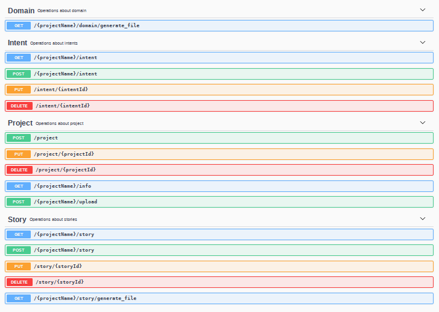
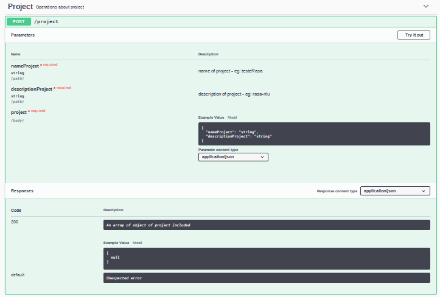

Com o objetivo de conferir mais autonomia na gestão da tecnologia da Tais pelo orgão, foi levantada a necessidade de uma plataforma para inserção de conteúdo. Atualmente, o conteúdo é inserido como arquivo markdown, arquivo técnico que dificulta, e até inviabiliza equipes de conteúdo inserir conteúdos na Tais.
Após serem levantadas a necessidade de uma plataforma de gerenciamento de conteúdo de chatbot e os requisitos serem levantados, foi iniciado o desenvolvimento.

Inicialmente, o desenvolvimento foi feito a partir de uma plataforma do Rasa que permitia a edição dos dados de treinamento do chatbot. Isso permitiu levantar novos ter um melhor entendimento dos desafios das ferramentas já existentes que resolvem parcialmente o problema identificado.

O repositório anterior [rasa-nlu-trainer](https://github.com/lappis-unb/rasa-nlu-trainer) foi depreciado e o desenvolvimento foi continuado em dois novos repositórios. Um dos repositórios trata do desenvolvimento do serviço de [API](https://github.com/lappis-unb/botflowapi), e o outro é a [plataforma web](https://github.com/lappis-unb/botflow).
Além disso, foram disponibilizados dois ambientes de homologação para o projeto. O ambiente de homologação da API pode ser acessado no endereço [https://botflow.api.lappis.rocks/api-docs](https://botflow.api.lappis.rocks/api-docs). O ambiente de homologação do front end web pode ser acessado no endereço [https://botflow.lappis.rocks/](https://botflow.lappis.rocks/). 

Esse link da api(https://botflow.api.lappis.rocks/api-docs) direciona para a sua documentação. Lá são descritos os endpoints disponibilizados para a utilização, junto com o que cada um deles retorna e os parâmetros esperados. As figuras abaixo exemplificam os endpoints criados até então e mostram como a cada um deles pode ser usado e o que esperar.

