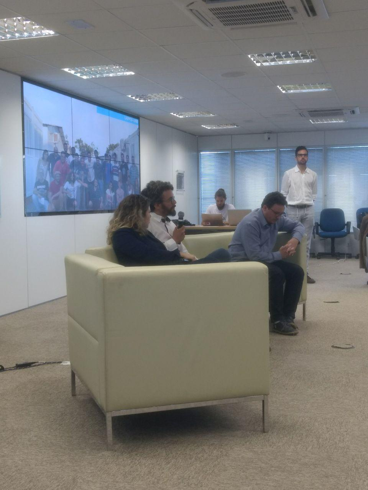
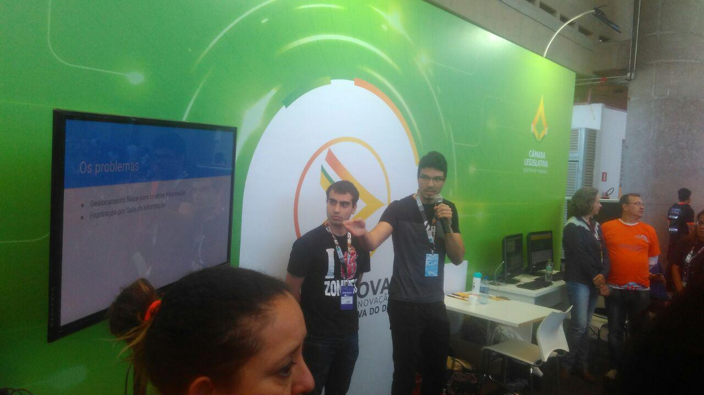
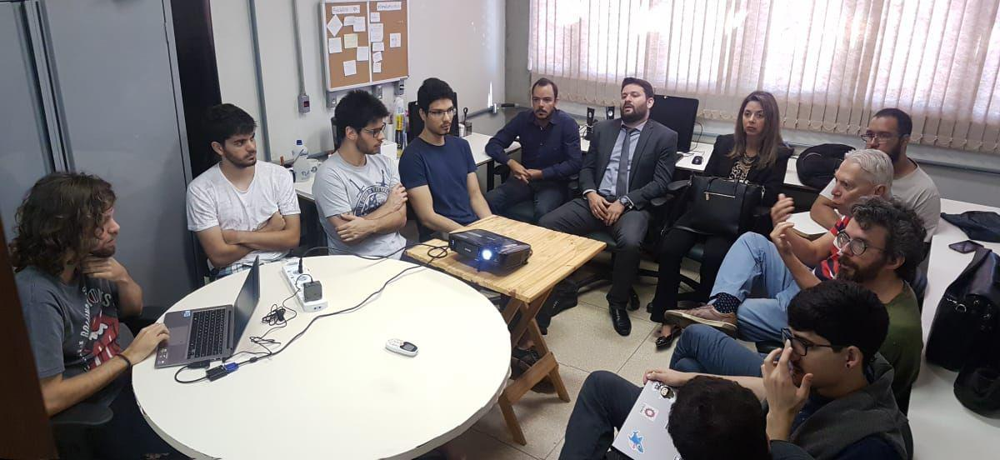
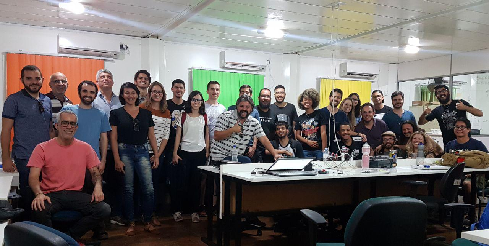
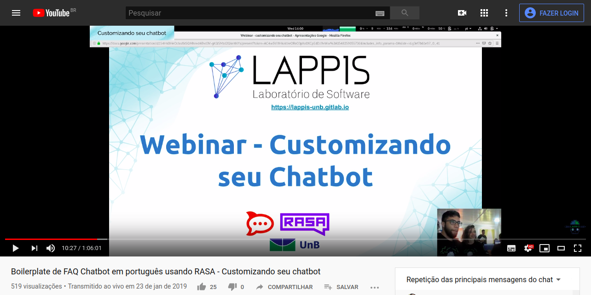
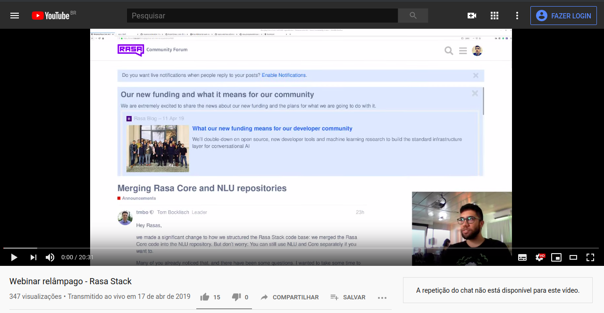
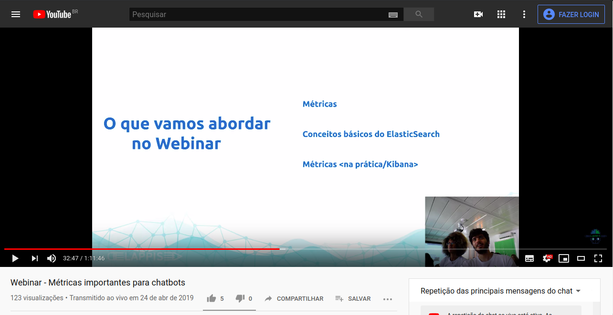
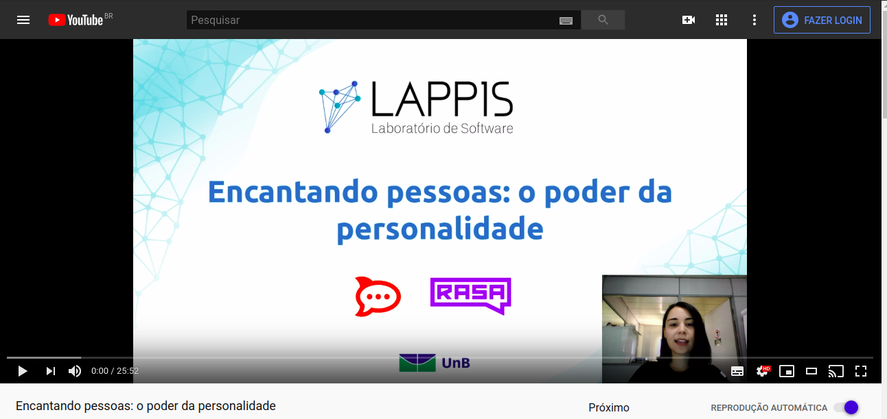

* Webinar
* Apresentação da bruna e temporim - hacklab
* Minilappisconf
* Faria no botsbrasil
* Moura pydata
* Pythoncerrado Miranda e temporim
* fabio e bruna moreira - python cerrado
* campus party - carla e guilherme 2019
* seman geek miranda e guilherme furada joenio feira geek
* maia caixa cultural
* labconf
* serenata de amor - minilappisconf *
* Dorgam proxy reverso hacklab/rocketchat
* varios jenipapos * 13/06
* Workshops técnicos do mInc
* UFG e UFABC PHp meio merda
  

Fontes:
youtube lappis
grupo do lappis
minilappisconf

## 30/01/2018

* Workshop Ux/Design - Rodrigo Maia e Peter - https://gitlab.com/lappis-unb/internal/docs/wikis/events/workshops/usability/UX,-UI,-uai,-WTF

## 13/06/2018

* GNPapo1 

## 15/06/2018

* Serenata de amor - Irio 

https://photos.app.goo.gl/yNHXQ4mhWvMmQ2DW7

## 30/06/2018

* Hackaton Saude - Moura e Diniz

## 04/07/2018

* Workshop devops com MDH

## 30/07/2018

* Lappis conf - softwares livres pra controle social, eleições.

## 13/08/2018

* Lappis conf - Atos (Vida após lappis)

## 15/08/2018

* Entrega Minc 

## 16/08/2018

* Entrega Minc 

## 17/08/2018

* Lappis na indie warehouse

## 20/08/2018

* Lappis Conf - CHatbo

## 20/08/2018

* Lappis Conf

## 31/08/2018

* LABConf

https://photos.app.goo.gl/NSqRum7rmYYRxNy28

parei setembro 12

# 13/12/2018

* Fazendo seu chatbot inteligente com RASA e Rocket.Chat

Autor(es): Arthur Temporim, Bruna Pinos, Carla Rocha, Gabriela Guedes, Matheus de Sousa Faria e Paloma C. Mamede

https://www.youtube.com/watch?v=5fbdIwsGrQ4  

# 23/01/2019

* Boilerplate de FAQ Chatbot em português usando RASA - Customizando seu chatbot

Autor(es): Arthur Temporim e Bruna Moreira

https://www.youtube.com/watch?v=tW4x-R82hNc  

# 27/03/2019

* Chatbot Rasa conectado com API do Google

Autor(es): Arthur Temporim e Bruna Moreira

https://www.youtube.com/watch?v=zL8zCbmfLwM  

## 10/04/2019

* Webinar Rasa Bot no Telegram com Slots e Entities

Autor(es): Arthur Temporim e Gabriela Guedes

https://www.youtube.com/watch?v=ZPUtt2AFhjM  

webinar_rasa_bot_telegram.png

## 17/04/2019

* Webinar relâmpago - Rasa Stack

Autor(a): Arthur Temporim

https://www.youtube.com/watch?v=5kXLmnWJe5g  

## 24/04/2019

* Webinar - Métricas importantes para chatbots
Autor(es): Guilherme Lacerda e Bruna Pinos

https://www.youtube.com/watch?v=yqzxZsOa3gg  

## 30/04/2019

* Apresentação Tais
Autor(a): Matheus de Sousa Faria

https://www.youtube.com/watch?v=uR0W-fDUr9g  

## 22/05/2019

* Webinar Arquitetura desaplocada
Autor(es): Pablo Diego e Arthur Temporim

https://www.youtube.com/watch?v=f35j9yydcEU  

## 31/07/2019

* Webinar Testes automatizados de ChatBot
Autor(a): Leonardo Gomes

https://www.youtube.com/watch?v=6YlFhpj6JSs  

## 18/09/2019

* Webinar Encantando pessoas: o poder da personalidade
Autor(a): Paloma C. Mamede

https://www.youtube.com/watch?v=hmFoxEYTK0Y  

