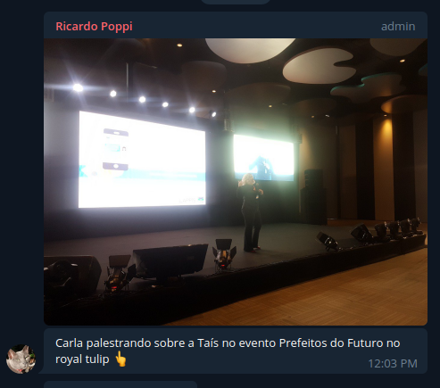

* Faria no botsbrasil
* Moura pydata
* Pythoncerrado Miranda e temporim
* fabio e bruna moreira - python cerrado
* campus party - carla e guilherme 2019
* seman geek miranda e guilherme furada joenio feira geek
* maia caixa cultural
* Dorgam proxy reverso hacklab/rocketchat
* varios jenipapos * 13/06
* Workshops técnicos do mInc
* UFG e UFABC PHp meio merda
  

Fontes:
youtube lappis
grupo do lappis
minilappisconf

# 30/01/2018

* Workshop Ux/Design - Rodrigo Maia e Peter - https://gitlab.com/lappis-unb/internal/docs/wikis/events/workshops/usability/UX,-UI,-uai,-WTF

# 13/06/2018

* GNPapo1 

# 15/06/2018

* Serenata de amor - Irio 

https://photos.app.goo.gl/yNHXQ4mhWvMmQ2DW7

# 30/06/2018

* Hackaton Saude - Moura e Diniz

# 04/07/2018

* Workshop devops com MDH

# 30/07/2018

* Lappis conf - softwares livres pra controle social, eleições.

# 13/08/2018

* Lappis conf - Atos (Vida após lappis)

# 15/08/2018

* Entrega Minc 

# 16/08/2018

* Entrega Minc 

# 17/08/2018

* Lappis na indie warehouse

# 20/08/2018

* Lappis Conf - CHatbo

# 20/08/2018

* Lappis Conf

# 31/08/2018

* LabConf - Conferência dos laboratórios de inovação da cultura

https://photos.app.goo.gl/NSqRum7rmYYRxNy28

parei setembro 12

# 17/09/2018

* MiniLappisConf - Moldura

# 20/09/2018

* O uso de Chatbots no Serviço Público

Autor(es): Arthur Temporim e Bruna Pinos

https://www.youtube.com/watch?v=wpi5xDhofW4  

# 01/10/2018

* MiniLappisConf - Promova Cultura

# 22/11/2018

* Meetup Pydata - Como a inteligencia artificial ajuda no atendimento de agentes da lei de incentivo a cultura

Autor(es): Carla Rocha

# 02/12/2018

* Apresentação identidade visual do LAPPIS

Autor(es): Heloise Cullen, Bruna Moreira

# 13/12/2018

* Fazendo seu chatbot inteligente com RASA e Rocket.Chat

Autor(es): Arthur Temporim, Bruna Pinos, Carla Rocha, Gabriela Guedes, Matheus de Sousa Faria e Paloma C. Mamede

https://www.youtube.com/watch?v=5fbdIwsGrQ4  

# 23/01/2019

* Boilerplate de FAQ Chatbot em português usando RASA - Customizando seu chatbot

Autor(es): Arthur Temporim e Bruna Moreira

https://www.youtube.com/watch?v=tW4x-R82hNc  

# 14/03/2019

* Apresentação TAIS no evetno Prefeitos Do Futuro

# 27/03/2019

* Chatbot Rasa conectado com API do Google

Autor(es): Arthur Temporim e Bruna Moreira

https://www.youtube.com/watch?v=zL8zCbmfLwM  

# 01/04/2019

* MiniLappisConf 

# 02/04/2019

* MiniLappisConf - Projection Mapping

# 10/04/2019

* Webinar Rasa Bot no Telegram com Slots e Entities

Autor(es): Arthur Temporim e Gabriela Guedes

https://www.youtube.com/watch?v=ZPUtt2AFhjM  

# 11/04/2019

* GNPapo 

# 15/04/2019

* MiniLappisConf - E-Democracia

# 17/04/2019

* Webinar relâmpago - Rasa Stack

Autor(a): Arthur Temporim

https://www.youtube.com/watch?v=5kXLmnWJe5g  

# 24/04/2019

* Webinar - Métricas importantes para chatbots
Autor(es): Guilherme Lacerda e Bruna Pinos

https://www.youtube.com/watch?v=yqzxZsOa3gg  

# 29/04/2019

* MiniLappisConf - Geek

4h - Cosplay - hermes e sua fabrica de cosplay (conhecido nacionalmente e internacionalmente)
4:30 - Chico - RPG
5h - Action-figure - Colecionando um hobbie
5:30 - Figurante Game of Thrones - um nerd na corte jeffrey
6h - Ações culturais do Sesc no Brasil - 
6:30 - Comunidade de Rpg - fabricando novos jogos

# 30/04/2019

* Apresentação Tais
Autor(a): Matheus de Sousa Faria

https://www.youtube.com/watch?v=uR0W-fDUr9g  

# 14/05/2019

* Talkshow IA na PGR

Autor(es): Carla Rocha

# 22/05/2019

* Webinar Arquitetura desaplocada
Autor(es): Pablo Diego e Arthur Temporim

https://www.youtube.com/watch?v=f35j9yydcEU  

# 01/06/2019

* Feira Geek

Autor(es): Guilherme Lacerda, Mateus Miranda, Joenio Costa

# 20/06/2019

* Campus Party

# 25/06/2019

* 17º Pydata - Como construir uma aplicaçã ocom features baseadas em data science

# 12/07/2019

* Vida após LAPPIS - Rodrigo Siqueira

https://www.youtube.com/watch?v=Vx3U6tmQBhY&feature=youtu.be

# 31/07/2019

* Webinar Testes automatizados de ChatBot
Autor(a): Leonardo Gomes

https://www.youtube.com/watch?v=6YlFhpj6JSs  

# 05/09/2019

* Python Cerrado

# 18/09/2019

* Webinar Encantando pessoas: o poder da personalidade
Autor(a): Paloma C. Mamede

https://www.youtube.com/watch?v=hmFoxEYTK0Y  

# 27/09/2019

* Projetando chatbots inteligentes

