# Anexo III
No presente anexo vamos apresentar as evidências dos eventos que os membros do laboratório participaram e/ou organizaram no âmbito do projeto. As atividades fazem parte tanto do pacote de trabalho "Estudos sobre práticas de gestão colaborativa em comunidades de software aberto" da meta "Transferência de tecnologia". Aqui será apresentado somente uma amostragem dessas participações, uma vez que parte delas foram encontros, treinamentos e reuniões informais. As evidências desses eventos foram registrados somente em emails e canais informais, como grupos de discussão no Telegram.

# Workshop Ux/Design - Rodrigo Maia e Peter (30/01/2018) - 
Workshop de UX/Design introdutório apresentado pelos designers seniores do projeto, Rodrigo Maia e Peter

**Documento Comprobatório**

[https://gitlab.com/lappis-unb/internal/docs/wikis/events/workshops/usability/UX,-UI,-uai,-WTF](https://gitlab.com/lappis-unb/internal/docs/wikis/events/workshops/usability/UX,-UI,-uai,-WTF)

# GNPapo - Mesa redonda sobre software livre e bolhas de opinião

- **Local** - ENAP
- **Data** - 13/06/2018
- **Participantes**: coordenadores do projeto "Ecossistemas de Software Livre" e os seniores do projeto

* Link para o vídeo do evento - 
[https://www.youtube.com/watch?v=CBM0Cy8ERug&list=PLo2mbJ5niURZE9U8XI8xw4sV_hh1HVWLg&index=7](https://www.youtube.com/watch?v=CBM0Cy8ERug&list=PLo2mbJ5niURZE9U8XI8xw4sV_hh1HVWLg&index=7)

# Serenata de amor - workshop técnico de uso de machine learning em projetos de software lire

- **Local** - LAPPIS
- **Data** - 15/06/2018
- **Participantes** - Equipe lappis, equipe técnica do ministério, convidados externos.
- **Convidado** - Irio Irineu Musskopf Junior
Visita técnica do fundador do software Livre "Projeto Serenata de Amor"([https://serenata.ai](https://serenata.ai)), Irio Irineu Musskopf Junior. Tema: "Workshop técnico focado nos desafios de aprendizado de máquina do projeto serenata de amor" . 

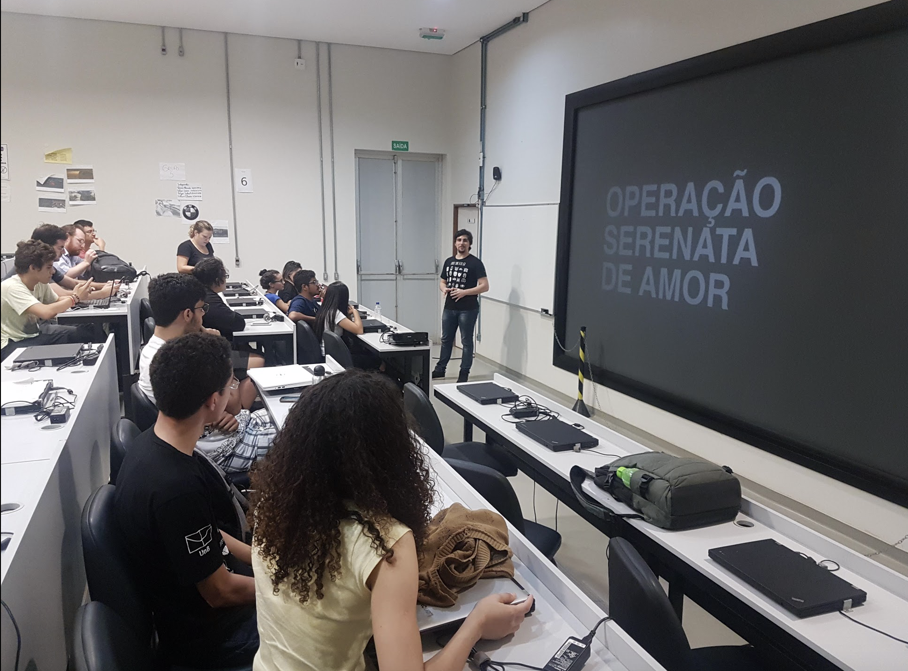

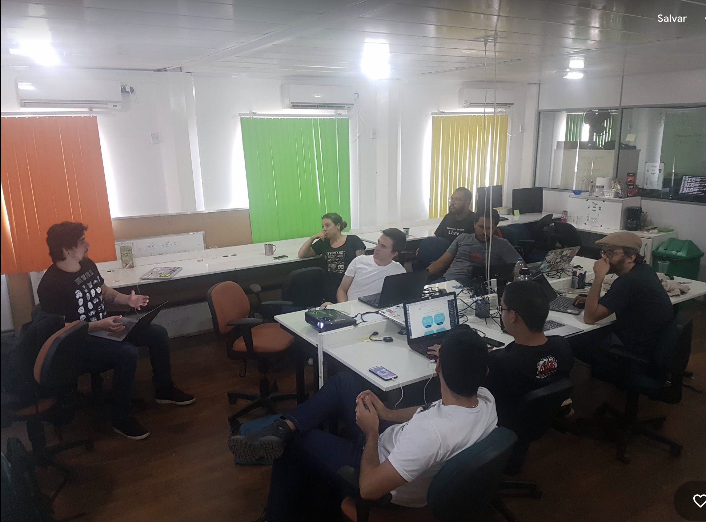

# Hackaton Saude

- **Data** - 30/06/2018
- **Participantes** - Alunos participantes do projeto Arthur Diniz, Victor Moura.

Participação de hackathon no qual desenvolveram um chatbot no contexto da saúde. Iniciativa importante para apresentar os resultados e capacitação da equipe e também entrar em contato com as inovações realizadas e propostas no contexto local.

# Workshop devops com MDH

- **Data** - 04/07/2018
- **Participantes** - Equipe Técnica do MDH e workshop técnico sobre principios de DevOps organizados pelos alunos bolsistas do lappis.

# Lappis conf - softwares livres pra controle social, eleições

- **Data** - 30/07/2018
- **Participantes**  - equipe do Lappis e convidados dos seguintes laboratórios

# Lappis conf - Atos (Vida após lappis)
- **Data** - 13/08/2018
- **Participantes**  - equipe do LAPPIS e o ex aluno Athos.

Apresentação da perspectiva do mercado de trabalho em software livre: perspectiva tanto brasileira quanto internacional.

# Entrega Técnica Ciclo trimestral 
- **Data** - 15/08/2018
- **Participantes**  - equipe do LAPPIS e equipe técnica do Ministério.

A equipe Técnica do Ministério reuniu com a equipe projeto Ecossistemas para apresentação das entregas realizadas no ciclo trimestral de desenvolvimento.

# Entrega Técnica Ciclo trimestral 
- **Data** - 16/08/2018
- **Participantes**  - equipe do LAPPIS e equipe de negócio da SEFIC.

A equipe negocial do Ministério reuniu com a equipe projeto Ecossistemas para apresentação das entregas realizadas no ciclo trimestral de desenvolvimento.

# Participação de alunos no evendo Indie Warehouse 

- **Data** - 17/08/2018
- **Participantes**  - equipe do LAPPIS.

 Lappis na indie warehouse. Participação da comunidade local de inovação.

# Lappis Conf Chatbot

- **Data** - 20/08/2018
- **Participantes**  - organizado pela equipe do LAPPIS e aberto para a comunidade.

Para fomentar a disseminação do conhecimento internamenta na Universidade de Brasília, foram organizados Lappis conf especiais para apresentar os avanços realizados no projeto da TAIS e nas demais frentes do projeto "Ecossistemas de Software Livre".

# Lappis Conf - Software Legado

- **Data** - 27/08/2018
- **Participantes**  - organizado pela equipe do LAPPIS e aberto para a comunidade.

 Para fomentar a disseminação do conhecimento internamenta na Universidade de Brasília, foram organizados Lappis conf especiais para apresentar os avanços realizados no projeto da TAIS, software legado  do projeto "Ecossistemas de Software Livre".

# LabConf - Conferência dos Laboratórios de inovação da cultura

- **Data** - 31/08/2018
- **Local** - Ministério da Cultura
- **Participantes**  - organizado pela equipe do LAPPIS. Participaram a equipe técnica do ministério, e os laboratórios da UFG e UFABC que possuem também parceria com o minitério.

 LabConf, ou Conferência dos laboratórios de inovação da cultura, foi o evento organizado pelo LAPPIS no Ministério da Cultura para que o arranjo de TED entre Universidade e o Ministério da Cultura pudesse ser discutido. Nesse dia, os demais laboratório (UFG, UFABC, UnB) puderam apresentar os avanços alcançados em seus respectivos projetos, diversos workshops práticos relacionados a DevOps foram ministrados pelos bolsistas do LAPPIS, e mesas rendondas foram realizadas para discutir modelos de contratação.

Video para a apresentação sobre a Tais no evento - [https://www.youtube.com/watch?v=uR0W-fDUr9g](https://www.youtube.com/watch?v=uR0W-fDUr9g)
 

Mais fotos do evento podem ser acessados em [https://photos.app.goo.gl/NSqRum7rmYYRxNy28](https://photos.app.goo.gl/NSqRum7rmYYRxNy28)

# O uso de Chatbots no Serviço Público

- **Data** - 20/09/2018
- **Local** - LabHacker - câmara dos deputados
- **Participantes**  -  Arthur Temporim e Bruna Pinos

Fomos convidados  a participar de uma live no LabHacker para apresentar o projeto Tais e o uso de chatbots pelo Ministério da Cidadania.

O video completo da transmissão pode ser acessado em -  [https://www.youtube.com/watch?v=wpi5xDhofW4](https://www.youtube.com/watch?v=wpi5xDhofW4)

# MiniLappisConf - Promova Cultura

- **Data** - 01/10/2018
- **Local** - LAPPIS
- **Participantes**  -  Equipe Lappis

Os avanços do projeto eram constantemente compartilhados com a comunidade. Nessa data, a equipe de design do projeto apresentou os avanços do projeto Promova Cultura para  a comunidade.

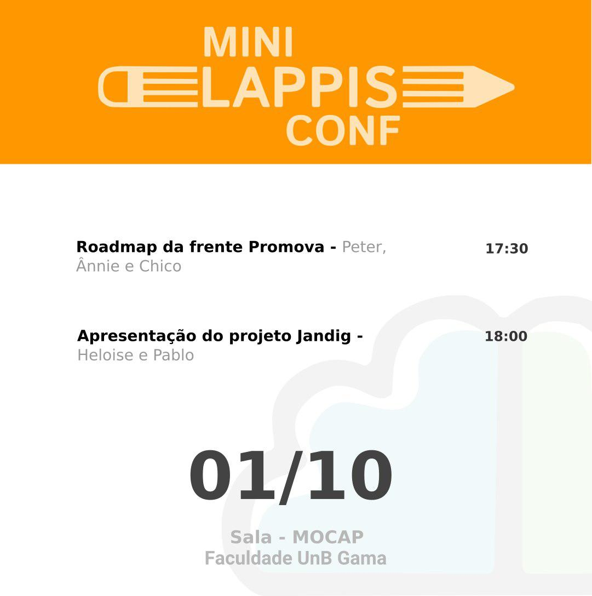

# Meetup Pydata - Apresentação da Tais

- **Data** - 22/11/2018
- **Local** - Ministério da Cultura
- **Participantes**  -  palestrante: Carla Rocha.  Participantes: Comunidade de Brasília que trabalha com ciencia de dados.

Meetup Pydata - Como a inteligencia artificial ajuda no atendimento de agentes da lei de incentivo a cultura. 

Foi apresentado para a comunidade Pydata os algoritmos de aprendizagem de máquinas utilizados na tais, o framework desenvolvidos e alguns resultados já obtidos.

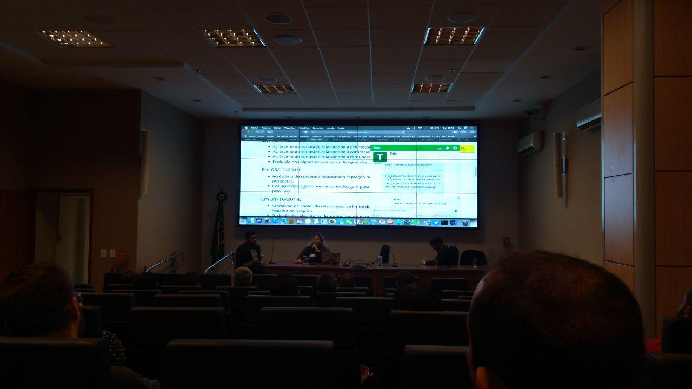

# Webinar - Fazendo seu chatbot inteligente com RASA e Rocket.Chat

- **Data** - 13/12/2018
- **Local** - LAPPIS
- **Participantes**  -  Arthur Temporim, Bruna Pinos, Carla Rocha, Gabriela Guedes, Matheus de Sousa Faria e Paloma C. Mamede

Foi realizado o primeiro webinar sobre o trabalho realizado no projeto Tais. Além de apresentar o trabalho realizado, iniciamos a construção de uma comunidade local e em torno das tecnologias usadas no projeto.

O video possui atualmente, mais 1400 visualizações. Ele pode ser acessado em: [https://www.youtube.com/watch?v=5fbdIwsGrQ4](https://www.youtube.com/watch?v=5fbdIwsGrQ4)

# Webinar - Boilerplate de FAQ Chatbot em português usando RASA - Customizando seu chatbot

- **Data** - 23/01/2019
- **Local** - LAPPIS
- **Participantes**  -  Arthur Temporim e Bruna Moreira

Webinar para transferência de tecnologia do projeto Tais - pode ser acessado em  - 
[https://www.youtube.com/watch?v=tW4x-R82hNc](https://www.youtube.com/watch?v=tW4x-R82hNc)

 

# Tais no prefeitos do Futuro 
- **Data** - 14/03/2019
- **Local** - Hotel Royal Tulip
- **Participantes**  -  Carla Rocha

Evento Prefeitos do Futuro reune prefeitos de todo o Brasil e apresentam soluções inovadoras para tratar questões de gestão publica. Apresentamos a TAIS no evento e os benefícios de trabalhar com soluções Open Source. Vídeo sobre o event Prefeitos Do Futuro pode ser acessado em -[https://www.youtube.com/watch?v=CKM4ieBsMLw&list=PLo2mbJ5niURZE9U8XI8xw4sV_hh1HVWLg&index=6](https://www.youtube.com/watch?v=CKM4ieBsMLw&list=PLo2mbJ5niURZE9U8XI8xw4sV_hh1HVWLg&index=6)

# Webinar Chatbot Rasa conectado com API do Google

- **Data** - 27/03/2019
- **Local** - LAPPIS
- **Participantes**  -   Arthur Temporim e Bruna Moreira

Mais um webinar para transferência e compartilhamento de experiência. Participação da equipe técnica do ministério da Cidadania (empresa Vector)

O video para o webinar pode ser acessado em [https://www.youtube.com/watch?v=zL8zCbmfLwM](https://www.youtube.com/watch?v=zL8zCbmfLwM)

# MiniLappisConf  - visita técnica CGEE

- **Data** - 01/04/2019
- **Local** - LAPPIS

Apresentação do trabalho realizado na CGEE para extrair informações sobre inovação e pesquisa no Brasil. 

# Webinar Rasa Bot no Telegram com Slots e Entities
- **Data** - 10/04/2019
- **Local** - LAPPIS
 - **Palestrantes**  - Arthur Temporim e Gabriela Guedes

Link do webinar em [https://www.youtube.com/watch?v=ZPUtt2AFhjM](https://www.youtube.com/watch?v=ZPUtt2AFhjM)

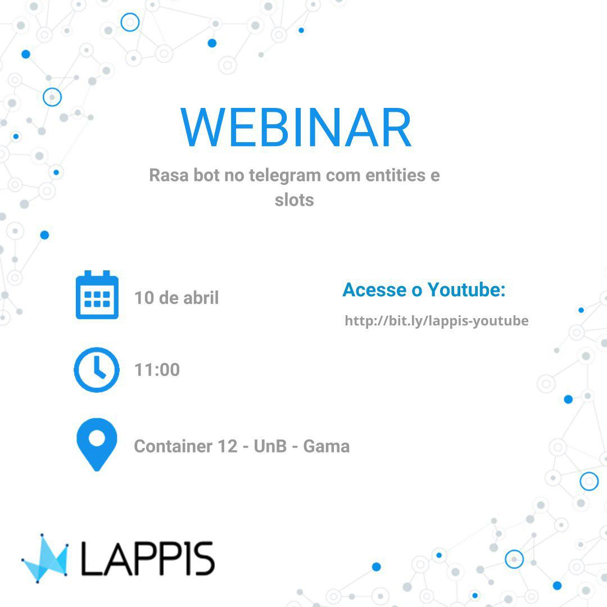

# GNPapo Chatbot
- **Data** - 11/04/2019
- **Local** - ENAP
 - **Palestrantes**  - Seniores Lappis

Gnpapo dedicado a discutir chatbots no governo no qual apresentamos o estudo de caso da TAIS.

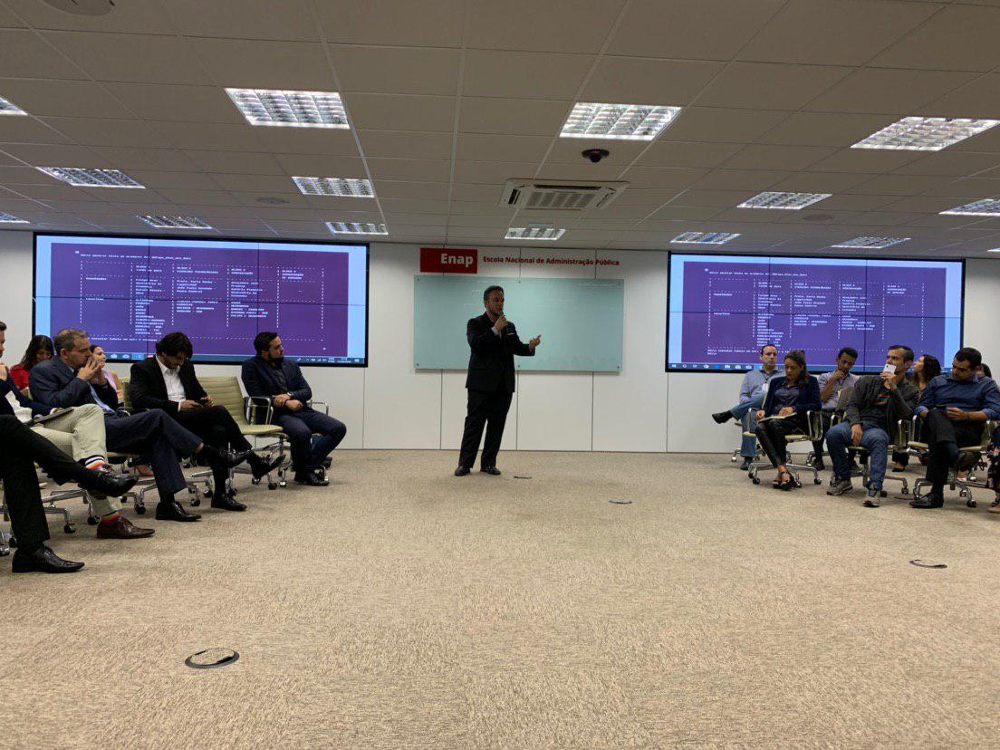

# MiniLappisConf - E-Democracia
- **Data** - 15/04/2019
- **Local** - LAPPIS

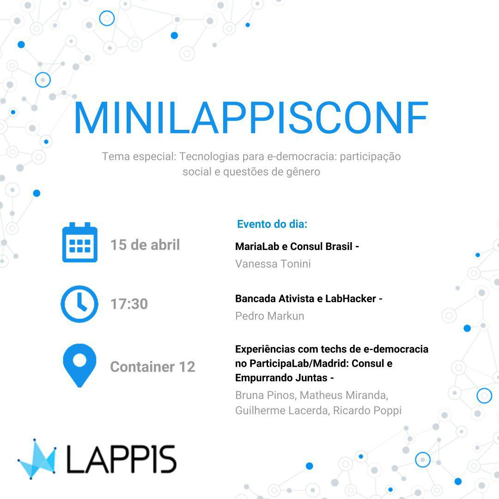

# Webinar relâmpago - Rasa Stack
- **Data** - 17/04/2019
- **Local** - LAPPIS
- **Palestrantes** -  Arthur Temporim

Link do webinar [https://www.youtube.com/watch?v=5kXLmnWJe5g](https://www.youtube.com/watch?v=5kXLmnWJe5g)

# Webinar - Métricas importantes para chatbots
- **Data** - 24/04/2019
- **Local** - LAPPIS
- **Palestrantes** -  Guilherme Lacerda e Bruna Pinos

Link do webinar  - [https://www.youtube.com/watch?v=yqzxZsOa3gg](https://www.youtube.com/watch?v=yqzxZsOa3gg) 

#  Talkshow IA na PGR
- **Data** - 14/05/2019
- **Local** - PGR
- **Palestrantes** -  Carla Rocha

Foi organizado pela PGR um evento para discutir o uso de Inteligência Artificial no Governo Federal. Apresentamos o trabalho da Tais e do SalicMl e compartilhamos com a comunidade as lições aprendidas nesse projeto.

# Webinar Arquitetura desaplocada
- **Data** - 22/05/2019
- **Local** - LAPPIS
- **Palestrantes** -   Pablo Diego e Arthur Temporim

Link para o webinar [https://www.youtube.com/watch?v=f35j9yydcEU ](https://www.youtube.com/watch?v=f35j9yydcEU )

# Feira Geek
- **Data** - 01/06/2019
- **Local** - SESC 604 sul
- **Palestrantes** -    Guilherme Lacerda, Mateus Miranda, Joenio Costa

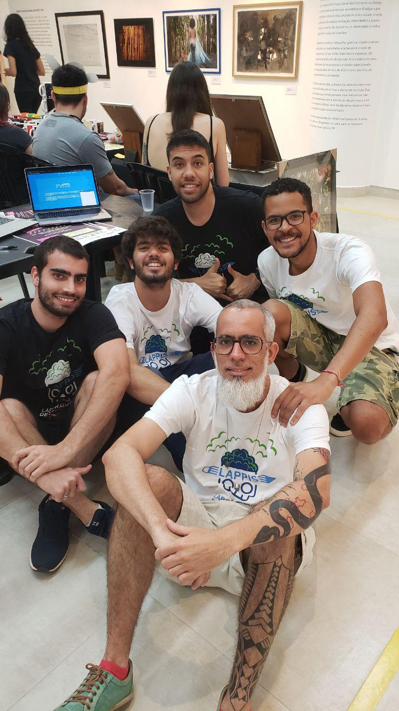

# Campus Party
- **Data** - 20/06/2019
- **Local** - Estádio Mané Garringa
- **Palestrantes** -    Equipe Lappis

Participamos da Campus Party Brasilia tanto no Stand da UnB, no qual foram apresentados para o publico geral inovações realizadas na Universidade de Brasilia. Também foi feito uma apresentação no palco Coders sobre o projeto Tais, intitulado "chatbot indie, isso existe?". Os trabalhos realizados no projeto, como os dashboards, tanto as experiência dos alunos foram apresentados no evento. 

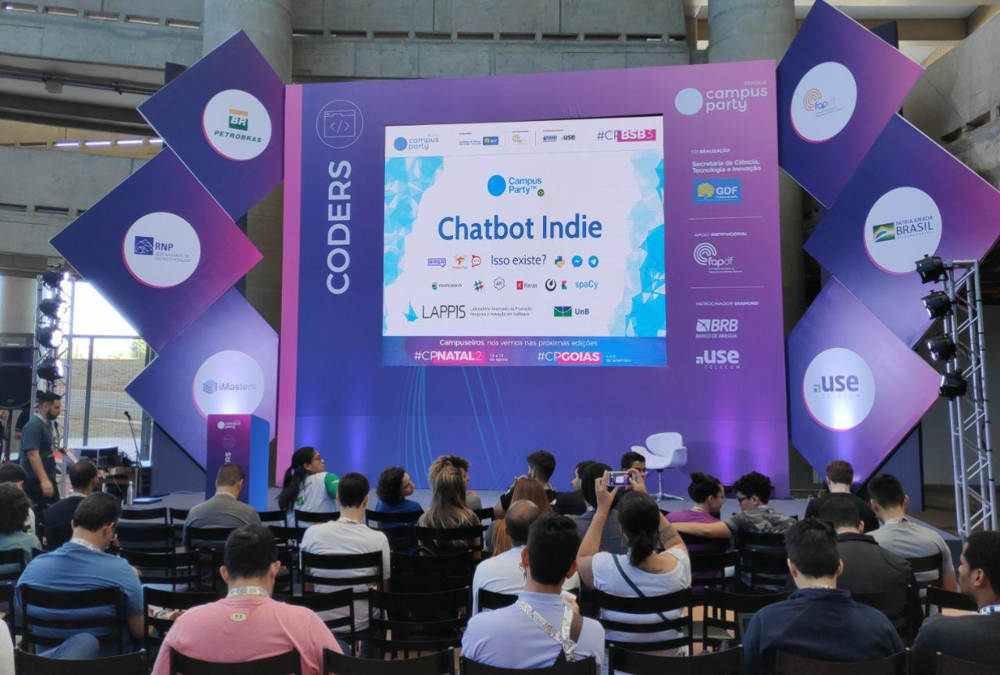

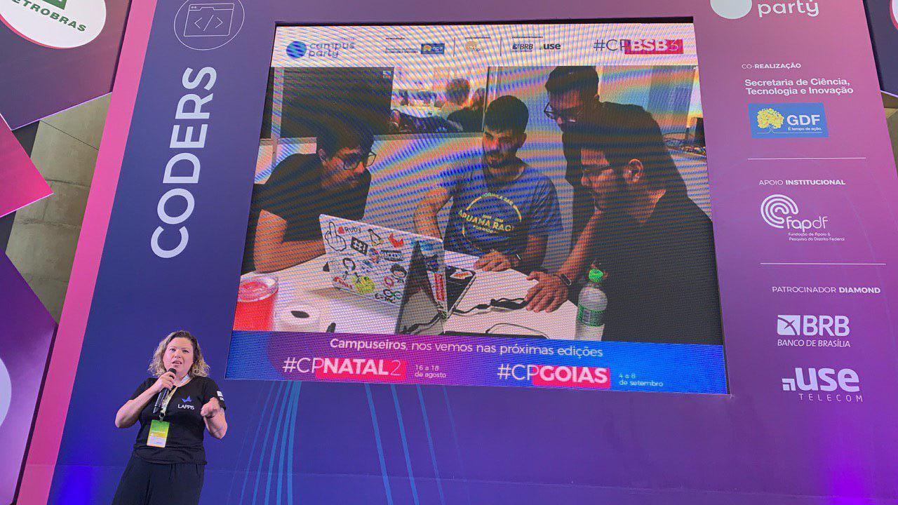

# 17º Pydata - Como construir uma aplicação com features baseadas em data science

- **Data** - 25/06/2019
- **Local** - Caixa Econômica Federal
- **Palestrantes** -    Victor Moura

Foi apresentado pelo bolsista Victor Moura as principais lições aprendidas pelo projeto SalicML.

# Webinar Testes automatizados de ChatBot
- **Data** -  31/07/2019
- **Local** - LAPPIS
- **Palestrantes** - Leonardo Gomes

Link do Webinar - [https://www.youtube.com/watch?v=6YlFhpj6JSs](https://www.youtube.com/watch?v=6YlFhpj6JSs)

# Python Cerrado
- **Data** -  05/09/2019
- **Local** - Goiania
- **Palestrantes** - Matheus Miranda e Arthur Temporim

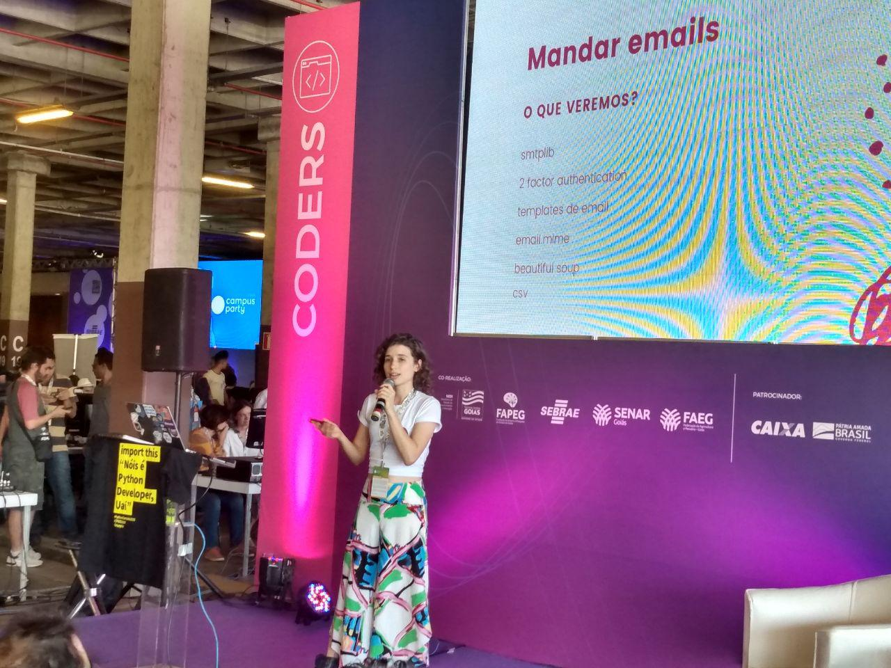

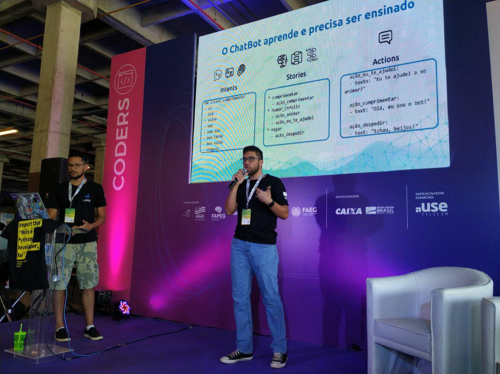

# Webinar Encantando pessoas: o poder da personalidade
- **Data** -  18/09/2019
- **Local** - LAPPIS
- **Palestrantes** - Paloma C. Mamede

Link para o webinar em [https://www.youtube.com/watch?v=hmFoxEYTK0Y](https://www.youtube.com/watch?v=hmFoxEYTK0Y)
 

# Projetando chatbots inteligentes
- **Data** -  27/09/2019
- **Local** - ENAP
- **Palestrantes** - Equipe Lappis

Como evento de entrega de produto e transferência de tecnologia para o ministério, foi realizado um workshop, aberto ao público, apresentando o processo de criação, manutenção e evolução de um chatbot. Utilizamos a Tais como estudo de caso, no qual apresentamos os principais desafios tecnológicos encontrados. Dividimos o workshop em duas trilhas: DevOps e Curadoria. A trilha DevOps trata das questões técnicas, arquiteturais, algortimicas relacionadas a chatbots. Apresentamos os conceitos gerais da solução proposta para a Tais, como subir em ambiente de homologação e produção a Tais, como criar novos dashboards de visualização. 

Já na trilha de curadoria, apresentamos o processo para criar conteúdo para o chatbot, como definir a personalidade, como inserir e testar novos conteúdos, como evoluir um chatbot ja existente, como validar em uso novos conhecimentos. 

Convidamos a equipe técnica do ministério e a comunidade externa. Da comunidade externa, foram 60 pessoas inscritas nas duas trilhas. Todo o material didático apresentado foi disponibilizado para os participantes, assim como as ferramentas de código abertos desenvolvidos pelo projeto "Ecossistemas de Software Livre". 

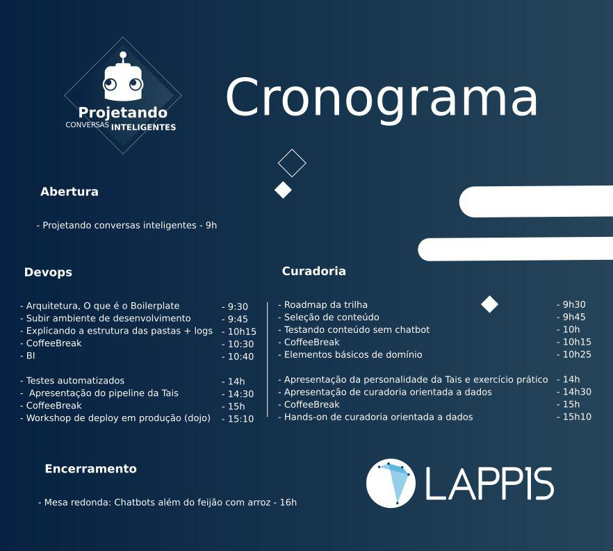

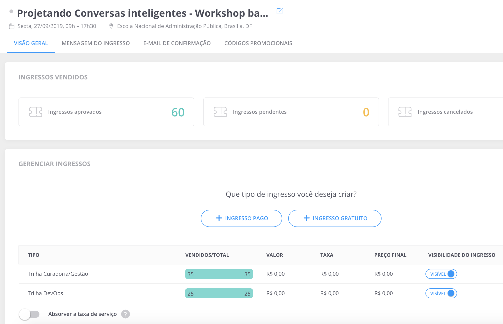

