# Objetivo Geral

O objetivo geral da parceria foi constituir a rede de laboratórios de pesquisa e desenvolvimento de tecnologias inovadoras para políticas públicas do Ministério da Cultura. O principal objetivo é pesquisar e aplicar técnicas, metodologias de desenvolvimento de software, além de aferição qualidade produto de software, em ambiente experimental do Laboratório Avançado de Pesquisa, Produção e Inovação em Software (LAPPIS).  Tais pesquisas e práticas serão usadas para subsidiar o Ministério da Cultura de  ferramentas de gestão e desenvolvimento de software colaborativo, aberto e contínuo, em diferentes arranjos produtivos,  aprimorando os mecanismos de governança digital; além de fornecer subsídios tecnológicos que apoiem a execução da Lei 8.313/91, conhecida como Rouanet e das demais políticas de fomento e incentivo a cultura.

O presente relatório apresenta o acompanhamento do trabalho realizado no projeto "Ecossistemas de Software Livre", Termo de Cooperação para Descentralização de Crédito, Processo Ofício No 0646/2017/FUB-UnB, Vigência Outubro 2017 a Outubro 2019. O documento apresentado é o *Relatório Final do Projeto* e apresenta o que foi realizado no âmbito da cooperação, os principais resultados de pesquisa e inovação, além das entregas definidas no plano de trabalho vigente.

# Objetivos Específicos

O plano de trabalho levantou alguns objetivos específicos referentes a parceria. Ao longo do relatório de entrega final serão detalhadas como esses objetivos foram alcaçandos. Abaixo elencamos os objetivos e explicamos de forma resumida como eles foram realizados, e por qual pacote de trabalho:

-  __Realizar estudos de algoritmos de aprendizado de máquina para analisar dados da execução da Lei Rouanet__: O projeto "Salic-ML" realizou esse objetivo. Além de inúmeras reuniões com a equipe da Sefic para entender o processo da Lei de Incentivo a Cultura e o SALIC, foram levantados os principais gargalos do processo. O gargalo mais crítico foi a prestação de contas, no qual o Ministério tem um passivo de cerca de 17 mil projetos a serem analisados, incluindo o objeto e a prestação de contas. O time então priorizou em desenvolver algoritmos de ciência de dados para gerar métricas/indicadores que explicitem a **complexidade** de um projeto cultural, no que tange a análise financeira. O objetivo é direcionar o trabalho dos técnicos da Sefic no trabalho técnico, e aos gestores a priorizar e delegar as análises de forma eficiente e orientadas a dados. Esse trabalho foi finalizado e entregue como um microsserviço a ser integrado ao SALIC.

-  __Realizar estudos de métodos/práticas ágeis e de desenvolvimento lean de software, além das práticas de engenharia de software e de governança utilizadas nas comunidades de software livre, de forma a prover uma infraestrutura computacional para desenvolvimento e experimentação contínua de software__: Esse objetivo foi alcaçado com as reuniões estratégias trimestrais com os principais stakeholders do ministério, além de mantermos as boas prática de comunidades de software livre nos projetos desenvolvidos ao longo da cooperação. Um grande trabalho de governança foi feito com a chatbot "Tais", engajando outros ministérios a adotarem a solução técnica da Tais, aumentando assim a comunidade.

-  __Fornecer suporte tecnológico para apropriação das informações por parte da sociedade civil de
maneira a contribuir para transparência pública e participação social__: Todos os estudos, código, apresentações, material de treinamento foram disponibilizados com licenças livres, de modo que a sociedade civil possa acessar, dar feedback, contribuir, etc.

-  __Fornecer suporte tecnológico para estimular a participação da sociedade civil na governança
digital em torno das tecnologias livres do portfólio do ministério__: Esse objetivo foi alcançado ao seguir as boas práticas e documentações adotadas pela comunidade de software livre. Dessa maneira, diminui a barreira de contribuição para os interessados em contribuir com os projetos desenvolvidos ao longo da parceria.

-  __Mineração em repositórios de software para extração e análise de dados__: Esse objetivo foi alcançado nos notebooks de análise de dados. Isso foi feito tanto no contexto da Lei de Incentivo Cultural, por meio da mineração do banco de dados do Salic, quanto da análise dos próprios repositórios e métricas dos projetos desenvolvidos ao longo do parceria.

- __Processamento de linguagem natural dos dados extraídos dos diferentes sistemas de software
culturais__: Esse objetivo foi alcaçando por meio da assistente virtual TAIS. Nela, aplicamos algoritmos de __Natural Language Understanding (NLU)__ para a classificação da intenção dos usuários que interagem com a chatbot por meio de linguagem natural.

- __Transferência de conhecimento da academia para o Estado__: Além dos diversos workshops realizados ao longo do projeto com a equipe de TI do Ministério da Cidadania, foram realizados pela frente de governanças do projeto, diversas interaçoes com comunidades de software livre e outros ministérios.

- __Formação de alunos de graduação em pós-graduação em projetos com problemas reais do
contexto cultural__: Esse objetivo foi alcançado com grande parte da equipe do projetos sendo alunos de graduação de Engenharia de Software, design e letras. Ao total, 43 alunos de graduação foram bolsistas do projeto.

- __Contribuir para o fomento da cultura de software livre na Administração Pública Federal__: Esse objetivo foi alcançado a partir da criação de tecnologias em software livre além da instrumentação de repositórios estratégicos para o Ministério. Esta instrumentação foi feita a partir de um diagnóstico dos principais problemas enfrentados por estes repositórios com relação à adoção de boas práticas de organização de repositórios de Software Livre. O objetivo do diagnóstico e das interferências foi facilitar a capacidade de contribuição e a curva de aprendizado de novos usuários. Ações incluíram melhoras na documentação e criação de containers que facilitem o uso destas aplicações por usuários e novos;

- __Contribuir para o desenvolvimento da cultura de tomada de decisões orientadas a dados e
evidência__: Esse objetivo foi alncançado com o projeto Salic-ML no qual  estimamos métricas e indicadores de complexidade de projetos de projetos culturais. Na TAIS, criamos um dashboard de BI  (Business Inteligence) que fornece, em tempo real, o comportamento dos usuários que interagem com a TAIS. Esse dashboard disponibiliza dados preciosos para compreender o perfil do usuário que acessa a o portal da Lei de Incentivo, e o comportamento desse usuário;

- __Contribuir para o estabelecimento da cultura de desenvolvimento e experimentação contínua__: Alcançamos esse objetivo pela forma como escolhemos as ferramentas, técnicas, e escopos a serem desenvolvidos, sempre realizados após um período de experimentação. Esses aprendizado e amadurecimento de experimentação contínua foi registrado nas wikis e notebooks disponibilizados em licenças livres nos repositórios dos projetos, no qual estudos comparativos precedem escolhas técnicas.

# Metodologia, metas e etapas do projeto

O planejamento de execução das metas foi inicialmente dividido em 5 etapas e 5 pacotes de trabalho. Descrevemos os avanços a seguir e ressaltamos alguns itens que foram executados de forma diferente do cronograma. Vale ressaltar que todas as alterações ao longo da execução do projeto que divergem do planejado foram previamente acordadas com o Ministério e registradas nos relatórios de acompanhamento entregues trimestralmente.

## Inovação tecnológica em Software

Os pacotes de trabalho da presente parceria produziram 8 projetos de software distribuidos em 12 repositórios. Ao todo, foram mais de 3000 commits com contribuições de 62 commiters individuais. Além disto, o projeto ainda contempla estudos acadêmicos, estudos de identidade visual, dinâmicas de capacitação e outros insumos fora do produto de software propriamente dito.

Obviamente é impraticável anexar toda esta produção a este documento, portanto este documento apresenta um resumo com estatísticas e os resultados mais importantes obtidos e direções sobre como obter o código para fazer uma análise detalhada. Todo software desenvolvido no projeto está disponível publicamente sob licenças livres na plataforma Github (principal plataforma de disponibilização de código no mundo). Os repositórios e seus respectivos endereços estão listados abaixo e podem ser acessados publicamente por qualquer pessoa:

- _Ecossitemas de Software Livre_ ([https://github.com/lappis-unb/EcossistemasSWLivre](https://github.com/lappis-unb/EcossistemasSWLivre)) - todos os documentos administrativos do projeto estão disponibilizados nesse repositório. Registro de reuniões, decisões, relatórios de acompanhamento, plano de trabalho.

- _TAIS_ ([https://github.com/lappis-unb/tais](https://github.com/lappis-unb/tais)) - aplicação principal da TAIS, com o bot, interface web, dashboard de BI.

- _Salic-ML_ ([https://github.com/lappis-unb/salic-ml](https://github.com/lappis-unb/salic-ml)) - aplicação principal do microsserviço SALIC-ML. Nesse se encontra tanto a API do microsserviço, quanto toda a documentação técnica na Wiki, e estudos realizados nos notebooks.

- _Promova Cultura_ ([https://github.com/lappis-unb/PromovaCultura](https://github.com/lappis-unb/PromovaCultura)) - estudo de visualização de dados dos dados do banco de dados do Salic. Contém toda a documentação técnica, resultados da design sprint realizadas para definição do escopo e as visualizações implementadas.

- _Botflow_ ([https://github.com/lappis-unb/BotFlow](https://github.com/lappis-unb/BotFlow) e [https://github.com/lappis-unb/BotFlowAPI](https://github.com/lappis-unb/BotFlowAPI)) - não previsto no plano de trabalho, mas foi julgado pelo time necessário para facilitar a manutenção e evolução da base de conhecimento da TAIS.

- _Salic-API_ ([https://github.com/lappis-unb/salic-api](https://github.com/lappis-unb/salic-api)) - refatoramos, criamos testes unitários, pipelinde de integração contínua, documentação técnica. Ou seja, adequamos a API do Salic, que é o projeto do ministério de maior interesse externo, para os padrões, boas práticas e documentação de comunidades de software livre.

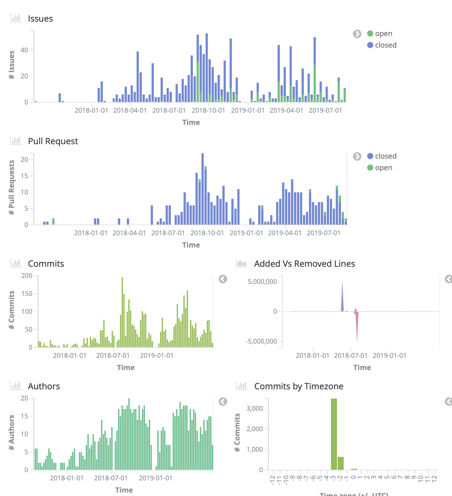

## Análise de custo benefício e impacto da inovação

Além do desenvolvimento de soluções de software para o Ministério da Cidadania, o projeto parte de uma lógica de parceria com a universidade e pressupõe a criação de insumos de pesquisa e produção acadêmica. A maior parte dos membros da equipe é formada por alunos do curso de Engenharia de Software, sendo que a participação no projeto contribuiu diretamente para a formação dos mesmos. Alguns destes alunos adotaram temas relacionados ao projeto como tema em seus trabalhos de conclusão de curso ainda em andamento. Foram publicados dois artigos científicos. O primeiro, com o título *"FLOSS FAQ chatbot project reuse - how to allow nonexperts to develop a chatbot"*, contém a experienca no desenvolvimento da Tais e foi apresentado no OpenSym, um dos maiores simposios de pesquisa acadêmica em software livre. O segundo, com o título *"A Survey of DevOps Concepts and Challenges"* foi aceito  na revista **Computing Surveys** da ACM, de alto impacto acadêmico (A1 no critério de Qualis da Capes) e mostra o resultado acadêmico dos estudos em DevOps. Foi publicado também um capítulo do livro "Software e Cultura no Brasil - Produção, gestão e políticas publicas",  no qual discutimos os modelos de contratação nas equipes de TI do governo federal, no capítulo "Colaboração aberta e sua relação com a contratação de software na administração pública".

# Metas alcançadas

Nas próximas seções apresentaremos os principais resultados relacionado a cada meta específica do plano de trabalho. Os resultados são complementares aos relatórios de entregas parciais entregues trimestralmente.

## Pacote de Trabalho: Estratégia/modelo de transformação de softwares legados em comunidades de software aberto

Evoluir e manter um software legado é uma experiência desgastante para desenvolvedores e desestimulantes no contexto de fomento a comunidades. Por outro lado, a reescrita desses softwares é impraticável e, em se tratando de software implantado, a necessidade de adicionar novas funcionalidades e dar manutenção persiste.

Os resultados desse pacote de trabalho, e as entregas foram documentadas nos seguintes relatórios:

- [Relatório Etapa 1](https://github.com/lappis-unb/EcossistemasSWLivre/blob/master/Relatorios/R1/RELATÓRIO%20ETAPA%201.pdf)

- [Relatório Etapa 2](https://github.com/lappis-unb/EcossistemasSWLivre/blob/master/Relatorios/R2/RELATÓRIO%20ETAPA%202.pdf)

- [Relatório Etapa 3](https://github.com/lappis-unb/EcossistemasSWLivre/blob/master/Relatorios/R3/RELAT%C3%93RIO%20ETAPA%203-1.pdf)

- [Relatório Etapa 4](https://github.com/lappis-unb/EcossistemasSWLivre/blob/master/Relatorios/R4/RELATÓRIO%20ETAPA%204.pdf)

- [Relatório Etapa 5](https://github.com/lappis-unb/EcossistemasSWLivre/blob/master/Relatorios/R5/RELAT%C3%93RIO%20ETAPA%205.pdf)

- [Relatório Etapa 6](https://github.com/lappis-unb/EcossistemasSWLivre/blob/master/Relatorios/R6/RELAT%C3%93RIO%20ETAPA%206.pdf)

- [Relatório Etapa 7](https://github.com/lappis-unb/EcossistemasSWLivre/blob/master/Relatorios/R7/RELATÓRIO%20ETAPA%207.pdf)

Além dos relatórios, esc um artigo no Medium sobre o projeto SALIC-ML [Algoritmos de aprendizagem de máquina com software em produção— análise de projetos da Lei Rouanet](https://medium.com/@lappisunbfga/o-uso-de-algoritmos-de-aprendizagem-de-m%C3%A1quina-em-produ%C3%A7%C3%A3o-estudo-de-caso-na-an%C3%A1lise-de-projetos-ed43ab86e5f6), apresentamos o trabalho do SALIC-ML na comunidade Pydata Brasília  (25/06/2019), com o título "Como construir uma aplicação com features baseadas em data science". Mais detalhes sobre os eventos serão apresentados no pacote de trabalho "Estudos sobre práticas de gestão colaborativa em comunidades de software aberto".

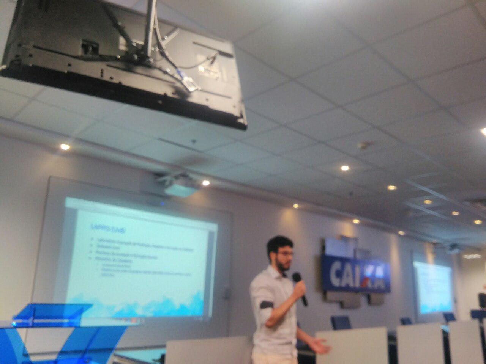

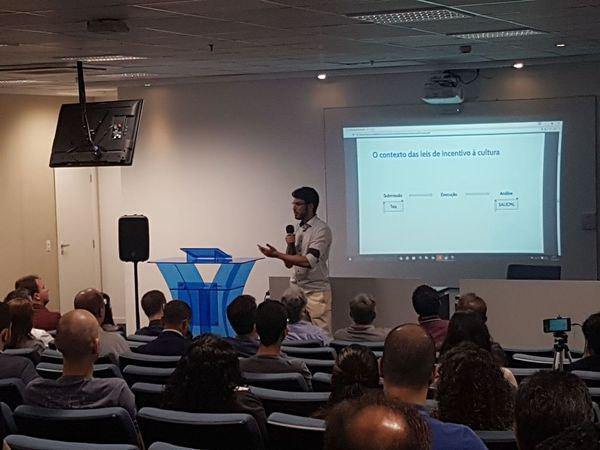

### Metas Específicas

Quanto as metas específicas dessa frente de trabalho definidas plano de trabalho são:

1. __Estudos e documentação do processo de conteinerização, testes automatizados, refatoração de sistemas legados em uma estrutura de DevOps para viabilizar trabalhos futuros__

**Concluído** - No início do projeto, fizemos um *checklist* com as principais boas práticas, documentações, automações de comunidades de software livre. Esse *checklist* foi aplicado em uma lista de projetos evoluidos e mantidos pelo Ministério da Cultura. Para cada projeto, colocamos a solução em containers, documentamos  o básico (README), instrumentamos com serviços de análise estática de qualidade de código, e integração contínua. A importância desse trabalho é que, além de fazer com que os projetos mantidos pelo Ministério façam adesão as  práticas modernas de engenharia de software, permite que outras equipes de desenvolvimento possam executar, testar e evoluir os projetos mais facilmente. Adicionalmente, tais ferramentas aceleram a curva de aprendizado de novos membros no time, além de incentivar boas práticas de desenvolvimento por meio de monitoramento das métricas.

Essa estratégia, chamada *legacy in the box*, é sugerida na literatura do estado da prática como primeira ação a ser feita em direção ao DevOps em sistemas legados. Conteinerizar e instrumentar um software legado permite que esse seja configurado em um pipeline de deploy contínuo. A falta de testes cria a vulnerabilidade de se colocar em ambiente de produção/homologação features defeituosos. Porém, esse risco está presente naturalmente em softwares legados sem testes. Logo, a estrégia *legacy in the box* agiliza a entrega de novas funcionalidades, possibilitando entrega contínua, criação de comunidade e incentivo as boas práticas de engenharia de software.

**Documentação comprobatória** - A lista de projetos que foram refatorado utilizando a estratégia *legacy in the box* está disponibilizada no [Relatório Etapa 1](https://github.com/lappis-unb/EcossistemasSWLivre/blob/master/Relatorios/R1/RELATÓRIO%20ETAPA%201.pdf). O principal benefício dessa estratégia é visto no projeto do [Salic](https://github.com/culturagovbr/salic-minc), o principal software desenvolvido e mantido pelo Ministério. Com a estratégia *legacy in the box*, foi possível realizar pipeline de deploy/entrega contínua e agilizar o processo de entrega.  A figura abaixo mostra o histórico de releases do SALIC. Pode-se notar que o processo de *release*, e logo de deploy/entrega contínua foi adotada somente após a aplicação da técnica  *legacy in the box*. Na imagem, nota-se que tal técnica possibilitou a realização de até 24 *realises* em um mês.

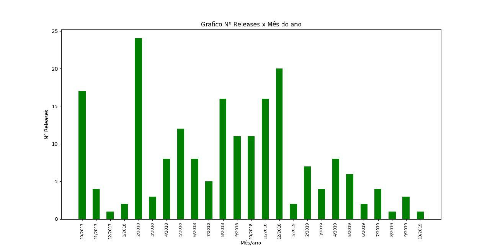

Parte da documentação de DevOps foi disponibilizada no repositório do laboratório em https://gitlab.com/lappis-unb/docs, disponibilizada também como anexo no final deste documento. Os documentos cobrem tanto a presente meta quanto a meta de documentação de software livre (e será reapresentado no relatório).

Elaborou-se uma documentação/relatório descrevendo todo o pipeline usado para deploy contínuo no laboratório com os seguintes tutoriais, que podem ser aplicados em diversos contextos:

- GitLab CI/CD: Guia relacionado ao uso da Integração Contínua e Deploy contínuo no Gitlab;
- Overview e exemplo básico (pt-br): Um guia que ensina como usar o gitlab CI/CD para gerar integração contínua e deploy contínuo em um projeto básico;
- Usando Docker Compose (pt-br): Um guia que ensina como usar o GitLab CI/CD para gerar integração contínua com o Docker Compose em um projeto ágil;
- Integrando GitLab CI/CD com projeto GitHub(pt-br): Um procedimento que possibilita o uso do GitLab CI/CD no projeto GitHub.

2.  __Pesquisa em metodologias de refatoração de sistemas legados__

**Concluído** - O principal problema tratado foi a pesquisa de estratégias para fazer inovação em plataformas compostas por software legado. Utilizamos o SALIC, principal software mantido pelo antigo Ministério da Cultura, que além de ser o maior software desenvolvido pelo Ministério ainda é o software responsável pelo acompanhamento da execução da Lei de Incentivo a Cultura. Nesse contexto, refatorar e/ou reescrever o Salic é uma tarefa inviável com custos proibitivos e riscos elevados. Uma particularidade do Salic é a utilização de vários bancos de dados (cerca de 10 bancos), e o fato de que várias regras de negócios serem implementadas como procedimentos no próprio banco. A documentação técnica no início do projeto era mínima, quase inexistente.

Dado o contexto, além da estratégia *legacy in the box*, descrita na seção acima, pesquisamos e aplicamos outras duas técnicas de refatoração de sistemas legados. Identificamos o *SalicAPI*, projeto que disponibiliza os dados sobre a execução de projetos da Lei de incentivo, como sendo o software com o maior pontencial de se ter comunidade, uma vez que os dados acessados via o *SalicAPI* são de interesse tanto do governo quanto da sociedade civil e jornalistas. Para o o *SalicAPI*, aplicamos a técnica tradicional de refatoração orientados a métricas. Para isso, atualizamos a versão do *Python*, automatizamos a execução de testes automatizados, criamos containers Docker, fizemos toda a documentação técnica e dos *endpoints*. Essa técnica de refatoração (reescrita de código, melhoria das práticas, execução de testes unitários) modernizou o *SalicAPI* e permitiu um pipeline de entrega/deploy continuo seguro.

A terceira técnica de refatoração de sistemas legados foi no contexto de inserir novas funcionalidades baseadas no uso de algoritmos de *machine learning*. O código do SALIC é escrito em PHP, mas a maioria dos frameworks e bibliotecas de aprendizagem de máquina são desenvolvidos na linguagem *python*. Por isso, escolhemos a técnica de adotar uma arquitetura microsserviços, no qual novas funcionalidade são adicionadas a plataforma como novos microsserviços que compartilham o banco de dados com o software legado. Essa técnica foi colocada em prática com o serviço *"SalicML"*. Nele, construimos uma API na qual adicionamos várias métricas de complexidade de análise de projetos culturais.

**Documentação comprobatória** - Quanto a estratégia refatoração, foi aplicado ao [SALIC API](https://github.com/lappis-unb/salic-api). A figura abaixo mostra a evolução das métricas relacionadas ao código.

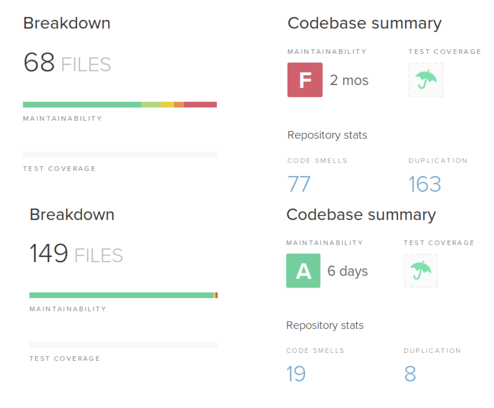

 Além de instrumentar a API com automações como conteiner, integração contínua (testes automatizados, build, teste de folha de estilo), foi realizados testes (cobertura atual de 87%). Foi adicionada também o graphQL para facilitar a consulta à dados. Três Docker Composers foram implementados com o ambiente de desenvolvimento, ambiente de homologação e ambiente de produção. Realizou-se, também, a documentação técnica para agilizar a manutenção e evolução da API utilizando *readthedocs*, disponibilizado no gitpage [https://salic-api.readthedocs.io/pt/latest/index.html](https://salic-api.readthedocs.io/pt/latest/index.html). Com essa estratégia, temos o projeto SALIC-API respeitando todas as recomendações de comunidades *open source*. Com isso, esse projeto, dentre os mantidos pelo ministério com  licenças abertas, é o mais receptivo para contribuições externas, da comunidade de software.

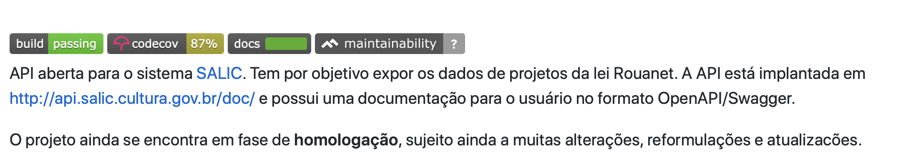

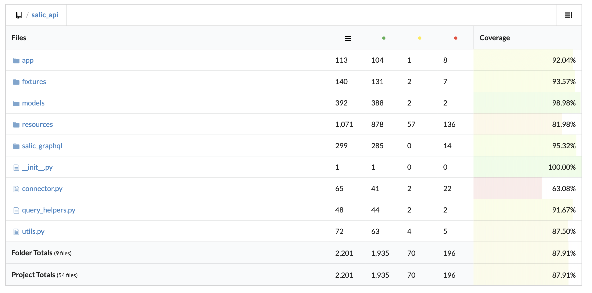

Finalmente, a estratégia de arquitetura microsserviços foi aplicada no [SalicML](https://github.com/lappis-unb/salic-ml).

1.  __Utilizar como estudo de casos alguns sistemas legados do Ministério da Cultura, tais como o projeto SIMEC (Sistema Integrado de Monitoramento Execução e Controle) e o projeto Salic (Sistema de Apoio as Leis de Incentivo à Cultura), Sistel__

**Concluído.** - Dos três projetos citados, trabalhamos com o *SALIC* e o *Sistel*. No *Sistel* aplicamos a técnica de *legacy in a box*. Já no *SALIC*, aplicamos as três técnicas pesquisadas: *legacy in a box*, *refatoração de código orientado a métricas* e *arquitetura microsserviços*. Toda a documentação técnica, assim como os resultados técnicos obtidos, e decisões colaborativas com o Ministério estão disponibilizadas na wiki do respectivo repositório. Vamos detalhar aqui o trabalho arquitetural utilizado na estratégia *arquitetura microsserviços*.

Implementar sistemas com modelos de aprendizado de máquina é sempre um desafio, o trabalho com os dados é o coração da aplicação e deve ter cuidados especiais. Cada situação tem suas peculiaridades e, no projeto Salic-ML, não foi diferente. Com o escopo definido ao redor do mundo da lei de Incentivo a Cultura, o Salic-ML tem como objetivo agilizar processos pelos quais um projeto cultural deveria passar caso se candidatasse ao incentivo fiscal.

O uso de aprendizado de máquina e técnicas estatísticas nos dados disponibilizadas pelo Ministério da Cidadania permitia calcular métricas que serviam como indicadores de possíveis anormalidades de um projeto, aumentando a rapidez na busca de eventuais anomalias. A partir desta situação, surgiu o projeto Salic-ML, nosso objeto de estudo. O objetivo seria criar uma plataforma na qual, a partir da análise dos dados e por meio de métricas de cada projeto cultural, indicasse, aos usuários, um *score* que indicava o quão complexo seria a análise do ponto de vista financeiro.

O projeto completo está sendo desenvolvido como software livre, e pode ser acessado em [SalicML](https://github.com/lappis-unb/salic-ml).

**Documentação comprobatória** - Grande parte do tempo de projeto foi dedicado aos estudos sobre os dados disponíveis. Entretanto, toda a análise tinha, como objetivo final, um produto que pudesse auxiliar os técnicos do Ministério a realizarem o seu trabalho de uma forma mais otimizada. Para isso, iniciou-se o trabalho da equipe de produto.

Por conta do tempo e do escopo definido, a arquitetura inicial envolvia apenas uma aplicação, com fundação no framework web Python Django. A chamamos de salic-ml-web. Nela, seria possível navegar entre os diversos projetos disponíveis na base de dados e visualizar uma nota global de cada um deles, calculada a partir dos algoritmos implementados pela equipe de data science.

Para viabilizar este comportamento, era necessário integrar os algoritmos dos Python Notebooks na aplicação Python Django. A solução encontrada foi transformar o código dos estudos em um pacote Python, disponibilizado no PyPi e consumido no salic-ml-web.

A divisão da equipe em duas frentes (“Equipe ML” e “Equipe ML Produto”) foi inspirada na abordagem de divisão de serviços por subdomínio (bem utilizada em arquiteturas de microserviços). O pacote Python continha os algoritmos resultantes dos estudos sobre os dados e a aplicação Django tinha maior preocupação em como estes algoritmos seriam entregues como produto ao Ministério.

Como resultado desta divisão interna, foi planejado o seguinte fluxo de trabalho:

1. “Equipe ML” implementava, no salic-ml, o código do algoritmo necessário para calcular uma determinada métrica.
2. “Equipe ML Produto” preocupava-se em:
1. Atualizar, no salic-ml-web, a versão utilizada do salic-ml para permitir o uso da nova feature implementada.
3. Mostrar os resultados da métrica em um front-end acessível pelos técnicos do MinC.

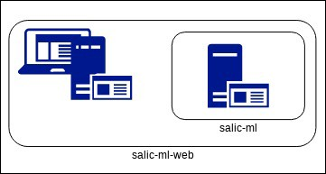

As vantagens deste modelo foram:

- Haviam duas equipes e criou-se dois "serviços". Cada equipe ficou responsável por uma base de código.
- Não observou-se mudanças drásticas das responsabilidades de cada equipe, já que o time de ciência de dados permaneceu preocupado em criar novos algoritmos e a equipe de produto preocupava-se com outros aspectos (DevOps, frontend, …).

Entretanto, haviam desvantagens:

- O processo era cascateado: antes, a equipe de data science deveria implementar o algoritmo no salic-ml para uso posterior no salic-ml-web.
- A separação das equipes gera, naturalmente, eventuais falhas de comunicação. Alterações de última hora eram feitas de forma constante e isto gerava desgaste dos membros.

Para tentar amenizar estes problemas, técnicas de DevOps foram utilizadas para otimizar o tempo de desenvolvimento de ambos os projetos. Integração e deploy contínuos permitiam encontrar problemas mais cedo e, consequentemente, corrigí-los o quanto antes.

Além dos pontos mencionados, havia uma preocupação em relação à integração com o SALIC, já implementado no Ministério. Para isso, em um determinado momento, trocou-se o conceito e a arquitetura interna do salic-ml-web para que ele se tornasse uma API baseada no Django Rest Framework e que o frontend fosse apenas um protótipo de homologação das informações, feito em VueJS (salic-ml-frontend). Esperava-se que, em algum momento, as informações resultantes dos algoritmos fossem repassadas para o SALIC e que o frontend fosse, no máximo, reutilizado na integração.

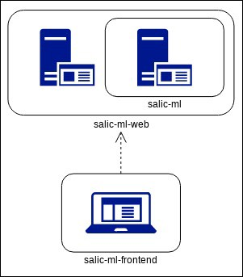

Dada a implementação do pacote salic-ml, que espelhava o que foi feito nos Python Notebooks, era necessário alimentar os algoritmos com os mesmos tipos de input utilizados na fase de data science. Para isso, foi necessário mapear um Docker Volume, por meio do Docker Compose, para a pasta na qual o pacote era instalado dentro do contâiner. Nesta pasta, seriam inseridos os arquivos (.csv) contendo os dados exigidos pelos algoritmos.

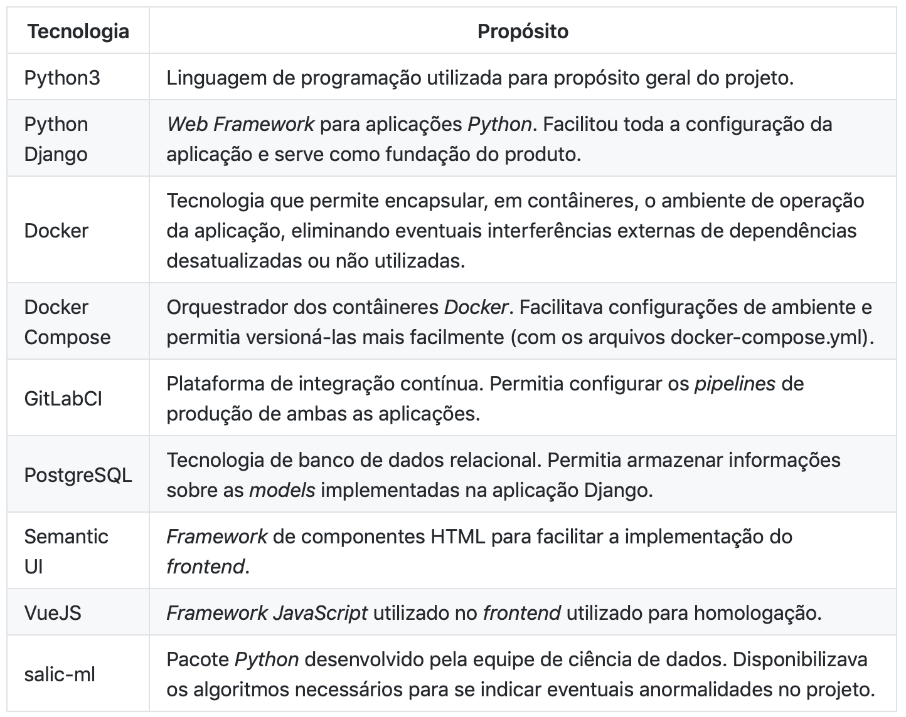

Observou-se os seguintes problemas:

- Os .csv's eram significativamente grandes. Movimentá-los exigia um certo tempo e nem sempre era garantido que funcionariam na primeira tentativa.
- Instanciar o objeto que continha os algoritmos custava alguns minutos, o que causava dificuldades no processo de desenvolvimento do produto. Cada modificação mínima no frontend resultava no recarregamento da aplicação e, consequentemente, na instanciação deste objeto.

Para tentar amenizar o segundo problema, além de serializar o objeto em um Pickle File, houve uma mudança arquitetural que removeria a necessidade do salic-ml-web instanciar o objeto que calculava os algoritmos. Mantendo a ideia do serviço único por equipe, criou-se o lappis-learning, uma aplicação Python Flask que implementava os algoritmos resultantes da análise dos dados e disponibilizava os resultados, em formato de JSON, por meio de uma API. Desta maneira, o objeto que leva mais tempo para ser instanciado fica completamente desacoplado da aplicação que exige uma maior cadência de modificações, facilitando o desenvolvimento.

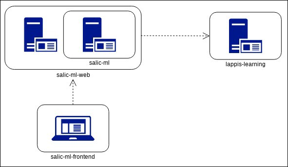

Aproveitando a modificação arquitetural, optou-se por eliminar o uso dos .csv's. A aplicação lappis-learning obtém os dados diretamente do banco de dados, eliminando a necessidade de se manter os arquivos que os continham.

Como o estágio de implementação do pacote salic-ml era avançado, a estratégia de transição envolvia implementar os novos algoritmos diretamente na nova arquitetura e, aos poucos, iríamos transferindo os já existentes.

Assim, era possível manter uma arquitetura híbrida. Alguns resultados eram obtidos do pacote salic-ml, que retornava Python Dicts, e outros do serviço lappis-learning, que retornava JSONs.

Como pontos de melhoria, é possível observar:

- É um verdadeiro malabarismo técnico manter a arquitetura híbrida do ponto de vista de fonte de dados. O cenário ideal seria a finalização da transição do consumo do salic-ml para o consumo exclusivo do lappis-learning.
- Mesmo com a separação do serviço exclusivo de análise de dados, a arquitetura interna deveria possibilitar um cache dos metadados que são calculados toda vez que se inicia o serviço lappis-learning.
- A integração, até o momento no qual este texto está sendo escrito, não foi realizada.

Apesar das possíveis melhorias, também percebemos acertos:

- A separação dos serviços entre as equipes, que beneficiou o desenvolvimento como um todo. Haver responsabilidades exclusivas de cada equipe possibilitou que cada uma delas pudesse estar mais imersa em seus desafios e, consequentemente, apresentar melhores resultados.
- As otimizações internas, como o uso do pickle para agilizar a instanciação do objeto que continha os algoritmos.
- A transferência de conhecimento entre os membros foi constante. Seja sobre o contexto das leis de incentivo a cultura ou sobre questões técnicas, percebe-se que os membros da equipe (tanto do ML quanto do ML Produto) tiveram crescimento no conhecimento obtido, o que é relevante dado o contexto acadêmico no qual o projeto se inseria.

Do ponto de vista arquitetural, apresentamos uma solução que viabiliza o uso de algoritmos, tanto estatísticos quanto de machine learning, em uma aplicação web. Já do ponto de vista de produto, conseguimos construir uma plataforma na qual é possível enxergar anomalias em propostas de projetos submetidas ao Ministério. O resultado, dentro do escopo e do contexto presentes na época, foi relevante e apresentou-se de forma madura aos clientes.

## Pacote de Trabalho: Estudo sobre catálogos de Software Culturais

De acordo com o plano de trabalho, "O foco dessa etapa é executar o ciclo de projeto de software completo, desde a iniciação. Assim, o projeto já será iniciado como software livre e com as práticas de DevOps,  ferramentas e tecnologias modernas. Será focado o levantamento das tecnologias e  ferramentas usadas pela comunidade de software livre para automatizar o processo de  desenvolvimento e implantação do software, pois há pouca pesquisa focada nesse tema. O principal objetivo nessa etapa é exercitar em todo ciclo de projeto a experimentação e inovação contínua, de forma a subsidiar a pesquisa realizada na Etapa 5.

Referente à meta “Realizar estudos sobre funcionalidades de catálogo de software” e implemetação de um catálogo de software, foi feito um levantamento, juntamente com a CGTEC, da necessidade de se desenvolver um catálogo de software como previsto no plano de trabalho. Foram levantados como alguns governos lidam com o portifólio de projetos software livre, tais como as iniciativas do governo inglês de trabalhar majoritamente com software livre [https://governmenttechnology.blog.gov.uk/2016/12/15/next-steps-for-open-source-in-government/](https://governmenttechnology.blog.gov.uk/2016/12/15/next-steps-for-open-source-in-government/), e manter seu catálogo de software na própria organização github [http://gds-operations.github.io/](http://gds-operations.github.io/). Observamos também uma tendência mundial do uso de software livre no governo (egovernment - [http://www.egov4dev.org/success/definitions.shtml](http://www.egov4dev.org/success/definitions.shtml)), com uma quantidade crescente de adesão [https://government.github.com/community/](https://government.github.com/community/), [https://github.com/g0v](https://github.com/g0v). Observamos que o próprio repositório, organização, gitpages e wiki do repositório são utilizados para compor o catálogo de software. Como o principal objetivo dessa etapa é executar um ciclo completo de projeto, de comum acordo com a CGTEC, decidimos não desenvolver o catálogo de software, como previsto no calendário. Tal decisão está documentada e aprovada pelo Ministério no [Relatório de entrega da Etapa 2](https://github.com/lappis-unb/EcossistemasSWLivre/blob/master/Relatorios/R3/RELATÓRIO%20ETAPA%203.md).

Vamos detalhar as demais tarefas realizas nesse pacote de trabalho. As entregas parciais estão disponíveis nos seguintes relatório de entrega aprovadas pelo ministério:

- [Relatório Etapa 1](https://github.com/lappis-unb/EcossistemasSWLivre/blob/master/Relatorios/R1/RELATÓRIO%20ETAPA%201.pdf)

- [Relatório Etapa 2](https://github.com/lappis-unb/EcossistemasSWLivre/blob/master/Relatorios/R2/RELATÓRIO%20ETAPA%202.pdf)

### Metas Específicas

1. __Aplicação de práticas de experimentação e inovação contínua no desenvolvimento do projeto de Catálogo de Software Culturais__

**Cancelado** - Durante a execução do projeto, percebemos que os objetivos desse pacote de trabalho estavam sendo realizados no desenvolvimento da TAIS e do SalicML. Adicionalmente, catálogo de softwares são apresentados atualmente como gitpages dentro das próprias organizações, otimizando a manutenção e evolução. Dessa forma, em conjunto acordo com o Ministério, essa frente foi extinta. Tal decisão foi documentada no relatório de entrega 2 (2 de maio de 2018), página 04, que foi devidamente aprovada pela equipe da gestão do projeto tanto na Unb quanto no Ministério.

**Documento Comprobatório** - Relatório de Entrega 02 - [https://github.com/lappis-unb/EcossistemasSWLivre/blob/master/Relatorios/R2/RELATÓRIO%20ETAPA%202.pdf](https://github.com/lappis-unb/EcossistemasSWLivre/blob/master/Relatorios/R2/RELATÓRIO%20ETAPA%202.pdf)

2. __Realizar estudos e documentação do processo de desenvolvimento e das boas práticas e automações realizadas__

**Concluído** - Quanto em relação as boas práticas de documentação técnica,  além de encontros técnicos para apresentação das práticas experimentadas no laboratório, alguns documentos técnicos foram elaborados para tal fim. Grande parte do time ficou focado em amadurecer o pipeline devops, atualizar o pipeline dos softwares do Ministério trabalhados no laboratório (Salic API, Salic, Mapas culturais), além de gerar a documentação técnica do conhecimento adquirido. Experimentamos várias formas de documentação técnica foram realizados durante o projeto. No projeto Tais, experimentamos realizar documentos técnicos de estudos precedentes a tomada de decisão. Esses estudos foram todos disponibilizados na wiki do projeto. Já o SalicML, experimentados a documentação técnica dos experimentos de data science disponíveis nos jupyter notebooks, no qual o código está junto com a documentação técnica. No SalicAPI, utilizamos documentação técnica *readthedocs* para registrar tando as funcionalidades implementadas, quanto o roadmap do projeto. Finalmente, testamos os benefícios na realização de webinários como forma de documentação e compartilhamento de conhecimento, forma de treinamento. Todas essas formas de documentação são amplamente utilizadas pela comunidade opensource, e percebemos que cada contexto sugere um modelo próprio. A partir da nossa experiência, vimos que o formato de documentação técnica mais adequada para um projeto opensource é o formato adotado pela comunidade. Por exemplo, em comunidade de software livre que tratam de problemas de machine learning, ciência de dados, e processamento de sinais, o uso de notebooks para documentação técnica é o padrão adotado.

**Documentação comprobatória** -
Parte da documentação de DevOps foi disponibilizada no repositório do laboratório em https://gitlab.com/lappis-unb/docs, disponibilizada também como anexo no final deste documento, os documentos cobrem tanto a primeira quanto a terceira meta do período.

Foi elaborado documentação/relatório descrevendo todo o pipeline usado para deploy contínuo no laboratório com os seguintes tutoriais, que podem ser aplicados em diversos contextos:

1. GitLab CI/CD: Guia relacionado ao uso da Integração Contínua e Deploy contínuo no Gitlab;
2. Overview e exemplo básico(pt-br): Um guia que ensina como usar o gitlab CI/CD para gerar integração contínua e deploy contínuo em um projeto básico;
3. Usando Docker Compose (pt-br): Um guia que ensina como usar o GitLab CI/CD para gerar integração contínua com o Docker Compose em um projeto ágil;
4. Integrando GitLab CI/CD com projeto GitHub(pt-br): Um procedimento que possibilita o uso do GitLab CI/CD no projeto GitHub.

Toda a documentação foi realizada em português e disponibilizada para acesso.

- Documentação técnica da Tais - Wiki do projeto [https://github.com/lappis-unb/tais/wiki/](https://github.com/lappis-unb/tais/wiki/)
- Documentação Técnica do SalicML - Notebooks do projeto [https://github.com/lappis-unb/salic-ml/tree/master/notebooks](https://github.com/lappis-unb/salic-ml/tree/master/notebooks)
- Documentação técnica do Salic API - readthedocs [https://salic-api.readthedocs.io/pt/latest/](https://salic-api.readthedocs.io/pt/latest/) e swagger [http://api.salic.cultura.gov.br/doc/](http://api.salic.cultura.gov.br/doc/)
- Documentação Promova Cultura - wiki do projeto [https://github.com/lappis-unb/PromovaCultura/wiki](https://github.com/lappis-unb/PromovaCultura/wiki)

Um exemplo da documentação técnica de estudos da Tais está apresentado abaixo (os demais estarão disponíveis como anexo e disponíveis no repositório do projeto):

----
----
### Estudo de Métricas para Bots

Este documento contém um estudo sobre métricas relevantes para o contexto de um(a) assistente virtual.

O objetivo deste estudo é encontrar métricas que possam contribuir para a análise da dados da interação entre o usuário-bot, auxiliando na área de _business_ e de desenvolvimento.

### Métricas

Uma métrica é uma medida quantificável que é usada para rastrear e avaliar o status de um processo específico.

Os próximos dois subtópicos serão responsáveis por expor as métricas que foram definidas como apropriadas para a área de negócio e de desenvolvimento, no contexto da Tais.

#### Métricas de Negócio

- **Quantidade de usuários totais**

Medir a quantidade de usuários/sessões que já interagiram com a Tais. As medidas podem variar de acordo com o intervalo de tempo definido (por dia, por semana, por mês, ...).

- **Interações por usuário [IU]**

Quantificar a média de perguntas realizadas por usuário.

IU = (Qtd. total de perguntas do usuário) / (Qtd. total de usuários)

- **Horas com mais atividades**

Identificar em qual horário os usuários mais interagem com o bot. Definir por intervalo de tempo (De 11:00 as 12:30, etc).

- **Perguntas mais frequentes**

Analisar as perguntas que são feitas com mais frequências.

Neste caso, pode-se definir como a pergunta mais realizada em todo o tempo, ou então a pergunta que foi tendência em determinado intervalo de tempo.

- **Taxa de satisfação**

Medida que diz respeito a taxa de satisfação em relação ao serviço prestado pelo bot. Se o assistente virtual está conseguindo suprir as necessidades do usuário e em qual "qualidade".

- **Self-service rate**

Quantos usuários conseguem atingir o seu objetivo com a conversa, sem a interação externa de um humano.

- **Retention Rate**

Quantos usuários retornam a interagir com a assistente virtual. Esta métrica pode se relacionar, também, com o intervalo de tempo entre cada sessão do usuário.

É importante identificar também se após retornar o objetivo do usuário é diferente do anterior. Porque pode sinalizar que suas dúvidas não foram sanadas anteriormente.

#### Métricas de Desenvolvimento

- **Taxa de confusão (CR)**

Calcular a quantidade de _fallbacks_ em relação a quantidade de perguntas realizadas pelos usuários.

CR = (Qtd. de _fallbacks_) / (Qtd. total de perguntas)

- **Frases/palavras mais frequentes**

Analisar as frases/palavras que são mais realizadas. Neste caso, pode-se definir também como as palavras mais realizadas em todo o tempo, ou então a que foi tendência em determinado intervalo de tempo.

- **Perguntas mais frequentes**

Analisar as perguntas que são feitas com mais frequências. Neste caso, pode-se definir como a pergunta mais realizada em todo o tempo, ou então a pergunta que foi tendência em determinado intervalo de tempo.

- **Etapas de conversação**

Calcular a quantidade média de etapas realizadas por sessão. Uma etapa é definida por uma inteção do usuário e a resposta do bot.

As conversas que excedem significativamente ou ficam aquém da média da etapa de conversação geralmente indicam uma experiência ruim para o usuário.

- **Fallback por intent**

Identificar quais são as intenções de usuários que mais geram _fallbacks_.

- **Fluxo de sessão**

Um fluxograma que mostra o "caminho" percorrido pelos usuários em cada sessão de conversa e a porcentagem de cada "caminho". Relacionando também com a métrica anterior de **_Fallback_ por intent**, a qual identifica em qual intenção o bot entrou no fallback.

### Links das referências

- [http://www.topbots.com/5-bot-metrics-every-chatbot-should-track/](http://www.topbots.com/5-bot-metrics-every-chatbot-should-track/)
- [https://blog.ubisend.com/optimise-chatbots/right-chatbot-kpi](https://blog.ubisend.com/optimise-chatbots/right-chatbot-kpi)
- [https://blog.growthbot.org/](https://blog.growthbot.org/)
- [https://blog.growthbot.org/the-practical-guide-to-chatbot-metrics-and-analytics](https://blog.growthbot.org/the-practical-guide-to-chatbot-metrics-and-analytics)
- [https://chatbotsmagazine.com/chatbot-analytics-101-e73ba7013f00](https://chatbotsmagazine.com/chatbot-analytics-101-e73ba7013f00)

----
----

3. __Relatório com os  modelos de desenvolvimento e comunidade para serem aplicados aos projetos de software do Minc__

**Concluído** -  O projeto foi dividido em ciclos de 3 meses, no qual a cada ciclo era realizado um planejamento estratético com a equipe estratégica do Ministério da Cidadania (tanto a equipe de coordenação quanto de negócio). Nessa reunião de planejamento estratégico, amadurecido ao longo do projeto, era definido as metas estratéficas para o próximo ciclo, além das épicas priorizadas. Essas reuniões foram documentadas na wiki do repositório ou em apresentações com o alinhamento. Então, a equipe se reunia para criar as issues, histórias de usuário e tarefas a serem desenvolvidas. Tais tarefas estão todas documentadas em forma de issue, no repositório de cada repositório. Utilizamos _sprints_ de duas semanas para planejar e revisar o desenvolvimento. A cada mês, a equipe técnica/gestão da TI do ministério era convidado para visitar o laboratório e acompanhar a evolução das frentes.

Em relação as automações realizadas, elas foram tomas mapeadas nas _issues_ e toda documentação técnica necessária para evoluir e manter as soluções.

Como o desenvolvimento do catálogo de software foi cancelado, tanto as práticas quanto métodos e automações, além da documentação foi usada nos outros projetos desenvolvidos, como o projeto da Tais e SalicML.

**Documentação comprobatória** -
O processo de construção colaborativa do planejamento e execução contínua foi feito em colaboração com o Ministério. Abaixo colocamos um exemplo do resultado de um planejamento estratégico da Etapa I.

### Planejamento Estratégico Etapa 1 - E1

Planejamento referente a Etapa I do projeto (Novembro 2017 a Fevereiro 2018)

1. Levantamento de necessidades Etapa I - Nitai + time Lappis - 07/11
2. Proposta Planejamento Estratégico Etapa I- Time Lappis - 14/11
3. Aprovação Planejamento Estratégico Etapa I - Time Lappis + Time MinC - 22/11

#### Metas Estratégicas

* Primeiros passos para transformar software culturais para dinâmica de práticas colaborativas e aberta ([meta estratégica 1](https://github.com/lappis-unb/EcossistemasSWLivre/wiki/Metas#meta-1-transforma%C3%A7%C3%A3o-de-software-legado-em-comunidades-de-software-aberto))
* Desburocratizar o acesso a lei Rouanet (proposta) 

#### Épicas

1. Avaliar sociabilidade de software culturais ao ecossistema de SWL
2. Começar cultura de entrega contínua de SW
3. Avaliação do fluxo de preenchimento de proposta
4. Escrever documentos de visão de cada frente de trabalho

#### Features

##### 1. Avaliar sociabilidade de software culturais ao ecossistema de SWL
- [x] diagnóstico do repositório para a comunidade (mapas)
- [x] prognóstico do repositório para a comunidade (mapas)
- [x] diagnóstico do repositório para a comunidade (salic-br)
- [x] prognóstico do repositório para a comunidade (salic-br)

##### 2. Começar cultura de entrega contínua de SW
- [x] Criação de uma stack de desenvolvimento
- [x] Criação do mecanismo de chatops que auxilie a equipe na gestão da infra-estrutura
- [x] Criação de uma stack de análise Graylog para aferição da saúde dos serviços e da infra-estrutura.
- [x] monitorar/visualizar o fluxo de trabalho da TI do MinC

##### 3. Avaliação do fluxo de preenchimento de proposta
- [x] Escolha das estratégias e ferramentas de Machine Learning para o chatbot
- [x] Elaboração e implementação da interação inicial do chatbot para o portal da Lei Rouanet
- [x] Treinamento e refinamento das informações e técnicas utilizadas no chatbot
- [x] diagnostico de UX (salic-minc)

Os planejamentos estratégicos foram sempre agendados via email e as decisões registradas nos emails, e registradas em issues/apresentações e wiki do projeto. Abaixo estão os tipos de emails trocados para esse fim. Em anexo vamos colocar alguns das apresentações realizadas tanto para o planejmanento estratégico quanto para oficialização das entregas.

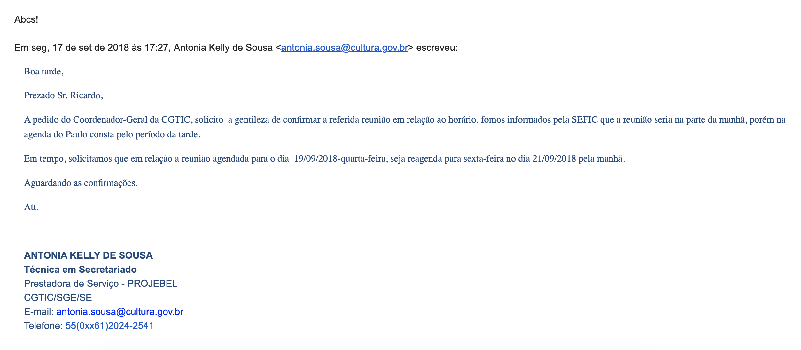

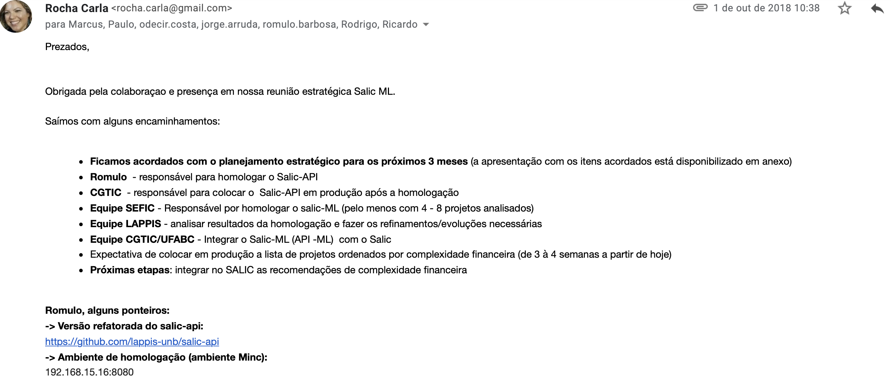

Além dos relatórios de entregas trimestrais que são aprovadas pelo Ministério, a documentação completa dos planejamentos estratégicos e execução desses ciclos estão disponíveis na wiki do projeto [https://github.com/lappis-unb/EcossistemasSWLivre/wiki](https://github.com/lappis-unb/EcossistemasSWLivre/wiki) e em apresentações que serão disponibilizada  nos anexos. Após o planejamento estratégico, cada time trabalha de forma auto-organizada para o planejamento das sprints, priorização das issues, e alocação de recursos. Para título de exemplo, o projeto Tais tem ao total de 30 sprints (milestones) e um total de 387 issues fechadas. Um resumo de como os principais repositórios se organizaram em issues está apresentado na próxima imagem.

4. __Transferência de conhecimento e capacitar a equipe de servidores e técnicos do MinC em práticas de gestão e desenvolvimento de software aberto, colaborativo e contínuo__

**Concluído** - Durante toda a execução do projeto, tivemos a preocupação em manter a documentação técnica atualizada para deixar a comunidade dos projetos desenvolvidas receptivas para novos contribuidores. Além disso, realizamos ao longo do projeto diversos workshops de Devops, chatbots, ML, boas práticas, com a equipe técnica do ministério
treinamentos. Ao amadurecer tecnicamente conhecimento sobre chatbots e a arquitetura da Tais, realizamos diversos webinares que estão disponibilizados no youtube, que abordam diversos aspectos técnicos importantes para a manutenção e evolução da Tais. Participamos também de 2 edições do pydata gravadas no qual apresentamos a visão geral da Tais e do SalicML. Esses materiais estão organizados e disponibilizados de forma que pessoas interessadas em manter e evoluir os projetos desenvolvidos no projeto terão todo o apoio técnico necessário.

**Documentação comprobatória** -  Em anexo ao  presente relatório serão apresentados todos os eventos de capacitação realizados ao longo do projeto.

Alguns exemplos de capacitações realizadas:

*  Entrega Técnica Ciclo trimestral (15/08/2018) e workshop devops - A equipe Técnica do Ministério reuniu com a equipe projeto Ecossistemas para apresentação das entregas realizadas no ciclo trimestral de desenvolvimento e um workhop mão na massa devops.

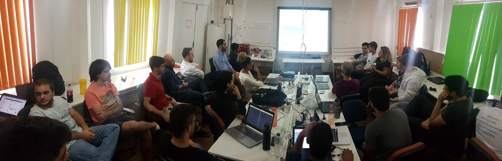

* LabConf (31/08/2018) - LabConf, ou Conferência dos laboratórios de inovação da cultura, foi o evento organizado pelo LAPPIS no Ministério da Cultura para que o arranjo de TED entre Universidade e o Ministério da Cultura pudesse ser discutido. Nesse dia, os demais laboratório (UFG, UFABC, UnB) puderam apresentar os avanços alcançados em seus respectivos projetos, diversos workshops práticos relacionados a DevOps foram ministrados pelos bolsistas do LAPPIS, e mesas rendondas foram realizadas para discutir modelos de contratação.

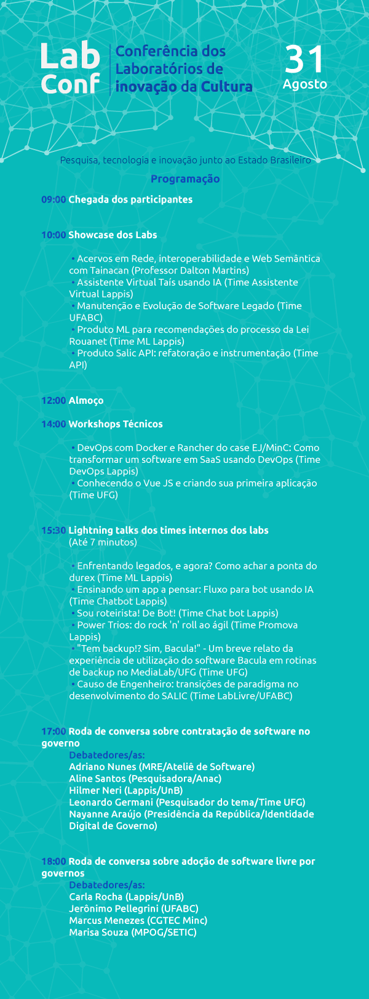

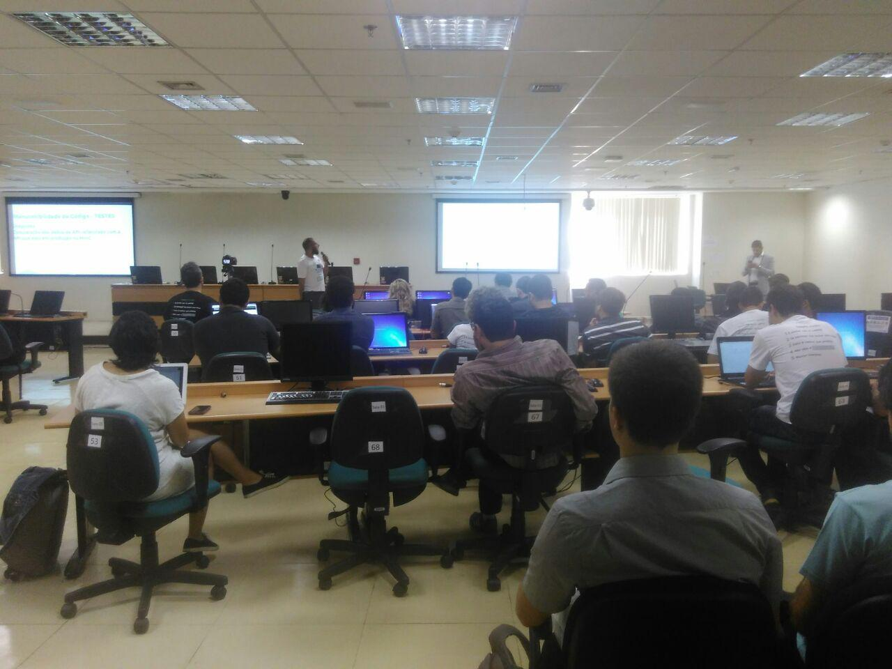

* Webinar - Métricas importantes para chatbots - Autor(es): Guilherme Lacerda e Bruna Pinos
[https://www.youtube.com/watch?v=yqzxZsOa3gg](https://www.youtube.com/watch?v=yqzxZsOa3gg)

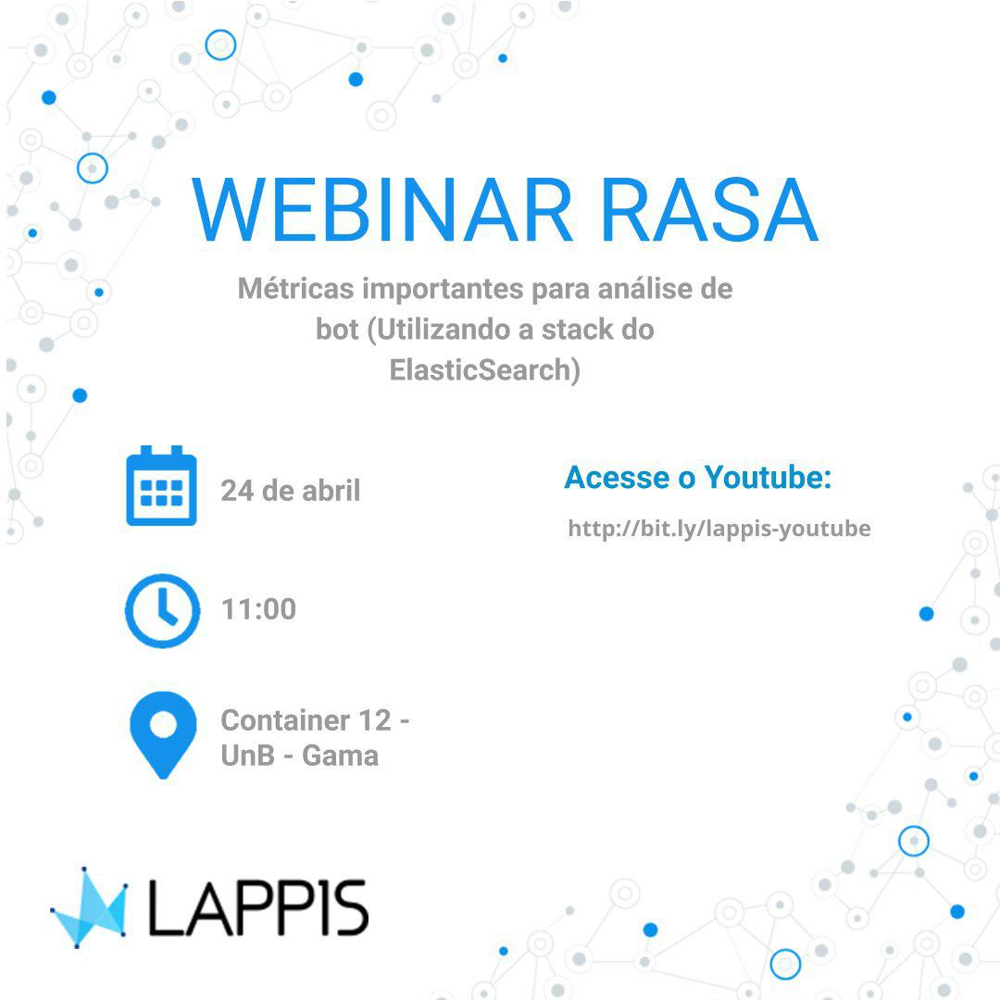

A lista completa de atividades de capacitação realizadas ao longo do projeto estão em anexo. Algumas dessas iniciativas/eventos foram aprovados nos relatórios de entregas parciais:

- Relatório Etapa 2 - [https://github.com/lappis-unb/EcossistemasSWLivre/blob/master/Relatorios/R2/RELATÓRIO%20ETAPA%202.pdf](https://github.com/lappis-unb/EcossistemasSWLivre/blob/master/Relatorios/R2/RELATÓRIO%20ETAPA%202.pdf)

- Relatório Etapa 5 - [https://github.com/lappis-unb/EcossistemasSWLivre/blob/master/Relatorios/R5/RELATÓRIO%20ETAPA%205.pdf](https://github.com/lappis-unb/EcossistemasSWLivre/blob/master/Relatorios/R5/RELATÓRIO%20ETAPA%205.pdf)

- Relatório Etapa 6 - [https://github.com/lappis-unb/EcossistemasSWLivre/blob/master/Relatorios/R6/RELATÓRIO%20ETAPA%206.pdf](https://github.com/lappis-unb/EcossistemasSWLivre/blob/master/Relatorios/R6/RELATÓRIO%20ETAPA%206.pdf)

- Relatório Etapa 7 - [https://github.com/lappis-unb/EcossistemasSWLivre/blob/master/Relatorios/R7/RELATÓRIO%20ETAPA%207.pdf](https://github.com/lappis-unb/EcossistemasSWLivre/blob/master/Relatorios/R7/RELATÓRIO%20ETAPA%207.pdf)

## Pacote de Trabalho: Estudos sobre práticas de gestão colaborativa em comunidades de software aberto

De acordo com o plano de trabalho, "O principal resultado dessa pesquisa será sistematizar e produzir conhecimento sobre as práticas das comunidades de software livre que o Estado participa por adesão e, a partir dos aprendizados com seus arranjos, orientar e capacitar os servidores e técnicos do MinC nas práticas de planejamento, gestão de softwares abertos, aprimorando os mecanismos de governança digital dos softwares presentes no portifólio do MinC".

### Metas Específicas

1. __Estudos de caso sobre comunidades de software livre onde o Estado participa por adesão, com prioridade para os softwares utilizados para a gestão cultural__

**Concluído** -

**Documentação comprobatória** -

2. __Estudos sobre boas práticas para planejamento conjunto de milestones e releases entre as organizações que fazem parte das comunidades__
**Concluído** -

**Documentação comprobatória** -

3. __Estudos sobre boas práticas de comunicação e mobilização no contexto das comunidades onde o Estado participa__

  **Concluído** -

**Documentação comprobatória** -

4. __Participação em eventos e encontros das comunidades de software livre que contribuem para o portifólio mantido pelo MinC__

**Concluído** -

**Documentação comprobatória** -

5. __Estudos sobre arranjos econômicos utilizados pelas comunidades com fins de sustentabilidade de seus comuns de software__

**Concluído** -

**Documentação comprobatória** -

6. __Estudos sobre metodologias e suportes tecnológicos para a gestão colaborativa em comunidades de software livre nas quais o Estado participa por adesão__

**Concluído** -

**Documentação comprobatória** -

## Pacote de Trabalho: Estudo de técnicas de Aprendizado de Máquina para apoiar a fiscalização da Lei Rouanet

De acordo com o plano de trabalho, "O principal objetivo é o estudo de técnicas de Aprendizado de Máquina que possam apoiar o sistema de recomendação e fiscalização da lei Rouanet. Nessa etapa será realizada  uma pesquisa exploratória em técnicas de aprendizado de máquina e processamento de linguagem natural. Tais técnicas e algoritmos serão aplicados para melhorar a experiência de usuário (UX) por meio da proposta de chatbots como interface entre os proponentes na lei Rouanet e o Ministério da Cultura".

###  Metas específicas

1. __Realizar estudos e propor técnicas de processamento de linguagem natural, aprendizado supervisionado e o desenvolvimento de chatbots para interagir com proponentes da Lei Rouanet__

**Concluído** -  Principal pesquisa do projeto TAIS. Durante o projeto foram testados diversos frameworks de chatbots, dentre eles o *hubot natural*, *botpress*, e *rasa*. O objetivo era pesquisar os algoritmos, dados de treinamento e performance de algoritmos de processamento de linguagem natural em português. Pela novidade da tecnologia, e das ferramentas, existia poucos ou nenhum experimento executado em português.

Após diversos experimentos, testes (a primeira versão da Tais utilizamos o *hubot natural* com o classificador Support Vector Machine), escolhemos o Rasa, pois além de crescente comunidade, possuia a vantagem de trazer a possibilidade de customizar o pipeline de processamento e algoritmos. Além disso, já estava implementado algoritmos modernos de processmanto de linguagem natural, tais como *Embeddings*, *LSTM*, entre outros.

Testamos diversas técnicas de  classificadores de intenção do usuário: Support Vector Machine (SVM), Embeddings. Após diversos experimentos observamos que o embeddings classificava melhor com poucos dados de treinamento, que é o caso do chatbot em português que tem poucos ddos para treinamento. Além de testes de algoritmos de *Natural Language Processing* (NLU), um chatbot tem que prever a ação mais adequadava a partir da intenção do usuário e o contexto da conversa. Com isso, tem-se uma segunda etapa de processamento de chatbots que é a gestão de conversa. Nessa etapa, testamos duas formas de fazer a gestão de conversa: a partir de um fluxo de conversa (árvore de decisão), ou utilizando redes neurais preditivas (LSTMs). O primeiro caso se mostrou muito limitado, pois impões a estrutura burocrática do órgão para o usuário, e obriga o chatbot a controlar a conversa para garantir a boa experiência do usuáio. Mas testes em uso mostraram que esse tipo de diálogo é não natural e, mesmo o chatbot tendo o contexto e sabendo responder a  determinadas perguntas, deixa a experiência para o usuário de muitos erros na interação. Já a abordagem utilizando redes neurais demanda mais conhecimento técnico do time de projeto, mais dados de treinamento, mas traz o benefício de permitir o usuário conduzir a conversa com o chatbot e tivemos mais feedbacks positivos dos nossos testes em uso.

**Documentação comprobatória** -
Todos os experimentos conduzidos foram documentados e os resultados disponibilizaos na wiki do repositório do projeto Tais.

Após a etapa de experimento, implementamos a chatbot TAIS. Até o final do projeto, todo o conteúdo demandado pela SEFIC foi inserido no bot, e também foi feito uma curadoria orientado a dados. Como parte da arquitetura da Tais é um BI com os dados, métricas e indicadores sobre o comportamento dos usuários, utilizamos esses dados para melhorar de forma contínua novos conteúdos.

Os dados gerais sobre o projeto da Tais são detalhados

- Total de intenções:

- Total de utters:

- [Relatório Etapa 1](https://github.com/lappis-unb/EcossistemasSWLivre/blob/master/Relatorios/R1/RELATÓRIO%20ETAPA%201.pdf)

- [Relatório Etapa 2](https://github.com/lappis-unb/EcossistemasSWLivre/blob/master/Relatorios/R2/RELATÓRIO%20ETAPA%202.pdf)

- [Relatório Etapa 3](https://github.com/lappis-unb/EcossistemasSWLivre/blob/master/Relatorios/R3/RELATÓRIO%20ETAPA%203.md)

- [Relatório Etapa 4](https://github.com/lappis-unb/EcossistemasSWLivre/blob/master/Relatorios/R4/RELATÓRIO%20ETAPA%204.pdf)

- [Relatório Etapa 6](https://github.com/lappis-unb/EcossistemasSWLivre/blob/master/Relatorios/R6/RELATÓRIO%20ETAPA%206.pdf)

- [Relatório Etapa 7](https://github.com/lappis-unb/EcossistemasSWLivre/blob/master/Relatorios/R7/RELATÓRIO%20ETAPA%207.pdf)

2. __Realizar estudos e propor técnicas de aprendizado supervisionado e detecção de anomalias para automatizar as trilhas de auditoria na fase de aprovação e prestação de contas__
3. __Realizar estudos e propor técnicas de reconhecimento de padrão e Inteligência de Negócio para análise dos projetos submetidos via Lei Rouanet__

**Concluídos** - As metas 2 e 3 foram concluídas no âmbito do projeto Salic-ml. O salic-ml é um projeto aberto que utiliza data science e inteligência artificial para apoiar o acompanhamento e prestação de contas de projetos culturais viabilizados pela Lei Rouanet (Lei Brasileira de fomento e incentivo à cultura) e acompanhados pelo sistema Salic.

O projeto se iniciou em março de 2018, em uma parceria entre o LAPPIS e o Ministério da Cidadania (MinC). A primeira fase do projeto teve foco no levantamento do ciclo de vida de projetos culturais e em seus principais pontos de melhoria. Em julho de 2018 foi iniciada a Fase 2 do projeto, quando foram definidas as primeiras metas e entregas de curto e médio prazo. A principal motivação desse projeto é auxiliar o ministério a lidar com 17 mil projetos que já foram executados mas ainda aguardam avaliação (passivos), como mostrado na figura abaixo.

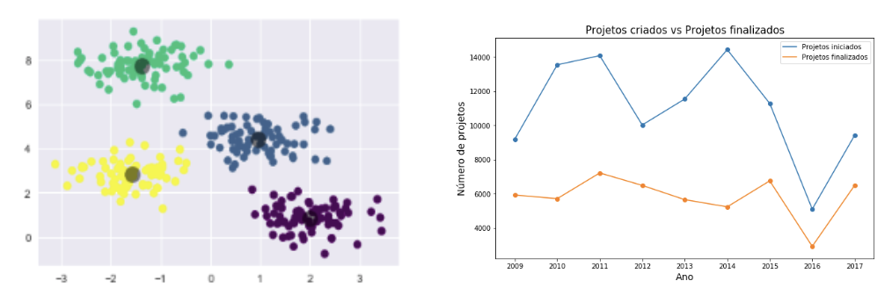

Serão apresentados detalhes de pesquisa, planejamento e guias de contribuição. Discussões e principais ideias podem ser encontradas na seção Issues; e detalhes sobre os resultados e datasets utilizados estão no github do projeto.

Foram desenvolvidos duas grandes funcionalidades para o Salic-ml:

- Sistema de informações de projetos na etapa de análise de resultados: criação de indicadores de complexidade e qualidade de projetos culturais, relação de projetos mais similares e relação de comprovantes mais críticos e suspeitos;

- Sistema de recomendações de projetos durante as fases de admissão e execução: sugestões de modificação da planilha orçamentária e sugestões de acompanhamento do projeto.

**Documentação comprobatória** - As entregas foram divididas em sprints de duas semanas e a frente se organizou em três equipes:

- Time de pesquisa e geração: responsável pelo estudo dos dados do Salic e geração de métricas e indicadores que possam ajudar os técnicos da Sefic (Secretaria de Fomento e Incentivo à Cultura) a analisar projetos culturais, por exemplo: métricas de nível de complexidade de projetos culturais, semelhança entre projetos culturais, entre outras. Repositório da equipe: salic-ml
- Time de disponibilização de dados: responsável por disponibilizar as métricas e indicadores gerados pelo time de pesquisa e extração para que os mesmos possam ser utilizados de alguma forma na plataforma Salic ou em algum outro sistema de interesse. Repositório da equipe: salic-ml-web
- Time de DataViz: responsável pela integração das métricas e indicadores gerados na plataforma Salic. Repositório da equipe: salic-ml-web

Essa configuração de equipe foi baseada em projetos de data science e machine learning de referência.

Todas as sprints contam com uma reunião inicial de planejamento com duração de aproximadamente 3 horas, reuniões não formais ao longo do período de desenvolvimento (conforme a necessidade) e, ao final, uma reunião de revisão e retrospectiva. As reuniões inicial e final são realizadas, idealmente, com todos os membros dos três times da frente.

Como todo o produto será software livre e disponibilizado na plataforma GitHub, o grupo decidiu por utilizar o GitHub com a extensão ZenHub para gerenciar o backlog de tarefas.

Ao início de cada entrega, as tarefas de todas as equipes são cadastradas no repositório salic-ml do GitHub como issues e adicionadas à milestone referente àquela entrega. À cada entrega é dado o nome de uma ponte famosa (Golden Bridge, JK Bridge, entre outras) para facilitar a associação da mesma às suas tarefas.

Todas as issues são adicionadas também ao board "Backlog" do ZenHub. Durante a reunião de planejamento, as tarefas da sprint são priorizadas, atribuídas aos membros do time e movidas para a aba "Sprint Backlog". Durante a sprint, as issues em andamento são movidas para a aba "Doing". Após finalizadas, é aberto um pull request e, assim que ele é revisado e aprovado, a issue é movida para a aba "Done". Durante a reunião de revisão e retrospectiva, as issues finalizadas são movidas para a aba "Closed", o que encerra o ciclo de vida de uma tarefa.

Todas as tarefas devem ter critérios de aceitação bem definidos em sua descrição. É comum para todas as tarefas que a documentação e a criação de testes automatizados sejam escritos como critério de aceitação.

Por fim, aqui na Wiki são documentadas todas as reuniões da frente e eventuais estudos sobre temas relacionados ao projeto.

A primeira etapa do projeto tiveram os seguintes objetivos:
-  Entender o ciclo de vida de projetos culturais
- Entender o ciclo de trabalho da Sefic
- Identificar gargalos no processo
- Apresentar oportunidades de melhorias para o Salic
- Definir roadmap para o projeto

A segunda etapa do projeto tiveram os seguintes objetivos:

- Indicadores de complexidade e qualidade de projetos culturais
- Relação de similaridade entre projetos
- Sistema de recomendações de projetos na etapa de Análise de Resultados
- Sistema de recomendações de projetos nas etapas de Admissão e Execução

Quanto à complexidade de projetos culturais, foram levantados junto à equipe técnica da SEFIC como eles identificam o um projeto simples e um projeto complexo a ser analisado. O objetivo é ranquear os projetos de acordo com a métrica de complexidade, a fim de orientar a equipe técnica na priorização da análise dos projetos, assim como em como delegar os projetos. Nas Figuras abaixos apresentamos a evolução do projeto, desde as primeiras métricas, validadas e evoluidas a partir do feedback da equipe técnica do ministério.

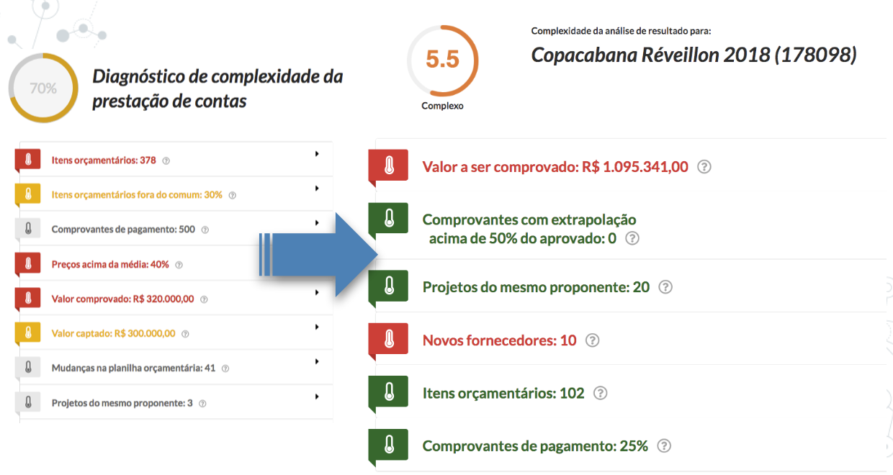

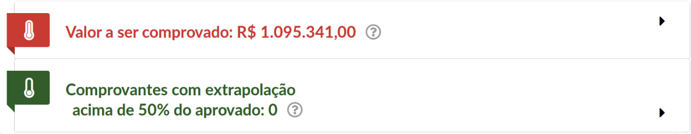

Além de evoluir questões relacionadas a área de negócio, também criamos um sistema de recomendação para etapa de admissibilidade. No qual, a partir do segmento do proponente e da planilha orçamentária submetida, recomendamos a inserção/retirada de itens orçamentários a partir da análise dos dados das planilhas orçamentárias de projetos já executados. A figura abaixo ilustra o exemplo de recomendação.

Para chegar as métricas mostradas, detecção de outliers, e sistemas de recomendação, definimos o seguinte processo. A partir das hipóteses levantandas a partir de reuniões com a equipe técnica do ministério e análise do banco de dados dos projetos submetidos via salic, a equipe de pesquisa formulava a hipótese de melhoria. Um exemplo de hipótese é

*Realizar estudo comparativo entre diversos modelos de detecção de outlier no contexto da métrica "Razão entre o número de itens com comprovante e o número de itens por projeto".*

**Tarefas**

- [x] Estudo de técnicas de detecção de outlier, verificando a viabilidade de cada técnica para o contexto
- [x] Detalhar resultados encontrados
- [x] Comparar resultados dos diversos modelos

**Critérios de aceitação**

- [x] Notebook disponível da `master` comparando diversos modelos de detecção de outlier
- [x] Conclusão de qual método é melhor

Essas hipóteses eram desenvolvidas em  jupyter notebooks. Mais de 40 notebooks (entre versões e hipoteses) foram desenvolvidos ao longo do projeto. Nessa etapa, os dados eram extraídos do banco de dados, realizados pré processamentos para condicionar esses dados, o processamento, e análise dos resultados. A imagem abaixo mostra um trecho de como esses notebooks eram desenvolvidos/documentados.

Os resultados eram compartilhados com o time completo. Sendo válidos os resultados e a hipótese, passavamos para etapa de implementar na API do salic ML a funcionalidade. Uma vez implementada, construimos uma visualização para validar as hipóteses com a equipe técnica do ministério.

A entrega dessas meta é então uma API que calcula as seguintes métricas de complexidade de projetos Culturais:

- Valor comprovado
- Comprovantes com extrapolação de 50%
- Projetos do mesmo proponente
- Novos fornecedores
- Itens orçamentários
- Comprovantes de pagamentos
- Recomendação de itens orçamentários
- Ranking dos projetos de acordo com a complexidade

O acompanhamento dessas entregas estão disponíveis nos reguintes relatórios de acompanhamento:

- [Relatório Etapa 2](https://github.com/lappis-unb/EcossistemasSWLivre/blob/master/Relatorios/R2/RELATÓRIO%20ETAPA%202.pdf)

- [Relatório Etapa 3](https://github.com/lappis-unb/EcossistemasSWLivre/blob/master/Relatorios/R3/RELATÓRIO%20ETAPA%203.md)

- [Relatório Etapa 4](https://github.com/lappis-unb/EcossistemasSWLivre/blob/master/Relatorios/R4/RELATÓRIO%20ETAPA%204.pdf)

4. __Realizar estudos e compartilhar resultados sobre inovação DevOps e melhores práticas no contexto de integração e deploy contínuos__

**Concluído** - Em algumas frentes, buscou-se cultuar a cultura DevOps para otimizar a entrega de valor no produto de software. Como fator comum na maioria dos casos, temos o uso de gerência de configuração utilizando:
- Docker
- Docker-Compose
- Makefiles
- _scripts_ em outras linguagens (principalmente Shell Script e Python)

Em relação aos ambientes de deploy, houve sucesso na experimentação das seguintes abordagens:
- Uso de máquina virtual disponibilizada pelo Ministério
- Uso de máquina virtual em plataformas de cloud (Google Cloud e Digital Ocean)
- Uso de máquina virtual na infraestrutura do LAPPIS
- Orquestração de contâineres com Rancher 1.6 (Rancher Cattle) na infraestrutura do LAPPIS
- Orquestração de contâineres com Rancher 2.0 (Kubernetes) na infraestrutura do LAPPIS

Apesar dos diversos ambientes mencionados, todos possuiam um orquestrador Docker instalado (Docker Compose, Rancher Cattle ou Kubernetes), padronizando e abstraindo toda a configuração necessária para o desenvolvedor. Além das ferramentas, o processo de _deploy_ em diferentes ambientes agregou nas documentações de instalação dos serviços, uma vez que estas eram realimentados com eventuais peculiaridades observadas durante a instalação e disponibilização.

Além da disponibilização, houve preocupação com o aspecto da entrega contínua, utilizando integração e deploy contínuos (CI e CD, respectivamente). Como plataforma de CI, foi utilizado o GitLabCI pelos seguintes motivos:
- Plataforma feita em código aberto
- Possibilidade de se instanciar um Runner em infraestrutura externa para auxiliar no _pipeline_
- Integrável ao GitHub e GitLab
- Comunidade ativa compartilhando experiências e dando suporte
- Experiência prévia de alguns membros do laboratório

Também houve a experimentação do Jenkins integrado ao Rancher 2.0. Todas as configurações de cada frente estão disponíveis em arquivos `.gitlab-ci.yml` localizados na raíz de cada repositório que fez uso da tecnologia. Os avanços feitos nesta tecnologia incluem:
- Otimização de pipeline
  - Reaproveitamento de imagens Docker entre os _jobs_ do _pipeline_ para reduzir a duração do processo
  - Uso de imagem Docker separada para as dependências das aplicações para permitir sua construção apenas quando necessário, também reduzindo duração do processo
  - Uso de _job image_ customizada para permitir o _deploy_ em instâncias do Rancher 1.6 sem o uso de requisições explícitas para a API
- Deploy multiplataforma
  - Definição de _stage_ contendo deploy para diferentes ambientes em um mesmo _pipeline_
- Disponibilização de imagens Docker em múltiplos _registries_
  - DockerHub
  - GitLabCI Registry
  - Rancher Registry

Alguns resultados e lições aprendidas foram apresentados e discutidos pelos alunos de graduação nos Workshops organizados pelo laboratório e em eventos abertos a comunidade.

**Documentação comprobatória** -
- [Configuração GitLabCI SALIC-ML](https://github.com/lappis-unb/salic-ml/blob/master/.gitlab-ci.yml)
- [Configuração GitLabCI Tais (com reaproveitamento de _build_ entre _stages_)](https://github.com/lappis-unb/tais/blob/master/.gitlab-ci.yml)
- [Apresentação sobre otimização de _pipeline_ no Workshop realizado na ENAP em 27/09/2019](https://github.com/lappis-unb/EcossistemasSWLivre/blob/master/Workshop/Apresentacao/DevOps/PipelineTais_TrilhaDevOps.pdf)
- [Apresentação sobre deploy da Tais no Workshop realizado na ENAP em 27/09/2019](https://github.com/lappis-unb/EcossistemasSWLivre/blob/master/Workshop/Apresentacao/DevOps/deploy%20de%20bots.pdf)
- [Apresentação sobre construção de _pipeline_ de entrega no SALIC-ML (17º PyData Brasília)](https://www.youtube.com/watch?v=CuRs9XpwGE0&feature=youtu.be)
- [Configuração Rancher Pipeline BotFlow](https://github.com/lappis-unb/BotFlow/blob/master/.rancher-pipeline.yml)
- [Configuração Rancher Pipeline BotFlowAPI](https://github.com/lappis-unb/BotFlowAPI/blob/master/.rancher-pipeline.yml)
- [DockerHub do laboratório com todas as imagens publicadas nos _pipelines_](https://hub.docker.com/u/lappis)

## Pacote de Trabalho: Visualização de dados e criação de Dashboards

De acordo com o plano de trabalho, "O tema deste estudo é buscar formas visuais de apresentar os dados obtidos e
processados nas etapas anteriores. Os gráficos produzidos servem de embasamentotanto para análise por parte da equipe do projeto quanto pelos gestores do próprio ministério.""

### Metas específicas

1. __Painéis com estatísticas sobre projetos cadastrados no Salic__

**Concluído** - Inicialmente, o objetivo desta meta era gerar visualizações com base nos dados disponíveis no portal VerSalic. A equipe fez uma análise extensa tanto desse portal quanto de todo o processo da Lei de Incentivo. Em seguida, aplicou-se uma versão modificada da técnica de Design Sprint para geração de ideias de visualização. A dedicação dos bolsistas e apreço pelo tema, foi tamanha que resolveram batizar o grupo de trabalho de “Promova Cultura”.

Foram geradas 18 ideias, possibilidades de visualização divididas em dois grupos chamados de “Panorama da cultura” e “Visualização de projetos”. Destas 18, foram escolhidas 5 considerando tanto o potencial de benefício quanto viabilidade técnica. Estas 5 ideias foram prototipadas sob a forma de painéis interativos on-line. Para isso, foi adotada a tecnologia VueJS para o front-end, tecnologia essa usada pela equipe do SALIC. Além disso, a maioria dos painéis acessava dados reais via a versão refatorada da Salic-API.

Dentre os painéis prototipados, ressalta-se o de “Mapa de Calor”, que demonstra a distribuição de projetos de incentivo, incentivadores e valores incentivados pelo território nacional. O painel confirmou suspeitas conhecidas, como a concentração de incentivadores no eixo Rio-São Paulo, mas também surpreendeu ao revelar projetos no Acre sendo fortemente incentivados pela região Nordeste. O painel de “Deslocamentos" é bastante relevante pois mostra claramente o deslocamento de projetos pelo país e também trás algumas interpretações inusitadas. Por exemplo, pouquíssimos projetos circula entre o RS e SC, mesmo com a proximidade geográfica entre os estados. Cabe indicar que as visualizações prototipadas são todas responsivas, funcionando tanto em versão desktop quanto mobile.

Os painéis foram combinados em uma biblioteca de visualizações e o resultado amplamente documento no Relatório de Acompanhamento 04. Sendo este apresentado e aprovado para os gestores do projeto. Aliás, foi durante a reunião de apresentação deste relatório, em 21/09/2018, que a equipe gestora de uma das áreas finalísticas do então Ministério da Cultura, solicitou a coordenação do projeto que o desenvolvimento dos painéis não fossem avançado e que a equipe fosse alocada para a refatoração completa do Portal Comparar, um portal de dados mais antigo do Ministério.

O pedido foi acatado pela coordenação do projeto, na medida que não ferisse o escopo e as metas dos projeto. Procedeu-se uma análise aprofundada de compatibilidade tecnológica e disponibilidade dos dados. O resultado dessa análise indicou que a refatoração completa seria inviável, já que dos 105 relatórios disponíveis no Portal Comparar, apenas 4 tinham dados compatíveis com o que era disponibilizado na SALIC-API. Além disso, uma refatoração completa necessitaria de uma mudança de base tecnológica que fugiria tanto das competências disponíveis na equipe, quanto da essência deste projeto.

Isso foi comunicado aos gestores do projeto e, no final de dezembro 2018, acordou-se uma tentativa de converter o relatório “Captação de recurso por UF - desde 1992” em uma visualização baseada no “Mapa de Calor”. A equipe então realizou essa adaptação e conversão, adicionando aí a exportação dos dados em formato tabular. O resultado foi uma visualização com o mesmo nome do relatório original, disponível também na biblioteca de visualizações, junto com os outros painéis.

Todos os resultados desta segunda empreitada, foram documentados no Relatório de acompanhamento 05 e aprovados pela equipe gestora de transição para o Ministério da Cidadania. Nesta mesma oportunidade, foi acordado que o custo de avançar com a adaptação do Portal Comparar seria muito grande para o projeto. Sendo assim, por decisão da CGTI, essa iniciativa foi dada como finalizada e concluída, ainda no Relatório de acompanhamento 05. A equipe “Promova Cultura”, em seguida, foi realocada para outras frentes, a saber: SALIC-ML, dashboard de BI da Tais e BotFlow.

**Documentação comprobatória** -

- [Repositório do “Promova Cultura”](https://github.com/lappis-unb/PromovaCultura/)
- [Técnica de Design Sprint - Ideias de “Panorama da cultura”](https://github.com/lappis-unb/PromovaCultura/wiki/Design-Sprints-Panorama)
- [Técnica de Design Sprint - Ideias de “Visualização de projetos”](https://github.com/lappis-unb/PromovaCultura/wiki/Design-Sprints-Visualizacao)
- [Repositório da API dos protótipos do “Promova Cultura”](https://github.com/lappis-unb/PromovaCultura/)
- [Biblioteca de painéis prototipados](https://lappis-unb.github.io/PromovaCultura/)
- Visualizações: 
- [Relatório de Acompanhamento 4](https://github.com/lappis-unb/EcossistemasSWLivre/tree/master/Relatorios/R4)
- [Portal Comparar](http://sistemas.cultura.gov.br/comparar/salicnet/salicnet.php)
- [Planilha de comparação dos dados necessários no portal Comparar contra os dados disponíveis na SALIC-API](https://docs.google.com/spreadsheets/d/1HjrNITQ8EGYVrMCxTMUh14Ogyaxum5WVYP4jVDwki4o/edit#gid=1949184657)
- [Relatório “Captação de recurso por UF - desde 1992”](http://sistemas.cultura.gov.br/comparar/grid_Proponente_Captacao_UF/grid_Proponente_Captacao_UF.php)
- [Relatório de Acompanhamento 5](https://github.com/lappis-unb/EcossistemasSWLivre/tree/master/Relatorios/R5)

 2. __Estudos sobre a apresentação visual de resultados de algoritmos de aprendizado de máquina e análises estatísticas__

 **Concluído** - Esse estudo foi realizado no contexto do projeto da Tais. Foi acoplado a arquitetura a stack elastic/Kibana para a mineração dos dados de conversa entre a Tais e o usuário. A partir dos dados em uso, foram projetados dashboards com métricas de uso, comportamento, e de negócio. Ao total, foram propostos 9 graficos de negócio, 5 de compartamento do usuário, e 4 de uso/técnico. Essas métricas foram validadas e evoluidas. Ao final do projeto, utilizamos esses dashboards para melhorar o desempenho da Tais, acrescentar novos conhecimentos a sua base de treinamento. Também conseguimos prever tendências e conteúdos mais pesquisados pelo usuário.

TODO: Imagem do gráfico do dashboard da Tais

**Documentação comprobatória** - Através de uma demanda combinada com o antigo Ministério da Cultura, atual Secretaria Especial da Cultura do Ministério da Cidadania, foi criada uma equipe para atuar no campo de pesquisa e desenvolvimento na área de *business intelligence* (BI). Frente de trabalho responsável por elaborar visualizações dos dados provenientes da interação dos usuários com a Tais.

Por ser uma nova área de atuação dentro do LAPPIS, a equipe começou pesquisando sobre quais métricas são relevantes coletar a partir da interação do *usuário vs Tais*, fornecendo dados tanto para equipe de desenvolvimento do *chatbot*, facilitando na manutenção e evolução da Tais, e gerando dados para a equipe de negócios, comprovando os objetivos da implementação do projeto.

Após a pesquisa sobre as métricas, um estudo teve que ser realizado sobre quais tecnologias seriam utilizadas para armazenar e elaborar as visualizações propostas, seguindo a cultura do laboratório de utilização de *software*. Foi então selecionado o *ElasticSearch*, como sendo a ferramenta de armazenamento de dados, que também trabalha com buscas em tempo real e faz o armazenamento em cache das pesquisas já realizadas. Para consumir os dados armazenados no Elastic e tratá-los para disponbilizar em formato de visualizações, foi utilizado o *Kibana*, um dos componentes da *ElasticStack*. Essa ferramenta fornece recursos para elaboração de dashboards e visualizações.

Subsequente a escolha das tecnologias, a equipe atuou na implementação de todas as visualizações propostas. Foram dividas em dois grupos, métricas de desenvolvimento e de negócio, sendo disponibilizadas respectivamente em dois *dashboards* distintos, *Paloma's* e *Perfil de Usuário*.

Com a finalização da etapa de implementação, foi automatizado o processo de importação dos *dashboards* contendo as visualizações a partir de um único comando, evitando um retrabalho e garantindo uma entrega de excelência.

As entregas estão documentadas nos relatórios de entrega e em alguns estudos apresentados abaixo:

- [Estudo sobre métricas](https://github.com/lappis-unb/tais/wiki/Estudo-sobre-metricas-para-bots)

- [Automação do processo de importação](https://github.com/lappis-unb/rasa-ptbr-boilerplate/blob/master/analytics/import_dashboards.py)

- [Stack do Elastic/Kibana](https://github.com/lappis-unb/tais/blob/master/README.md)

- [Relatório Etapa 5](https://github.com/lappis-unb/EcossistemasSWLivre/blob/master/Relatorios/R5/RELATÓRIO%20ETAPA%205.pdf)

- [Relatório Etapa 6](https://github.com/lappis-unb/EcossistemasSWLivre/blob/master/Relatorios/R6/RELATÓRIO%20ETAPA%206.pdf)

- [Relatório Etapa 7](https://github.com/lappis-unb/EcossistemasSWLivre/blob/master/Relatorios/R7/RELATÓRIO%20ETAPA%207.pdf)

 3. __Dashboard  para a visualização e análise das relações entre proponentes e financiadores por meio de grafos__

 **Concluído** - A parte da equipe do “Promova Cultura” que foi realocada para o SALIC-ML, conforme relatado na meta 1 deste pacote de trabalho, se juntou aos esforços de estudo das relações entre proponentes e incentivadores por meio de grafos. O assunto é bastante complexo pois os mesmos atores podem assumir papéis distintos em projetos diferentes. Por exemplo, uma incentivadora de um projeto, pode ser proponente de um outro projeto e, ao mesmo tempo, ser fornecedora para este mesmo projeto. Além disso, existe circularidade, onde é necessário desmembrar pessoas jurídicas em seus sócios componentes para aí sim, analisar a relação entre eles.

Com base nas análises preliminares dos dados e nas explorações computacionais, foram geradas propostas de visualização, documentadas as issues 312 e 326 do repositório. Em, 02/04/2019 a equipe recebeu a visita de um especialista da CGEE que fez uma jornada de treinamento e co-trabalho, apontando vários pontos que precisavam ser revistos e aprofundados. Dada essa perspectiva e a necessidade de aprofundamento do relatório de complexidade de análise financeira dos projetos, o tópico principal do SALIC-ML, a equipe foi realocada para garantir a qualidade do relatório de complexidade.

Cabe frisar que os estudos computacionais de caráter exploratório foram 100% documentados em Jupyter notebooks (em anexo), apresentando os cálculos em associação a visualizações científicas e explicitando as relações entre proponentes e financiadores por meio de grafos. O que cumpre plenamente esta meta.

O material produzido, todos os estudos e esboços de visualização, foram apresentados como parte do Relatório de Acompanhamento 6 e aprovado pelos gestores.

**Documentação comprobatória** -

- [Repositório do “SALIC-ML”](https://github.com/lappis-unb/salic-ml/)
- Exemplos de estudos de grafos:

   
- [Issue 312](https://github.com/lappis-unb/salic-ml/issues/312)
- [Issue 326](https://github.com/lappis-unb/salic-ml/issues/326)
- [Relatório de Acompanhamento 6](https://github.com/lappis-unb/EcossistemasSWLivre/blob/master/Relatorios/R6/)

## Pacote de Trabalho: Estudos dos processos técnicos e gerenciais MinC para aferição e aceitação de produtos de software

De acordo com o plano de trabalho, "O objetivo geral desta frente de pesquisa é auxiliar os times de desenvolvimento e gestores de TI do MinC a aprimorarem sua capacidade em tomar decisões acerca  da qualidade das versões dos produtos de software entregues por seus fornecedores.

Esse pacote de trabalho teve seu cronograma alterado e escopo limitado. Tais mudanças foram registradas no relatório X de acompanhamento, e devidamente aprovados pelo ministério e universidade.

### Metas específicas

1. __Experimentação contínua aplicada a engenharia de produto de software__

 **Concluído** - Durante todo o projeto foi abordado a experimentação contínua, no qual passavamos continuamento por três etapas: (1) levantamento de hipoteses para solucionar um problema, (2) teste de parte da solução para validar a hipótese, (3) validação da hipótese, (4) implementação da solução no produto final. Além disso, trabalhamos com times full-stack e orientados a produto, a fim de ter uma qualidade alta do produto entregue. Com isso, para cada pacote de trabalho, tinha-se um time composto por alunos de Engenharia de Software, Designers, Alunos de letras, e profissionais plenos e seniores para gerir os riscos de projeto.

Experimentação contínua fundamenta-se na formulação de hipóteses a respeito de
comportamento dos usuários do sistema, na verificação dessas hipóteses através
da coleta automatizada de métricas para guiar a execução de experimentos
controlados realizados contínuamente, resultando em incrementos no produto de
software entregues automaticamente num ciclo contínuo de experimentação.

Um pipeline de experimentação contínua requer: (a) Integração contínua, (b)
Entrega contínua e (c) Deploy contínuo. Neste ambiente diferentes versões do
produto de software são expostos a diferentes grupos de usuários, selecionados
aleatoriamente. Hipóteses são testadas para cada grupo e para cada versão, então
decide-se qual será eleita e entregue a toda a base de usuários.

Assim, temos que o primeiro passo no planejamento de experimentação contínua é
a definição de hipóteses a respeito do comportamento dos usuários, essas
hipóteses devem ser formuladas sempre com objetivo em mente de serem úteis na
tomada de decisão sobre evolução e melhoria do produto de software, a partir
das hipóteses métricas serão definidas, deve-se eleger métricas que suportem e
promovam conjunto de dados suficiente para realizar testes das hipóteses
definidas.

Uma vez tendo planejado e implementado a infreestrutura necessária, um
experimento se inicia logo após o deploy de um novo código, contendo novas
features ou alterações em features existentes, experimentos geralmente tomam
tempo de 1 semana ou mais para coleta de dados, o grupo de usuários
participantes do experimento cresce ao longo do tempo, o tempo mínimo de 1
semana para execução de um experimento se justifica pois usualmente os usuários
se comportam de maneira diferente a depender do
dia da semana, assim ao longo de 1 semana é possível coletar as diversas
variações de comportamento.

Em termos práticos costuma-se utilizar diversas ferramentas num ambiente de
experimentação contínua, desde ferramentas para automatização de
infra-estrutura como Docker, Kubernetes e outros em nível de orquestração,
chegando a soluções específicas para guiar experimentos, coletar métricas e
automatizar análise de dados, neste sentido a ferramenta PlanOut desenvolvida
pelo Facebook é o padrão "de facto" utilizado por grandes empresas como Google,
Microsoft e o próprio Facebook.

O PlanOut fornece uma linguagem específica de domínio (DSL) para descrever em
nível de código habilitar e desabilitar certas funcionalidades, como por
exemplo exibir uma feature para parte dos usuários e não exibir essa mesma
feature para outra parte ou grupo de usuários, essa linguagem é integrada em
diversas linguagens de programação, sendo possível realizar experimentos em
produtos escritos em Python, PHP, Ruby, Javascript, entre outras.

**Documentação comprobatória** -

- [Relatório Etapa 3](https://github.com/lappis-unb/EcossistemasSWLivre/blob/master/Relatorios/R3/RELATÓRIO%20ETAPA%203.md)

- [Relatório Etapa 4](https://github.com/lappis-unb/EcossistemasSWLivre/blob/master/Relatorios/R4/RELATÓRIO%20ETAPA%204.pdf)

- [MeasureSoftGram: A Future Vision of Software Product Quality](anexos/ESEM%202018%20-%20PAPER%20229%20-%20camera_ready%20-%20final.pdf)

2. __A mineração em repositórios de software e a análise científica de dados do software__

 **Concluído** - O principal objetivo dessa meta é identificar métricas de repositórios de projetos de software que auxilie a compreender a qualidade do produto de software. O que se procurar com essas métricas de produtividade da equipe, volume de trabalho entregue, boas práticas de engenharia de software.

Com o intuito de compreender a dinâmica de desenvolvimento e a qualidade de cada uma das soluções de software desenvolvidas durante o período do projeto, foi realizada uma análise das métricas dos repositórios onde estão hospedados os códigos fonte e as respectivas documentações.

É importante ressaltar o fato de todos os softwares terem sido desenvolvidos como softwares livres sob a licença recíproca total *GNU General Public License* versão *3*, o que permite acesso público à todo o código bem como todos os direitos intrínsicos ao software livre.  Porém, as análises feitas podem ser replicadas e reaproveitadas em outros contextos e outros projetos que possuem essas informações disponibilizadas. Vale ressaltar que algumas métricas podem ser diferentes ao longo do relatório uma vez que para cada análise, os dados foram minerados em instantes diferentes do projeto.

Estão contemplados nesta análise 8 repositórios, sendo eles:

1. **Tais:** A Tais (Tecnologia de Aprendizado Interativo do Salic) é um chatbot desenvolvido para o projeto da Lei Rouanet com o objetivo de ajudar os proponentes nos momentos de dúvida. A Tais é baseada no framework Rasa. Disponível em: https://github.com/lappis-unb/tais.
2. **Rasa-ptbr-Boilerplate:**  Projeto feito com a tecnologia  Rasa incluindo as configurações iniciais necessárias para a construção de um projeto chatbot. Disponível em: https://github.com/lappis-unb/rasa-ptbr-boilerplate.
3. **BotFlow:** O BotFlow é uma plataforma criada para facilitar a criação e edição de conteúdos para o desenvolvimento de ChatBots que utilizam o framework Rasa. Neste repositório estão os códigos referentes à camada de visualização (*Front-end*). Disponível em: https://github.com/lappis-unb/BotFlow.
4. **BotFlowAPI:** O BotFlowAPI é a API baseada no protocolo REST para permitir o funcionamento do BotFlow. Disponível em: https://github.com/lappis-unb/BotFlowAPI.
5. **Promova Cultura:** O PromovaCultura tem como objetivo principal desenvolver visualizações de dados sobre a Lei Federal de Incentivo à Cultura. Disponível em: https://github.com/lappis-unb/PromovaCultura.
6. **SalicML:** Módulo para análise dos dados do Salic por meio de algoritmos de aprendizagem de máquina . Disponível em: https://github.com/lappis-unb/salic-ml.
7. **SalicAPI:** API aberta para o sistema SALIC. Tem por objetivo expor os dados de projetos da lei Rouanet. Disponível em: https://github.com/lappis-unb/salic-api.
8. **SailcMLFrontEnd:** Protótipo de front-end para o módulo SalicML. Disponível em: https://github.com/lappis-unb/salic-ml-frontend.

**Documentação comprobatória** -
Iniciamos a análise dos repositórios apontando três métricas gerais, sendo elas:

* **Número de linhas de código (LOC):** quantidade total de linhas de código  do projeto indicando, em parte, sua complexidade.
* **Número de contribuidores:** quantidade de pessoas que contribuiram diretamente com o código do projeto.
* **Esforço em meses:** quantidade de tempo pela qual a equipe trabalhou no projeto.

Os dados das tabelas foram extraídos em Outubro de 2019, na finalização do projeto. Porém, as imagens referentes a evolução temporal das métricas, foi extraída em Agosto de 2019, podendo haver diferenças entre esses números.

A tabela abaixo apresenta estas métricas juntamente com as linguagens de programação predominantes utilizadas em cada uma das soluções para ajudar a contextualizar as tecnologias de cada projeto.

Repositório	|	Linhas de Código	|	Número de Contribuidores	|	Esforço em Meses	|	Linguagem predomintante
-	|	:-:	|	:-:	|	:-:	|	:-:
**Tais**	|	15085	|	34	|	19	|	Python/Markdown/Jupyter Notebook
**Rasa-ptbr-Boilerplate**	|	5397	|	17	|	8	|	Markdown
**BotFlow**	|	4117	|	10	|	3	|	JavaScript
**BotFlow API**	|	2062	|	11	|	4	|	Python
**Promova Cultura**	|	103368	|	11	|	18	|	JavaScript
**Salic-ML**	|	80268	|	14	|	18	|	Python/Jupyter Notebook / Markdown
**Sailc ML FrontEnd**	|	20675	|	6	|	13	|	Vue / JavaScript
**Salic API**	|	9786	|	15	|	-	|	Python

Neste caso, destacam-se os projetos *Promova Cultura*, *Salic-ML*, *Sailc ML FrontEnd* e *Tais* como os de maior complexidade, o que é apontado pelo número de linhas de código e, consequentemente, os que tiveram maior tempo de dedicação da equipe. Considerando que todos as soluções são aplicações para serem executadas em servidor *web* com acesso via browser ou via API,  observa ainda o caráter inovador dos projeto que adotam de maneira predominante as linguagens de programação que estão hoje (Ano base 2019) com o maior crescimento de adoção no mercado (https://www.sciencealert.com/master-website-programming-with-these-ten-amazing-deals, https://www.geeksforgeeks.org/top-10-programming-languages-of-the-world-2019-to-begin-with/).

## Métricas de volume de trabalho

Em seguida, consideramos outras 4 métricas que apontam o volume de trabalho e fornecem uma noção da complexidade do projeto:

* **Número de Commits:** indicam o número de grupos de alterações no código fonte, sendo um indicador do volume de atividades realizadas ao longo do projeto.
* **Número de Arquivos:** quantidade total de arquivos do projeto indicando, em parte, sua complexidade.
* **Número de linhas adicionadas / removidas:** quantidade de linhas de código adicionadas e removidas durante o período do projeto, indicando a quantidade de trabalho realizada incluindo melhorias à partir de refatoração do código.
* **Média de Linhas modificadas por commit:** esta métrica indica a quantidade média de modificações realizadas à cada nova versão do sistema. Este é um importante indicador de boas práticas de desenvolvimeto, uma vez que novas submissões devem passar por revisão e, se forem muito extensas, dificultam sua avaliação e extendem o tempo necessários para as mesmas serem integradas à base de código e estarem disponíveis para os demais desenvolvedores.

Neste caso, se observa na tabela à seguir o grande volume de *commits* e alterações de código realizadas ao longo do desenvolvimetno de cada um dos projetos.

Repositório	|	Número de Arquivos	|	Número de Commits	|	Número de Linhas Adicionadas / Linhas Removidas	|	Média de Linhas modificadas por commit
-	|	:-:	|	:-:	|	:-:	|	:-:
**Tais**	|	224	|	1441	|	167750 / 166147	|	232
**Rasa-ptbr-Boilerplate**	|	62	|	297	|	30689 / 23840	|	184
**BotFlow**	|	82	|	291	|	41078 / 35942	|	265
**BotFlow API**	|	50	|	152	|	5947 / 3414	|	62
**Promova Cultura**	|	133	|	229	|	800202 / 669861	|	6419
**Salic-ML**	|	203	|	638	|	3150841 / 3076296	|	9760
**Sailc ML FrontEnd**	|	38	|	113	|	43966 / 23038	|	593
**Salic API**	|	156	|	399	|	69973 / 57328	|	319

Considerando que a *Média de Linhas modificadas por commit* ainda representa um valor considerado alto de modificações cuja qualidade possa ser mais facilmente analisada e rastreada, levantou-se um histograma, mostrando, de maneira mais granular, a frequência de commits com a respectiva quantidade de modificações conforme pode ser observado na figura abaixo.

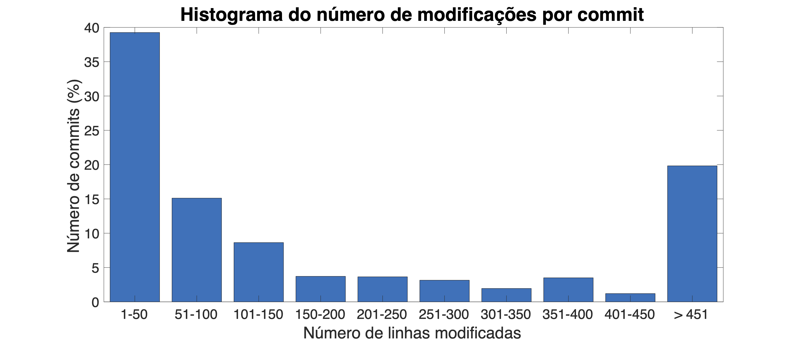

Neste caso, é possível observar que 40% dos commits não passa de 50 linhas modificadas. Na prática 63% dos commits altera até 150 linhas. Se observa ainda que em torno de 20% dos commits realizam alterações acima de 500 linhas por commit e, em análise pontual, foi possível observar que em sua maioria representam inclusões de bibliotecas externas ou mesmo arquivos de dados para treinamento de modelos de Machine Learning que podem chegar a até 20 mil linhas, cada um. Conclui-se então que, em sua maioria, os commits realizados estão seguindo as boas práticas de fazerem alterações pequenas de mais fácil compreensão e rastreamento.

## Métricas de boas práticas de Engenharia de Software

Para avaliar boas práticas no desenvolvimento das soluções de software, são consideradas 3 métricas gerais conforme à seguir:

* **Quantidade de *Pull Requests*:** indicam a quantidade de submissões de alterações no código fonte. Associada ao número de commits, esta métrica demonstra o volume de atividades realizadas e também indica a boa prática de revisão de códigos submetidos antes das modificações serem aceitas.
* **Quantidade de issues abertas/fechadas:** a *issues* de um repositório documentam tanto os requisitos do projeto em sua fase de desenvolvimento quanto necesisdades de evolução e necessidades de correções (*bugs*) observados em seu funcionamento. Seu propósito é socializar estas tarefas a serem realizadas, designar responsáveis, bem como deixar transparendo o que está sendo desenvolvido através da documentação do processo de construção do software.
* **Pipeline de CI/CD:** configuração das técnicas de integração contínua (CI) e deploy contúnuo (CD) mostrando a maturidade do processo de desenvolvimento e manutenção da solução de software.

Neste caso, a tabela à seguir aponta estas métricas em cada um dos repositórios onde é possível observar que praticamente todos eles adotaram as boas práticas de documentar *issues* nos repositórios e distribuí-las entre os membros da equipe, socializando o conhecimento e documentando a evolução do software. Os dois repositórios que não contém *issues* cadastradas (*BotFlowAPI* e *Sailc ML FrontEnd*) tiveram suas *issues* gerenciadas  nos repositórios equivalentes em suas frentes de trabalho. Uma outra boa prática observada é o uso do mecanismo de *Pull Request* onde as submissões de alterações no código são feitas para o repositório e tem que ser aprovadas por outros membros do projeto, incentivando a revisão do código, bem como ampliando o conhecimento de toda a equipe sobre a base se código que está sendo desenvolvida. Por fim, a configuração do pipeline de CI/CD em praticamente todos os repositórios demonstra a maturidade da solução de software com testes automatizados e métricas de análise estática de código. Este pipeline aumenta a confiança da equipe em reavaliar modificações em uma grande base de código uma vez que os testes podem apontar falhas antes que submissões novas possam ser aceitas.

Repositório	|	Quantidade de Pull Requests (Abertos/Fechados)	|	Número de Issues (Abertas / Fechadas)	|	Pipeline CI/CD
-	|	:-:	|	:-:	|	:-:
**Tais**	|	0 / 158	|	39 / 387	|	GitlabCI / CD
**Rasa-ptbr-Boilerplate**	|	1 / 55	|	15 / 44	|	GitlabCI
**BotFlow**	|	1 / 54	|	34 / 50	|	TravisCI
**BotFlow API**	|	0 / 24	|	0 / 0	|	-
**Promova Cultura**	|	1 / 78	|	19 / 157	|	-
**Salic-ML**	|	0 / 89	|	38 / 292	|	GitlabCI
**Sailc ML FrontEnd**	|	1 / 17	|	0 / 0	|	GitlabCI / TravisCI
**Salic API**	|	2/31	|	17/53	|	GitlabCI

A figura baixo ilustra uma nuvem de palavras com os conteúdos das labels das issues dos projetos, além da extração dos números dos repositórios extraidos em agosto de 2019.

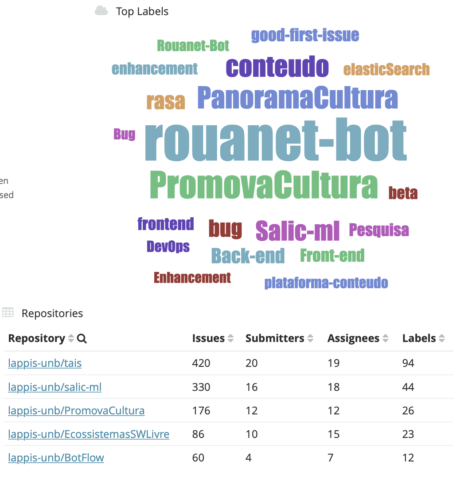

## Métricas de adoção pela comunidade

Duas métricas importantes para avaliar a adoção do software livre pela comunidade são o número de *Estrelas* e o número de *Forks* nos reposirótios conforme explicados à seguir:

* **Estrelas:** O número de estrelas em um repositório demonstra como a comunidade classifica cada um dos projetos. Quanto maior é o número, mais visível é o projeto da comunidade. (Ref. https://medium.appbase.io/analyzing-20k-github-repositories-af76de21c3fc)
* **Forks:** Os *Forks* representam as cópias do repositório feita por membros da comunidade. Um *fork* pode ser feito por membros da comunidade tanto para que contribuam para o projeto original (atrávés de *Pull Requests* / *Merge Requests*) quanto para a realização de derivações do projeto original em outras soluções. (Ref. https://medium.appbase.io/analyzing-20k-github-repositories-af76de21c3fc)

A tabela à seguir apresenta estas duas métricas para cada um dos repositórios juntamente com a data de criação de cada um dos projetos. Pela tabela, é possível observar que projetos com caráter mais interno como os do Salic tem menos adoção da comunidade, enquanto projetos cuja base de código pode ser aproveitada por outros órgãos como a *Tais* e o *Rasa-ptbr-Boilerplate* apresentam um índice de adoção da comunidade bem mais alto. O destaque aqui fica com o projeto *Rasa-ptbr-Boilerplate* que foi baseado na experiência da *Tais* e, mesmo tendo sido desenvolvido só em 2019, já possui 65 *Forks* mostrando uma ótima adoção da comunidade. Além disso, pode ser observado que os projetos do *BotFlow* / *BotFlowAPI* que foram iniciados em meados de 2019 e só tiveram sua primeira versão estável em set/2019 também já contam com *Forks* da comunidade.

Repositório	|	Forks	|	Número de Estrelas	|	Data de Criação
-	|	:-:	|	:-:	|	:-:
**Tais**	|	26	|	28	|	21/03/2018
**Rasa-ptbr-Boilerplate**	|	65	|	42	|	21/01/2019
**BotFlow**	|	2	|	9	|	03/06/2019
**BotFlow API**	|	1	|	3	|	21/05/2019
**Promova Cultura**	|	0	|	5	|	21/03/2018
**Salic-ML**	|	0	|	4	|	21/03/2018
**Sailc ML FrontEnd**	|	0	|	0	|	27/08/2018
**Salic API**	|	4	|	2	|	10/01/2018

 3. __prospectar uma sistemática, baseada em evidência científica, que auxilie  a homologação de produtos de software, em obediência ao normativo estabelecido__

  **Concluído parcialmente** -
Nessa meta específica adaptamos para a análise do custo benefício e impacto da inovação no desenvolvimento de Software. Ao invés de focar no normativo estabelecido, levantamos diversas métricas de precificação. A avaliação de esforço de desenvolvimento e precificação de Software ainda é uma área com grandes incertezas. Existem metodologias na área de Engenharia de Software para estimar o esforço de desenvolvimento de um produto baseadas em padrões históricos médios e na observação de vários projetos desenvolvidos comercialmente. É importante notar que estes modelos são apenas aproximados,mas ajudam a estabelecer uma ordem de grandeza do esforço de desenvolvimento de um software em comparação com projetos semelhantes encontrados na indústria.

**Documentação comprobatória**

## Análise de custo benefício e impacto da inovação

O "Ecossistemas de Software livre" é um projeto de pesquisa e inovação e deve ser avaliado  segundo estas duas perspectivas. As metas de pesquisa serão analisadas detalhadamente nas seções posteriores (#FIX ou foram analisadas nas seções anteriores) enquanto aqui, destacamos o caráter da inovação tanto em termos da qualidade dos produtos desenvolvidos quanto com relação à eficiência econômica do mesmo.

O Termo de Execução Descentralizada (TED) pressupõe que a unidade descentralizada, no caso a UnB na figura do laboratório LAPPIS, executará atividades de interesse da unidade descentralizadora, o Ministério da Cidadania. Deste modo, as etapas relativas ao desenvolvimento de software e linhas de atuação de pesquisa foram definidas explicitamente na etapa inicial do TED e revisadas continuamente durante cada um dos sete ciclos de entrega executados. Deste modo, entendemos que o planejamento da execução de tarefas esteve continuamente alinhado com as estratégias e interesses do Ministério.  

Uma vez estabelecido os interesses e objetivos do ciclo de desenvolvimento, é importante também determinar se a produtividade da equipe é compatível com os padrões de desenvolvimento típicos de projetos com a industra e academia. Assim, podemos mostrar que o desenvolvimento não só cumpriu os objetivos do Ministério, como o fez de maneira vantajosa do ponto de vista econômico.

Vale lembrar que além da entrega de produtos de software, o presente TED também realizou várias tarefas de pesquisa e extensão, treinamento e cumpriu um papel importante na formação de alunos. Algumas das tecnologias adotadas também possuem um forte caráter experimental e que não apresentam alternativas maduras na indústria para substituí-las. Deste modo, a Universidade cumpre um papel desbravador de trazer tecnologias da ponta para absorção na área de TI do Ministério da Cidadania e em outros órgãos do Governo. Como toda tecnologia experimental, existem maiores riscos e maior tempo de capacitação e treinamento antes da entrega de produtos maduros. Veremos que estes fatores refletem em algumas métricas colhidas sobre os produtos desenvolvidos.

### Estimativa de esforço

A avaliação de esforço de desenvolvimento e precificação de Software ainda é uma área com grandes incertezas. Existem metodologias na área de Engenharia de Software para estimar o esforço de desenvolvimento de um produto baseadas em padrões históricos médios e na observação de vários projetos desenvolvidos comercialmente. É importante notar que estes modelos são apenas aproximados,mas ajudam a estabelecer uma ordem de grandeza do esforço de desenvolvimento de um software em comparação com projetos semelhantes encontrados na indústria.

Estimamos o esforço a partir do número de horas-desenvolvedor necessários para produzir um projeto com a mesma ordem de grandeza dos aqui desenvolvidos. Para isto, utilizaremos primeiramente o modelo COCOMO (*Constructive Cost Model*) desenvolvido por Berry W. Boehm que estima o esforço de desenvolvimento a partir do número de linhas físicas e código de um determinado projeto. Os parâmetros do modelo de Boehm partiram de uma análise empírica da produtividade de equipes em projetos  reais e tendem a ter uma correspondência razoável com projetos de desenvolvimento reais. O próprio Boehm estima que cerca de 70% dos projetos apresentam estimativas dentro de uma faixa de 20% em torno do valor real, com o resto apresentando divergências mais significativas.

Os dados sobre a contagem de linhas de código foram extraídos utilizando a ferramenta *SCC* (https://github.com/boyter/scc) e recalculados com parâmetros adequados para cada repositório. O custo total para desenvolver o projeto é estimado a partir do esforço fornecido pelo modelo COCOMO e do custo médio mensal de cada desenvolvedor e o parâmetro de sobrecarga (do inglês *overhead*), que estima os custo adicionais de atividades necessárias, mas não relacionadas ao código como custos operacionais e de infra-estrutura,gestão e planejamento, treinamento, etc. A tabela abaixo mostra os projetos desenvolvidos seguidos das linguagens principais (py=Python, rasa=Bases de treinamento do RASA, js=Javascript e tecnologias Web associadas como Vue e SASS), o esforço estimado pelo modelo COCOMO em homens-mês e o valor estimado de desenvolvimento.

|      Projeto      | Linguagens | Esforço | Valor (R$) |
| :---------------: | ---------- | ------- | ---------- |
|       Taís*       | py,rasa    | 23,52   | 521.495    |
| Rasa-Boilerplate* | py,rasa    | 8,25    | 182.893    |
|      Bottis       | py,rasa    | 5,48    | 121.577    |
|      BotFlow      | js,css     | 9,60    | 212.861    |
|    BotFlowAPI     | py,json    | 4,64    | 102.911    |
|  PromovaCultura   | js         | 19,33   | 428.579    |
|     Salic ML*     | py,SQL     | 74,05   | 1.642.237  |
|   Salic ML Web    | py         | 4,13    | 91.677     |
| Salic ML Frontend | js         | 6,23    | 138.182    |
|     Salic API     | py         | 20,81   | 461.524    |
|     Flaskapi      | py,SQL     | 0,51    | 11.313     |
|  Lappis Learning  | py         | 2,19    | 48.638     |
|     **Total**     |            | 178,75  | 3.963.890  |

Em todos os projetos, exceto a Taís, Rasa-Boilerplate e Salic ML, utilizamos o modelo COCOMO simples calibrado para a categoria de projetos "orgânicos". Esta categoria descreve projetos relativamente previsíveis, desenvolvidos por times pequenos e bem integrados e utilizando tecnologias familiares. É possível argumentar que vários destes projetos possuem desafios técnicos que os colocariam em uma categoria de complexidade mais alta, mas adotamos esta categoria como uma estimativa conservadora.

O *SCC* considera um salário médio anualizado de U$56.286,00 e um parâmetro de *overhead* para o modelo orgânico simples equivalente à 2,4\footnote{O SCC utiliza uma parametrização diferente de outras ferramentas mais estabelecidas como, por exemplo o SLOCCOUNT do David Wheeler. Seu fator de *overhead* é de 1,8, mas ao mesmo tempo ele superestima o esforço de desenvolvimento com relação COCOMO simplificado de desenvolvimento *orgânico* por um fator fixo de 1,33. Esta diferença vem de diferentes escolhas de parâmetros, mas quando multiplicamos os dois fatores, obtemos os mesmos resultados de custo financeiro utilizando as duas ferramentas}. Utilizando-se estes valores, obtemos uma estimativa de U$2.012.000,00 ou cerca de 8 milhões de reais. Obviamente, a realidade brasileira é diferente e o principal fator de custo, o salário médio de um desenvolvedor, é consideravelmente mais baixo. Tomamos como referência o valor de R$9.200,00 mensais (R$ 110.400,00 anuais), compilado em um relatório recente do TCU sobre os a eficiência econômica dos contratos com o Serpro e Dataprev (https://pesquisa.apps.tcu.gov.br/#/documento/acordao-completo/*/KEY%253AACORDAO-COMPLETO-2298670/DTRELEVANCIA%2520desc%252C%2520NUMACORDAOINT%2520desc/0/%2520). Este é o valor de mercado para um cargo de *analista*, a menor categoria de desenvolvedor de mercado considerada no relatório. Fazendo estes ajustes, o custo estimado para o desenvolvimento dos produtos de software seria R$3.963.890,00. Lembrando que o valor total do TED foi de R$2.078.600,00 e envolve outras atividades além do desenvolvimento de Software, vemos que este resultado demonstra uma grande eficiência econômica na execução do projeto.

O modelo COCOMO é muito utilizado para avaliar e comparar esforço de desenvolvimento de projetos já finalizados ou em andamento. A análise utiliza a contagem de linhas de código produzidas e portanto não pode ser realiza nas fases de contratação e planejamento. Outro tipo de análise de esforço comum,que visa contornar esta limitação, utiliza a técnica de contagem de pontos de função, introduzida na IBM no fim dos anos 1970 para avaliar os custos de seus próprios projetos. Um ponto de função contabiliza o esforço relacionado à implementação de uma funcionalidade a partir de uma soma ponderada do número de entradas, saídas, arquivos e requisições que o software deve fazer. A análise de pontos de função estima o esforço de desenvolvimento de um software a partir das funcionalidades planejadas, antes mesmo do início do desenvolvimento do mesmo. Assim como o modelo COCOMO, trata-se de uma abordagem aproximada, já que é difícil antecipar o esforço de desenvolvimento precisamente somente com este tipo de informação genérica. Por ser aplicável antes da criação do produto, pode ser utilizada para guiar a definição de preços para produtos de software na fase de contratação.

Existe uma correlação bastante alta entre número de pontos de função e números de linhas de código de um projeto, dada uma linguagem de programação. Ainda que não existam estudos muito aprofundados sobre a produtividade do Python sob esta métrica, é um consenso na comunidade que ela deva se situar próxima a da do Perl, já que ambas são consideradas linguagens de programação de alto nível e muito produtivas, com várias funcionalidades semelhantes. Assim, assumimos o valor de 24 linhas por ponto de função para Python/Perl e 47 para Javascript, segundo a tabela da QSM (https://www.qsm.com/resources/function-point-languages-table). Somando a contribuição destas duas linguagens ficamos com 1403 pontos de função para todas as contribuções do projeto. Este número exclui algumas linguagens com participação menor (SQL) e mais notadamente as bases de treinamento da Taís desenvolvidas em Markdown e YAML, já que não existe nenhuma métrica que avalia a produtividade destas linguagens.

Mesmo se consideramos apenas estes dois valores, a produção apresentada é bastante competitiva. Podemos avaliar de duas maneiras: na primeira consideramos o tamanho médio da equipe (23,8 pessoas) e assumimos que todos membros contribuíram com 20h semanais de desenvolvimento, para chegar no valor de 45,696 horas empregadas. Isto fornece uma taxa de 32,5 horas por ponto de função. Trata-se de um limite superior, já que na realidade existem membros alocados para outras funções (pesquisa, design, coordenação) e membros com atribuições variáveis.

Uma auditoria recente do TCU no desempenho do SERPRO e do DATAPREV avaliou valores típicos de produtividade de mercado e destas duas instituições e estimou um valor médio é de 16,15 horas por ponto de função para o mercado e 33,5 e 40,3 horas por ponto de função respectivamente para o SERPRO e Dataprev. É importante ressaltar que contabilizamos a produtividade assumindo que todos membros estariam alocados em tarefas de desenvolvimento e que deixamos de computar vários pontos de função relacionados principalmente à base de treinamento da Taís, devido à inexistência de parâmetros confiáveis para comparação. Além disto, e talvez de forma mais decisiva, a maior parte dos integrantes da equipe são alunos e recebem uma remuneração muito inferior a um profissional de mercado de forma que não seria razoável esperar a mesma produtividade das duas categorias.

Uma outra maneira de calcular a vantagem econômica seria medir quantas horas de desenvolvimento de mercado seria possível contratar com o orçamento fornecido e utilizar este número para avaliar os resultados obtidos. É importante ressaltar que o custo para uma empresa não se limita aos valores dos salários, mas existe uma série de outros gastos (direitos trabalhistas, infra-estrutura, gestão, manutenção, margem de lucro, etc) que encarece o custo total. Usamos novamente o valor de *overhead* de 2,4, ainda que reconheçamos o caráter arbitrário da escolha. Assim, dividindo o valor do projeto por 2,4 e depois pelo salário médio de analista utilizado no relatório do TCU (R$ 9.200,00) chegamos no valor de 90,6 meses de contratação, ou 14.492 horas. Estes valores resultariam numa taxa de 10,3 horas por função, o que seria extremamente competitiva no mercado.

A análise a partir do modelo COCOMO também mostra uma situação bastante favorável: a soma da estimativa de esforço de de todos projetos demandaria 178 meses-homem de desenvolvimento, mas foi executada a um custo de mercado para apenas 90,6 meses-desenvolvedor, que é aproximadamente metade do esforço estimado.

### Esforço nos projetos da Taís, Rasa Boilerplate e Salic ML

As duas maiores discrepâncias entre o esforço empregado e o estimado pelas técnicas de Engenharia de Software estão justamente nas duas maiores contribuições deste TED: o Salic ML e a Taís. Enquanto o esforço do primeiro o esforço do segundo parece um pouco superestimado em comparação com a equipe efetivamente empregrada é amplamente sub-dimensionado pelo modelo COCOMO. Não surpreendentemente, os dois possuem características peculiares de desenvolvimento comparados a projetos de Sotware típicos, o que provavelmente está na origem desta discrepância.

A primeira diferença entre estes dois projetos e os outros projetos elaborados está na complexidade maior e o uso de tecnologias inovadoras. Para isto, decidimos avaliar os dois projetos utilizando uma categoria diferente com relação ao modelo básico. Primeiramente, incluímos a avaliação detalhada dos fatores de custo. Nos dois projetos, consideramos que a complexidade do produto é alta e que a confiabilidade poderia ser classificada como baixa, já que erros na fase de treinamento produzem efeitos relativamente fáceis de se recuperar. Além disto, enquadramos os dois projetos na categoria "semi-destacado", já que utiliza tecnologias que pressupõe o uso de arquiteturas e algoritmos inovadoras, impondo especificações mais restritas que o modelo "orgânico".

Além disto, não modificamos os valores de referência relativos à experiência da equipe e ao uso de ferramentas de engenharia de software já que o objetivo é fazer uma avaliação do tempo que seria necessário em um desenvolvimento típico de mercado e não estimar o valor para a equipe que foi de fato empregada. O modelo estima, por exemplo, que o emprego adequado de técnicas de Engenharia de Software pode deixar a velocidade de desenvolvimento entre 32% mais rápido até 53% mais lento que os valores de referência. Já a qualificação da equipe pode reduzir o tempo de desenvolvimento para desde 1/3 do esforço de referência até 3,68 vezes maior.

O repositório do Salic ML consiste basicamente em código Python, cerca de 3800 linhas físicas, e Notebooks do Jupyter. Estes também estão escritos em Python e possuem 66.000 linhas que, após a conversão do formato .ipynb para Python, resultam em 10,696 linhas de código Python. Nós utilizamos o segundo valor já que o execedente consiste majoritariamente em dados de saída gerados automaticamente e portanto não refletem em esforço de desenvolvimento.

Ainda assim, talvez seja necessário considerar um fator de ponderação no esforço de produzir código em módulos estruturados e em ferramentas de desenvolvimento usuais em contraposição a um ambiente dinâmico e interativo como o de um Notebook. É difícil ponderar qual seria este fator, em especial porque os Notebooks lidam com algoritmos complexos de aprendizado de máquina e código de natureza bastante experimental. Se assumirmos, ainda que de forma um tanto arbitrária, que a produtividade em um ambiente de Notebook dobra a eficiência de desenvolvimento usual, reduziríamos a estimativa de esforço total de 71 meses-homem para 48, o que corresponde uma redução de 32%.

Já o chatbot da Taís possui particularidades de outro gênero. A Taís foi desenvolvida utilizando a tecnologia RASA, que por estar no estado da arte em Chatbots, possui um custo adicional de absorção e treinamento. Além disto, boa parte do esforço do desenvolvimento do Chatbot se encontra na configuração e manutenção dos bancos de treinamento. Estes bancos não são escritos em linguagem de programação, mas sim desenvolvidos declarativamente em arquivos do tipo Markdown e YAML. Esta diferença torna a análise e comparação usando metodologias desenvolvidas para código pouco confiável.

O repositório consiste em cerca de 5000 linhas de código em Markdown, 1000 linhas YAML e 1800 linhas de Python. Ainda que o Markdown seja uma linguagem de edição de textos simples, ela é utilizada neste projeto para definir os fluxos de conversa e a inteligência do Bot, de forma que a dificuldade principal consiste na organização destes fluxos de informação e não na criação do documento propriamente dito. O desenvolvimento destes arquivos também requer um nível alto de testes manuais para verificar se os fluxos desenhados estão corretos e se o bot reconhece as interações planejadas. Assim, é razoável supor que o esforço de criação destes arquivos supera muito o esforço de criação de código tradicional.

Podemos analisar esta base de treinamento olhando pela ótica de pontos de função já que esta análise não depende da linguagem de programação e usa apenas a contagem de funcionalidades básicas como o número de diferentes entradas, saídas, arquivos e requisições que um software utiliza. Vamos nos limitar esta análise à apenas a base de treinamento da Taís, pois é simples estimar o número de entradas e saídas programadas a partir da estrutura dos arquivos de treinamento.

Deste modo, consideramos que cada tipo de resposta do Bot (ou "utter", na nomeclatura do arquivo de configuração) da Taís é uma saída do tipo simples e cada história, que corresponde a um pequeno fluxo de conversa, corresponde a uma entrada de complexidade padrão. Utilizando os valores usuais de 4 pontos de função para cada uma destas funcionalidades e usando o fato que temos 210 saídas diferentes e 185 histórias,ficaríamos com um total 1580 pontos de função. Note que este valor é maior que todos os outros projetos somados, e muito provavelmente é bastante superestimado.

Vemos portanto, que as peculiaridades das tecnologias utilizadas pela Taís tornam a estimativa de esforço extremamente *não-confiável* já que metodologias que tipicamente apresentam um grau de concordância razoável geraram previsões totalmente destoantes. Enquanto o modelo COCOMO sugere um esforço de desenvolvimento da ordem de 23 meses-homem, a análise por pontos de função faz uma estimativa 6 vezes maior considerando apenas uma parte do projeto (145 meses-homem).

Além destas particularidades tecnológicas, a Taís apresentou dificuldades na sua trajetória de desenvolvimento que não apareceram em outros projetos. A primeira versão da Taís, utilizava outra tecnologia de treinamento (Hubot Natural) e linguagem de programação (CoffeScript). Uma vez que as limitações desta abordagem ficaram aparentes, decidiu-se mudar o projeto para utilizar Python com a biblioteca RASA, que até então era um projeto jovem com um pouco mais de um ano de duração. A primeira versão também apresentou problemas arquiteturais e foi então reescrita no formato atual. Estas duas versões do projeto demandaram, na estimativa do COCOMO, um esforço de 13 meses-homem. Assim como no caso anterior, acreditamos que este valor também esteja subestimado.

### Conclusão

Finalmente, além do desenvolvimento de soluções de software para o Ministério da Cidadania, o projeto parte de uma lógica de parceria com a universidade e pressupõe a criação de insumos de pesquisa e produção acadêmica. A maior parte dos membros da equipe é formada por alunos do curso de Engenharia de Software, sendo que a participação no projeto contribuiu diretamente para a formação dos mesmos. Alguns destes alunos adotaram temas relacionados ao projeto como tema em seus trabalhos de conclusão de curso ainda em andamento. Foram publicados dois artigos científicos. O primeiro, com o título *"FLOSS FAQ chatbot project reuse - how to allow nonexperts to develop a chatbot"*, contém a experienca no desenvolvimento da Tais e foi apresentado no OpenSym, um dos maiores simposios de pesquisa acadêmica em software livre. O segundo, com o título *"A Survey of DevOps Concepts and Challenges"* foi aceito  na revista **Computing Surveys** da ACM, de alto impacto acadêmico (A1 no critério de Qualis da Capes) e mostra o resultado acadêmico dos estudos em DevOps. Foi publicado também um capítulo do livro "Software e Cultura no Brasil - Produção, gestão e políticas publicas",  no qual discutimos os modelos de contratação nas equipes de TI do governo federal, no capítulo "Colaboração aberta e sua relação com a contratação de software na administração pública".

# Acompanhamento Financeiro

Tivemos completa transparência quanto ao acompanhamento financeiro do projeto. A prestação de contas foi feita a cada relatório de acompanhamento, no qual apresentamos não só o montante gasto, quanto também o valor gasto por pacote de trabalho. O tamanho do time por frente de trabalho foi definido de acordo com as prioridades estabelecidas pelo ministério, nas reuniões estratégicas. Porém, vale ressaltar, que por se tratar de times multidisciplinares, membros poderiam ser alocados em diferentes frentes por diversas __sprints__ de acordo com necessidade de projeto e deadlines de entrega.

O financeiro completo do projeto pode ser visto na figura abaixo.

# Assinatura

Responsável pela Execução:
---
Nome:  Carla Silva Rocha Aguiar
             (Coordenadora do Projeto)

Assinatura:

Data:/2019

# Anexos

Nos anexos serão apresentadas alguns documentos comprobatórios. Vale ressaltar que será colocado em anexo os documentos técnicos de cada projeto. E esses estão disponibilizados no próprio repositório, E podem ser mais facilmente acessado nos links disponibilizados.

## Anexo I

No Anexo I são apresentados os artigos acadêmicos, capítulos de livros e comunicação em geral realizadas no âmbito do projeto "Ecossistemas de Software Livre".

## Anexo II

No anexo II serão apresentadas evidências das iniciativas relacionadas a capacitação, transferência de conhecimento e Governança do projeto. Os eventos organizados e participados por integrantes do laboratório no contexto do projeto são apresentados nesse anexo.

## Anexo III
Uma das atividades de pesquisa realizadas pela equipe no projeto SalicML foi a análise de grafos a partir da análise proponente, fornecedor, incentivador. Para fazer essa análise, utilizamos tanto os CNPJs e CPFs declarados no Salic quanto a base societária disponibilizadas pela receita federal. Como esses dados são sensíveis, os repositórios dos estudos foram mantidos privados. Nesse anexo, apresentamos esses notebooks privados.

## Anexo IV

Serão disponibiliados no anexo IV toda a documentação técnica realizada nos projetos. Vale ressaltar que essa documentação também está disponível nos repositórios de cada respectivo projeto.

## Relatórios de Entrega Parciais e Parecer do Ministério

O último anexo estão os relatórios de entrega parciais e os pareceres do Ministério. De acordo com  o plano de trabalho, os repasses financeiros foram previstos de ocorrer trimestralmente condicionados a aprovação do relatório de entrega parcial.

Nesses relatórios de entrega parcial são apresentados o trabalho e as entregas realizadas no período, assim como as suas respectivas evidências. É apresentado também o acompanhamento financeiro, no qual é detalhado os empenhos realizados no trimestre. A aprovação de cada relatório é realizada por meio de um parecer técnico. Além do relatório, a cada trimestre houve uma reunião de entrega no qual apresentamos e homologamos os avanços junto a equipe técnica e de negócio do ministério.
